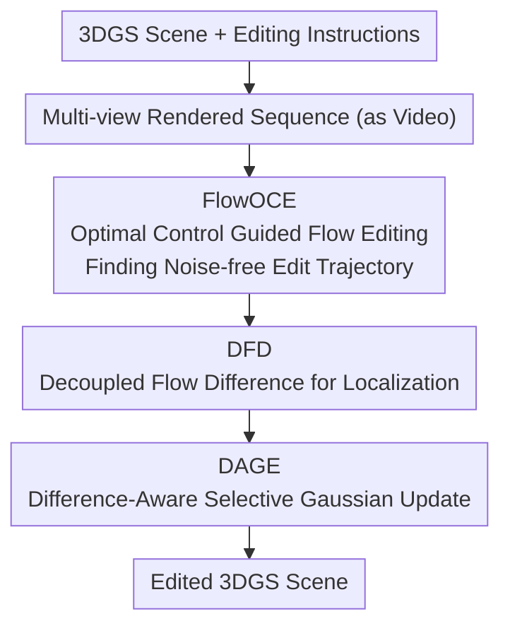

# VDFE: Difference-Aware 3D Scene Editing with Non-Intrusive Video Diffusion Priors for Multi-View Consistency and Efficiency

**Conference**: CVPR 2026  
**Code**: To be confirmed  
**Paper**: [CVF Open Access](https://openaccess.thecvf.com/content/CVPR2026/html/Zhang_VDFE_Difference-Aware_3D_Scene_Editing_with_Non-Intrusive_Video_Diffusion_Priors_CVPR_2026_paper.html)  
**Area**: 3D Vision / 3D Editing  
**Keywords**: Text-driven 3D editing, 3D Gaussian Splatting, Video diffusion priors, Optimal control, Multi-view consistency

## TL;DR
VDFE decomposes text-driven 3D scene editing into three steps: performing multi-view consistent flow editing via video diffusion priors, accurately localizing editing regions through flow differences, and selectively updating only the Gaussians in those regions. This achieves precise and efficient controllable editing of 3D Gaussian Splatting (3DGS) scenes without intrusive modifications to pre-trained video diffusion models.

## Background & Motivation
**Background**: With the maturation of reconstruction technologies like NeRF and 3D Gaussian Splatting (3DGS), text-driven 3D editing aims to allow users to intuitively transform scenes (changing materials, replacing objects, modifying colors) using simple natural language.

**Limitations of Prior Work**: Existing methods often suffer from issues in **controllability** and **consistency**—edits may "leak" into non-target areas, results may be inconsistent across different viewpoints (the same object appearing differently in different views), and optimizing the entire 3D representation is computationally inefficient.

**Key Challenge**: 2D editing models (e.g., those based on cross-attention in diffusion models) lack multi-view consistency constraints, leading to conflicts when per-view edits are integrated back into 3D. Conversely, ensuring consistency often requires intrusive modification or fine-tuning of diffusion models, which is costly.

**Goal**: To achieve multi-view consistent, precisely localized, and efficiently updated 3D scene editing without intrusive fine-tuning of pre-trained **video diffusion** models.

**Key Insight**: Leverage the inherent temporal consistency of video diffusion priors to ensure multi-view consistency. Model the editing process as an **optimal control problem** to find a noise-free editing trajectory, and use **flow difference** to precisely delineate the regions to be modified, followed by selective updates of the Gaussians in those areas.

## Method

### Overall Architecture
The input consists of a reconstructed 3DGS scene and an editing instruction; the output is the edited 3DGS scene. VDFE treats the multi-view rendered sequence as a "video" and feeds it into a pre-trained video diffusion model, linking three modules: FlowOCE handles flow editing guided by optimal control to find a noise-free trajectory; DFD localizes the editing area by analyzing flow differences; and DAGE performs selective updates on the Gaussians for efficient refinement.

### Key Designs

**1. FlowOCE: Modeling Editing as an Optimal Control Problem for Noise-free Trajectories**

To address "edit leakage" and cross-view inconsistency, FlowOCE (Optimal Control Guided Flow Editing) models the editing process as an **optimal control** problem. It optimizes a noise-free editing trajectory to minimize unintended modifications in non-target regions while producing multi-view consistent and smooth transitions. By utilizing the temporal consistency of video diffusion priors, edits across viewpoints naturally maintain coherence, avoiding the conflicts inherent in independent per-view editing.

**2. DFD: Precise Localization via Decoupled Flow Difference**

Localization based on cross-attention is often coarse with blurry boundaries. DFD (Decoupled Flow Difference) instead **analyzes flow differences** by comparing optical or feature flow before and after editing. This generates high-precision "flow difference maps" that clearly mark which areas need modification. Compared to cross-attention, it is more accurate and works without additional training, providing a precise spatial prior for optimization.

**3. DAGE: Difference-Aware Selective Updates for Efficiency and Precision**

With the precise localization from DFD, DAGE (Difference-Aware Gaussians Editing) **selectively updates only the 3D Gaussians that fall within the editing region** rather than optimizing the entire set of Gaussians. This avoids unnecessary perturbations to non-target Gaussians (preserving precision and preventing detail loss) while significantly reducing the computational load (improving efficiency).

## Key Experimental Results

### Main Results
On editing benchmarks such as FIVE, evaluating with CLIP-sim (semantic similarity Between edit and instruction) and CLIP-dir (consistency of editing direction), the method achieves SOTA performance across both 3D and video editing tasks:

| Method | CLIP-sim | CLIP-dir | Notes |
|------|----------|----------|------|
| Existing Baselines | Lower | Lower | Limited controllability/consistency |
| **VDFE (Ours)** | **Highest** | **Highest** | SOTA on 3D + Video editing tasks |

(The paper reports that FlowOCE combined with DFD surpasses all baselines on the FIVE benchmark. Please refer to the original tables for specific numerical values ⚠️.)

### Ablation Study

| Configuration | Effect | Description |
|------|------|------|
| Full VDFE | Best | Synergy of the three modules |
| w/o DFD | Poorer Localization | Inaccurate localization leads to degraded precision |
| w/o DAGE | Detail Loss + Non-target Edits | Lack of precise selective updates |
| FlowOCE only | Strong Video Edit, Limited 3D Precision | Lack of localization and selective update |

### Key Findings
- **DAGE is the most significant contributor**: Removing it leads to loss of detail and unintended modifications in non-target areas, proving that "precise localization + selective updating" is the decisive factor for 3D editing quality.
- **DFD outperforms cross-attention localization**: Flow differences yield high-precision difference maps without extra training, providing a more reliable prior for optimization.
- **FlowOCE provides the consistency foundation**: The noise-free trajectory obtained via optimal control ensures multi-view consistency and smooth transitions, which is a prerequisite for safely migrating 2D/video editing to 3D.

## Highlights & Insights
- **Non-intrusive use of video diffusion priors** is a clever approach: it avoids fine-tuning large models and directly leverages their temporal consistency to solve the long-standing problem of multi-view consistency in 3D, resulting in low migration costs.
- **Modeling editing as optimal control** provides a principled method for preventing "contamination" of non-target areas, rather than relying on crude masking.
- The observation that **flow difference localization > cross-attention** is transferable to any 2D/3D editing task requiring precise region localization.

## Limitations & Future Work
- Dependency on the quality of pre-trained video diffusion priors and the coherence of rendered sequences; biases in the priors may propagate to the results.
- Robustness of flow difference localization for large-scale geometric modifications (e.g., adding/deleting objects vs. changing materials/colors) is less explored, as the paper focuses primarily on appearance-level edits.
- The methodological descriptions are somewhat high-level. The specific objective functions for FlowOCE and the exact calculations for DFD are simplified in the main text; replication may require the supplementary materials ⚠️.

## Related Work & Insights
- **vs. Cross-attention based localization**: VDFE replaces cross-attention with flow difference, achieving higher precision without training.
- **vs. Per-view 2D editing for 3D integration**: Such methods lack consistency constraints, whereas VDFE ensures multi-view consistency at the source via video diffusion priors.
- **vs. Full 3DGS optimization**: VDFE uses DAGE to update only target-area Gaussians, making it more efficient and less likely to destroy non-target details.

## Rating
- Novelty: ⭐⭐⭐⭐ Combination of non-intrusive video priors, optimal control, and flow difference is relatively novel.
- Experimental Thoroughness: ⭐⭐⭐⭐ Extensive dual-task (3D/Video) evaluation and ablation, though some numerical details are brief.
- Writing Quality: ⭐⭐⭐⭐ Clear motivation and division of labor between the three modules.
- Value: ⭐⭐⭐⭐ Practical value for controllable, consistent, and efficient 3D scene editing.

<!-- RELATED:START -->

## Related Papers

- [\[CVPR 2026\] Unsupervised Monocular 3D Keypoint Discovery from Multi-View Diffusion Priors](unsupervised_monocular_3d_keypoint_discovery_from_multi-view_diffusion_priors.md)
- [\[CVPR 2026\] AniMimic: Imitating 3D Animation from Video Priors](animimic_imitating_3d_animation_from_video_priors.md)
- [\[CVPR 2026\] HAD: Hallucination-Aware Diffusion Priors for 3D Reconstruction](had_hallucination-aware_diffusion_priors_for_3d_reconstruction.md)
- [\[CVPR 2026\] EcoSplat: Efficiency-controllable Feed-forward 3D Gaussian Splatting from Multi-view Images](ecosplat_efficiency-controllable_feed-forward_3d_gaussian_splatting_from_multi-v.md)
- [\[CVPR 2026\] ObjectMorpher: 3D-Aware Image Editing via Deformable 3DGS](objectmorpher_3d-aware_image_editing_via_deformable_3dgs.md)

<!-- RELATED:END -->
