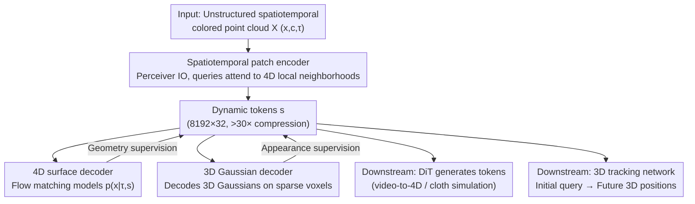

# Velox: Learning Representations of 4D Geometry and Appearance

**Conference**: CVPR 2026  
**arXiv**: [2605.04527](https://arxiv.org/abs/2605.04527)  
**Code**: https://apple.github.io/ml-velox (Project Page)  
**Area**: 3D Vision  
**Keywords**: 4D Representation Learning, Dynamic Point Clouds, Dynamic Tokens, Flow Matching, 3D Gaussians

## TL;DR
Velox utilizes a Perceiver encoder to compress unstructured spatiotemporal colored point clouds into a small set of "dynamic tokens" (>30× compression). These tokens are jointly supervised by two complementary decoders: a Flow Matching 4D surface decoder for geometry and a 3D Gaussian decoder for appearance. This creates a general latent representation that characterizes both 4D geometry and appearance without requiring temporal correspondences, which can be directly applied to video-to-4D generation, 3D tracking, and cloth simulation, achieving SOTA performance.

## Background & Motivation
**Background**: Representation learning is central to progress in 2D/3D vision; features obtained through self-supervised reconstruction transfer well to downstream tasks, and latent representations form the basis for generation and editing. The authors aim to extend this concept to the spatiotemporal (4D) domain, investigating whether a general 4D representation for dynamic objects can be learned solely through reconstruction.

**Limitations of Prior Work**: An ideal 4D representation should be **descriptive** (faithfully capturing time-varying geometry and appearance), **compressive** (compact and efficient for downstream processing), and **accessible** (dependent only on easily obtainable inputs). Existing methods fail to satisfy all three: ① Many are tailored for single tasks (view synthesis / character animation / 3D tracking), losing information necessary for general understanding and having dimensions too high for diverse downstream tasks. ② Efforts toward "general 4D object representations" either **model only geometry while ignoring appearance**, or rely on **temporal correspondences** as encoder inputs or supervision—correspondences that are extremely difficult to obtain in complex dynamic scenes, limiting training data and complicating inference pipelines.

**Key Challenge**: While concatenating independent 3D representations per frame can represent dynamic objects, it ignores temporal continuity, leading to high-dimensional and temporally inconsistent features (jitter, unstable geometry). To model temporal continuity, mainstream methods revert to "correspondence/deformation fields," which are inherently difficult to solve and undefined in scenarios involving "appearing/disappearing" objects.

**Goal**: To learn a **single** latent representation that does not rely on correspondences as encoder input, jointly characterizes dynamic geometry and appearance, and can be constructed from minimal input (an unstructured sequence of colored point clouds).

**Key Insight**: By viewing the 4D surface as a collection of "local spatiotemporal patches" and using Perceiver-style cross-attention to aggregate information across space and time (where each query only attends to its 4D neighborhood), temporal continuity can be encoded **without requiring temporal correspondences** between points. Geometry is modeled as a "time-conditional probability density $p(\mathbf{x}|\tau,\mathbf{s})$" instead of a deformation field, naturally handling appearing/disappearing components.

**Core Idea**: A set of latent "dynamic tokens" is used to uniformly carry 4D geometry and appearance. Dual-path supervision is provided via a Flow Matching surface decoder for geometry and a 3D Gaussian decoder for appearance, completely decoupling representation learning from downstream tasks.

## Method

### Overall Architecture
The goal of Velox is to learn a set of **dynamic tokens** $\mathbf{s}$, consisting of $k$ tokens of dimension $d$ (the latent shape is $8192\times32$). The encoder $E$ takes an unstructured spatiotemporal colored point cloud $\mathcal{X}=\{(\mathbf{x}_i\in\mathbb{R}^3,\ \mathbf{c}_i\in[0,1]^3,\ \tau_i\in\mathbb{R})\}_{i=1}^N$ as input, where each point has spatial coordinates, RGB color, and a timestamp; the output is $\mathbf{s}=E(\mathcal{X})$. These tokens are **jointly supervised** by two complementary decoders: a 4D surface decoder for geometry and a 3D Gaussian decoder for appearance. The model requires only multi-view RGBD videos (and their back-projected point clouds) for training, avoiding reliance on watertight meshes and heavy preprocessing common in SDF/occupancy representations.

Once trained, the dynamic tokens serve as a "foundation" for three downstream tasks: **video-to-4D generation** and **cloth simulation** utilize a DiT to generate tokens directly in the latent space (conditioned on DINOv2 image/video features), followed by Gaussian rendering. **3D tracking** trains a Perceiver encoder on the tokens to map the 3D position of query points from the first frame to future frames.

### Key Designs

**1. Spatiotemporal patch encoder: Replacing correspondence with local cross-attention**

To address the lack of temporal correspondences in complex dynamic scenes, Velox abandons the requirement for point-to-point correspondence. Instead, it encodes the 4D spatiotemporal surface by partitioning it into local patches, utilizing a Perceiver IO architecture. From the input point cloud $\mathcal{X}$, $k$ points are sampled as queries. Each query **only cross-attends to its nearest neighbor points** (observing its own 4D local neighborhood), followed by windowed self-attention to propagate local patch information between queries, balancing receptive fields and computational efficiency. Temporal continuity is implicitly captured because points from the same 4D neighborhood across different times are aggregated together, ensuring the representation is **accessible**. The $8192\times32$ latent achieves >30× compression relative to the original 4D point cloud, making it **compressive**.

**2. Flow matching 4D surface decoder: Modeling geometry as "time-conditional probability density"**

To ensure the representation is **descriptive** for geometry and allows sampling surface points at any arbitrary time, the 4D surface is modeled as a conditional distribution $p(\mathbf{x}|\tau,\mathbf{s})$—the probability density of 3D point $\mathbf{x}$ given time $\tau$. The decoder $V$ receives the latent $\mathbf{s}$, flow matching time $t$, target frame time $\tau$, and a noisy surface point $\mathbf{x}_t=\alpha_t\mathbf{x}+\sigma_t\boldsymbol{\epsilon}$ (where $\mathbf{x}$ is a point from frame time $\tau$ and $\boldsymbol{\epsilon}$ is standard normal noise). It predicts the flow matching velocity $\mathbf{v}=V(\mathbf{s},\mathbf{x}_t,t,\tau)$ with the loss:

$$\mathcal{L}_V=\lVert \mathbf{v}-\dot{\alpha_t}\mathbf{x}-\dot{\sigma_t}\boldsymbol{\epsilon}\rVert^2.$$

At inference, integrating $\mathbf{v}$ from $t=0$ to $t=1$ samples the surface point cloud for time $\tau$. Unlike deformation fields, this time-conditional density modeling naturally handles the **appearance/disappearance** of objects.

**3. 3D Gaussian decoder: Decoding appearance on sparse voxels without deformation assumptions**

To inject appearance into the tokens and enable rendering, Velox decodes 3D Gaussians. To manage memory and avoid deformation field limitations, Velox trains $G(\mathbf{s},\tau)$ to directly map dynamic tokens to 3D Gaussians for a given time $\tau$. To aid convergence, decoding is performed only on **sparse occupancy voxels 'Vox'** using Perceiver IO. The supervision loss is the L2 distance between the rendered and ground truth images:

$$\mathcal{L}_{GS}=\lVert I_{GT}-\text{Render}(G(\text{Vox},\mathbf{s},\tau),\text{H}_I)\rVert^2,$$

where $\text{H}_I$ represents camera parameters. During training, 'Vox' uses ground truth voxels from the input point cloud. During inference, voxels can be sampled from the 4D surface decoder or, for efficiency, predicted by a **lightweight voxel decoder** directly from the dynamic tokens.

**4. Throwaway texture augmentation: Enhancing appearance diversity in dynamic datasets**

To overcome the low-frequency and monochromatic textures common in dynamic sequences, the authors implement **real-time random re-texturing** during training. UV coordinates assigned to the first frame mesh are propagated through the animation for consistency; random images from OpenImages are used as textures and rendered instantly via nvdiffrast (>500 fps). Crucially, the mesh correspondence is **only used for data augmentation and is not an input or supervision for the model**, preserving the "correspondence-free" claim. Ablations show significant drops in both appearance and geometry metrics without this augmentation.

### Loss & Training
The total objective includes geometry and appearance losses, plus a KL regularization on the dynamic tokens (which simplifies to an L2 norm for standard normal priors, $\mathcal{L}_C=\lVert\mathbf{s}\rVert^2$):

$$\mathcal{L}=\mathcal{L}_V+\mathcal{L}_{GS}+\gamma\mathcal{L}_C,\quad \gamma=10^{-4}.$$

Downstream tasks are trained independently: video-to-4D and cloth simulation use a DiT (using learnable zero-initialized position embeddings and DINOv2 for images). 3D tracking uses Perceiver IO with the first-frame 3D query as the query and dynamic tokens as key/value to predict future 3D positions, intentionally kept simple to highlight the information density of the tokens.

## Key Experimental Results

### Main Results

**Reconstruction Quality (256 held-out scenes from Objaverse, Chamfer ×10⁵)**

| Method | PSNR↑ | SSIM↑ | LPIPS↓ | FVD↓ | CVVDP↑ | Chamfer↓ |
|------|-------|-------|--------|------|--------|----------|
| GVF (Deformation) | 26.45 | 0.952 | 0.051 | 173.62 | 7.620 | - |
| LiTo (Per-frame, GT Vox.) | 32.55 | 0.972 | 0.037 | 126.38 | 8.544 | 38.17 |
| **Ours (GT vox.)** | **35.39** | **0.984** | **0.021** | **48.99** | **8.910** | **36.36** |
| Ours (dec. vox.) | 35.11 | 0.983 | 0.022 | 50.68 | 8.877 | 36.36 |
| Ours (samp. vox.) | 34.25 | 0.981 | 0.024 | 59.37 | 8.811 | 36.36 |

Velox outperforms the per-frame LiTo and deformation-based GVF across geometry, appearance, and temporal consistency metrics (FVD/CVVDP).

**Video-to-4D Generation (Objaverse / Consistent4D; Input view vs. 9 novel views)**

| Dataset | Method | Input PSNR↑ | Input LPIPS↓ | Novel PSNR↑ | Novel LPIPS↓ | Novel FVD↓ |
|--------|------|-----------|------------|-------------|--------------|------------|
| Obj | L4GM | 22.59 | 0.074 | 18.30 | 0.146 | 498 |
| Obj | GVF | 18.21 | 0.117 | 16.41 | 0.157 | 663 |
| Obj | **Ours** | **24.04** | **0.056** | **20.62** | **0.104** | **373** |
| C4D | L4GM | 21.87 | 0.080 | 17.71 | 0.147 | 432 |
| C4D | **Ours** | **22.95** | **0.072** | **18.98** | **0.120** | **431** |

Velox provides superior reconstruction in the input view and generation in novel views, demonstrating robustness across camera settings.

**3D Tracking (Objaverse; All points / Visible points)**

| Method | L²₍all₎↓ | L²₍vis₎↓ | APD₍all₎↑ | APD₍vis₎↑ | AJ³ᴰ↑ | OA↑ |
|------|---------|---------|-----------|-----------|-------|-----|
| SpatialTrackerV2 | 0.068 | 0.056 | 0.600 | 0.627 | 0.444 | **0.897** |
| CoTracker3 (+GT Depth) | 0.060 | 0.039 | 0.755 | 0.803 | 0.648 | 0.889 |
| **Ours** | **0.025** | **0.020** | **0.835** | **0.857** | **0.709** | 0.871 |

Velox leads in L2, APD, and AJ metrics, performing particularly well on textureless objects by joint modeling of geometry and appearance.

**Cloth Simulation**: Generates full 4D trajectories from a single initial frame with a centroid RMSE of only **1 cm (0.5% of max scene size)**, accurately reproducing physical bounces.

### Ablation Study

| Configuration | PSNR↑ | LPIPS↓ | Chamfer↓ | Description |
|------|-------|--------|----------|------|
| Ours-S w/ aug. | 33.93 | 0.029 | 38.79 | Small model + texture augmentation |
| Ours-S w/o aug. | 32.41 | 0.036 | 43.34 | Without texture augmentation |
| Ours (samp. vox.) | 34.25 | 0.024 | 36.36 | Voxels from sampled point cloud |
| Ours (dec. vox.) | 35.11 | 0.022 | 36.36 | Decoded voxels |
| LiTo (Per-frame) | 32.55 | 0.037 | 38.17 | No joint temporal processing |

### Key Findings
- **Joint temporal encoding is critical**: The per-frame LiTo shows lower quality and visual temporal flickering, proving that joint processing of point clouds suppresses jitter.
- **Texture augmentation helps geometry**: Removing augmentation significantly degrades both appearance and geometry, indicating that rich appearance supervision constrains geometric learning.
- **Conditional density > Deformation fields**: GVF's deformation failures in appearing/disappearing components are resolved by Velox's time-conditional modeling.
- **Voxel source impacts rendering**: Insufficient points in sampled voxels degrade quality; the trained voxel decoder matches GT performance while being much faster.

## Highlights & Insights
- **"Correspondence-free" local patch aggregation**: Using Perceiver queries for 4D local neighborhoods liberates temporal continuity from explicit correspondences, expanding usable training data.
- **Geometry via "Time-conditional density"**: This modeling choice ($p(\mathbf{x}|\tau,\mathbf{s})$ instead of deformation) enables handling of appearing/disappearing objects, a known weakness of deformation-based paradigms.
- **Evidence for a versatile representation**: The same dynamic tokens serve generation, tracking, and simulation without structural changes, outperforming specialized methods even without iterative refinement for tracking.
- **Transferable trick**: Real-time texture augmentation (UV propagation + nvdiffrast) is nearly cost-free and applicable to any dynamic dataset with low appearance diversity.

## Limitations & Future Work
- **Residual flicker in per-frame rendering**: Due to GPU memory limits, the Gaussian decoder treats frames independently, causing flickering in high-frequency texture or high-motion areas.
- **Generation capacity**: Video-to-4D generation of high-frequency textures lags behind reconstruction, limited by the capacity of the underlying DiT model.
- **High training cost**: Training dynamic tokens requires significant compute; future 4D foundation models may alleviate this.

## Related Work & Insights
- **vs GVF (Deformation 4D Representation)**: GVF models a canonical shape plus deformation; Velox models conditional density. Velox excels in complex dynamics where deformation is ill-defined.
- **vs LiTo (Per-frame SOTA 3D Representation)**: LiTo concatenates per-frame codes, missing temporal consistency. Velox provides smoother geometry and better FVD.
- **vs Correspondence-dependent 4D Methods**: These are limited by correspondence availability. Velox is simpler and more broadly applicable.
- **vs L4GM (Pixel-aligned Gaussian video-to-4D)**: L4GM is accurate on input views but has novel-view floaters; Velox offers more stable 4D modeling.

## Rating
- Novelty: ⭐⭐⭐⭐⭐ Uses "correspondence-free patch aggregation + time-conditional geometry + Gaussian appearance" to unify 4D representations flawlessly.
- Experimental Thoroughness: ⭐⭐⭐⭐⭐ Covers reconstruction, generation, tracking, and physical simulation with extensive baselines.
- Writing Quality: ⭐⭐⭐⭐ Clear motivation-method-experiment chain; though some details are in supplements.
- Value: ⭐⭐⭐⭐⭐ A versatile 4D representation serving multiple tasks; provides a strong foundation for the 4D community.

<!-- RELATED:START -->

## Related Papers

- [\[CVPR 2026\] MotionScale: Reconstructing Appearance, Geometry, and Motion of Dynamic Scenes with Scalable 4D Gaussian Splatting](motionscale_reconstructing_appearance_geometry_and_motion_of_dynamic_scenes_with.md)
- [\[CVPR 2026\] Intrinsic Geometry-Appearance Consistency Optimization for Sparse-View Gaussian Splatting](intrinsic_geometry-appearance_consistency_optimization_for_sparse-view_gaussian_.md)
- [\[CVPR 2026\] Learning to Infer Parameterized Representations of Plants from 3D Scans](learning_to_infer_parameterized_representations_of_plants_from_3d_scans.md)
- [\[CVPR 2026\] 4DEquine: Disentangling Motion and Appearance for 4D Equine Reconstruction from Monocular Video](4dequine_disentangling_motion_and_appearance_for_4d_equine_reconstruction_from_m.md)
- [\[CVPR 2026\] Learning Compact 3D Representations from Feed-Forward Novel View Synthesis](learning_compact_3d_representations_from_feed-forward_novel_view_synthesis.md)

<!-- RELATED:END -->
