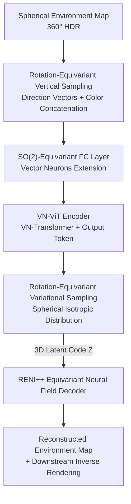

# VENI: Variational Encoder for Natural Illumination

**Conference**: CVPR 2026  
**Paper**: [CVF Open Access](https://openaccess.thecvf.com/content/CVPR2026/html/Walker_VENI_Variational_Encoder_for_Natural_Illumination_CVPR_2026_paper.html)  
**Project Page**: https://paul-pw.github.io/veni  
**Area**: 3D Vision / Inverse Rendering / Natural Illumination Priors  
**Keywords**: Rotation Equivariance, Variational Autoencoder, Spherical Neural Fields, Environment Maps, Vector Neurons

## TL;DR
VENI establishes a prior for outdoor natural illumination using an $SO(2)$ rotation-equivariant Variational Autoencoder. It utilizes a novel Vector Neuron Vision Transformer (VN-ViT) as the encoder and adopts the equivariant neural field from RENI++ as the decoder. By directly encoding spherical environment maps into a well-structured, unique latent space, VENI achieves smoother interpolation than the decoder-only RENI++, scales to large datasets, and enhances performance in downstream tasks such as inverse rendering.

## Background & Motivation

**Background**: Inverse rendering (estimating shape, material, and lighting from a single image) is inherently ill-posed, as infinitely many combinations of "shape + material + lighting" can generate the same image. To constrain the solution space, lighting priors are commonly introduced. Although complex, natural outdoor illumination exhibits strong statistical regularities—the primary light sources are the sun and sky, the color range is limited, and there is a clear "up" direction, where any rotation around the vertical axis is equally plausible. Recent works use spherical neural fields (RENI, RENI++) to model lighting as a continuous representation queryable from any direction, leveraging the physical property of "up-axis rotation equivariance."

**Limitations of Prior Work**: The current state-of-the-art lighting prior, RENI++, adopts an **autodecoder (decoder-only)** architecture. The latent code for each training/test image is randomly initialized and jointly optimized with the model. This leads to two major drawbacks: First, the **latent space is non-unique**, as two similar images could be mapped to completely different latent codes. Second, it **cannot scale to large datasets**, as optimizing a separate latent code for every image becomes problematic. As the number of similar images increases, the uniqueness degrades, causing performance to drop with larger data volumes (see Table 3).

**Key Challenge**: The goal is to retain the advantages of "rotation equivariance + continuous neural field representation," but an equivariant **encoder** is difficult to construct. The lack of an equivariant encoder led RENI++ to use a decoder-only setup. Thus, there is a conflict between "equivariance" and a "well-structured, forward-encodable latent space."

**Goal**: To design an architecture that maintains up-axis rotation equivariance while being able to encode an image into a latent code in a single forward pass, ensuring that similar images naturally map to similar latent codes, thereby making the latent space unique, scalable, and smoothly interpolatable.

**Core Idea**: Replace the autodecoder of RENI++ with an **$SO(2)$-equivariant Variational Autoencoder**. The key is designing a ViT encoder (VN-ViT) that can process spherical signals and maintain up-axis rotation equivariance, while reusing the RENI++ decoder.

## Method

### Overall Architecture

VENI aims to learn a "well-structured natural illumination latent space" where operations (especially interpolation) are semantically meaningful. It treats the 360° HDR environment map as a true spherical signal without 2D projection. The pipeline is: **Environment Map → Vertical strip patch sampling (concatenating direction vectors and colors) → $SO(2)$-equivariant projection to patch embeddings → VN-Transformer → Output token extraction → $SO(2)$-equivariant projection of $\mu$ and $\log(\sigma^2)$ → Spherical reparameterization to obtain 3D latent code $Z$ → RENI++ equivariant neural field decoding → Reconstructed environment map**. The entire encoder is equivariant to "up-axis rotation of the input." If the input rotates, the latent code and reconstruction rotate accordingly (Fig. 2).

### Key Designs

**1. $SO(2)$-Equivariant FC Layer: Equivariant "Direction" and Invariant "Color" with Mutual Interaction**

The original Vector Neurons provide full $SO(3)$ equivariance (equivariance to rotation around any axis). However, for outdoor lighting, only **rotation around the up-axis (within the xy-plane)** produces another plausible environment. Rotations around other axes, especially rotating the color vectors, produce unrealistic lighting. Thus, only the x and y dimensions should be equivariant, while z and RGB colors should remain **invariant** to xy-plane rotations. The challenge is maintaining the respective symmetries of equivariant and invariant dimensions while allowing them to exchange information. VENI splits the input into equivariant components $X_{eq} \in \mathbb{R}^{d_{in} \times 2}$ (x, y) and invariant components $X_{inv} \in \mathbb{R}^{d_{in} \times c_{inv}}$ (z + color, $c_{inv}=4$). It performs both operations within one neuron. The equivariant output is a **bilinear** combination of $X_{eq}$ and the invariants: $\mathbf{T}_{inv}=[X_{inv}, \mathbf{1}]$; $Y_{eq,o,v}=\sum_i\sum_k W_{eq,o,k,i}\,T_{inv,i,k}\,X_{eq,i,v}$. The invariant output is a linear combination of $X_{inv}$ and the norm of the equivariant vectors $\lVert X_{eq} \rVert$: $Y_{inv}=W_{inv}\,T'_{inv}+B_{inv}$. Feeding the norm into the invariant branch is key to letting the invariant output depend on equivariant input without breaking invariance. Ablation (Table 5) shows that using this layer only for the input/output projections of the encoder works best.

**2. VN-ViT Encoder + Rotation-Equivariant Vertical Sampling: Equivariant ViT**

This is the core contribution: a Vision Transformer that encodes spherical images into $SO(2)$-equivariant latent codes. Standard ViT breaks equivariance due to positional encodings and 2D projections. VENI replaces each ViT component with a Vector Neuron version: **no positional encodings** are used; instead, the color of each sample point is concatenated with its sampling direction vector as "coordinate-aware" input (early fusion). Patch sampling uses **vertical strips on the sphere**. Rotating the environment map by a multiple of the strip width is equivalent to permuting the colors in each patch; since transformers are permutation-invariant, and direction vectors provide orientation, the system becomes $SO(2)$-equivariant. To avoid uneven sampling at the poles, azimuth $\varphi$ is sampled uniformly, and polar angle $\theta$ is distributed as $\theta = \arccos(x), x \in [-1, 1]$, **eliminating projection distortion**.

**3. Rotation-Equivariant Variational Sampling: Isotropic Spherical Distribution in 3D Latent Space**

After replacing the autodecoder with a VAE, sampling must occur in the 3D latent space. Naively sampling three 1D distributions independently yields an **axis-aligned** distribution that is not rotationally equivariant. VENI instead samples from a **spherical normal distribution** defined by a 3D mean vector and a 1D variance, which is isotropic and thus rotation-equivariant. Correspondingly, the KL divergence is modified to a 3D isotropic version: $\mathcal{L}_{KLD}=\frac{1}{D}\sum_i -0.5\,(3+3\log\sigma_i-\lVert\mu_i\rVert^2-3\sigma_i)$. This "equivariant sampling + forward encoding" ensures similar images map to similar latent codes, eliminating the non-uniqueness of RENI++.

**4. HDR Training Loss + StreetLearn Pre-training Curriculum**

Natural light has an extreme dynamic range, necessitating training in log space. Furthermore, HDR maps have unknown exposure, leading to scale ambiguity. VENI exclusively uses **scale-invariant** losses: Mean Absolute Gradient Error (MAGE, $\mathcal{L}_{MAGE}=\frac{1}{M}\sum_j\frac{1}{N_j}\sum_i\sin(\theta_i)\lvert\nabla_S f(\mathbf I)^j_i-\nabla_S\mathbf I^j_i\rvert$ using Scharr operators in log space), scale-invariant loss, and cosine loss (for RGB direction/color). All are weighted by $\sin\theta_i$ to compensate for equirectangular sampling bias. Since high-quality 360° HDR data is scarce, VENI **pre-trains** on 43,310 StreetLearn images and **finetunes** on RENI++ data.

### Loss & Training
As described in Key Design 4: A weighted combination of MAGE, scale-inv, cosine, and 3D-KLD in log space, following a two-stage curriculum (StreetLearn pre-training → RENI++ finetuning).

## Key Experimental Results

### Main Results
Reconstruction quality on the RENI++ test set (PSNR/SSIM/LPIPS in tone-mapped LDR space, PSNR in linear HDR space) across latent dimensions $D=27/147/300$. VENI reports two modes: full Autoencoder forward pass (AE) and latent optimization using only the decoder (opt).

| Latent Dim D | Metric | RENI++ (opt) | Ours (AE) | Ours (opt) |
|--------------|--------|--------------|-----------|------------|
| 27 | PSNR↑ | 18.02 | 18.78 | **20.33** |
| 27 | SSIM↑ | 0.39 | 0.46 | **0.51** |
| 27 | LPIPS↓ | 0.62 | 0.62 | **0.61** |
| 147 | PSNR↑ | 21.13 | 19.40 | **21.89** |
| 300 | PSNR↑ | 22.10 | 19.47 | **22.68** |

At low dimensions ($D=27$), Ours (opt) improves PSNR from 18.02 to 20.33 (+2.3 dB). At higher dimensions, Ours (opt) consistently outperforms RENI++.

### Uniqueness & Scalability

| Latent Dim D | Uniqueness↓ RENI++ | Uniqueness↓ Ours | Recon. Consistency↑ RENI++ | Recon. Consistency↑ Ours |
|--------------|--------------------|------------------|---------------------------|-------------------------|
| 27 | 1.46 | **0.04** | 0.17 | **0.50** |
| 147 | 1.11 | **0.43** | 0.12 | **0.30** |
| 300 | 1.03 | **0.57** | 0.07 | **0.23** |

Uniqueness measures the MSE between the reconstruction of the midpoint of two optimized latent codes for the same image vs. the reconstruction of the first code (lower is better). VENI suppresses the uniqueness error from 1.46 to 0.04 at $D=27$.

Data scaling experiment (Table 3, StreetLearn):

| Data Scale | RENI++ | Ours (AE) | Ours (opt) |
|------------|--------|-----------|------------|
| 1,500 | 20.11 | 16.00 | 20.99 |
| 43,260 | 17.14 (↓) | 16.77 (↑) | 19.90 |

RENI++ performance drops from 20.11 to 17.14 as data increases, while VENI's AE forward pass improves, validating the scalability of the VAE.

### Ablation Study

| Configuration | PSNR@27 | PSNR@147 | PSNR@300 |
|---------------|---------|----------|----------|
| Ours (Full) | 18.78 | 19.40 | 19.47 |
| − scale-inv & MAGE loss | 17.32 | 18.47 | 18.80 |
| − streetlearn pre-train | 17.37 | 18.07 | 17.88 |
| − SO(2) linear proj | 16.89 | 17.49 | 17.30 |

### Key Findings
- **$SO(2)$ projection layer is critical**: Removing it drops PSNR by 1.9 dB at $D=27$. Relaxing only the projection to $SO(2)$ is superior to relaxing the entire encoder.
- **Pre-training is essential**: Without StreetLearn, high-dimensional performance ($D=300$) drops significantly (19.47 → 17.88).
- **Uniqueness is the differentiator**: VENI's uniqueness error is an order of magnitude lower than RENI++. Interpolations are smooth, whereas RENI++ introduces artifacts.
- **Downstream Gains**: A more unique latent space benefits inverse rendering optimization, with VENI consistently outperforming RENI++ in reconstruction PSNR.

## Highlights & Insights
- **Hard-coding Physical Symmetry**: Outdoor lighting is only plausible when rotated around the up-axis. Designing for $SO(2)$ rather than full $SO(3)$ while allowing direction-color interaction is a powerful approach for any oriented spherical signal.
- **VAE over Autodecoder**: Moving to a forward encoder naturalizes the "similar input → similar latent" mapping, solving both non-uniqueness and scalability.
- **Cross-task Loss Adaptation**: Adapting MAGE and scale-invariant losses from depth prediction to HDR lighting effectively handles high-frequency details and scale ambiguity.
- **Projection-free Spherical Processing**: By using "direction + color early fusion" and vertical sampling, VENI avoids equirectangular distortion entirely.

## Limitations & Future Work
- **Natural Illumination Assumption**: The model assumes a clear horizon and up-axis; it is not directly applicable to indoor or synthetic lighting without clear orientation.
- **Data Dependency**: The quality of StreetLearn-to-HDR conversion is limited and biased towards urban scenes.
- **Patch Discretization**: Equivariance is strict only for rotations of integer strip widths; continuous rotation equivariance remains an area for improvement.
- **Future Directions**: Higher resolution equivariant neural fields and expanding datasets with high-quality synthetic HDR data.

## Related Work & Insights
- **vs RENI++**: VENI solves the uniqueness and scalability issues of RENI++'s autodecoder by introducing the VN-ViT encoder.
- **vs Parametric Illumination (SG / SH)**: While SG/SH have limited expressive power, VENI uses neural fields to capture finer details with fewer parameters.
- **vs LDR→HDR Extrapolation**: Unlike GAN-based methods that require visible light sources, VENI acts as a general-purpose prior.
- **vs Vector Neurons**: VENI extends the VN framework to $SO(2)$ linear layers, a specific technical contribution to the VN toolbox.

## Rating
- Novelty: ⭐⭐⭐⭐⭐ 
- Experimental Thoroughness: ⭐⭐⭐⭐ 
- Writing Quality: ⭐⭐⭐⭐ 
- Value: ⭐⭐⭐⭐ 

<!-- RELATED:START -->

## Related Papers

- [\[CVPR 2026\] Variational Graph-based Normal Integration](variational_graph-based_normal_integration.md)
- [\[CVPR 2026\] GP-4DGS: Probabilistic 4D Gaussian Splatting from Monocular Video via Variational Gaussian Processes](gp-4dgs_probabilistic_4d_gaussian_splatting_from_monocular_video_via_variational.md)
- [\[CVPR 2026\] Glove2Hand: Synthesizing Natural Hand-Object Interaction from Multi-Modal Sensing Gloves](glove2hand_synthesizing_natural_hand-object_interaction_from_multi-modal_sensing.md)
- [\[CVPR 2026\] Illumination-Consistent Human-Scene Reconstruction from Monocular Video](illumination-consistent_human-scene_reconstruction_from_monocular_video.md)
- [\[CVPR 2026\] Lumosaic: Hyperspectral Video via Active Illumination and Coded-Exposure Pixels](lumosaic_hyperspectral_video_via_active_illumination_and_coded-exposure_pixels.md)

<!-- RELATED:END -->
