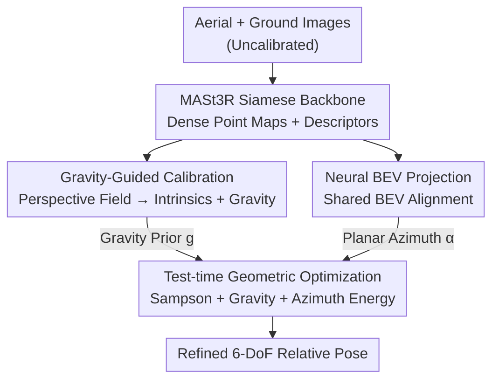

# VGA: Empowering Aerial-Ground Localization by Visual Geometry Alignment

**Conference**: CVPR 2026  
**Paper**: [CVF Open Access](https://openaccess.thecvf.com/content/CVPR2026/html/Lin_VGA_Empowering_Aerial-Ground_Localization_by_Visual_Geometry_Alignment_CVPR_2026_paper.html)  
**Area**: 3D Vision  
**Keywords**: Aerial-ground localization, relative size estimation, gravity prior, BEV alignment, test-time optimization

## TL;DR
VGA addresses extreme wide-baseline 6-DoF relative pose estimation between uncalibrated aerial drone views and ground views. It learns two additional physical priors on top of a MASt3R backbone—a gravity alignment prior derived from perspective fields and a planar orientation prior from Procrustes alignment of views projected onto a shared top-down plane. These are used as geometric constraints in test-time joint optimization to refine the pose, improving AUC@30° by approximately 11% over the second-best method on MatrixCity / ACC-NVS1 / ULTRRA.

## Background & Motivation

**Background**: Estimating the 6-DoF relative pose of a ground-view image relative to an aerial drone or satellite image ("aerial-ground localization") is a fundamental problem for air-ground coordination, autonomous navigation, and cross-view scene understanding. Two main paradigms exist: 1) classical or learning-based correspondence matching followed by pose solving (SfM, COLMAP, SuperPoint+SuperGlue, and recent 3D foundation models like DUSt3R, MASt3R, VGGT, π³) which rely on finding point pairs across views to solve the essential matrix; 2) fine-grained cross-view localization, which projects ground images to the Bird’s-Eye-View (BEV) plane to estimate azimuth and planar translation relative to satellite imagery.

**Limitations of Prior Work**: The first approach struggles with the extreme viewpoint gap in aerial-ground pairs—ground images are near-horizontal while aerial images are high-altitude oblique views. This results in drastic differences in visible surfaces, occlusions, scale, and resolution, causing matching to fail. 3D foundation models see a performance cliff on such pairs (e.g., the original MASt3R fails across the board in Table 1). The second approach, while stable for azimuth and translation, assumes constant ground camera height and relies on well-calibrated satellite orthomaps, failing when faced with variable drone altitudes, oblique angles, and scale ambiguities.

**Key Challenge**: The extreme viewpoint difference makes the "pixel-level correspondence" information channel highly unreliable, while existing learning-based regression models lack generalization to unseen viewpoints and altitudes (pure geometric regression collapses under distribution shifts). The root cause is an excessively large search space devoid of physical constraints to tighten it.

**Goal**: To robustly estimate full 6-DoF relative poses on uncalibrated, cross-altitude aerial-ground image pairs, while simultaneously predicting intrinsics, gravity direction, and metric scale for each view.

**Key Insight**: Urban scenes contain abundant "gravity-aligned" visual cues (vertical building edges and vanishing points determine roll/pitch; horizontal roads and rooftops determine tilt). Once both views are aligned to the gravity direction and projected onto a shared metric BEV plane, the 6-DoF matching problem is reduced to a 4-DoF problem—consisting only of in-plane rotation (azimuth $\alpha$) and planar translation—which is far more stable than direct matching in perspective space.

**Core Idea**: Directly learn two "physically meaningful" geometric priors (gravity alignment + shared BEV plane alignment) from visual inputs, and use them during inference as global regularization terms to jointly optimize the feed-forward relative pose, bridging the generalization gap of learning-based methods with physical constraints.

## Method

### Overall Architecture
VGA is a two-stage framework. The first stage is a dense geometric regression network: a Siamese ViT backbone (from MASt3R) processes the aerial image $I^a$ and ground image $I^g$. Beyond the original dense 3D point maps, confidence, and descriptors, it includes two additional branches: a **calibration branch** that predicts intrinsics $\xi^v=(\mathrm{vfov},c_x,c_y,\theta,\phi)^v$ and dense perspective fields $(\mathbf{u},\varphi)^v$; and a **BEV branch** that uses a Neural BEV Projector to project features onto a shared BEV plane, decoding BEV point maps, confidence, and descriptors. The second stage is test-time Post-Geometry Optimization: the predicted gravity directions and BEV azimuth are treated as geometric constraints and combined with perspective-space reprojection errors in a joint energy function to iteratively refine the 6-DoF relative pose $P^{ag}=[R^{ag}\mid t^{ag}]$.

### Key Designs

**1. Gravity-Guided Calibration: Anchoring roll/pitch to physical gravity**

To reduce the massive ambiguity of 6-DoF rotation in aerial-ground matching, the authors decompose rotation into a "gravity alignment component + residual azimuth $\alpha$." The former is fixed using physical cues. Specifically, a set of calibration tokens are added to the backbone, interacting with image features via a Transformer Decoder to obtain a calibration embedding $\mathbf{c}^v$. A lightweight MLP head then regresses $\xi^v=(\mathrm{vfov},c_x,c_y,\theta,\phi)^v$, where $(\theta,\phi)$ represents pitch and roll relative to gravity. Simultaneously, a DPT head solves for the dense perspective field: the up-vector $\mathbf{u}_p=\frac{\Pi(X_p-c\vec{\mathbf{g}})-\Pi(X_p)}{\lVert\Pi(X_p-c\vec{\mathbf{g}})-\Pi(X_p)\rVert_2}$ describes the projection of the 3D upward direction, and the latitude $\varphi_p=\arcsin\!\big(\frac{\mathbf{r}_p\cdot\vec{\mathbf{g}}}{\lVert\mathbf{r}_p\rVert_2}\big)$ describes the angle between the line of sight and the horizontal plane. While the perspective field can theoretically be calculated from gravity and 3D points, VGA explicitly regresses it as an independent output to allow for further refinement using Levenberg–Marquardt: $\xi_v^*=\mathrm{LM}(\xi^v,\mathbf{u}^v,\varphi^v)$.

**2. Neural BEV Projector: Reducing 6-DoF matching to 4-DoF planar alignment**

Direct pixel-level correspondence is unreliable due to the lack of overlap between horizontal and oblique views. VGA maps both views to a shared gravity-aligned metric BEV plane where the unknowns are reduced to in-plane rotation $\alpha$ and planar translation. Since standard BEV projection requires known intrinsics and upright images, the authors propose a Neural BEV Projector $f(\cdot)$. It takes implicit intrinsics, gravity embeddings $\mathbf{c}^v$, and feature tokens $T^v$ as input, decoding learnable queries $Q^v$ into canonical BEV representations: $X^v_{\mathrm{bev}},C^v_{\mathrm{bev}},D^v_{\mathrm{bev}}=f(Q^v,T^v,\mathbf{c}^v)$. Ground truth (GT) for BEV is generated by merging GT 3D point maps in the aerial coordinate system, forcing the network to integrate complementary spatial cues.

**3. Test-time Geometric Optimization: Physical priors as rotation regularization**

To fix generalization failures of the feed-forward network in wide-baseline or out-of-distribution scenarios, a joint energy function is minimized during inference:

$$\{R^{ag}\}^*,\{t^{ag}\}^*=\arg\min_{R^{ag},t^{ag}}\ \lambda_S\,\mathcal{E}_S+\lambda_g\,\mathcal{E}_g+\lambda_\alpha\,\mathcal{E}_\alpha.$$

$\mathcal{E}_S$ is the Sampson reprojection error on MASt3R inlier correspondences, providing epipolar constraints. $\mathcal{E}_g=\lVert R^{ag}\vec{\mathbf{g}}^g-\vec{\mathbf{g}}^a\rVert_2^2$ uses the gravity vectors to regularize roll and pitch. $\mathcal{E}_\alpha=\lVert\log({R^{ag}_z}^\top R_z(\alpha))\rVert_2^2$ constrains the rotation around the gravity axis using the BEV azimuth $\alpha$, which is obtained via a Procrustes solver within a RANSAC loop. This joint optimization tightens the 6-DoF search space from two orthogonal directions (roll/pitch via gravity, and azimuth via BEV).

### Loss & Training
Training occurs in two stages: first, the backbone is fine-tuned on aerial-ground pairs using the AerialMegaDepth protocol for 20 epochs. Second, the backbone is frozen while the new branches are trained for 50 epochs using the total loss:

$$\mathcal{L}=\lambda_{Pers}\mathcal{L}_{Pers}+\lambda_\xi\mathcal{L}_\xi+\lambda_{conf}\mathcal{L}^{\text{bev}}_{\text{conf}}+\lambda_{match}\mathcal{L}^{\text{bev}}_{\text{match}},$$

where $\mathcal{L}_{Pers}$ supervises the perspective field, $\mathcal{L}_\xi$ supervises calibration parameters, and $\mathcal{L}^{\text{bev}}_{\text{match}}$ uses InfoNCE for contrastive learning on BEV descriptors.

## Key Experimental Results

### Main Results
The model was tested on MatrixCity (synthetic urban pairs) and evaluated for zero-shot generalization on ACC-NVS1 and ULTRRA.

MatrixCity (BigCity) results (best in bold):

| Method | RTA@25° | RRA@25° | AUC@30° |
|------|---------|---------|---------|
| ROMA | 10.82 | 4.60 | 3.59 |
| VGGT | 11.74 | 1.96 | 1.66 |
| π³ | 17.48 | 16.00 | 1.52 |
| MASt3R (AMD+MatrixCity) | 37.10 | 33.54 | 29.12 |
| **VGA (Ours)** | **45.64** | **46.70** | **34.97** |

ACC-NVS1 + ULTRRA Zero-shot Generalization:

| Method | RTA@25° | RRA@25° | AUC@30° |
|------|---------|---------|---------|
| MASt3R (AerialMegaDepth) | 54.94 | 52.90 | 34.75 |
| π³ | 71.26 | 75.70 | 43.45 |
| **VGA (Ours)** | **72.74** | **76.34** | **47.45** |

VGA establishes a new SOTA on zero-shot benchmarks, with AUC@30° approximately 4.0% higher than π³. Total improvement relative to sub-optimal methods is cited as ~11% AUC@30°.

### Ablation Study
On MatrixCity (BigCity), isolating the two priors (Baseline = MASt3R feed-forward output):

| Configuration | RTA@25° | RRA@25° | AUC@30° | Note |
|------|---------|---------|---------|------|
| Baseline | 37.10 | 33.54 | 29.12 | Pure feed-forward |
| + Planar Alignment | 37.92 | 35.62 | 31.36 | BEV constraint only |
| + Gravity Prior | 40.60 | 41.28 | 33.38 | Gravity prior only |
| Joint Optimization | 45.64 | 46.70 | 34.97 | Full model |

### Key Findings
- **Gravity prior is the primary driver**: Adding the gravity prior alone pushes RRA@25° from 33.54 to 41.28, suggesting that anchoring roll/pitch to a physical vertical orientation contributes most to rotation stability.
- **BEV alignment is complementary**: While its individual gain is smaller (attributable to the difficulty of learning BEV projections), it provides azimuth constraints orthogonal to gravity.
- **Optimization is nearly free**: Joint optimization adds only milliseconds to inference while providing a substantial performance boost (5–8% gain).

## Highlights & Insights
- **Dimensionality Reduction**: The core insight is converting "hard matching" into "easy alignment" by using gravity to fix roll/pitch and BEV to reduce 6-DoF to 4-DoF.
- **Explicit for Optimizability**: Regressing the perspective field explicitly, rather than deriving it implicitly, allows the model to "provide an interface" for downstream LM refinement.
- **Generalized via Physical Constraints**: Instead of retraining the network for every distribution, VGA uses test-time physical constraints to tighten the search space, solving the fragility of pure regression models.

## Limitations & Future Work
- **Two-view Limitation**: The current framework is limited to pairs and does not utilize temporal or multi-view consistency.
- **BEV Projection Bottleneck**: Ablations show BEV alignment gains are capped by the difficulty of learning accurate projections in uncalibrated settings.
- **Unverified Auxiliaries**: Intrinsics and metric scale are predicted but not formally evaluated under standard protocols.
- **Urban Dependency**: The gravity prior relies on structural cues (buildings, roads), which may be absent in natural or wild environments.

## Related Work & Insights
- **vs 3D Foundation Models**: While DUSt3R and MASt3R are powerful, they fail under extreme aerial-ground viewpoint differences. VGA acts as a geometric "patch" for these models.
- **vs Cross-View Localization**: Unlike satellite-to-ground methods that assume constant height, VGA handles the variable altitude and oblique angles of drones.

## Rating
- Novelty: ⭐⭐⭐⭐ Combining gravity and BEV alignment with test-time optimization for 6-DoF search space reduction is a novel angle for aerial-ground tasks.
- Experimental Thoroughness: ⭐⭐⭐⭐ Solid results across three benchmarks, though the accuracy of predicted intrinsics remains unverified.
- Writing Quality: ⭐⭐⭐⭐ Clear motivation, complete formulas, and well-structured stages.
- Value: ⭐⭐⭐⭐ Addresses a practical challenge in air-ground coordination with a methodology transferable to other wide-baseline pose tasks.

<!-- RELATED:START -->

## Related Papers

- [\[CVPR 2026\] Towards Visual Query Localization in the 3D World](towards_visual_query_localization_in_the_3d_world.md)
- [\[CVPR 2026\] AsymLoc: Towards Asymmetric Feature Matching for Efficient Visual Localization](asymloc_towards_asymmetric_feature_matching_for_efficient_visual_localization.md)
- [\[CVPR 2026\] PV-Ground: Text-Guided Point-Voxel Interaction for 3D Visual Grounding](pv-ground_text-guided_point-voxel_interaction_for_3d_visual_grounding.md)
- [\[AAAI 2026\] Griffin: Aerial-Ground Cooperative Detection and Tracking Dataset and Benchmark](../../AAAI2026/3d_vision/griffin_aerial-ground_cooperative_detection_and_tracking_dataset_and_benchmark.md)
- [\[CVPR 2026\] DVGT: Driving Visual Geometry Transformer](dvgt_driving_visual_geometry_transformer.md)

<!-- RELATED:END -->
