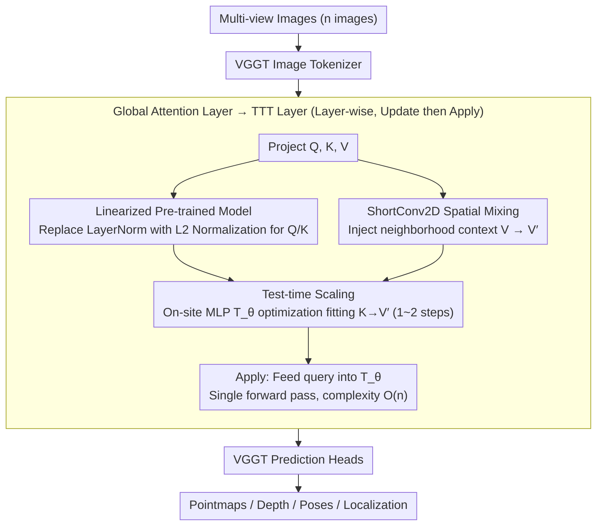

# VGG-T3: Offline Feed-Forward 3D Reconstruction at Scale

**Conference**: CVPR 2026  
**arXiv**: [2602.23361](https://arxiv.org/abs/2602.23361)  
**Code**: None  
**Area**: 3D Vision / 3D Reconstruction  
**Keywords**: 3D Reconstruction, Test-Time Training, Linear Complexity, KV Compression, Visual Localization  

## TL;DR

VGG-T3 is proposed, which compresses the variable-length KV representation of global attention layers in VGGT into a fixed-size MLP via **Test-Time Training (TTT)**. This reduces the computational complexity of offline feed-forward 3D reconstruction from $O(n^2)$ to $O(n)$, enabling large-scale scene reconstruction with thousands of images (1k images in 58 seconds).

## Background & Motivation

**Background**: Feed-forward multi-view 3D reconstruction methods (e.g., VGGT, Fast3R) utilize Transformer-based global self-attention for multi-view reasoning. Their accuracy is comparable to classic COLMAP pipelines while being more robust under challenging conditions.

**Limitations of Prior Work**: The computational complexity and memory requirements of these methods grow **quadratically** with the number of input images $n$. The core bottleneck is the global softmax attention operation, which must query a variable-length KV space composed of tokens from all images. VGGT takes over 11 minutes to process 1k images.

**Key Challenge**: Existing acceleration methods (e.g., token merging in FastVGGT, sparse attention in SparseVGGT) reduce the constant factor, but the **asymptotic complexity remains quadratic**: $O(n^2) \to O(n/r)^2$. Online methods (e.g., CUT3R, Must3R) use fixed-size implicit memory but suffer from limited accuracy and drift.

**Goal**: Achieve linear complexity $O(n)$ while maintaining the accuracy advantages of global offline reconstruction, supporting reconstruction of image sets of arbitrary scale.

**Key Insight**: Inspired by DeepSDF—compressing variable-length representations into fixed-size optimizable parameters. The variable-length KV space of the VGGT global attention layer is distilled into the weights of a fixed-size MLP via TTT.

**Core Idea**: A TTT mechanism is used to learn an MLP $T_\theta$ that maps Keys to Values ($\arg\min_\theta \sum_i L_t(T_\theta(k_i) - v_i)$). During inference, the output is obtained by passing queries through this MLP, resulting in operations that are linear with respect to sequence length.

## Method

### Overall Architecture

VGG-T3 addresses a specific challenge: VGGT relies on global softmax attention for multi-view reasoning, where every added image expands a variable-length KV space queried by all queries, causing computation to explode quadratically ($O(n^2)$). VGG-T3 replaces this expanding KV space by "encoding" it into fixed-size MLP weights—an intuition borrowed from DeepSDF, which uses optimizable parameters to encode the geometry of an instance.

The model retains the VGGT image tokenizer and prediction heads but replaces all **global attention layers** with TTT layers. Each layer executes two steps. First, **Update**: input tokens are projected into Q, K, and V, followed by on-site optimization of an MLP $T_\theta$ to fit the mapping from keys to values ($\arg\min_\theta \sum_i L_t(T_\theta(k_i), v_i)$). This compresses the variable-length KV relationships into $\theta$. Second, **Apply**: the layer's queries $q$ are fed directly into the optimized $T_\theta$ to obtain output tokens. Since the Apply step is a single forward pass, the complexity is $O(n)$ regardless of the KV space size.

### Key Designs

**1. Linearized Pre-trained Model: Enabling Fast TTT Convergence**

The model starts with pre-trained VGGT weights, retaining $W_q, W_k, W_v$ projection matrices to avoid training from scratch. However, VGGT utilizes LayerNorm in QK projections ($q_i = \text{LN}_q(W_q x_i)$), where learnable scale/shift parameters distort the input space during TTT, slowing MLP convergence. VGG-T3 replaces QK LayerNorm with parameter-free $L_2$ normalization. This stabilizes the input space, allowing TTT to converge in 1-2 steps, similar to post-training linearization techniques used in LLMs.

**2. ShortConv2D Non-linear Spatial Mixing: Avoiding Trivial TTT Solutions**

Without processing, the TTT objective faces a trivial solution: since $K = W_k x$ and $V = W_v x$ are linear projections of the same $x$, a closed-form solution $V = W_v W_k^{-1} K$ exists. An MLP approximating this linear mapping would reach zero loss without learning geometry. VGG-T3 introduces a ShortConv2D on the value side, changing the target from $K \to V$ to $K \to V'$, where $V'$ contains local spatial context. The 1D token sequence is reshaped into a 2D grid, processed by a 2D convolution to aggregate neighborhood information, and flattened back. This forces the MLP to predict neighborhood-aware targets from individual tokens, learning robust geometric representations.

**3. Test-time Scaling: Support for Large-scale Scenes with Fixed Capacity**

While one optimization step per TTT layer suffices during training, reconstructing 1k images—far beyond the training distribution—requires more capacity. To compress such large scenes into a fixed-dimension MLP, the number of optimization steps is increased from 1 to 2. This recovers accuracy to levels near small-scale reconstructions when sequence lengths grow significantly, achieving near-constant length generalization at the cost of one additional inner optimization round.

### Loss & Training

The TTT inner loop uses a dot product loss:

$$L_t(T_\theta(k_i), v_i) = T_\theta(k_i)^T v_i$$

The fast-weight network $T_\theta$ utilizes a SwiGLU MLP and a Muon optimizer. During outer training, original VGGT weights are frozen, and only the global attention layers (replaced by TTT layers) are fine-tuned for 100k steps. The total cost is approximately 12% of training a VGGT from scratch.

## Key Experimental Results

### Main Results: Standard Benchmarks

| Method | Complexity | DTU CD↓ | ETH3D CD↓ | NRGBD-D CD↓ | 7scenes-D NC↑ |
|------|--------|---------|-----------|-------------|---------------|
| VGGT | $O(n^2)$ | 1.537 | 0.279 | 0.014 | 0.668 |
| SparseVGGT | $O(n^2)$ | 1.541 | 0.327 | 0.018 | 0.665 |
| TTT3R | $O(n)$ | 5.708 | 0.885 | 0.071 | 0.666 |
| **Ours** | $O(n)$ | **1.654** | **0.480** | **0.029** | **0.679** |

- Pointmap Estimation: **Significantly outperforms** the $O(n)$ baseline TTT3R (reducing DTU error by 2-2.5×) while remaining competitive with $O(n^2)$ methods.
- Video Depth Estimation: Achieves $\delta<1.25$ of 0.967 on KITTI, comparable to $O(n^2)$ methods.

### Large-scale Reconstruction Performance

| Number of Images | Ours | VGGT | FastVGGT | TTT3R |
|----------|--------|------|----------|-------|
| 1k images | **58s** | 11min (11.6× slower) | 4min (4.3× slower) | ~60s |
| 2k images (4GPU) | **48.5s** | 1590s | N/A | N/A |

### Ablation Study

| Design | DTU CD↓ | ETH3D CD↓ |
|------|---------|-----------|
| No ShortConv2D | Significant decline | Significant decline |
| LayerNorm instead of L2 | Very slow convergence | - |
| 1-step TTT (1k imgs) | ~5× error increase | - |
| 2-step TTT (1k imgs) | Near small-scale accuracy | Stable |

### Key Findings

1. The gap between VGG-T3 and $O(n^2)$ methods **narrows as the number of images increases**.
2. Supports processing arbitrary image set sizes on a single GPU via minibatch offloading to CPU and multi-GPU distributed inference.
3. Visual Localization: Feed-forward localization can be performed with a frozen TTT-MLP, achieving $e_r=6.71°, e_t=0.15$m on 7scenes.

## Highlights & Insights

1. **Core Insight**: Treating the KV space in attention as a "variable-length scene representation" and compressing it into a "fixed-size representation" via TTT is a natural and profound analogy to DeepSDF.
2. **Scalability**: The additivity of the TTT objective (gradients can be accumulated via minibatches) natively supports distributed inference and CPU offloading, which is impossible with softmax attention.
3. **Unified Framework**: The same model and TTT-MLP handle both mapping and localization, opening a path for unified end-to-end solutions.
4. **Low Fine-tuning Cost**: Freezing most VGGT parameters and only training TTT layer parameters costs only 12% of training from scratch.

## Limitations & Future Work

1. **Weak Pose Estimation**: The linearized TTT model performs poorly on pose estimation, likely due to the heterogeneous design of camera tokens in VGGT.
2. **Gap with Softmax Attention**: Fixed MLP capacity limits scene representation in wide-baseline settings compared to full softmax attention.
3. **Training Cost**: While 12% of VGGT, it still requires 8×A100-80GB for 100k steps.
4. **Localization Validation**: Verification is limited to 7scenes and Wayspots, lagging behind dedicated pipelines like Reloc3R.

## Related Work & Insights

- **VGGT**: Foundational architecture; uses global softmax attention for multi-view reasoning with $O(n^2)$ complexity.
- **FastVGGT / SparseVGGT**: Accelerates via token merging or block-sparse attention, but asymptotic complexity remains quadratic.
- **TTT3R**: Concurrent work; an auto-regressive TTT model based on CUT3R with $O(n)$ complexity but lower accuracy and no support for unordered inputs.
- **CUT3R / Must3R / Point3R**: Online methods with fixed implicit/spatial memory; linear but lack global consistency.
- **LaCT (Sun et al.)**: Proposer of the TTT framework; VGG-T3 adopts its SwiGLU MLP and Muon optimizer.
- **DeepSDF**: Classic implicit representation work; the "fixed-size network encoding instance geometry" idea is directly inherited here.

## Rating

- Novelty: ⭐⭐⭐⭐ — Cleverly migrates post-training linearization and TTT from LLMs to 3D reconstruction with targeted ShortConv2D design.
- Experimental Thoroughness: ⭐⭐⭐⭐⭐ — Covers pointmaps, depth, poses, and localization; includes large-scale evaluation and distributed inference.
- Writing Quality: ⭐⭐⭐⭐ — Clear logic with progressive motivation and informative visualizations.
- Value: ⭐⭐⭐⭐⭐ — Resolves the scalability bottleneck of feed-forward 3D reconstruction, providing 11.6× speedup with minimal accuracy loss.

<!-- RELATED:START -->

## Related Papers

- [\[CVPR 2026\] AMB3R: Accurate Feed-forward Metric-scale 3D Reconstruction with Backend](amb3r_accurate_feed-forward_metric-scale_3d_reconstruction_with_backend.md)
- [\[CVPR 2026\] PanoVGGT: Feed-Forward 3D Reconstruction from Panoramic Imagery](panovggt_feed-forward_3d_reconstruction_from_panoramic_imagery.md)
- [\[CVPR 2026\] Gen3R: 3D Scene Generation Meets Feed-Forward Reconstruction](gen3r_3d_scene_generation_meets_feed-forward_reconstruction.md)
- [\[CVPR 2026\] Any4D: Unified Feed-Forward Metric 4D Reconstruction](any4d_unified_feed-forward_metric_4d_reconstruction.md)
- [\[CVPR 2026\] MoRe: Motion-aware Feed-forward 4D Reconstruction Transformer](more_motion-aware_feed-forward_4d_reconstruction_transformer.md)

<!-- RELATED:END -->
