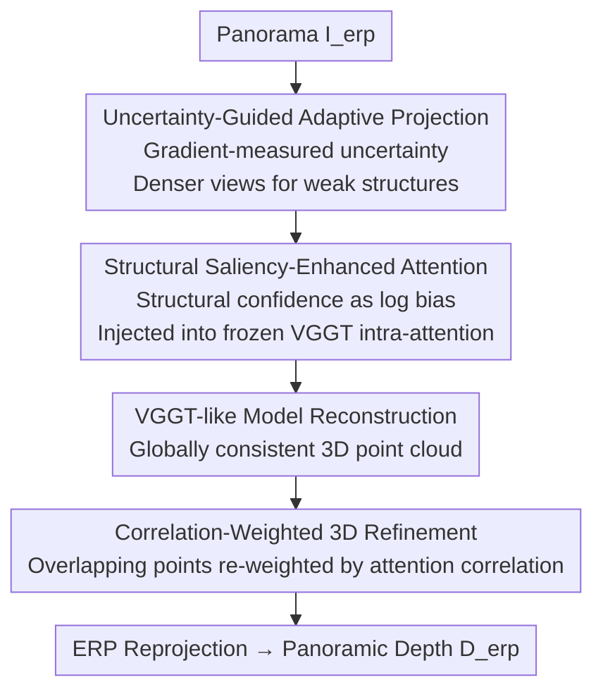

# VGGT-360: Geometry-Consistent Zero-Shot Panoramic Depth Estimation

**Conference**: CVPR 2026  
**Paper**: [CVF Open Access](https://openaccess.thecvf.com/content/CVPR2026/html/Yuan_VGGT-360_Geometry-Consistent_Zero-Shot_Panoramic_Depth_Estimation_CVPR_2026_paper.html)  
**Code**: https://github.com/Yuanjiayii/VGGT-360  
**Area**: 3D Vision  
**Keywords**: Panoramic Depth Estimation, Zero-Shot, VGGT, Training-free, Geometric Consistency

## TL;DR
VGGT-360 reformulates panoramic monocular depth estimation as a problem of "reconstructing a globally consistent 3D model using VGGT-like 3D foundation models from multiple views and then reprojecting it back to the panorama." Through three training-free plug-and-play modules (Uncertainty-Guided Adaptive Projection, Structural Saliency-Enhanced Attention, and Correlation-Weighted 3D Refinement), it unifies fragmented depth results from independent view inference into cross-view consistent results, surpassing both supervised and training-free SOTA methods on multiple indoor and outdoor datasets in a zero-shot manner.

## Background & Motivation
**Background**: 360° panoramas are typically stored in Equirectangular Projection (ERP). Panoramic Monocular Depth Estimation (MDE) is a fundamental capability for omnidirectional SLAM, VR, and autonomous navigation. Existing methods fall into two categories: **supervised** spherical/distortion-aware networks (BiFuse, UniFuse, HoHoNet, etc.) that directly regress depth in the ERP domain; and **training-free** methods (360MD, HDE360, RPG360) that decompose the panorama into several perspective views, perform per-view inference using pre-trained perspective MDE models (MiDaS, Depth Anything), and fuse them back into ERP.

**Limitations of Prior Work**: Supervised methods are bottlenecked by the scarcity of annotated panoramic data—high-quality panoramic data with ground truth (GT) depth is extremely difficult to obtain, limiting both accuracy and generalization. While training-free methods bypass annotations, they suffer from a structural flaw: **each perspective view is inferred independently, lacking cross-view interaction**. This leads to scale ambiguity (misaligned scales across views) and cross-view depth discontinuity, resulting in poor geometric fidelity and structural detail. Fig.1 provides a comparison: the traditional training-free method (360MD) yields an Abs Rel of 0.141 with a 13.31s latency, whereas the proposed method achieves 0.055 in 1.54s.

**Key Challenge**: The essence of panoramic depth is a **globally consistent geometric field**. However, the "slice-independent inference-fusion" paradigm essentially stitches together local predictions that are unaware of each other. No amount of fusion can fully recover the missing cross-view geometric constraints.

**Key Insight**: The authors observe a fundamental difference between 3D foundation models like VGGT and standard depth foundation models. VGGT does not merely learn implicit geometric priors from 2D data; it **explicitly reconstructs a consistent 3D representation** using cross-view geometric cues. If VGGT is first used to reconstruct a scene into a globally consistent 3D model from multiple views, and this 3D model is then projected back to the panorama to extract depth, "cross-view consistency" is inherently built-in, naturally eliminating fragmentation issues.

**Core Idea**: Reformulate panoramic depth estimation from "per-view depth fusion" to "Panorama $\rightarrow$ 3D (VGGT Reconstruction) $\rightarrow$ Panoramic Depth (ERP Reprojection)." The challenge lies in the fact that VGGT was originally trained on perspective views. Directly feeding panoramic slices encounters domain shifts such as spherical distortion, non-uniform resolution, and 360° wrap-around continuity. Therefore, three training-free modules are required to reinforce the "projection-reconstruction-refinement" pipeline.

## Method

### Overall Architecture
Given a single equirectangular panorama $I_{erp}\in\mathbb{R}^{H\times W\times 3}$, the VGGT-360 pipeline first **adaptively** projects the panorama into multiple perspective views, feeds them into a frozen VGGT-like model for multi-view 3D inference to reconstruct a globally consistent point map, and finally reprojects the 3D model back to the panorama via ERP projection to obtain the depth map $D_{erp}\in\mathbb{R}^{H\times W}$. The entire framework does not modify any pre-trained VGGT weights; the three modules are plug-and-play and can seamlessly switch between different backbones such as VGGT, π³, or Fastvggt.

Each of the three modules manages a specific stage: (1) **Uncertainty-Guided Adaptive Projection** determines "what to feed into VGGT"—it replaces uniform slicing by allocating more views to areas with sparse geometric information; (2) **Structural Saliency-Enhanced Attention** prevents "VGGT reconstruction failure in weak-structure regions"—it injects structural confidence priors into intra-frame attention to guide it toward geometrically reliable zones; (3) **Correlation-Weighted 3D Refinement** resolves "misalignment of multi-view points in overlapping regions"—it re-weights overlapping points using correlation derived from attention, ensuring a clean geometric basis for reprojection.

### Key Designs

**1. Uncertainty-Guided Adaptive Projection: Allocating View Budget to Geometric Difficulties**

Prior slicing methods used fixed schemes (e.g., uniform cubemap projection), assuming all orientations are equally important. In reality, weak-structure regions like walls and ceilings have few geometric cues and are the most difficult to estimate. Uniform slicing wastes views on easy-to-estimate areas. This design reallocates the budget in two steps. First, **Uncertainty Scoring**: starting from $N_B$ ($N_B \ge 6$) base views with controlled overlap, it uses Sobel gradient magnitude to measure edge richness/geometric saliency, calculating an uncertainty map per pixel: $U(p)=\sigma(-Z(p))$, where 

$$Z(p)=\big(G(p)-\mathrm{median}_{p'\in\Omega(v_b)}(G(p'))\big)/\tau$$

$G(p)$ is the Sobel magnitude, and $\tau$ controls normalization sensitivity. View scores $S(v_b)$ are calculated via area-weighted valid pixels. Large gradients lead to small $U$ after $\sigma$; thus, views with sparse gradients (weak structures) receive high uncertainty scores. Second, **Adaptive Neighborhood Augmentation**: the top-$K$ views $B^*$ with the highest uncertainty scores are selected. For each, two neighbor views $N(v_b^*)$ are generated using predefined yaw/pitch offsets. The final view set is $V_{per}=B \cup N(B^*)$. This ensures global coverage while densely sampling geometric ambiguity zones (implemented with $N_B{=}8, K{=}2$).

**2. Structural Saliency-Enhanced Attention: Anchoring VGGT Attention on Reliable Geometry**

While VGGT has strong zero-shot generalization, it is prone to artifacts and hallucinated depth in weak-structure regions lacking reliable geometric cues. This design injects a **structural awareness confidence map** $M_s$ into VGGT’s intra-frame attention to guide multi-view aggregation toward geometrically stable regions **without touching pre-trained weights**. $M_s$ consists of two parts: a gradient geometric prior $M_g(p)=\sigma(Z(p))$ to highlight structural reliability, and an **edge-band prior** $E(p)=\mathbb{1}[\max(|x|,|y|)\ge 1-m]$ (where $(x,y)\in[-1,1]^2$ are normalized coordinates and $m$ controls bandwidth) to emphasize uncertain pixels near view boundaries and encourage cross-view interaction. These are combined as:

$$M_s(p)=\mathbb{1}_{valid}(p)\cdot\big[(1-E(p))\cdot M_g(p)+E(p)\big]$$

$M_s$ is then inserted as an **additive log-confidence bias** into the attention score:

$$M_{Attn}=\mathrm{softmax}\big(QK^\top/\sqrt{d}+\log(M_s)\big)$$

As a log bias, keys with low reliability ($M_s$) are suppressed, while high-reliability keys are boosted. Attention is "forced" onto structurally stable keys, suppressing artifacts in weak-structure regions and maintaining feature continuity at overlap boundaries.

**3. Correlation-Weighted 3D Refinement: Using Attention to Judge Overlapping Point Credibility**

A single ERP pixel is often observed by multiple views, resulting in multiple reconstructed 3D points that may conflict in overlapping regions. Simple averaging incorporates errors from unreliable points. This design assigns a **correlation score** to each overlapping point (derived from the last intra-frame attention map $\widetilde{M}_{Attn}$ of VGGT), where higher scores indicate higher reliability. For an ERP pixel $r$ observed by $N_K$ views, the final depth is a weighted aggregation:

$$D_{erp}(r)=\frac{\sum_{v_k}C_{v_k}(p_k)D_{v_k}(p_k)}{\sum_{v_k}C_{v_k}(p_k)}$$

The weight $C_{v_k}(p_k)$ is the normalized sum of three complementary measures. **Sharpness** uses normalized Shannon entropy to measure focus: $S_{sharp}(p_k)=1-H(p_k)/\log|\Omega(v_k)|$; lower entropy indicates sharper attention and more confident geometric localization. **Locality** weights spatial distance via a Gaussian kernel $S_{loc}(p_k)=\sum_p \widetilde{M}_{Attn}(p_k,p)G(\|x_p-x_{p_k}\|)$, as stable geometry typically relies on local attention. **Symmetry** uses the Bhattacharyya coefficient $S_{sym}(p_k)=\sum_u\sqrt{\widetilde{M}_{Attn}(p_k,p)\widetilde{M}'_{Attn}(p_k,p)}$ to measure bidirectional consistency between points. This step improves surface continuity and accuracy in overlapping regions purely through the statistical features of VGGT's attention.

## Key Experimental Results

### Main Results
Performance comparison on Matterport3D, Stanford2D3D, and Replica360-2K (↓ lower is better, δ↑ higher is better). VGGT-360 with various backbones leads across the board, even surpassing **supervised methods trained on the official training sets** of these benchmarks.

| Dataset | Method | Setting | Abs Rel↓ | δ1↑ |
|--------|------|----------|----------|------|
| Matterport3D | Depth Anywhere (BiFuse++) | Supervised M+ | 0.085 | 0.917 |
| Matterport3D | RPG360 (Metric3D v2) | Training-free | 0.203 | 0.859 |
| Matterport3D | **VGGT-360 (Fastvggt)** | **Training-free** | **0.078** | **0.943** |
| Stanford2D3D | Depth Anywhere (BiFuse++) | Supervised M+ | 0.083 | 0.930 |
| Stanford2D3D | 360MD (MiDaS v2) | Training-free | 0.268 | 0.636 |
| Stanford2D3D | **VGGT-360 (π³)** | **Training-free** | **0.065** | **0.952** |
| Replica360-2K | HDE360 (HoHoNet) | Training-free | 0.107 | 0.910 |
| Replica360-2K | **VGGT-360 (Fastvggt)** | **Training-free** | **0.069** | **0.950** |

The paper reports a 27–36% improvement in Abs Rel over the previous SOTA on Stanford2D3D and Replica360-2K. Performance is consistent across backbones (VGGT / π³ / Fastvggt), validating the generalizability of the modules.

### Ablation Study
Ablation of components on Stanford2D3D using the VGGT backbone (Baseline Abs Rel 0.080 / RMSE 0.354 / 1.41s).

| Module | Configuration | Abs Rel↓ | RMSE↓ | Time |
|------|------|----------|-------|------|
| Structural Attention | Baseline | 0.080 | 0.354 | 1.41s |
| Structural Attention | + $M_g$ | 0.075 | 0.343 | 1.43s |
| Structural Attention | + $M_g$ + $E$ | 0.073 | 0.346 | 1.44s |
| Structural Attention | + $M_g$ + $E$ + $\mathbb{1}_{valid}$ | 0.072 | 0.340 | 1.45s |
| 3D Refinement | + $S_{sharp}$ | 0.074 | 0.328 | 1.43s |
| 3D Refinement | + $S_{loc}$ | 0.073 | 0.327 | 1.44s |
| 3D Refinement | + $S_{sym}$ | 0.074 | 0.328 | 1.44s |
| 3D Refinement | + All Three | 0.071 | 0.325 | 1.46s |

### Key Findings
- **The three modules are positive and complementary across backbones**: Regardless of the backbone used, the modules consistently improve performance without retraining.
- **Adaptive projection beats brute-force view increases**: Uniform projection with $N_B{=}6$ provides limited performance, and simply increasing views yields diminishing returns with high compute costs. $N_B{=}8$ + top-$K{=}2$ augmentation provides the best accuracy-efficiency trade-off.
- **Structural attention components serve distinct roles**: The gradient prior $M_g$ provides the largest single gain (Abs Rel 0.080 $\rightarrow$ 0.075), while the edge band $E$ and valid mask $\mathbb{1}_{valid}$ further refine the results to 0.072.
- **Correlation measures work best in synergy**: Each measure (sharpness, locality, symmetry) reduces RMSE individually; using all three achieves the best result, filtering reliable 3D structures from multiple perspectives.
- The pipeline latency is ~1.46s (RTX 4090), nearly an order of magnitude faster than the 13.31s required by 360MD.

## Highlights & Insights
- **Value in Paradigm Shift**: Changing "per-view depth fusion" to "consistent 3D reconstruction then reprojection" eliminates scale ambiguity and discontinuities at the root. Consistency is inherent to 3D reconstruction rather than a post-processing patch.
- **Modular Precision**: The three modules precisely target specific failure points: projection for "input quality," attention for "reconstruction robustness," and correlation for "overlap refinement," following a clean logical flow.
- **Non-weight-modifying Attention Priors**: Using $\log(M_s)$ as an additive bias to inject structural confidence into a frozen ViT is a cost-effective paradigm for adding domain priors to foundation models without fine-tuning.
- **Self-Assessment via Attention**: Deriving reliability from attention map statistics (entropy, distance, symmetry) is an unsupervised "self-confidence evaluation" strategy applicable to any multi-source fusion problem.

## Limitations & Future Work
- **Reliance on VGGT Baseline**: Geometric fidelity is capped by the reconstruction capability of the underlying VGGT-like model. Failures in extremely textureless or massive outdoor scenes propagate directly to the depth output.
- **Indoor-Centric Evaluation**: Quantitative benchmarks are indoor-focused; outdoor results (OmniPhotos) rely on qualitative visual plausibility due to the lack of GT depth.
- **Heuristics in Hyperparameters**: The number of base views, top-$K$ selection, and edge bandwidth are manually defined. Their optimality and sensitivity across different scenes require further exploration.
- **Future Directions**: Replacing manual gradient scores with learned geometric signals or learning a lightweight scoring head for the three correlation measures could further improve performance in weak-structure areas.

## Related Work & Insights
- **vs. 360MD / RPG360 / HDE360 (Training-free Fusion)**: These methods perform independent per-view MDE followed by fusion, leading to scale misalignment. By using unified 3D reconstruction, VGGT-360 eliminates fragmentation and significantly leads in both accuracy and speed.
- **vs. Supervised Methods (Depth Anywhere, BiFuse++)**: These require specific training on datasets like Matterport3D. VGGT-360 is zero-training and zero-annotation but outperforms them on their own benchmarks, demonstrating superior generalization.
- **vs. Standard Depth Foundations (MiDaS, Metric3D)**: These models learn implicit 2D geometric priors per image. VGGT explicitly reconstructs cross-view consistent 3D. This work is the first to extend VGGT-like models to the panoramic depth domain.

## Rating
- Novelty: ⭐⭐⭐⭐⭐ First to introduce VGGT-like 3D models to panoramas, reformulating the task effectively.
- Experimental Thoroughness: ⭐⭐⭐⭐ Solid across three benchmarks and three backbones, though lacking quantitative outdoor evaluation with GT.
- Writing Quality: ⭐⭐⭐⭐⭐ Very clear logic connecting motivation, challenges, and modular solutions.
- Value: ⭐⭐⭐⭐⭐ High practical value for omnidirectional perception, VR, and SLAM due to being training-free and fast.

<!-- RELATED:START -->

## Related Papers

- [\[CVPR 2026\] SO(3)-Equivariant ViT-Adapter for Data-Efficient Zero-Shot Sim-to-Real Indoor Panoramic Depth Estimation](so3-equivariant_vit-adapter_for_data-efficient_zero-shot_sim-to-real_indoor_pano.md)
- [\[CVPR 2026\] Depth Any Panoramas: A Foundation Model for Panoramic Depth Estimation](depth_any_panoramas_a_foundation_model_for_panoramic_depth_estimation.md)
- [\[CVPR 2026\] ConceptPose: Training-Free Zero-Shot Object Pose Estimation using Concept Vectors](conceptpose_training-free_zero-shot_object_pose_estimation_using_concept_vectors.md)
- [\[CVPR 2026\] Zero-Shot Depth Completion with Vision-Language Model](zero-shot_depth_completion_with_vision-language_model.md)
- [\[CVPR 2026\] LaS-Comp: Zero-shot 3D Completion with Latent-Spatial Consistency](las-comp_zero-shot_3d_completion_with_latent-spatial_consistency.md)

<!-- RELATED:END -->
