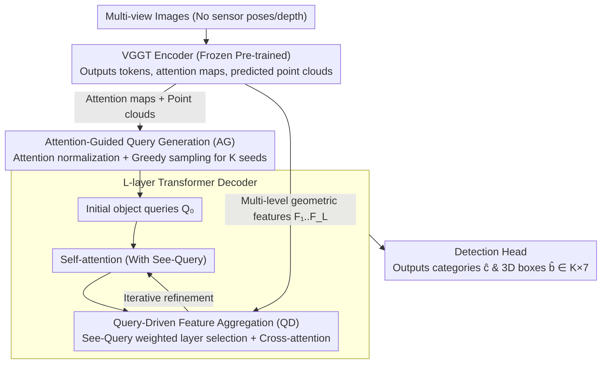

# VGGT-Det: Mining VGGT Internal Priors for Sensor-Geometry-Free Multi-View Indoor 3D Object Detection

**Conference**: CVPR2026  
**arXiv**: [2603.00912](https://arxiv.org/abs/2603.00912)  
**Authors**: Yang Cao, Feize Wu, Dave Zhenyu Chen, Yingji Zhong, Lanqing Hong, Dan Xu (HKUST, Huawei, Sun Yat-sen University)
**Code**: GitHub (Mentioned as open-sourced in the paper)  
**Area**: 3D Vision  
**Keywords**: Multi-view 3D object detection, Indoor scene understanding, Sensor-geometry-free, VGGT, Transformer

## TL;DR

Ours proposes VGGT-Det, the first multi-view indoor 3D object detection framework oriented towards sensor-geometry-free (SG-Free) input. By mining semantic priors (Attention-Guided query generation, AG) and geometric priors (Query-Driven feature aggregation, QD) inside the VGGT encoder, it outperforms the state-of-the-art methods by 4.4 and 8.6 mAP@0.25 on ScanNet and ARKitScenes, respectively.

## Background & Motivation

**Background**: Existing multi-view indoor 3D object detection methods (ImVoxelNet, NeRF-Det, MVSDet, etc.) rely heavily on **sensor-provided geometric inputs**—precisely calibrated multi-view camera poses and depth maps. 

**Limitations of Prior Work**: However, in practical deployment, indoor cameras are typically handheld or frequently moved, making the acquisition of precise poses expensive and often unavailable, which significantly limits the scalability of such methods.

**Key Insight**: Recent feed-forward 3D reconstruction models (DUSt3R, MASt3R, VGGT, etc.) demonstrate that strong 3D cues can be directly inferred from pose-free 2D images. Specifically, VGGT (Visual Geometry Grounded Transformer) can predict various 3D attributes such as camera poses and point clouds from multi-view images. This provides a new opportunity for indoor 3D detection without sensor geometry.

## Core Problem

1.  **Setting Level**: How to achieve multi-view indoor 3D object detection without depending on sensor-provided poses and depth? (SG-Free setting)
2.  **Method Level**: How to go beyond merely "consuming" the predicted results of VGGT and instead deeply mine the semantic and geometric priors learned inside its encoder?
3.  **Technical Level**: The point clouds predicted by VGGT represent dense scene reconstructions without distinguishing between foreground and background; simple Farthest Point Sampling (FPS) leads to many queries falling in background regions.

## Method

### Overall Architecture

VGGT-Det addresses multi-view indoor 3D detection under the SG-Free setting: while existing methods (ImVoxelNet, NeRF-Det, MVSDet) require precise calibration, indoor cameras are often handheld and lack such data. Its core idea is not to "consume" predicted outputs but to mine semantic and geometric priors within the VGGT encoder. The framework is an encoder-decoder Transformer: the encoder uses a frozen pre-trained VGGT to extract 3D-aware features, while the decoder iteratively updates object queries via cross-attention, incorporating two core modules—AG (Attention-Guided query generation) and QD (Query-Driven feature aggregation).

Specifically, the VGGT encoder outputs a token sequence $\mathbf{T}_i \in \mathbb{R}^{M \times C}$ for each view. All views are concatenated along the token dimension to form $\mathbf{T}_{\text{concat}} = [\mathbf{T}_1; \mathbf{T}_2; \dots; \mathbf{T}_V] \in \mathbb{R}^{(V \cdot M) \times C}$. Initial object queries $\mathbf{Q}_0$ are encoded from $K$ seed points obtained via FPS on the VGGT-predicted point cloud $\mathbf{P}_{\text{pred}}$. $L$ decoder layers each contain self-attention and cross-attention, with a detection head at the end outputting categories $\hat{\mathbf{c}} \in \mathbb{R}^K$ and boxes $\hat{\mathbf{b}} \in \mathbb{R}^{K \times 7}$.

### Key Designs

**1. Attention-Guided Query Generation (AG): Anchoring Queries on Objects using VGGT Attention Priors**

VGGT predicts dense scene point clouds without foreground/background distinction, so standard FPS scatters queries uniformly across background areas. AG leverages an observation: although VGGT's attention maps aren't trained for semantics, they naturally assign higher weights to object regions. It first performs min-max normalization on attention weights $\mathbf{A}$ to get $\mathbf{A}_{\text{norm}}$, selecting the point with the highest score as the first query $\mathbf{I}[1] = \arg\max \mathbf{A}_{\text{norm}}$. Subsequent points are selected via a priority function balancing semantics and spatial dispersion:

$$\text{Priority} = \mathbf{A}_{\text{norm}} + \lambda_{\text{dist}} \cdot \mathbf{D}_{\text{norm}}$$

Where $\mathbf{D}_{\min} = \min_{j \in \{1,\dots,k-1\}} \|\mathbf{P} - \mathbf{P}_{\mathbf{I}[j]}\|_2$ is the minimum distance to already sampled points, normalized as $\mathbf{D}_{\text{norm}}$, and $\lambda_{\text{dist}} \in [0,1]$ balances the terms. This ensures queries focus on semantically meaningful objects while maintaining global coverage (Gain of +2.8 mAP over the baseline BB).

**2. Query-Driven Feature Aggregation (QD): Adaptive Fusion of Multi-level Geometric Features via See-Query**

The VGGT encoder lifts 2D features to 3D across layers, where different layers capture different levels of geometric abstraction. QD introduces a learnable See-Query token $\mathbf{q}_{\text{see}} \in \mathbb{R}^C$ to "observe" the needs of object queries and dynamically aggregate features. It generates weights $\mathbf{w}$ for $L$ layers via $\text{MLP}+\text{Softmax}$, aggregating features as $\mathbf{F}_{\text{agg}} = \sum_{i=1}^L \mathbf{w}_i \cdot \mathbf{F}_i$. The See-Query and $K$ object queries are concatenated into $\mathbf{Q}_{\text{input}} \in \mathbb{R}^{(K+1) \times C}$ for self-attention, allowing the See-Query to perceive query demands before performing cross-attention on $\mathbf{F}_{\text{agg}}$. This achieves context-aware dynamic layer selection (Gain from 44.2 to 46.9 mAP).

### Loss & Training

| Configuration | Setting |
|---|---|
| VGGT Encoder | Frozen pre-trained, no gradient updates |
| Object Queries | 256 |
| Optimizer | AdamW, lr=2.5×10⁻⁴, weight decay=1×10⁻⁴ |
| Gradient Clipping | max norm=35, norm type=2 |
| Scheduler | Cosine annealing, decaying to 1×10⁻⁶ |
| Loss Function | Following 3DETR settings |
| Base Layers for QD | VGGT layers 4, 11, 17, 23 |
| Training Device | 8×H800 GPUs, approx. 2 days |

## Key Experimental Results

### Main Results on ScanNet (mAP@0.25)

| Method | Setting | mAP@0.25 | Key Categories |
|---|---|---|---|
| ImVoxelNet | SG-Free (VGGT Pose) | 35.2 | bed 76.3, toilet 83.2 |
| FCAF3D | SG-Free (VGGT PC) | 40.6 | bed 81.0, toilet 83.6 |
| NeRF-Det | SG-Free (VGGT Pose) | 41.2 | bed 85.3, toilet 88.4 |
| MVSDet | SG-Free (VGGT Pose) | 42.5 | bed 80.6, toilet 89.7 |
| **VGGT-Det (BB)** | SG-Free | 41.4 | sofa 78.5, toilet 89.5 |
| **VGGT-Det (BB+AG)** | SG-Free | 44.2 (+2.8) | bath 84.0, shower 45.2 |
| **VGGT-Det (BB+AG+QD)** | SG-Free | **46.9 (+4.4)** | chair 61.9, bookshelf 36.9 |

### Main Results on ARKitScenes (mAP@0.25)

| Method | mAP@0.25 |
|---|---|
| ImVoxelNet | 12.4 |
| NeRF-Det | 18.1 |
| MVSDet | 19.4 |
| **VGGT-Det** | **28.0 (+8.6)** |

Ours achieves more significant gains on ARKitScenes, with notable improvements in categories like washer (+16.3) and refrigerator (+32.2).

### Ablation Study

| Experiment | Variable | mAP@0.25 | Conclusion |
|---|---|---|---|
| AG Effect | BB → BB+AG | 41.4 → 44.2 (+2.8) | Attention priors effectively guide queries to objects |
| QD Effect | BB+AG → BB+AG+QD | 44.2 → 46.9 (+2.7) | See-Query aggregation outperforms fixed strategies |
| Input Frames | 40/60/80 frames | 45.3/46.2/46.9 | Performance saturates near 80 frames |
| Feature Aggregation | Last layer / Fixed 4 layers / QD | 37.5/44.2/46.9 | Multi-level features significantly better than single layer |
| Time & Memory | VGGT-Det vs MVSDet | 0.23s+3.57GB vs 0.21s+13.81GB | Memory reduced by 74%, Gain of +5.6 mAP |

## Highlights & Insights

1.  **Pioneering Setting**: Defines and solves the SG-Free multi-view indoor 3D detection problem for the first time, removing reliance on sensor poses and depth.
2.  **Interesting Observation**: Discovers that VGGT attention maps contain rich semantic information despite having no semantic training.
3.  **Elegant AG Design**: The iterative sampling strategy merging semantic attention and spatial dispersion maintains both object focus and global coverage.
4.  **Novel QD Mechanism**: See-Query interacts with object queries to achieve adaptive multi-level feature aggregation, outperforming manual layer selection.
5.  **Memory Efficient**: Only 3.57 GB of additional memory is used, much lower than MVSDet's 13.81 GB, offering high practicality.
6.  **Thorough Validation**: Analysis of training loss dynamics further confirms the respective contributions of AG and QD.

## Limitations & Future Work

1.  **Difficulty with Small/Thin Objects**: Performance on small embedded objects like TVs and stoves remains poor across all methods and is even more severe in SG-Free settings.
2.  **Frozen VGGT Encoder**: The potential gains from fine-tuning or partially unfreezing the VGGT encoder haven't been explored.
3.  **Dependence on VGGT Quality**: The performance ceiling is limited by VGGT's reconstruction quality, which might degrade in low-texture or repeated-texture scenes.
4.  **Indoor Focus**: Not yet validated for outdoor or larger-scale scenes.
5.  **Greedy AG Sampling**: Iterative greedy sampling may not be globally optimal.

## Related Work & Insights

-   **vs MVSDet/NeRF-Det**: These methods rely on sensor poses; when tested with VGGT-predicted poses, their performance is limited. VGGT-Det avoids the propagation of pose estimation errors by directly using internal representations.
-   **vs FCAF3D**: Point-cloud-based methods lack effective semantic guidance under the SG-Free setting, where VGGT-Det shows a +6.3 mAP Gain.
-   **vs Outdoor 3D Detection (DETR3D, BEVFormer)**: Outdoor poses are reliable due to fixed vehicle mounting; indoor handheld scenarios make the SG-Free setting more challenging.
-   **vs DUSt3R/MASt3R**: These reconstruction methods handle pair-wise inputs requiring multiple passes and global alignment; VGGT supports multi-view single forward passes.

## Rating

-   Novelty: ⭐⭐⭐⭐ (First SG-Free setting + AG/QD design)
-   Experimental Thoroughness: ⭐⭐⭐⭐ (Two datasets + detailed ablations + memory/loss analysis)
-   Writing Quality: ⭐⭐⭐⭐ (Clear structure, rich visualizations)
-   Value: ⭐⭐⭐⭐ (Strong practical significance for the SG-Free setting)

<!-- RELATED:START -->

## Related Papers

- [\[CVPR 2026\] VGGT-$\Omega$](vggt-ω.md)
- [\[CVPR 2026\] VGGT-360: Geometry-Consistent Zero-Shot Panoramic Depth Estimation](vggt-360_geometry-consistent_zero-shot_panoramic_depth_estimation.md)
- [\[CVPR 2026\] Few-Shot Incremental 3D Object Detection in Dynamic Indoor Environments](few-shot_incremental_3d_object_detection_in_dynamic_indoor_environments.md)
- [\[ICLR 2026\] PAGE-4D: VGGT-4D Perception via Disentangled Pose and Geometry Estimation](../../ICLR2026/3d_vision/page-4d_vggt-4d_perception_via_disentangled_pose_and_geometry_estimation.md)
- [\[ICCV 2025\] Boosting Multi-View Indoor 3D Object Detection via Adaptive 3D Volume Construction](../../ICCV2025/3d_vision/boosting_multiview_indoor_3d_object_detection_via_adaptive_3.md)

<!-- RELATED:END -->
