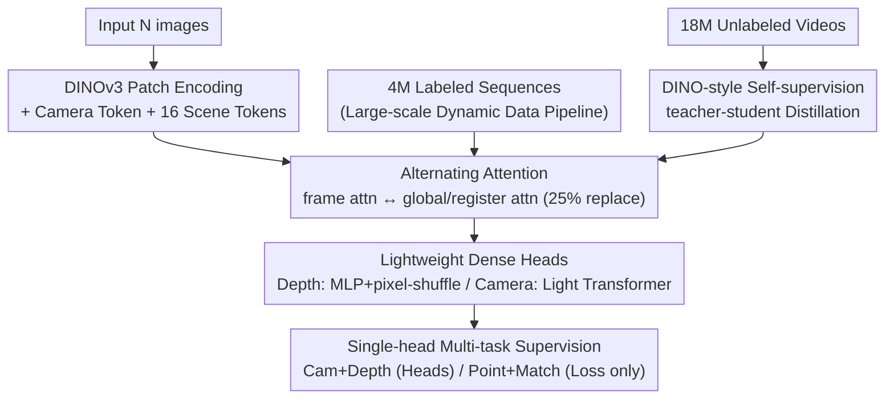

# VGGT-$\Omega$

**Conference**: CVPR 2026 (Oral)  
**arXiv**: [2605.15195](https://arxiv.org/abs/2605.15195)  
**Code**: Project Page http://vggt-omega.github.io/ (Code Pending)  
**Area**: 3D Vision / Feed-forward 3D Reconstruction  
**Keywords**: Feed-forward Reconstruction, Register Attention, scene tokens, Dynamic Scenes, Data Scaling, Self-supervised Distillation

## TL;DR
This work systematically "scales up" feed-forward 3D reconstruction models like VGGT. By utilizing register attention, lightweight dense heads, and single-head multi-task supervision, the training memory is reduced to approximately 30% of the original. Combined with a large-scale data pipeline capable of labeling dynamic videos and DINO-style self-supervised distillation, the model is scaled from 0.2B to 10B parameters using 15× more data. It achieves a new SOTA across six static and dynamic benchmarks (e.g., Sintel camera pose AUC@3° increased from 22.5 to 40.0, a 77% relative gain, while being 50× faster than MegaSaM).

## Background & Motivation
**Background**: Feed-forward reconstruction, represented by VGGT, DUSt3R/MASt3R, PI3, and Depth Anything 3 (DA3), has begun to rival or even surpass traditional optimization-based pipelines like SfM/COLMAP in many scenarios. By feeding multiple images into a Transformer, camera parameters and depth/point maps are predicted in a single forward pass. Furthermore, the learned tokens can serve as "geometry-aware features" for transfer to other tasks, suggesting that **reconstruction can act as a proxy task for learning spatial understanding representations**.

**Limitations of Prior Work**: While "scaling laws" have been thoroughly studied in language and image foundation models, whether feed-forward reconstruction can scale in 3D vision—and what the benefits are—remains largely unverified. The practical bottleneck is **training memory explosion** in models like VGGT: ① Global cross-frame attention has quadratic complexity relative to the number of tokens; ② High-resolution convolutional layers in DPT dense heads consume disproportionate memory for storing forward activations (irreducible by FSDP or gradient checkpointing); ③ VGGT relies on multiple dense heads for multi-tasking, each requiring separate activation storage. These issues make scaling models and data computationally infeasible.

**Key Challenge**: Verifying scaling requires simultaneously increasing model and data size. However, data scaling is hindered by both **computational efficiency** (memory constraints) and **data availability** (scarcity of multi-view data with precise geometric labels, especially for dynamic videos, as most internet videos contain motion and cannot be labeled via static SfM).

**Goal**: To push feed-forward reconstruction to unprecedented scales and determine if it improves predictably with scale, like structural foundation models. This breaks down into three sub-problems: reducing memory footprints, acquiring 15× more labeled data, and utilizing unlabeled web-scale video.

**Key Insight + Core Idea**: The authors observe that the global attention maps in VGGT are **highly sparse**—a few tokens suffice for cross-frame information exchange. Thus, registers (scene tokens) are used as an "information bottleneck" to aggregate and redistribute global information, partially replacing expensive global attention. Simultaneously, multiple dense heads are replaced with a single depth head, and high-resolution convolutions are swapped for MLP + pixel-shuffle. These designs reduce training memory by 70%, enabling the use of 15× more data through a conservative labeling pipeline and DINO-style self-supervision on both static and dynamic videos.

## Method

### Overall Architecture
VGGT-$\Omega$ is a feed-forward Transformer $f$: it takes $N$ images $I_1,\dots,I_N\in\mathbb{R}^{3\times H\times W}$ and outputs camera parameters $g_i=(q_i,t_i,f_i)\in\mathbb{R}^9$ for each frame (rotation quaternion, translation, and field of view, assuming the principal point is at the center) and a depth map $D_i$. Notably, it **does not directly predict point maps or tracking features** (a major structural difference from VGGT), though it still uses corresponding losses for supervision.

The forward pass consists of four steps: ① A ViT initialized with DINOv3 encodes each frame into patches as tokens $z_i^F$, with 1 camera token and 16 registers (scene tokens) appended per frame; ② Alternating attention—layers of per-frame self-attention (ensuring permutation equivariance to frame count/sequence without frame index embeddings) interleaved with cross-frame global attention, where 25% of global attention layers are replaced by **register attention**; ③ Lightweight head decoding—depth is regressed via an MLP + pixel-shuffle upsampling head, and cameras are regressed at once by a lightweight Transformer acting on camera tokens (eliminating the iterative refinement in VGGT); ④ Multi-task supervision via four losses (camera, depth, point map, and matching).

Training proceeds in three stages over 240K steps: 160K steps of supervised training on ~4M labeled sequences, followed by 50K steps of self-supervised distillation on 18 million unlabeled videos, and a final 30K-step supervised finish. Approximately 800,000 of the labeled sequences come from the authors' new pipeline (about 1/3 of which are dynamic scenes), while the rest come from ~30 public datasets.

### Key Designs

**1. Register Attention and Scene Tokens: Replacing expensive global attention with a sparse bottleneck and obtaining reusable geometric representations.**

Based on the observation that global attention is a quadratic bottleneck but highly sparse, the authors append 16 registers (scene tokens) per frame. In 25% of global attention layers, cross-frame exchange is **restricted to registers**: $z'=\text{attn}_{\text{scene}}(z)$, meaning only the registers $(z_1^{\text{scene}},\dots,z_N^{\text{scene}})$ participate in cross-frame self-attention. The updated registers then interact with local frame tokens in subsequent per-frame attention layers to redistribute aggregated global scene information. This makes registers an "aggregate-then-broadcast" bottleneck forced to carry global sequence information. Benefits are twofold: first, replacing 25% of global layers saves ~23% backbone FLOPs and 16% memory with negligible performance loss (point error 0.071→0.073)—whereas replacing **all** global layers reduces FLOPs to 6% but causes significant degradation. Second, unlike previous works that discard registers during inference, these tokens provide features useful for VLA robot policies and language alignment even without explicit supervision, effectively making reconstruction a proxy for spatial representation learning.

**2. Lightweight Dense Head: MLP + pixel-shuffle replaces DPT high-resolution convolutions.**

Convolutional blocks in DPT heads operating at resolutions higher than 1/4 of the input use few parameters but consume massive memory for forward activations, which FSDP and gradient checkpointing cannot alleviate. The authors replace these with a "single MLP + pixel-shuffle": the MLP outputs $2u^2$ channels ($u=4$), and pixel-shuffle rearranges $(H'\times W',\,2u^2)$ into $(uH')\times(uW')\times 2$ for depth and confidence. The authors also tested a **pure MLP/convolution-free** decoder; while numerically strong on benchmarks, it produced blocky artifacts in unconstrained depth regions like skies or distant mountains. Consequently, low-resolution convolutional layers from DPT were retained—an honest trade-off where benchmark scores do not equate to perceptual quality.

**3. Single Dense Head + Multi-task "Virtual Supervision": Multi-task benefits without multi-head overhead.**

VGGT demonstrated the benefit of supervising depth, point maps, and tracking features simultaneously, but multiple dense heads hinder scaling. VGGT-$\Omega$ retains only **one dense depth head + one sparse camera head**. The point map and matching tasks are **loss-only**: the point map loss $\mathcal{L}_{\text{point}}$ reuses the depth loss structure but replaces the residual $e_i = \hat D_i - D_i$ with $e_i = \pi^{-1}(\hat D_i, \hat g_i) - P_i$ (back-projecting predicted depth via predicted camera to compare against the point map). Matching loss $\mathcal{L}_{\text{match}}$ is applied to the final layer tokens, pulling positive pairs (same 3D location) closer and pushing negative pairs apart using a weighted binary cross-entropy $\mathcal{L}_{\text{match}} = \mathbb{E}_{\text{pos}}[-\log\sigma(s)] + \mathbb{E}_{\text{neg}}[-\log(1-\sigma(s))]$, where $s$ is the cosine similarity of $\ell_2$-normalized tokens. Ablations show this "virtual supervision" nearly matches the accuracy of VGGT's multi-head approach (0.078 vs 0.070) while saving significant memory.

**4. Scaling-oriented Dynamic Data Pipeline: Extracting 800,000 high-quality labels from 40 million web videos.**

Scaling requires dynamic video, but these lack precise geometric labels. The authors built a multi-model serial pipeline with aggressive filtering: VLM Pre-screening (discarding 50% "unreconstructable" and 40% "low precision" videos) → Grounding DINO to detect moving objects (cars, people) and **exclude dynamic regions** from matching → Ensemble matching/tracking (SIFT, SuperPoint, ALIKED, VGGSfM Tracker) → Initializing cameras with the original VGGT when RANSAC inliers are low, followed by COLMAP BA and filtering with aggressive heuristics (registration rate <99.5%, FoV outside $[30°,120°]$, distortion ratio >0.1) → Patch-based MVS for dense depth → Multi-view consistency checks. Finally, an ensemble classifier (XGBoost, Random Forest, CatBoost) trained on 1,000 manually labeled sequences filters based on camera vector consistency and trajectory smoothness. This conservative pipeline prefers "small and accurate" over "large and noisy"; validation shows their pseudo-labels reach 96.4% AUC@30° on Sintel, far exceeding MegaSaM's 62.1%.

**5. DINO-style Self-supervised Teacher-student Distillation: Utilizing 18 million unlabeled videos.**

To improve generalization, both student and teacher are initialized from a supervised VGGT-$\Omega$ checkpoint. The same video is fed to both with **independent random augmentations** (color jitter, blur, 90° rotation, block masking, and random frame shuffling). After aligning sequences, the student matches the teacher's tokens across multiple layers using $\ell_2$ loss and regresses the teacher's camera and depth predictions. To prevent collapse, the camera and depth heads are **frozen** during self-supervision, and the teacher is updated via EMA ($\theta_T\leftarrow m\theta_T+(1-m)\theta_S$) rather than gradients. This forces the model to remain invariant to appearance changes and frame order, improving out-of-distribution generalization (point error 0.073→0.070).

### Loss & Training
The total loss is a weighted sum: $\mathcal{L}=\lambda_{\text{cam}}\mathcal{L}_{\text{cam}}+\lambda_{\text{depth}}\mathcal{L}_{\text{depth}}+\lambda_{\text{point}}\mathcal{L}_{\text{point}}+\lambda_{\text{match}}\mathcal{L}_{\text{match}}$. Camera loss uses $\ell_1$ ($\mathcal{L}_{\text{cam}}=\sum_i|\hat g_i-g_i|$, more stable than VGGT's Huber). Depth loss follows VGGT's uncertainty-weighted gradient consistency with relative scale: $\mathcal{L}_{\text{depth}}=\sum_i\big(\|c_i^D\odot(1+D_i^{-1})\odot e_i\|+\|c_i^D\odot\nabla e_i\|\big)-\alpha\sum_i\log c_i^D$, where $c_i^D$ is the predicted uncertainty map. Training uses AdamW for 240K steps (160K supervised + 50K self-supervised + 30K refinement) with 5% warm-up and cosine decay. Peak LR is $2\times10^{-4}$ (supervised) and $1\times10^{-4}$ (self-supervised). Frame counts per batch are sampled from $[1,24]$. Trained on 128x 96GB H100s with bfloat16, gradient checkpointing, and FSDP. Models include 200M, 500M, 1B, and 10B versions.

## Key Experimental Results

### Main Results
Evaluation spans three static datasets (7-Scenes, NRGBD, ETH3D) and three dynamic datasets (DyCheck, Sintel, TUM-Dynamic).

Depth Estimation (Table 2, select $\delta_{1.25}\uparrow$ / AbsRel$\downarrow$):

| Method | ETH3D (Static) | Sintel (Dynamic) | TUM-Dynamic (Dynamic) |
|------|--------------|---------------|---------------------|
| MonST3R | 95.8 / 0.056 | 71.9 / 0.263 | 85.0 / 0.148 |
| MegaSaM (Opt.) | 94.8 / 0.083 | 74.1 / 0.207 | 92.9 / 0.083 |
| VGGT | 97.4 / 0.036 | 79.2 / 0.189 | 92.2 / 0.064 |
| PI3 | 99.6 / 0.016 | 82.5 / 0.144 | 95.5 / 0.046 |
| DA3 (Giant 1B) | 99.6 / 0.015 | 86.1 / 0.118 | 94.3 / 0.049 |
| **Ours-1B** | 99.8 / 0.012 | 89.5 / 0.097 | 97.4 / 0.041 |
| **Ours-10B** | **99.8 / 0.009** | **93.5 / 0.081** | **98.3 / 0.035** |

Camera Pose: While feed-forward models excel in static/loose thresholds, optimization-based MegaSaM is competitive on dynamic sequences but fails in wide-baseline/low-texture scenes. VGGT-$\Omega$ **leads across all metrics**: Sintel AUC@3° improved from 22.5 (MegaSaM) to **40.0** (+77%). It is approximately **50× faster** than MegaSaM. The 10B model consistently outperforms the 1B model.

### Ablation Study
Metrics use "point error" (average $\ell_2$ distance of back-projected points).

| Configuration | Point Error | Description |
|------|--------|------|
| Data 2K → 2M sequences | 0.275 → 0.073 | Monotonic decrease per 10× data |
| Model 0.2B → 10B | 0.107 → 0.046 | Scaling model continues to improve |
| Pure global attention | 0.071 | Upper bound reference |
| **+ 25% Register Attention** | 0.073 | Efficient with negligible loss |
| w/o point+match loss | 0.078 | Virtual supervision is effective |
| **+ Self-distillation** | 0.073 → 0.070 | Unlabeled data improves generalization |

### Key Findings
- **Scaling Law is Valid**: Point error decreases monotonically for both model size (0.2B→10B) and data size (2K→2M), following a power-law-like curve.
- **Register Attention is "Almost Free" Efficiency**: Replacing 25% of global layers is lossless, but 100% replacement degrades performance, indicating global info can be compressed but only to a point.
- **Label Quality > Quantity**: The conservative pipeline's pseudo-labels are significantly more accurate than standard datasets like MegaSaM.
- **Transferable Representations**: Frozen scene tokens improve OpenVLA-OFT success rates (97.1%→98.5%) and support CLIP-style alignment.

## Highlights & Insights
- **Sparse Attention → Register Bottleneck**: Validating that attention maps are sparse and using registers as a bottleneck is a clever way to turn analytical findings into architectural innovation.
- **Reusable Virtual Supervision**: Implementing auxiliary tasks (point maps, matching) without dedicated heads is a memory-saving "trick" applicable to any dense prediction task.
- **Honest Trade-offs**: Admitting that pure MLP decoders fail qualitatively despite high benchmark scores shows a focus on actual output quality over just metrics.
- **Data Pipeline as the Hero**: The 6-stage pipeline is what makes scaling to 15× possible by solving the "unlabeled dynamic video" problem.

## Limitations & Future Work
- **Conservative Bias**: The pipeline systematically excludes extreme motion and low-texture scenes. While this keeps data clean, generalization to "wild" dynamic scenes remains a question.
- **Implicit Motion**: The model does not explicitly output motion masks or dynamic point maps, relying on data priors to handle moving objects implicitly.
- **High Compute Barrier**: 128x H100s makes reproduction extremely costly.
- **Empirical Scaling**: The "power law" is an observation based on limited points and requires further validation at even larger scales.

## Related Work & Insights
- **vs. VGGT**: The direct successor. Replaces multi-head/iterative regression with single-head/MLP+pixel-shuffle for 70% memory savings, allowing 15× more data.
- **vs. DA3/PI3**: VGGT-$\Omega$ avoids expensive "ray maps" which tangle camera info and appearance, opting for pure depth+camera and winning through scale.
- **vs. MegaSaM**: Overcomes MegaSaM's failures in wide-baseline/low-texture scenes while running 50× faster.
- **vs. DINO Registers**: Repositions registers from "artifacts fixers" to "primary global scene representations" (scene tokens) that should be retained during inference.

## Rating
- Novelty: ⭐⭐⭐⭐ Solid combination of register attention and virtual supervision, though largely centered on re-engineering for scaling.
- Experimental Thoroughness: ⭐⭐⭐⭐⭐ Comprehensive scaling curves, ablations, and downstream verification.
- Writing Quality: ⭐⭐⭐⭐⭐ Excellent motivation-observation-design loop.
- Value: ⭐⭐⭐⭐⭐ First systematic verification of 3D reconstruction scaling laws; a landmark for 3D foundation models.

<!-- RELATED:START -->

## Related Papers

- [\[CVPR 2026\] AVGGT: Rethinking Global Attention for Accelerating VGGT](avggt_rethinking_global_attention_for_accelerating_vggt.md)
- [\[CVPR 2026\] VGGT-Det: Mining VGGT Internal Priors for Sensor-Geometry-Free Multi-View Indoor 3D Object Detection](vggt-det_mining_vggt_internal_priors_for_sensor-geometry-free_multi-view_indoor_.md)
- [\[CVPR 2026\] VGGT-360: Geometry-Consistent Zero-Shot Panoramic Depth Estimation](vggt-360_geometry-consistent_zero-shot_panoramic_depth_estimation.md)
- [\[CVPR 2025\] VGGT: Visual Geometry Grounded Transformer](../../CVPR2025/3d_vision/vggt_visual_geometry_grounded_transformer.md)
- [\[AAAI 2026\] VGGT-DP: Generalizable Robot Control via Vision Foundation Models](../../AAAI2026/3d_vision/vggt-dp_generalizable_robot_control_via_vision_foundation_models.md)

<!-- RELATED:END -->
