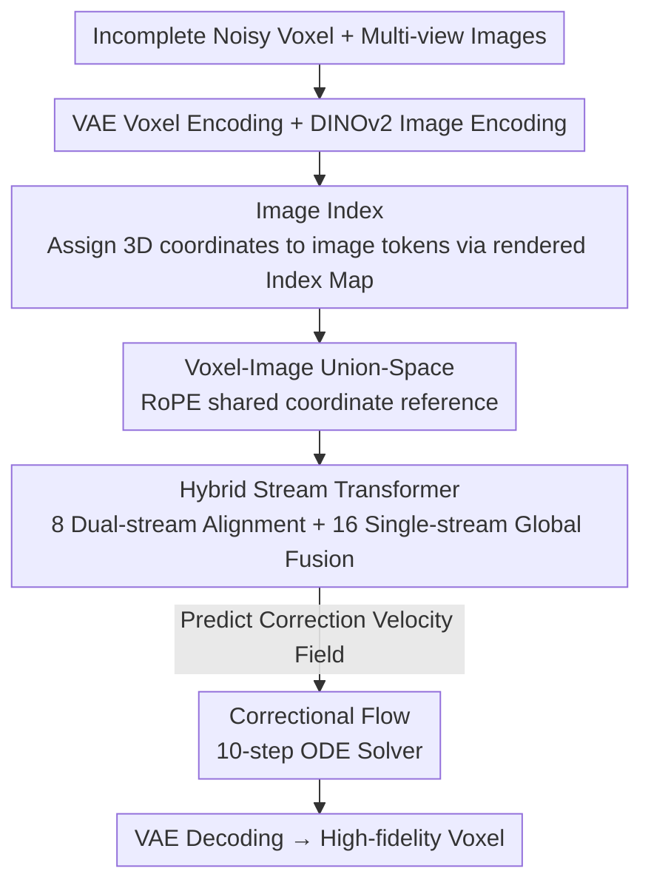

# VIAFormer: Voxel-Image Alignment Transformer for High-Fidelity Voxel Refinement

**Conference**: CVPR 2026  
**Paper**: [CVF Open Access](https://openaccess.thecvf.com/content/CVPR2026/html/Fang_VIAFormer_Voxel-Image_Alignment_Transformer_for_High-Fidelity_Voxel_Refinement_CVPR_2026_paper.html)  
**Keywords**: Voxel Refinement, Multi-view Guidance, Flow Matching, Cross-modal Alignment, 3D Generation

## TL;DR
VIAFormer reformulates "repairing incomplete and noisy voxels" as a **Conditioned Voxel Refinement** task guided by multi-view images. It explicitly assigns 3D coordinates to 2D image tokens using an Image Index, learns a direct "dirty-to-clean" correction trajectory via Correctional Flow, and achieves bidirectional cross-modal fusion with a Hybrid Stream Transformer. It reaches SOTA performance on both Vision Foundation Model (VFM) outputs and synthetic noise, achieving an IoU gain of up to 39.1% on synthetic noise.

## Background & Motivation

**Background**: Voxel grids represent one of the most fundamental representations in 3D generation/reconstruction pipelines. On one hand, Vision Foundation Models (VFMs, such as Pi3, VGGT) and 3D scans can quickly produce **coarse voxels**; on the other hand, high-fidelity generative models (such as the "where→what" two-stage paradigm of Trellis) require **clean and complete voxels** as input. A significant quality gap exists between these stages, necessitating a "Voxel Refinement" step to bridge the divide.

**Limitations of Prior Work**: Traditional voxel completion methods (DiffComplete, PatchComplete, WSSC) suffer from two major drawbacks. First, they are **geometry-only**, failing to utilize the valuable multimodal supervision provided by multi-view images. Second, they predominantly use convolutional networks in explicit 3D space, where memory consumption explodes when increasing resolution from $32^3$ to $64^3$. This limits scalability and often restricts them to small-scale, category-specific labeled datasets, hindering generalization to large-scale unlabeled data.

**Key Challenge**: Even when attempting to add image conditions to existing methods (e.g., via standard cross-attention), the improvement is nearly negligible. The authors diagnose the root cause as **Attention Collapse**—in standard cross-attention, 3D voxel tokens and 2D image tokens lack a shared spatial reference. Consequently, the influence of any image token is distributed almost uniformly across all voxel tokens, causing the model to treat the image as a global feature while ignoring positional information.

**Goal**: (1) Reformulate the task as a large-scale ($64^3$), cross-category, multimodal Conditioned Voxel Refinement; (2) Design an architecture that effectively utilizes image guidance and scales to $64^3$.

**Key Insight**: Given that VFMs provide initial voxels that are "noisy but structurally rich," the model should learn a **direct correction path** rather than generating from pure noise. Furthermore, image tokens must be assigned explicit 3D locations to break the attention collapse.

**Core Idea**: By integrating "explicit 3D coordinate alignment (Image Index) + Correctional Flow + Hybrid Stream Transformer," multi-view images are robustly coupled with voxel refinement.

## Method

### Overall Architecture

VIAFormer addresses the following problem: given an incomplete and noisy voxel $\tilde{v}$ and $S$ calibrated multi-view images $\{I_i\}_{i=1}^S$, it outputs a refined high-fidelity voxel $\hat{v}$, defined as $\hat{v} = F_\theta(\tilde{v}, \{I_i\}, c)$, where the condition $c$ includes estimated camera poses $\{\tilde{T}_i\}$.

The pipeline is as follows: dirty voxels are compressed into a geometric latent $z_V$ via a pretrained sparse structural VAE encoder $\mathcal{E}_V$ (from Trellis); multi-view images are encoded into patch tokens $\{z_{I,i}\}$ using a DINOv2 encoder $\mathcal{E}_I$. **Image Index** annotates each image token with 3D coordinates, bringing them into a "Voxel-Image Union-Space." The **Hybrid Stream Transformer** (consisting of 8 dual-stream blocks and 16 single-stream blocks) performs cross-modal fusion within this union space and predicts a velocity field under the **Correctional Flow** objective to pull $z_V$ back to the clean latent $z_{gt}$. Finally, an ODE solver performs 10 steps to obtain the clean latent, which the VAE decoder restores to $\hat{v}$.

### Key Designs

**1. Correctional Flow: Learning a direct correction trajectory from dirty to clean voxels instead of noise-to-clean generation**

Traditional Diffusion/Flow Matching maps a simple Gaussian distribution to the target distribution, essentially "generating from scratch." However, since a dirty $\tilde{v}$ already contains rich structural information, generating from pure noise is inefficient and risks losing existing geometry. The authors define a **linear path between the two latents**: $z_t = (1-t)z_V + t\cdot z_{gt}$, where $z_V = \mathcal{E}_V(\tilde{v})$ is the dirty voxel latent and $z_{gt} = \mathcal{E}_V(v_{gt})$ is the clean voxel latent. The network only needs to predict the constant velocity field along this path—the "correction vector" $(z_{gt} - z_V)$:

$$\mathcal{L}_{\text{FM}} = \mathbb{E}_{t, \tilde{v}, v_{gt}, c}\left[\left\| f_\theta(z_t, t, c) - (z_{gt} - z_V) \right\|_2^2\right].$$

This tightens the learning objective from "generation" to a more constrained problem of "geometric correction." Ablations show that starting from pure noise (w/o Correctional Flow) causes the IoU to plummet from 0.446 to 0.310, proving that leveraging the VFM prior is critical for performance.

**2. Image Index and Voxel-Image Union-Space: Assigning explicit 3D coordinates to 2D image tokens to break attention collapse**

Standard cross-attention fails because voxel tokens and image tokens lack a shared spatial coordinate system, resulting in a "uniformly striped" attention map—a symptom of attention collapse. The solution is to **calculate a 3D coordinate for every image token**, placing it in the same coordinate system as the naturally 3D voxel tokens. This process (Image Index) is an efficient rendering step: the noisy $\tilde{v}$ is triangulated into a mesh, the 3D integer coordinates of the source voxels are encoded into vertex colors, and a 2D index map is rendered from each camera pose $\{\tilde{T}_i\}$ (with background pixels left empty). Finally, patch tokens are cropped according to DINOv2's patch size, and the floating-point 3D coordinate for each image token is determined by average pooling the non-empty pixel coordinates within the patch.

Once the coordinates are obtained, both 2D and 3D tokens are converted into sinusoidal embeddings and injected via RoPE. This ensures that tokens that are physically close are more similar in the embedding space, naturally biasing attention scores toward spatial neighbors and breaking the attention collapse. Image Index provides the "spatial handshake" necessary for cross-modal information to flow bidirectionally. Ablation studies show that replacing Image Index with standard ViT-style positional encoding (w/o Image Index) drops IoU from 0.446 to 0.418, validating that explicit spatial anchoring is key to meaningful multimodal fusion.

**3. Hybrid Stream Transformer: A 24-layer architecture with dual-stream alignment followed by single-stream global fusion**

The Union-Space is implemented via a 24-layer Transformer modeled after OmniControl, divided into two stages. **The first 8 layers are dual-stream blocks**: the voxel latent $z_V$ and multi-view latents $\{z_{I,i}\}$ use non-shared weight MLPs to project $Q/K/V$ to preserve original features. Key/values from both streams are concatenated into a unified space $K_{\text{union}} = \text{Concat}(K_V, K_{I,1}, \cdots)$ and $V_{\text{union}} = \text{Concat}(V_V, V_{I,1}, \cdots)$, allowing both streams to query this shared space for bidirectional joint evolution: $z_V \mathrel{+}= \text{Attention}(Q_V, K_{\text{union}}, V_{\text{union}})$. **The remaining 16 layers are single-stream blocks**: since shared geometric anchoring is established, both streams are concatenated into a single sequence $z_{\text{unified}} = \text{Concat}(z_V, z_{I,1}, \cdots)$ for standard self-attention, facilitating global feature fusion and joint reasoning.

### Loss & Training

The training objective is the Correctional Flow velocity field regression loss $\mathcal{L}_{\text{FM}}$. Data synthesis uses a **1:1 mix of two sources**: one involves voxelizing point clouds reconstructed via Pi3 from multi-view images (simulating real VFM degradation), and the other uses a procedural noise pipeline (surface noise, volumetric floaters, and aggressive half-space deletions). This mix prevents the model from learning "phantom bases" on objects (a common bias in top-down datasets), forcing more robust and generalizable geometric understanding. The model contains 0.61B parameters and is trained with AdamW (lr $=3\times10^{-4}$) on 16 H20 GPUs for 7 days. Inference uses a 10-step ODE, taking ~14.5 seconds per sample on a V100.

## Key Experimental Results

### Main Results

The model is trained on ~478k 3D assets (ObjaverseXL, etc.) and evaluated on Toys4k and Dora. Metrics include volumetric accuracy (IoU) and surface fidelity (Chamfer Distance, CD). All baselines are adapted to the same $64^3$ VAE latent space and retrained with the Correctional Flow objective for fair comparison.

| Dataset | Metric | VIAFormer | Prev. SOTA | Gain |
|---------|--------|-----------|------------|------|
| Toys4k (VFM Degradation) | IoU ↑ | 0.4460 | 0.4255 (24L Cross-Attn) | +5.0% |
| Toys4k (VFM Degradation) | CD ↓ | 0.0163 | 0.0175 | Lower |
| Dora (VFM Degradation) | IoU ↑ | 0.4585 | 0.4356 (24L Cross-Attn) | +3.4% |
| Toys4k (Synthetic Noise) | IoU ↑ | 0.8580 | 0.2776 (24L Self-Attn) | +39.1% |
| Toys4k (Synthetic Noise) | CD ↓ | 0.0027 | 0.0766 | Significantly Lower |

VIAFormer improves IoU by 3.4%~5.0% on VFM output correction; the gain on synthetic noise is even more significant (IoU 0.858 vs 0.278 for self-attention), demonstrating the power of multi-view guidance under controlled degradation.

### Ablation Study

| Configuration | Toys4k IoU ↑ | Description |
|---------------|--------------|-------------|
| VIAFormer (Full) | 0.4460 | Full model |
| w/o Image Index | 0.4176 | Replaced with ViT-style Pos. Enc., drops 0.028 |
| w/o Correctional Flow | 0.3102 | Generation from pure noise, drops 0.136 |
| 24-Layer Cross-Attn | 0.4255 | Standard cross-attention, barely beats geometry-only |
| 24-Layer Self-Attn (Geometry only) | 0.4111 | No image guidance baseline |
| Cross-Attn + VGGT Cond. + 3MLP | 0.4055 | Strengthened conditioning remains ineffective |
| Cross-Attn + VGGT Cond. + 8 Self-Attn | 0.4076 | Strengthened adapter remains ineffective |

### Key Findings
- **Correctional Flow is the primary contributor**: Generating from noise (w/o Correctional Flow) drops IoU from 0.446 to 0.310, proving that refining a dirty VFM prior is superior to generating from scratch.
- **Attention collapse is structural**: Strengthening conditions with VGGT features or adding complex adapters still results in IoU values (0.405~0.408) that do not significantly exceed the geometry-only baseline (0.411). This confirms that a shared spatial basis is required for multimodal fusion.
- **View count isn't monotonic**: Performance peaks at 3~4 views. Further increasing views leads to a slight decrease, likely due to diminishing returns and the accumulation of noise from imperfect predictions diluting the attention mechanism.

## Highlights & Insights
- **"Rendering coordinates as indices" is clever**: Encoding voxel 3D coordinates as mesh colors for rendering allows back-referencing 3D locations for image patches, achieving explicit spatial alignment without complex learnable correspondences.
- **Decoupling "refinement" from "generation"**: When a noisy but structured initial value is available (depth maps, point clouds, etc.), learning the correction vector $(z_{gt}-z_V)$ is more constrained and stable than generating from noise.
- **Attention collapse diagnosis is reusable**: Visualizing attention maps for "uniform stripes" is a valuable diagnostic tool for any multimodal fusion task where added conditions fail to improve performance.

## Limitations & Future Work
- **Dependence on estimated pose and initial quality**: Image Index inherits geometric errors from $\tilde{v}$ and $\{\tilde{T}_i\}$; "spatial handshakes" may fail when initial values are extremely poor.
- **Inference speed**: At 14.5s per sample (10-step ODE) for 9572 tokens on a V100, it is not yet suitable for real-time interactive creation.
- **Resolution limited to $64^3$**: While higher than previous methods ($32^3$), it may still struggle with extremely fine geometries like thin-walled or filament structures.
- **View count diminishing returns**: Performance degradation beyond 4 views suggests that robust aggregation of multi-view noise (e.g., weighted fusion by reliability) remains an open problem.

## Related Work & Insights
- **vs DiffComplete / PatchComplete / WSSC**: These are geometry-only, use 3D convolutions at $32^3$, and depend on small category-specific data. Ours uses multi-view image conditions, operates in $64^3$ latent space with Transformers, and trains on large-scale cross-category data.
- **vs Standard Cross-Attention / ControlNet style injection**: These lack explicit 3D-2D token correspondence, leading to attention collapse. Ours builds a Union-Space via Image Index + RoPE.
- **vs 2D-lift-to-3D approaches**: Those methods leverage 2D priors but often yield lower 3D quality. Ours adopts a 3D-native refinement approach, serving as a stable "where" stage in "where→what" pipelines to provide clean geometry for high-fidelity generation.

## Rating
- **Novelty**: ⭐⭐⭐⭐⭐ Image Index for explicit 3D anchoring and Correctional Flow for reframing generation as correction directly address the core pain points of voxel refinement.
- **Experimental Thoroughness**: ⭐⭐⭐⭐ Dual datasets, multi-source degradation, and strong baseline adaptations; could benefit from more real-world scan validation and higher resolution tests.
- **Writing Quality**: ⭐⭐⭐⭐⭐ Clear task formulation and well-supported diagnosis of attention collapse.
- **Value**: ⭐⭐⭐⭐ Serves as a practical "bridge" between coarse VFM outputs and high-fidelity generation, but inference speed remains a bottleneck for deployment.

<!-- RELATED:START -->

## Related Papers

- [\[CVPR 2026\] Easy3E: Feed-Forward 3D Asset Editing via Rectified Voxel Flow](easy3e_feed-forward_3d_asset_editing_via_rectified_voxel_flow.md)
- [\[CVPR 2026\] DynamicTree: Interactive Real Tree Animation via Sparse Voxel Spectrum](dynamictree_interactive_real_tree_animation_via_sparse_voxel_spectrum.md)
- [\[CVPR 2026\] MeshWeaver: Sparse-Voxel-Guided Surface Weaving for Autoregressive Mesh Generation](meshweaver_sparse-voxel-guided_surface_weaving_for_autoregressive_mesh_generatio.md)
- [\[CVPR 2026\] PatchScene: Patch-based Voxel Diffusion Model for Large-Scale Scene Completion](patchscene_patch-based_voxel_diffusion_model_for_large-scale_scene_completion.md)
- [\[CVPR 2026\] CrowdGaussian: Reconstructing High-Fidelity 3D Gaussians for Human Crowd from a Single Image](crowdgaussian_reconstructing_high-fidelity_3d_gaussians_for_human_crowd_from_a_s.md)

<!-- RELATED:END -->
