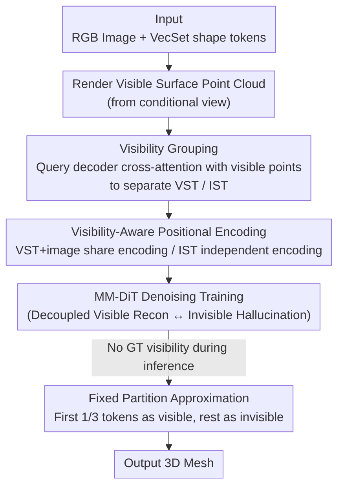

# ViLearn: Accelerating Training Convergence of Image-to-3D Generation via Visibility Learning

**Conference**: CVPR 2026  
**Paper**: [CVF Open Access](https://openaccess.thecvf.com/content/CVPR2026/html/Chen_ViLearn_Accelerating_Training_Convergence_of_Image-to-3D_Generation_via_Visibility_Learning_CVPR_2026_paper.html)  
**Keywords**: Single-image-to-3D generation, VecSet latent diffusion, visibility learning, convergence acceleration, positional encoding

## TL;DR
ViLearn explicitly decouples two inherently different sub-tasks in "single-image-to-3D"—**visible region reconstruction** and **invisible region hallucination**—during the training phase. It utilizes the cross-attention of a pre-trained VecSet decoder to partition unordered shape tokens into two groups (Visibility Grouping, VG): visible and invisible. Subsequently, it employs Visibility-Aware Positional Encoding (VAPE) to strengthen the "image token $\leftrightarrow$ visible token" correspondence and weaken entanglement with invisible tokens. This approach accelerates the training convergence of VecSet diffusion models by up to 4.4$\times$ and surpasses vanilla baselines in final quality without altering the backbone or increasing inference overhead.

## Background & Motivation

**Background**: Current mainstream single-image-to-3D shape generation follows the VAE–LDM pipeline: a 3D VAE compresses the mesh into compact latent tokens, and a conditional diffusion model is trained to predict these tokens in the latent space based on an input image. VecSet representation (compressing shapes into thousands of unordered 1D tokens) has become a primary choice for balance between efficiency and quality due to it being few tokens and end-to-end trainable, as seen in SOTA works like TripoSG, Hunyuan3D 2.0, and Step1X-3D.

**Limitations of Prior Work**: Single-image-to-3D is inherently an **ill-posed** problem, as a single image cannot uniquely determine occluded geometry. This results in a **non-uniform learning problem**: visible regions are strongly constrained by the input image, while invisible regions must be "hallucinated" based on priors. To maintain permutation invariance, VecSet methods intentionally **omit positional encodings**, treating shape tokens as a completely unordered set. Consequently, the diffusion model must **simultaneously** learn two distinct tasks within a massive, permutation-invariant token space: finding visible correspondences from the image and fabricating invisible geometry from priors.

**Key Challenge**: The coupling of visible reconstruction and invisible hallucination for joint optimization in an undifferentiated token space means the model lacks cues to distinguish "which tokens should follow the image and which should follow the prior." This entanglement unnecessarily expands the effective 2D$\rightarrow$3D mapping space, severely slowing convergence and undermining training stability. Notably, existing "3D acceleration" work (e.g., FlashVDM for inference acceleration, Direct3D-S2/ULTRA3D for reducing single-step training costs via sparse attention) focuses on reducing the cost of **each step**, rather than addressing **convergence efficiency**—learning more within a fixed number of steps.

**Core Idea**: Instead of reducing per-step costs, the model is **explicitly informed which shape tokens correspond to visible geometry and which correspond to occluded regions**. By structurally decoupling these two sub-tasks, the hypothesis space is narrowed, providing clear structural guidance for optimization. This is realized via ViLearn = Visibility Grouping (VG, partitioning tokens) + Visibility-Aware Positional Encoding (VAPE, injecting visibility into attention).

## Method

### Overall Architecture

ViLearn is a **training paradigm** that does not modify the MM-DiT backbone or introduce additional inference estimation overhead. It intervenes in two places: partitioning shape tokens by visibility during data preparation and injecting grouping information into attention via positional encoding during training.

Inputs include an RGB image (encoded into image tokens via DINOv2), corresponding VecSet shape tokens (from a pre-trained VecSet VAE), and a visible surface point cloud rendered from the conditional image viewpoint. The process involves two steps: (1) **VG** uses visible points as queries to find the most corresponding tokens via the cross-attention of a pre-trained VecSet decoder; after de-duplication, this yields the "Visible Token Set (VST)," with the remainder being the "Invisible Token Set (IST)." This step is performed once during data preparation with nearly zero training overhead. (2) **VAPE** assigns **shared** positional encodings to image tokens and the VST within MM-DiT dual-stream attention blocks to amplify cross-modal correspondence, while assigning **different** encodings to the IST to label it as requiring prior-based hallucination. These components collaboratively segregate "visible reconstruction" and "invisible hallucination" in the attention map. During inference, where ground-truth visibility is absent, a fixed partition approximation is used.

### Key Designs

**1. Visibility Grouping: Leveraging "Spatial Locality" of Pre-trained Decoders**

The challenge is that VecSet tokens are nominally unordered, making it unclear which correspond to visible surfaces. The authors leverage a verified observation: **although VecSet tokens are formally unordered, they exhibit strong spatial locality in practice**—each token encodes a compact local 3D region, and VecSet VAE decoder cross-attention is highly localized. Thus, VG reuses the pre-trained decoder's cross-attention for partitioning: using the visible point cloud $P_{visible}\in\mathbb{R}^{M\times3}$ as queries and the shape token set $S$ as keys, the cross-attention scores are computed as:

$$A = (W_q P_{visible})(W_k S)^T,$$

where $W_q, W_k$ are pre-trained projection layers from the decoder. Each visible point is mapped to the token with the highest score: $a_i = \arg\max_{j\in\{1,\dots,N\}} A_{i,j}$. The resulting set of unique indices $I_{visible}$ defines the VST, while others form the IST. Rendering geometric normals via the decoder (Fig. 2 in the paper) confirms that the VST reconstructs visible surfaces while the IST encodes occluded regions. This partitioning requires **no training and no additional networks**, relying purely on the existing decoder and performed only once during data preparation.

**2. VAPE: Encoding "Alignment vs. Prior" into Attention**

Grouping is insufficient; the diffusion model must **utilize** this info in its attention mechanism. VAPE addresses an asymmetry in information alignment: visible shape tokens and image tokens share the same viewpoint and geometric information, whereas invisible tokens lack direct visual correspondence. Thus, image$\leftrightarrow$VST cross-modal interaction should be **strengthened**, while the IST is **marked** for hallucination from priors. VAPE modifies only the query/key matrices in the MM-DiT dual-stream blocks. $Q_{shape}$ and $K_{shape}$ are split by visibility into $\text{Concat}[Q_{VST}, Q_{IST}]$ and $\text{Concat}[K_{VST}, K_{IST}]$ before encoding to obtain $\hat Q, \hat K$.

**3. VA-RoPE: Positional Encoding as "Two Fixed Relative Positions"**

As the primary implementation of VAPE, VA-RoPE repurposes the RoPE mechanism (which rotates query/key vectors) to encode "visible / invisible" discrete categories. Two rotation matrices, $R_m$ (for visible tokens, i.e., image tokens and VST) and $R_n$ (for invisible tokens, i.e., IST), are defined with fixed category indices $m, n$:

$$\hat Q_{IT}=Q_{IT}R_m,\ \hat K_{IT}=K_{IT}R_m,\quad \hat Q_{shape}=\text{Concat}[Q_{VST}R_m,\ Q_{IST}R_n],\ \hat K_{shape}=\text{Concat}[K_{VST}R_m,\ K_{IST}R_n].$$

This creates an **intra-class maintenance effect**: tokens of the same category (identical rotation) maintain strong attention, while cross-category attention is suppressed due to mismatched rotations. Empirically, setting $m=0, n=50$ reduces cross-category attention by approximately half, biassing the model toward intra-group interaction. This naturally enhances visible correspondence from the first step of training without a warmup period, leading to the fastest early convergence.

**4. VA-LPE: Simple Alternative via Learnable Additive Embeddings**

As a lightweight alternative, VA-LPE uses two learnable embeddings $e_v, e_i\in\mathbb{R}^{d_k}$ representing visible/invisible states, added directly to the tokens. Image tokens and VST receive $e_v$, while IST receives $e_i$. While simpler, VA-LPE's early convergence is slower than VA-RoPE because it must **learn** the appropriate attention weight distribution, whereas VA-RoPE's strong correspondence is built-in as a prior. However, VA-LPE accelerates after 25K steps, eventually matching or slightly exceeding VA-RoPE in quality.

### Inference Strategy

During inference from random noise, ground-truth visibility is unavailable. Although VG could theoretically be applied to intermediate denoising results, the authors use a **fixed partition approximation**. Statistical analysis of training data shows that visible tokens consistently account for approximately **1/3** of the total sequence across shapes and views. Consequently, the first **1/3** of the shape token sequence is treated as visible (assigned $R_m$ or $e_v$) and the remaining 2/3 as invisible (assigned $R_n$ or $e_i$). For a sequence of 2048 tokens, tokens 1–683 are visible, and 684–2048 are invisible. This preserves consistency with the training distribution and avoids explicit visibility estimation overhead.

## Key Experimental Results

Implementation Details: AdamW, LD 0.0001, 32$\times$ A800, BF16. Ablation used a 0.39B model + 270K samples (8 days); scaling used 1.1B model + 1.1M samples (17 days). CLAY-style progressive training (256$\rightarrow$1024$\rightarrow$2048 tokens, up to 4096). Evaluation on 1100 images (510 Hi3DEval + 590 AIGC). Metrics: Floater (disconnected components, lower is better), IS-AS (Image-Shape Alignment, higher is better), GP (Geometric Plausibility), GD (Geometric Detail).

### Main Results (Scaled to 1.1B, 110K steps)

| Method | IS-AS↑ | Floater↓ | GP↑ | GD↑ |
|------|--------|----------|-----|-----|
| TripoSG (1.3B) | 0.669 | 69.9 | 5.904 | 2.635 |
| Step1X-3D (1.3B) | 0.646 | 74.5 | 5.828 | 2.608 |
| Hunyuan3D 2.0 (1.1B) | 0.699 | 32.7 | 5.949 | 2.668 |
| Baseline (1.1B, No PE) | 0.656 | 74.8 | 5.826 | 2.623 |
| **ViLearn (1.1B, VA-RoPE)** | **0.702** | **31.5** | **5.988** | **2.688** |

ViLearn leads across all metrics. Compared to the vanilla baseline, it achieves 4.4$\times$ speedup + 57.8% improvement in Floater, and 2.4$\times$ speedup + 7% improvement in IS-AS. Notably, other SOTA methods typically require **hundreds of GPUs for weeks**, while ViLearn achieves superior alignment using only 32 GPUs by accelerating convergence.

### Ablation Study (0.39B, 110K steps)

| Configuration | IS-AS↑ | Floater↓ | GP↑ | GD↑ | Note |
|------|--------|----------|-----|-----|------|
| Baseline (w/o VG & VAPE) | 0.6248 | 165.1 | 5.664 | 2.509 | Equivalent to current SOTA training |
| Ours w/ Vanilla RoPE | 0.6063 | 114.1 | — | — | VG present but standard RoPE used; worst performance |
| Ours w/ VA-LPE | 0.6562 | 60.4 | 5.760 | 2.532 | Slower early, catches up later |
| **Ours w/ VA-RoPE** | **0.6593** | **55.7** | 5.902 | 2.583 | Fastest convergence, best early stage |

(VA-RoPE reaches the baseline's 110K step performance in just 25K steps, approx. 4.4$\times$ acceleration.)

### Key Findings
- **VA-RoPE dominates early, VA-LPE catches up**: The "strong visible correspondence" is built into VA-RoPE's rotation priors, making it effective from step one. VA-LPE requires time to learn attention allocation but matches final quality.
- **Visibility prior is the crucial factor**: "Ours w/ Vanilla RoPE" (with VG but standard RoPE) performs worse than the baseline, indicating that naive positional encoding does not build meaningful connections. The structural prior of "categorization by visibility" is what drives the gains.
- **Acceleration from Narrowing the Hypothesis Space**: Decoupling the tasks significantly improves the Floater metric (165 $\rightarrow$ 55.7), indicating that structural guidance effectively fixes failure modes like "geometric fragmentation" caused by the ill-posed nature of the problem.

## Highlights & Insights
- **"Unordered" is actually "Ordered"**: The core ingenuity lies in recognizing that VecSet tokens, while formally unordered, possess strong spatial locality. By leveraging the pre-trained decoder's cross-attention, high-quality supervision signals are obtained at virtually zero cost.
- **Redefining "Acceleration"**: Amidst works focusing on inference speed or reducing per-step computation, ViLearn identifies convergence efficiency (learning more per step) as the critical bottleneck, which is a significant conceptual shift.
- **Transferable Paradigm**: The strategy of partitioning tokens by supervision strength and injecting group priors via positional encoding is applicable to any generative task with heterogeneous constraints (e.g., inpainting, single-view completion).
- **Minimal Intrusion**: The method only modifies the Q/K matrices in dual-stream blocks, leaving the backbone and values unchanged. The 1/3 fixed partition at inference makes it highly practical for existing VecSet pipelines.

## Limitations & Future Work
- **Approximation of Inference Visibility**: The fixed 1/3 partition is an empirical approximation that may be sub-optimal for shapes with extreme self-occlusion or non-standard orientations.
- **Dependency on Decoder Spatial Locality**: VG relies entirely on the localized cross-attention of the pre-trained decoder; performance may degrade if the underlying VAE lacks this property.
- **Restricted to VecSet**: The design specifically targets the unordered/PE-less nature of VecSet; its applicability to sparse voxel (e.g., SLAT) representations remains unverified.
- **Binary Visibility**: Current modeling treats visibility as discrete (binary); incorporating continuous visibility levels for semi-occluded regions or view-dependent effects could offer further improvements.

## Related Work & Insights
- **vs. Vanilla VecSet Training (TripoSG / Hunyuan3D 2.0)**: These prioritize permutation invariance by omitting PE, leading to slow convergence in an undifferentiated token space. ViLearn's decoupling via visibility-aware PE significantly outperforms them under equal compute.
- **vs. FlashVDM (Inference Acceleration)**: FlashVDM uses distillation to shorten inference time at a slight cost to quality. ViLearn focuses on training convergence, which is orthogonal and addresses a larger portion of the total cost.
- **vs. Direct3D-S2 / ULTRA3D (Training Acceleration)**: These utilize sparse attention to reduce per-step compute for sparse voxels. ViLearn instead improves the **effectiveness** of each step, representing a more fundamental acceleration path.

## Rating
- Novelty: ⭐⭐⭐⭐ Problem positioning (convergence efficiency) and the "free" visibility grouping via decoder attention are highly insightful.
- Experimental Thoroughness: ⭐⭐⭐⭐ Solid ablations, scaling, and SOTA comparisons across multiple metrics, though robustness of the fixed partition could be further explored.
- Writing Quality: ⭐⭐⭐⭐ Clear motivation, intuitive diagrams, and consistent methodology.
- Value: ⭐⭐⭐⭐ Up to 4.4$\times$ speedup with minimal intrusion makes this highly practical for 3D generation research and production.

<!-- RELATED:START -->

## Related Papers

- [\[CVPR 2026\] Text–Image Conditioned 3D Generation](text-image_conditioned_3d_generation.md)
- [\[CVPR 2026\] C-GenReg: Training-Free 3D Point Cloud Registration by Multi-View-Consistent Geometry-to-Image Generation with Probabilistic Modalities Fusion](c-genreg_training-free_3d_point_cloud_registration_by_multi-view-consistent_geom.md)
- [\[CVPR 2026\] Image-to-Point Cloud Feature Back-Projection for Multimodal Training of 3D Semantic Segmentation](image-to-point_cloud_feature_back-projection_for_multimodal_training_of_3d_seman.md)
- [\[CVPR 2026\] NVGS: Neural Visibility for Occlusion Culling in 3D Gaussian Splatting](nvgs_neural_visibility_for_occlusion_culling_in_3d_gaussian_splatting.md)
- [\[CVPR 2026\] Uncertainty-driven 3D Gaussian Splatting Active Mapping via Anisotropic Visibility Field](uncertainty-driven_3d_gaussian_splatting_active_mapping_via_anisotropic_visibili.md)

<!-- RELATED:END -->
