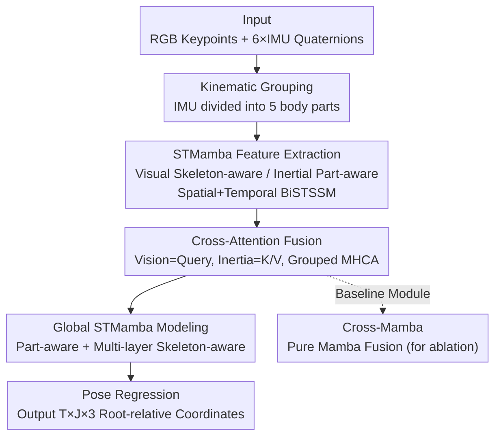

# VIMCAN: Visual-Inertial 3D Human Pose Estimation with Hybrid Mamba-Cross-Attention Network

**Conference**: CVPR 2026  
**arXiv**: [2605.07552](https://arxiv.org/abs/2605.07552)  
**Code**: https://github.com/Eddieyzp/VIMCAN (Available)  
**Area**: 3D Vision / Human Pose Estimation / Multi-modal Fusion  
**Keywords**: Visual-Inertial Fusion, 3D Human Pose, Mamba, Cross-Attention, Real-time Inference

## TL;DR
VIMCAN integrates Mamba's linear complexity for temporal modeling with Cross-Attention's cross-modal spatial reasoning into a hybrid architecture. By fusing RGB keypoints and wearable IMU data, it achieves 17.2 mm MPJPE on TotalCapture while supporting real-time inference at 60+ FPS on consumer-grade hardware.

## Background & Motivation

**Background**: State-of-the-art multi-modal pipelines for 3D Human Pose Estimation (HPE) are predominantly built on Transformers, utilizing Cross-Attention to fuse heterogeneous modalities like visual features and IMUs. Monocular vision solutions suffer from depth ambiguity in 2D-to-3D lifting, making high-frequency, low-latency, and occlusion-resistant sensors like IMUs essential complementary signals.

**Limitations of Prior Work**: Attention mechanisms exhibit quadratic complexity $\mathcal{O}(L^2)$ relative to sequence length $L$, leading to prohibitive memory and computational costs during long-sequence inference. As shown in the paper's comparison (Fig.1), the peak memory of GCN-Transformer models climbs rapidly with sequence length. Previous works (e.g., Wang’s GCN-Transformer, Liu’s CNN-Transformer) are forced to shrink temporal windows for real-time performance, thereby sacrificing temporal context.

**Key Challenge**: There is a trilemma between precision, robustness, and efficiency. One must choose between precise cross-modal spatial modeling via Attention at $\mathcal{O}(L^2)$ cost, or linear complexity $\mathcal{O}(L)$ via Mamba. However, pure Mamba’s selective state space mechanism compresses representation for efficiency, resulting in spatial reasoning capabilities significantly weaker than convolutions or attention, which leads to information loss in fine-grained multi-modal alignment.

**Goal**: To achieve multi-modal 3D HPE with linear complexity, support for variable-length sequences, and real-time performance on consumer hardware without sacrificing accuracy.

**Key Insight**: The authors observe that temporal modeling and spatial/cross-modal modeling can be decoupled and handled by different tools. Mamba excels at efficiently compressing history along the temporal axis but struggles with spatial relationships; Cross-Attention is superior for modeling complex relations between heterogeneous tokens, despite its quadratic complexity, which is only unavoidable during the "fusion" phase. Thus, Mamba can handle the bulk of spatio-temporal feature extraction and global modeling, while Cross-Attention is applied locally at critical visual-inertial fusion nodes.

**Core Idea**: A "hybrid" architecture using Mamba as an efficient temporal backbone and Cross-Attention for cross-modal spatial fusion. By confining quadratic complexity to the minimal fusion stage, the model balances accuracy and real-time performance. This is the first work to apply Mamba to visual-inertial multi-modal 3D HPE.

## Method

### Overall Architecture
The input to VIMCAN consists of $J{=}17$ joint coordinates extracted from monocular images and unit quaternions from $I{=}6$ wearable IMUs; the output is the root-relative 3D pose $P\in\mathbb{R}^{T\times J\times 3}$ for the entire sequence. The pipeline is divided into three stages: **independent spatio-temporal feature extraction (STMamba) → cross-modal fusion (primarily via Cross-Attention) → 3D coordinate regression**.

Specifically, both modalities are lifted to a common dimension $D_e$ via linear layers, yielding visual features $F^V$ and inertial features $F_g^I$ grouped by body parts. Guided by kinematic priors, the 6 IMUs are divided into $G{=}5$ groups (torso, left/right arms, left/right legs). Each modality is independently processed by STMamba (Spatio-Temporal Mamba): a "skeleton-aware" STMamba for vision and a "part-aware" STMamba for inertia, both composed of concatenated spatial and temporal BiSTSSM blocks. After feature extraction, visual features serve as Queries while inertial features serve as Keys/Values in a Multi-Head Cross-Attention block for fusion. The fused results pass through a part-aware STMamba followed by multiple skeleton-aware STMamba layers for global spatio-temporal modeling, with a final linear layer regressing the 3D pose. A pure Mamba-based "Cross-Mamba" module is also proposed as a baseline to prove that Attention is indeed necessary for the fusion stage.

### Key Designs

**1. Body Part Grouping + Skeleton-Aware Scanning: Injecting Kinematic Priors into Mamba**

Standard Mamba scanning flattens data into a sequence, which discards anatomical relationships between joints in the human body. VIMCAN injects kinematic priors in two ways: first, 6 IMUs are grouped into $G{=}5$ body parts (torso, L/R arms, L/R legs), each processed by a dedicated part-aware STMamba to align sensor information locally within limbs. Second, the visual branch performs spatial forward scanning by rearranging keypoints according to parent-child joint relationships (skeleton topology), ensuring Mamba's recursive updates follow the skeletal chain rather than an arbitrary pixel order. Ablations show MPJPE drops monotonically from 25.6→20.5→17.2 mm as groups increase from 0→3→5, while removing skeleton-aware scanning degrades performance to 25.7 mm.

**2. BiSTSSM: Bidirectional Spatio-Temporal Selective State Space Block**

The fundamental unit of STMamba is BiSTSSM, which first employs a spatial BiSTSSM to encode intra-frame topology, followed by a temporal BiSTSSM for inter-frame dynamics. The input feature $F$ ($F^V$ or $F_g^I$) is linearly projected and split into $F_x,F_z = \text{Chunk}(\text{FC}(F))$. $F_x$ captures local patterns via depthwise convolution and SiLU before entering selective scanning:

$$F_x^{ssm} = \text{LN}(\text{SS2D}(\sigma(\text{DWConv}(F_x))))$$

$F_z$ acts as a gating signal, with the gated output $F_y^{ssm} = F_x^{ssm}\cdot\sigma(F_z)$, which is then projected back to $D_e$ with residual and MLP connections. The inertial branch uses four-directional scanning (SS2D), while the visual branch employs the skeleton-ordered version. This design enables a single block to achieve local convolutional patterns, bidirectional spatio-temporal dependencies, and gating capabilities at $\mathcal{O}(L)$ complexity.

**3. Grouped Cross-Attention Fusion: Localizing Attention to the Fusion Stage**

This is the key to the "hybrid" approach—given Mamba's limited spatial representation, fusion is handled by Multi-Head Cross-Attention. Visual features are split into groups $Y_g^V$. For each group $g$, vision acts as Query $Q_g^V$ and inertia as Key/Value $K_g^I,V_g^I$:

$$\text{MHCA} = \text{Concat}\Big[\text{Softmax}\big(\tfrac{Q_g^V {K_g^I}^\top}{\sqrt{d_k}}\big) V_g^I\Big]_h,\quad Z_g = \text{LN}(\text{MHCA}) + Q_g^V$$

The residual is added only to the visual Query to preserve skeletal information. Since Attention only operates on a small number of "grouped tokens," the quadratic cost is minimized while the overall complexity remains near-linear. Replacing Cross-Attention (17.2 mm) with Cross-Mamba (24.3 mm) or vision-only Self-Attention (26.9 mm) significantly worsens results, especially on complex actions of unseen subjects where Cross-Attention leads by over 5.6 mm.

**4. Cross-Mamba Baseline Module: Proving Mamba’s Insufficiency in Fusion**

The authors designed a pure Mamba-based fusion alternative: Cross-Mamba. It uses linear layers to adaptively map inertial features to the visual space, applies linear projections and 1D convolutions to both modalities, and then uses Cross-SSM (concatenating vision and inertia along the spatial axis for 1D bidirectional scanning) to mimic cross-attention. It serves as a scientific control—results consistently show it underperforms compared to Cross-Attention (35.3 vs 31.2 mm), confirming that Mamba’s spatial reasoning deficit is indeed critical at the fusion stage.

### Loss & Training
The total loss is a weighted sum of four terms, trained end-to-end:

$$\mathcal{L}_{\text{Total}} = \lambda_{\text{MPJPE}}\mathcal{L}_{\text{MPJPE}} + \lambda_{\text{N-MPJPE}}\mathcal{L}_{\text{N-MPJPE}} + \lambda_{\text{V}}\mathcal{L}_{\text{V}} + \lambda_{\text{TC}}\mathcal{L}_{\text{TC}}$$

Where $\mathcal{L}_{\text{MPJPE}}$ is the L2 distance between predicted and GT joint coordinates; $\mathcal{L}_{\text{N-MPJPE}}$ calculates the error after solving for a scale factor $s$ using least squares to suppress global scale drift; $\mathcal{L}_{\text{V}}$ (MPJVE) constrains first-order differences (joint velocity consistency); $\mathcal{L}_{\text{TC}}$ is a weighted temporal consistency loss, penalizing key perceptual joints like distal limbs higher to reduce jitter. Weights are set to $\lambda_{\text{MPJPE}}{=}1$, $\lambda_{\text{N-MPJPE}}{=}0.5$, $\lambda_{\text{V}}{=}20$, and $\lambda_{\text{TC}}{=}0.5$.

**Variable-Length Training Strategy**: VIMCAN natively supports variable-length sequence inference without padding or masking. During training, the max length is $T{=}81$, with sequence lengths randomly sampled from $\{9,18,27,36,45,54,63,72,81\}$ per batch. Training uses a single RTX 3090, batch 16, 20 epochs, AdamW (weight decay 0.01), and initial learning rate $2\times10^{-4}$ with exponential decay (factor 0.99); $D_e{=}64$, $D_g{=}256$, with $L_N{=}5$ layers of global skeleton-aware STMamba.

## Key Experimental Results

### Main Results
Comparison with various fusion methods on TotalCapture (P1 = Mean MPJPE, P2 = Procrustes-aligned MPJPE, in mm):

| Configuration | Method | P1 ↓ | P2 ↓ |
|------|------|------|------|
| 6 IMU + MediaPipe | Wang's (GCN-Transformer) | 39.0 | 28.8 |
| 6 IMU + MediaPipe | **VIMCAN** | **33.2** | **25.7** |
| 6 IMU + SimpleNet | Wang's | 34.9 | 26.9 |
| 6 IMU + SimpleNet | **VIMCAN** | **31.2** | **23.6** |
| 8 IMU + SimpleNet | Wang's | 33.4 | 25.1 |
| 8 IMU + SimpleNet | **VIMCAN** | **28.9** | **21.3** |
| 6 IMU + GT 2D | Wang's | 28.6 | 17.6 |
| 6 IMU + GT 2D | **VIMCAN** | **17.2** | **13.8** |

Using GT keypoints, VIMCAN reduces P1 by 11.4 mm and P2 by 3.8 mm compared to Wang's. On 3DPW, VIMCAN achieves 45.3 mm P1, outperforming Liu's (60.3), Pan's (55.0), and Wang's (53.9).

**Efficiency Comparison** (Consumer RTX 4060 Laptop):

| Method | P1 ↓ | Parameters | Peak Memory ↓ | FPS ↑ |
|------|------|--------|-----------|-------|
| Wang's (GCN-Transformer) | 34.9 | 7.3M | 969.8 MB | 45.8 |
| CrossMamba | 35.3 | 12.5M | 89.6 MB | 64.6 |
| VIMCAN-B (Balance) | **31.2** | 12.3M | 282.5 MB | 61.4 |
| VIMCAN-T (Tiny) | 34.5 | 3.9M | 156.4 MB | 71.1 |

VIMCAN-B achieves the highest accuracy while using only ~29% of Wang's memory with 1.3× throughput; VIMCAN-T achieves 71 FPS with 3.9M parameters, suitable for resource-constrained deployment.

### Ablation Study

| Experiment | Configuration | P1 ↓ (mm) | Description |
|------|------|-----------|------|
| Grouping + Scan | #G=0 | 25.6 | No grouping |
| Grouping + Scan | #G=3 | 20.5 | 3-part grouping |
| Grouping + Scan | #G=5, no skeleton scan | 25.7 | Grouped but no skeleton order |
| Grouping + Scan | #G=5, Full | **17.2** | Full model |
| Fusion Method | PoseMamba (Vision-only) | 28.1 | No inertia |
| Fusion Method | Self-Attention (Vision-only) | 26.9 | Vision + Self-Attention |
| Fusion Method | Cross-Mamba | 24.3 | Pure Mamba inertial fusion |
| Fusion Method | Cross-Attention | **17.2** | Full fusion |
| Var-length Train | Fixed T=81 | 17.2 | Optimal fixed length |
| Var-length Train | Variable V | 18.9 | Robust across lengths |

### Key Findings
- **Fusion mechanism is the primary driver**: Moving from vision-only Self-Attention (26.9) to Cross-Attention fusion (17.2) yields a 9.7 mm gain, the largest single improvement. Cross-Mamba (24.3) loses to Cross-Attention (17.2) by 7.1 mm, particularly on freestyle/acting sequences (>5.6 mm gap), proving Mamba cannot handle multi-modal spatial reasoning.
- **Anatomical grouping granularity**: Error decreases as grouping moves from 0→3→5, though parameters increase from 6.8M to 12.3M. Removing skeleton-aware scanning costs 8.5 mm, emphasizing the necessity of kinematic priors.
- **Variable-length training is near-lossless**: Variable-length training (18.9) is only 1.7 mm worse than optimal fixed-length (17.2), while enabling arbitrary sequence inference.
- **Asymmetric dimensionality is optimal**: $D_e{=}64, D_g{=}256$ performs best; forcing $D_e{=}D_g$ increases FPS to 70+ but sacrifices accuracy.

## Highlights & Insights
- **"Task-specific" Hybrid Architecture**: Decoupling temporal modeling (Mamba, $\mathcal{O}(L)$) from cross-modal spatial fusion (Attention, $\mathcal{O}(L^2)$ localized), ensuring quadratic costs are paid only on a small budget. This "operator-by-specialty" approach is transferable to any multi-modal task requiring long sequences and strong spatial interaction.
- **Cross-Mamba as a "Negative" Ablation**: Instead of simply claiming Mamba’s spatial weakness, the authors built a pure-Mamba fusion module to provide a quantitative baseline, grounding their motivation with a 7.1 mm performance gap.
- **Dual Injection of Kinematic Priors**: Grouping IMUs by limbs and skeleton-order scanning for keypoints hard-codes human topology into Mamba’s scanning sequence, serving as a practical trick for encoding domain priors into sequence models.
- **Native Variable-Length Inference**: Random sampling of lengths within batches eliminates the need for padding or masking during deployment, making it highly suitable for real-time motion capture.

## Limitations & Future Work
- **Reliance on Strict Sensor Calibration**: VIMCAN depends on T-pose calibration for IMU-to-bone alignment ($\mathbf{R}_B^C=\mathbf{R}_B^I\mathbf{R}_I^S\mathbf{R}_S^G\mathbf{R}_G^C$). Calibration errors propagate directly to fusion; future work aims for adaptive alignment.
- **Synthetic IMU Data for 3DPW**: Since 3DPW lacks real IMU data, inertial readings were synthesized, potentially limiting the persuasiveness of cross-dataset generalization under real-world IMU noise.
- **Bottlenecked by 2D Detectors**: MPJPE improves from 33.2→31.2→17.2 mm as detection moves from MediaPipe to SimpleNet to GT, highlighting 2D noise as a major hurdle. End-to-end approaches might offer future improvements.
- **Walking Performance**: On simple walking subsets, TCN-based methods (e.g., Bao's) occasionally perform better. VIMCAN’s strengths lie in complex movements and generalization rather than simple periodic actions.

## Related Work & Insights
- **vs. Wang's GCN-Transformer [29]**: Both use visual-inertial fusion, Cross-Attention, and kinematic grouping. However, Wang's uses a full quadratic Transformer, causing memory explosions (969.8 MB) on long sequences. VIMCAN replaces the temporal backbone with Mamba, using 29% of the memory for 1.3× the throughput and higher accuracy (11.4 mm improvement in GT setting).
- **vs. PoseMamba [10] (Vision-only Mamba)**: PoseMamba uses spatio-temporal scanning for vision-only 3D HPE. VIMCAN adopts the skeleton scanning idea but adds IMU fusion via Cross-Attention, reducing error from 28.1 to 17.2 mm.
- **vs. Liu's CNN-Transformer [17] / Pan's RNN [22]**: These earlier fusion methods were limited by window length or weak temporal modeling; VIMCAN significantly leads on 3DPW (45.3 mm vs 60.3/55.0 mm).
- **vs. Mamba-Transformer Hybrid [6]**: VIMCAN applies the "Mamba for efficiency + Attention for long-range/spatial" paradigm specifically to visual-inertial 3D HPE, verifying Attention's indispensability for cross-modal fusion via the Cross-Mamba baseline.

## Rating
- Novelty: ⭐⭐⭐⭐ First to apply Mamba to visual-inertial 3D HPE with a clear "division of labor" hybrid design, though components are clever combinations of existing modules.
- Experimental Thoroughness: ⭐⭐⭐⭐ Two datasets, multiple 2D detectors, and 5 comprehensive ablation groups. The Cross-Mamba counter-example is particularly solid.
- Writing Quality: ⭐⭐⭐⭐ Logical flow from motivation to verification; complete formulas and clear diagrams.
- Value: ⭐⭐⭐⭐ Practical for real-time, variable-length multi-modal pose estimation at 60+ FPS on consumer hardware, with direct utility in MoCap and HCI.

<!-- RELATED:START -->

## Related Papers

- [\[CVPR 2026\] Egocentric Visibility-Aware Human Pose Estimation](egocentric_visibility-aware_human_pose_estimation.md)
- [\[CVPR 2026\] RI-Mamba: Rotation-Invariant Mamba for Robust Text-to-Shape Retrieval](ri-mamba_rotation-invariant_mamba_for_robust_text-to-shape_retrieval.md)
- [\[ICLR 2026\] 3DSMT: A Hybrid Spiking Mamba-Transformer for Point Cloud Analysis](../../ICLR2026/3d_vision/3dsmt_a_hybrid_spiking_mamba-transformer_for_point_cloud_analysis.md)
- [\[CVPR 2026\] AIMDepth: Asymmetric Image-Event Mamba for Monocular Depth Estimation](aimdepth_asymmetric_image-event_mamba_for_monocular_depth_estimation.md)
- [\[CVPR 2026\] FlashVGGT: Efficient and Scalable Visual Geometry Transformers with Compressed Descriptor Attention](flashvggt_efficient_and_scalable_visual_geometry_transformers_with_compressed_descr.md)

<!-- RELATED:END -->
