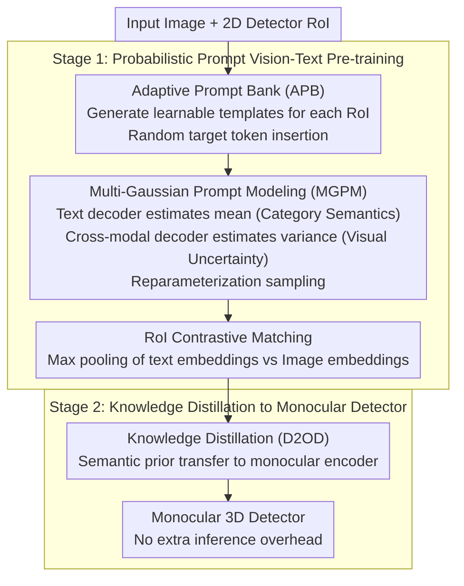

# VirPro: Visual-referred Probabilistic Prompt Learning for Weakly-Supervised Monocular 3D Detection

**Conference**: CVPR 2026 Findings  
**arXiv**: [2603.17470](https://arxiv.org/abs/2603.17470)  
**Code**: To be confirmed  
**Area**: 3D Vision  
**Keywords**: Weakly-Supervised Monocular 3D Detection, Probabilistic Prompt Learning, Multimodal Pre-training, Vision-Language Alignment, CLIP

## TL;DR

VirPro is proposed as an adaptive multimodal pre-training paradigm that provides scene-aware semantic supervision for weakly-supervised monocular 3D detection through visual-guided probabilistic prompts (Adaptive Prompt Bank + Multi-Gaussian Prompt Modeling). It can be seamlessly integrated into existing WS-M3D frameworks, achieving up to a 4.8% AP improvement on KITTI.

## Background & Motivation

Monocular 3D object detection relies heavily on expensive 3D annotations due to the lack of explicit depth information. Existing weakly-supervised methods mainly follow three routes:

1.  **Pseudo 3D Label Generation**: Aligning 2D boxes with LiDAR point clouds to generate 3D pseudo-labels.
2.  **3D Knowledge Distillation**: Transferring knowledge from strong models to monocular detectors.
3.  **Text-Visual Alignment**: Borrowing from CLIP by using deterministic text descriptions as auxiliary weak supervision signals.

Methods like CAW3D use **hand-crafted static text prompts** (e.g., "a photo of a car") as weak supervision. However, these **deterministic, scene-independent** text descriptions cannot capture the visual diversity of object appearance and spatial position across different scenes, limiting the ability of the model to learn scene-aware representations.

**Key Insight**: Robust scene-aware representations can be achieved without additional manual annotation if prompts are allowed to adaptively reflect cross-scene visual diversity.

## Core Problem

How to design prompt supervision signals that embrace cross-scene visual diversity to achieve robust scene-aware representations without additional manual labeling?

## Method

### Overall Architecture

VirPro addresses a specific pain point in weakly-supervised monocular 3D detection: the inability of static text prompts (as used in CAW3D) to express visual diversity. The framework follows a **two-stage** approach. Stage 1 uses a set of learnable probabilistic prompts for vision-text alignment, embedding "scene-aware" semantic priors into the prompt distribution. Stage 2 transfers these priors to the monocular encoder via knowledge distillation, with no additional overhead during inference. The data flow during pre-training involves: generating learnable prompt templates (APB) for each RoI $\rightarrow$ modeling each template as a Gaussian distribution and sampling diverse embeddings (MGPM) $\rightarrow$ performing RoI-level image-text contrastive alignment.

### Key Designs

**1. Adaptive Prompt Bank (APB): Self-learning Prompts with Random Positioning**

A single category prompt is insufficient for diverse contexts in weakly-supervised scenarios. VirPro avoids hard-coded text and instead generates $N_p$ probabilistic prompt templates $p_i^t = \{a_1^t, a_2^t, \ldots, a_L^t \mid o_i\}$ for the $i$-th target query token $o_i$. The $L$ elements $\{a_1^t, \ldots, a_L^t\}$ are **learnable scene descriptors** that are randomly initialized and jointly optimized. Multiple templates provide complementary semantic cues.

Unlike ProDA, which fixes the target token position, APB allows the target token to be **randomly inserted** into the template. This forces the model to capture more robust contextual associations, which is crucial under label-scarce weak supervision. In practice, 32 learnable prompts are initialized per RoI, and 8 are randomly sampled and normalized to form RoI-specific text embeddings.

**2. Multi-Gaussian Prompt Modeling (MGPM): Mean for Semantics, Variance for Visual Uncertainty**

Learnable templates alone are deterministic. MGPM models each scene prompt as an independent isotropic Gaussian distribution $\mathcal{P}(z_i^{(1:N_p)} \mid p_i) \sim \{\mathcal{N}(\boldsymbol{\mu}_i^{(t)}, (\boldsymbol{\sigma}_i^{(t)})^2 \mathbf{I})\}_{t=1}^{N_p}$ to decouple semantic stability from visual variation.

The mean and variance are estimated from two different sources. The **text prompt decoder** uses self-attention within the prompt set to obtain the mean $\mu_i^t = \phi_\mu(q_i^t) + \text{SelfAttn}_\mu(q_i^t; P_i)$, capturing canonical category semantics. The **cross-modal vision-text decoder** injects variance $\sigma_i^t = \phi_\sigma(q_i^t) + \text{CrossAttn}_\sigma(q_i^t; F)$ via cross-attention from vision-language features $F$, allowing the variance to represent visual uncertainty. Each scene is sampled using the reparameterization trick $\hat{z}_{i,j}^{(t)} = \boldsymbol{\mu}_i^{(t)} + \boldsymbol{\sigma}_i^{(t)} \odot \boldsymbol{\epsilon},\ \boldsymbol{\epsilon} \sim \mathcal{N}(\mathbf{0}, \mathbf{I})$ to ensure end-to-end differentiability.

**3. RoI Contrastive Matching: Intra-scene Consistency and Inter-scene Separability**

VirPro performs **max pooling** on the sampled prompt distribution $\hat{z}_{i,j}^{(t)}$ to obtain the text embedding $\mathbf{e}_i^{\text{txt}}$. This forms a positive pair with the image embedding $\mathbf{e}_i^{\text{img}}$ extracted by the monocular 3D encoder (spatially aligned with the 2D detector). Object-level contrastive learning is applied: $\mathcal{L}_{\text{contrast}} = \frac{1}{N}\sum_{i=1}^N \ell_i$. Ablations show that parameter-free max pooling outperforms MLP fusion, adhering to the "less is more" principle.

### Loss & Training

The probabilistic prompt learning loss consists of two parts: a **diversity loss** based on orthogonality $\mathcal{L}_{\text{div}} = \frac{1}{K}\sum_{i=1}^K \|\tilde{P}_i \tilde{P}_i^\top - \mathbf{I}\|_2^2$ to differentiate scene prompt semantics, and a **KL divergence regularization** to prevent variance collapse by constraining the prompt distribution toward a standard Gaussian prior: $\mathcal{L}_{\text{prompt}} = \mathcal{L}_{\text{div}} + \frac{1}{N_p}\sum_{t=1}^{N_p}\text{KL}(\mathcal{P}(\hat{\boldsymbol{z}}_i^{(t)} \mid p_i^{(t)}) \| \mathcal{N}(\mathbf{0}, \mathbf{I}))$.

The objectives for the two stages are $\mathcal{L}_{\text{stage1}} = \mathcal{L}_{\text{contrast}} + \alpha \mathcal{L}_{\text{prompt}}$ and $\mathcal{L}_{\text{stage2}} = \mathcal{L}_{\text{mse}} + \lambda \mathcal{L}_{3D}$ (knowledge distillation MSE + pseudo-label 3D supervision). Stage 2 utilizes Dual-to-One Distillation (D2OD) from CAW3D without introducing extra inference cost.

## Key Experimental Results

### KITTI Val Set (Car Category, AP @ IoU=0.5, $R_{40}$)

| Method | Supervision | $\text{AP}_{\text{BEV}}$ Easy | $\text{AP}_{\text{BEV}}$ Mod | $\text{AP}_{\text{BEV}}$ Hard | $\text{AP}_{\text{3D}}$ Easy | $\text{AP}_{\text{3D}}$ Mod | $\text{AP}_{\text{3D}}$ Hard |
|------|----------|------|------|------|------|------|------|
| WeakM3D | Weak (No 2D GT) | 58.20 | 38.02 | 30.17 | 50.16 | 29.94 | 23.11 |
| **VirPro+WeakM3D** | - | **55.09** | **38.76** | **31.12** | **50.97** | **31.95** | **24.27** |
| GGA+PGD | Weak (With 2D GT) | 57.20 | 40.11 | 34.96 | 51.48 | 35.73 | 30.49 |
| **VirPro+GGA+PGD** | - | **60.11** | **42.95** | **37.50** | **54.72** | **39.49** | **33.32** |

VirPro+GGA+PGD improves GGA+PGD by **+3.76 $\text{AP}_{\text{3D}}$** on Moderate and **+2.83 $\text{AP}_{\text{3D}}$** on Hard.

### KITTI Test Set (Car Category)

| Method | $\text{AP}_{\text{BEV}}$ Easy | Mod | Hard | $\text{AP}_{\text{3D}}$ Easy | Mod | Hard |
|------|------|------|------|------|------|------|
| WeakM3D | 11.82 | 5.66 | 4.08 | 5.03 | 2.26 | 1.63 |
| **VirPro+WeakM3D** | **12.23** | **5.92** | **4.33** | **5.41** | **2.52** | **1.81** |
| GGA+PGD | 14.87 | 9.26 | 7.09 | 7.09 | 4.27 | 3.26 |
| **VirPro+GGA+PGD** | **15.59** | **9.58** | **7.29** | **7.95** | **4.96** | **3.64** |

### Ablation Study Highlights

- **Prompt Design**: Multi-probabilistic prompt (M.P.P) > Single-probabilistic prompt (S.P.P) > Hand-crafted prompt (H.C.P).
- **Prompt Fusion Strategy**: Max pooling significantly outperforms MLP / Concat+MLP / Add, leading by 1.15+ in $\text{AP}_{\text{3D}}$ Hard.
- **Image-Text Fusion**: Cross-attention is optimal ($\text{AP}_{\text{3D}}$ Hard 25.05), far exceeding Add (22.37) and Concat (21.88).
- **Latent Space Structure**: VirPro's Calinski-Harabasz and Silhouette indices outperform CAW3D, indicating more compact intra-scene and more separable inter-scene RoI embeddings.

## Highlights & Insights

1.  **Plug-and-play**: As a pre-training paradigm, VirPro seamlessly integrates into various WS-M3D frameworks without increasing inference cost.
2.  **Probabilistic Uncertainty Modeling**: The decoupled design where mean captures canonical semantics and variance encodes visual uncertainty is elegant.
3.  **Simplicity of Max Pooling**: Using parameter-free max pooling for probabilistic prompts outperforms complex MLP fusion, validating the "less is more" philosophy.
4.  **Latent Space Validation**: Quantitative clustering metrics and inter-scene centroid distance distributions demonstrate improvement in latent space structure.

## Limitations & Future Work

1.  **RoI Quality Bottleneck**: Probabilistic prompt quality depends on the accuracy of the 2D detector; inaccurate 2D detection leads to biased visual cues.
2.  **Rectangular Box Assumption**: Cropping RoI features with rectangular boxes introduces background noise; real objects are rarely perfect rectangles.
3.  **Fixed Resolution Constraints**: RoI feature extraction is limited by fixed image resolution and predefined cropping strategies, affecting cross-domain robustness.
4.  **KITTI-only Validation**: Experiments were only conducted on KITTI; generalization to larger datasets like nuScenes is unverified.
5.  **Computational Overhead**: The two-stage training requires 25 epochs of Stage 1 pre-training, increasing training costs compared to end-to-end methods.

## Related Work & Insights

- **vs CAW3D**: CAW3D uses static hand-crafted prompts; VirPro replaces them with learnable probabilistic prompts for richer scene-aware semantics.
- **vs ProDA**: ProDA models prompt uncertainty in the output space for zero-shot classification; VirPro focuses on tailored RoI-level individual modeling for weak 3D detection.
- **vs APP**: APP models prompt uncertainty in the input space, limited by natural language sparsity; VirPro operates in the output space with visual feature injection.
- **vs GGA**: GGA uses static prompts from LLMs; VirPro's visual-guided probabilistic prompts are more adaptive.

## Rating

- Novelty: ⭐⭐⭐⭐ — The combination of probabilistic prompt modeling and visual-guided variance is novel in the context of weakly-supervised 3D detection.
- Experimental Thoroughness: ⭐⭐⭐ — Sufficient ablations, but validation is restricted to a single dataset (KITTI).
- Writing Quality: ⭐⭐⭐⭐ — Clear derivations, intuitive diagrams, and logical flow.
- Value: ⭐⭐⭐⭐ — A practical pre-training paradigm, though restricted to the niche of weakly-supervised 3D detection.

<!-- RELATED:START -->

## Related Papers

- [\[CVPR 2026\] Rewis3d: Reconstruction Improves Weakly-Supervised Semantic Segmentation](rewis3d_reconstruction_improves_weaklysupervised_s.md)
- [\[ECCV 2024\] TCC-Det: Temporarily Consistent Cues for Weakly-Supervised 3D Detection](../../ECCV2024/3d_vision/tcc-det_temporarily_consistent_cues_for_weakly-supervised_3d_detection.md)
- [\[AAAI 2026\] VPN: Visual Prompt Navigation](../../AAAI2026/3d_vision/vpn_visual_prompt_navigation.md)
- [\[CVPR 2026\] Towards Intrinsic-Aware Monocular 3D Object Detection](towards_intrinsic-aware_monocular_3d_object_detection.md)
- [\[CVPR 2026\] UniPixie: Unified and Probabilistic 3D Physics Learning via Flow Matching](unipixie_unified_and_probabilistic_3d_physics_learning_via_flow_matching.md)

<!-- RELATED:END -->
