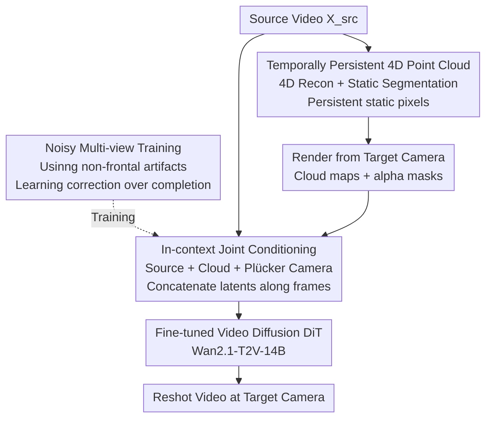

# Vista4D: Video Reshooting with 4D Point Clouds

**Conference**: CVPR 2026  
**arXiv**: [2604.21915](https://arxiv.org/abs/2604.21915)  
**Code**: https://eyeline-labs.github.io/Vista4D (Project Page)  
**Area**: 3D Vision / 4D Reconstruction / Video Generation  
**Keywords**: Video Reshooting, 4D Point Clouds, Novel View Video Synthesis, Camera Control, Video Diffusion Models

## TL;DR
Vista4D lifts input videos into "temporally persistent" 4D point clouds where static pixels are preserved across time. By rendering these clouds from a target camera and feeding them into a fine-tuned video diffusion model alongside the source video, it "reshoots" the scene from new angles while preserving dynamics. The model is trained on noisy multi-view data to ensure robustness against real-world 4D reconstruction artifacts.

## Background & Motivation

**Background**: Video reshooting aims to take a monocular source video and "re-render" it from a new camera trajectory while keeping the scene dynamics unchanged. It must faithfully reproduce observed content, generate plausible pixels in unobserved regions, and strictly follow user-specified camera control. Current mainstream approaches use video diffusion models as generative priors combined with explicit geometric priors, such as lifting the source video into frame-by-frame 3D point clouds in the camera coordinate system (e.g., TrajectoryCrafter, GEN3C, EX-4D).

**Limitations of Prior Work**: Existing "frame-by-frame point cloud condition" methods have two flaws. First, they are mostly trained on clean point clouds rendered from **precise depth maps**, effectively simplifying reshooting to an "inpainting" task. However, real-world dynamic 4D reconstruction is imprecise; once the target camera deviates from the frontal view, rendered clouds exhibit geometric distortion and flickering that the model cannot handle. Second, per-frame clouds only show content visible in that specific frame. When there is minimal overlap between the target trajectory and the source video (e.g., large-scale rotations or zooming out), the model loses both source content and the signals needed for camera control.

**Key Challenge**: Explicit priors (point clouds) provide precise camera previews but are fragile and sensitive to reconstruction quality. Implicit priors (camera embeddings, reference videos) are robust but provide imprecise camera control and lack "previews." Existing methods typically choose one, failing to provide a representation that is robust to reconstruction artifacts while maintaining content and control under low-overlap trajectories.

**Goal**: (1) Create a 4D representation that persists source content across frames even under low-overlap camera trajectories; (2) Train the model to "correct" rather than "avoid" point cloud artifacts; (3) Extend these capabilities to applications beyond simple video reshooting.

**Core Idea**: Anchor the source video and target camera within a **shared 4D point cloud**. Use segmentation to make static pixels temporally persistent and train with noisy multi-view reconstruction data to upgrade the video diffusion model from "completion" to "geometric correction."

## Method

### Overall Architecture
Given a source video $\mathbf{X}^{\mathrm{src}}$, Vista4D reshoots it in three steps. First, depth, intrinsic, and extrinsic parameters are extracted via 4D reconstruction, and static pixel masks are obtained through segmentation to lift the video into a world-coordinate **temporally persistent 4D point cloud** $\overline{\mathbf{P}}$. Second, $\overline{\mathbf{P}}$ is rendered from target cameras to produce point cloud renderings $\mathbf{X}^{\mathrm{src\to tgt}}$ and alpha masks $\mathbf{M}^{\mathrm{src\to tgt}}$, serving as 4D-anchored geometric/camera priors. Third, the source video, rendered point clouds, alpha masks, and target camera parameters (Plücker encoding) are **concatenated in-context** and fed into a fine-tuned video diffusion Transformer (based on Wan2.1-T2V-14B) to generate the target video.

The key innovation lies in training on **imperfect multi-view reconstruction clouds** to teach the model to correct geometry and using **in-context concatenation** so the model can read appearance from the source video and camera signals from the point clouds.

### Key Designs

**1. Temporally Persistent 4D Point Cloud: Making static content visible in any frame**

Frame-by-frame 3D clouds are only visible in the current frame. Vista4D anchors clouds in the world coordinate system. First, depth $\mathbf{D}^{\mathrm{src}}$, intrinsics $\mathbf{K}^{\mathrm{src}}$, and extrinsics $\mathbf{T}^{\mathrm{src}}$ are obtained (via $\pi^3$ / STream3R) to lift the video:
$$\mathbf{P}=\Omega\left(\Phi^{-1}\left([\mathbf{X}^{\mathrm{src}},\mathbf{D}^{\mathrm{src}}],\mathbf{K}^{\mathrm{src}}\right),\mathbf{T}^{\mathrm{src}}\right),$$
where $\Phi^{-1}$ is inverse perspective projection and $\Omega$ is the world coordinate transform. Crucially, a static pixel mask $\mathbf{M}^{\mathrm{stc}}$ (filtered via RAM, Llama-3.1, and Grounded SAM 2) **persists static pixels across all frames** to form $\overline{\mathbf{P}}$. When rendering from any target camera, the background and buildings remain visible in every frame, providing rich camera signals even when trajectories do not overlap.

**2. Noisy Multi-view Training: From "Inpainting" to "Geometric Correction"**

This is the core insight. Previous methods use **dual-projection** to create training pairs (rendering clouds to a source camera and back to the target), resulting in clean, frontal-view depth maps. Vista4D instead trains on **dynamic multi-view video pairs with 4D reconstruction artifacts**. Because the target camera deviates from the frontal view, the rendered cloud exhibits real spatial misalignments and artifacts. This forces the model to **correct imperfect geometry** rather than treating it as ground truth. The model is trained on a mix of synthetic multi-view data (MultiCamVideo) and real monocular data (OpenVidHD).

**3. In-context Joint Conditioning: Mutual compensation of source and cloud**

Real-world point cloud artifacts damage both geometry and appearance. Instead of conditioning solely on cloud renderings, Vista4D conditions on **both** the source video and the cloud renderings. The cloud provides precise camera/geometry, while the source video provides appearance and temporal consistency. Patchified latent tokens from both are **concatenated along the frame dimension (in-context)** with the noisy target latent. This allows the model to "see" the clean source appearance while following the cloud's camera trajectory. The training objective follows flow matching:
$$\mathcal{L}=\left\lVert\boldsymbol{\epsilon}_{\theta}\left(\mathbf{X}^{\mathrm{tgt}}_{t},\mathbf{X}^{\mathrm{src\to tgt}},\mathbf{M}^{\mathrm{src\to tgt}},\mathbf{X}^{\mathrm{src}},\mathbf{C}^{\mathrm{tgt}},t\right)-\mathbf{V}\right\rVert,$$
where $\mathbf{C}^{\mathrm{tgt}}$ is the target camera injected via **Plücker embedding**.

### Loss & Training
The base model is Wan2.1-T2V-14B. Training is performed in two stages: $672\times384$ for 30,000 steps, then $1280\times720$ for 300 steps. Global batch size is 8, 49 frames, using AdamW with $lr = 1\times10^{-5}$. Only patchify layers, self-attention layers, and camera encoders are trained; the rest are frozen.

## Key Experimental Results

### Main Results

**Camera Control Accuracy & 3D Consistency** (RE@SG is reprojection error using SuperGlue, lower is better):

| Method | Trans. Err↓ | Rot. Err↓ | Int. Err↓ | RE@SG↓ |
|------|-----------|-----------|-----------|--------|
| ReCamMaster (Implicit) | 1.574 | 12.79 | 11.16 | 23.66 |
| CamCloneMaster (Implicit) | 2.132 | 23.77 | 6.422 | 23.38 |
| TrajectoryCrafter (Cloud) | 1.434 | 6.838 | 6.671 | 120.5 |
| EX-4D (Cloud) | 1.325 | 5.941 | 5.182 | 13.11 |
| GEN3C (Cloud) | 1.309 | 4.751 | 5.085 | 12.99 |
| **Ours** | **1.251** | **4.647** | **4.927** | **7.504** |

Vista4D outperforms all baselines across all metrics; its RE@SG is nearly half that of the best competitor, indicating superior geometric consistency.

**Novel View Video Synthesis** (iPhone dataset; m-prefix denotes masked metrics):

| Method | mPSNR↑ | mLPIPS↓ | PSNR↑ | LPIPS↓ | EPE↓ |
|------|--------|---------|-------|--------|------|
| TrajectoryCrafter | 13.82 | 0.569 | 13.06 | 0.656 | 2.375 |
| EX-4D | 12.85 | 0.596 | 12.64 | 0.669 | 4.269 |
| GEN3C | 12.19 | 0.608 | 12.06 | 0.679 | 3.019 |
| **Ours** | **14.09** | **0.461** | **14.14** | **0.514** | **1.142** |

### Ablation Study
Ablations show that "Full" (noisy training + in-context source) is robust to both spatial artifacts (imprecise depth) and temporal flicker. Without noisy training, the model degrades to simple inpainting and fails on real-world inputs. Without temporal persistence, accuracy drops significantly for large camera movements.

### Key Findings
- **"Noisy Training + In-context Source" is the source of robustness**: Without these, the model cannot correct geometry and fails when faced with real reconstruction artifacts.
- **Temporal Persistence is essential for low-overlap**: It maintains background consistency when the target camera moves far from the original viewpoint.
- **Robust to segmentation failure**: Even if moving objects (e.g., a racket) are not segmented, the model corrects the resulting point cloud "ghosting" by relying on the source video in-context.

## Highlights & Insights
- **The definition of training distribution outweighs architecture**: The core insight is shifting the training from "clean point clouds" to "point clouds with real artifacts," turning the task into geometric correction.
- **Integration of Explicit and Implicit Priors**: Using point clouds for explicit camera previews and in-context source videos for implicit appearance priors allows the model to bridge the gap between precision and robustness.
- **Multimodal capabilities from one representation**: The ability to handle imperfect clouds allows for 4D scene recomposition (inserting/moving objects) and dynamic scene extension.

## Limitations & Future Work
- **Limitations**: There is currently no "slider" for users to control the degree of adherence to the point cloud versus reliance on the video prior for correction.
- **Dependencies**: The pipeline relies on the quality of upstream 4D reconstruction and segmentation models.
- **Compute Cost**: Running a 14B DiT with 4D reconstruction and segmentation preprocessing is computationally expensive.

## Related Work & Insights
- **vs. TrajectoryCrafter**: It uses dual-projection (frontal views), which simplifies the task to inpainting. Vista4D's noisy training and in-context conditioning provide significantly better robustness and content preservation.
- **vs. Implicit Methods (ReCamMaster)**: These are robust but lack precise control. Vista4D maintains the precision of point clouds while matching the robustness of implicit models.

## Rating
- Novelty: ⭐⭐⭐⭐⭐ 
- Experimental Thoroughness: ⭐⭐⭐⭐⭐ 
- Writing Quality: ⭐⭐⭐⭐ 
- Value: ⭐⭐⭐⭐⭐

<!-- RELATED:START -->

## Related Papers

- [\[CVPR 2026\] V-DPM: 4D Video Reconstruction with Dynamic Point Maps](v-dpm_4d_video_reconstruction_with_dynamic_point_maps.md)
- [\[CVPR 2026\] 3D sans 3D Scans: Scalable Pre-training from Video-Generated Point Clouds](3d_sans_3d_scans_scalable_pre-training_from_video-generated_point_clouds.md)
- [\[ICML 2026\] DynaTok: Token-Based 4D Reconstruction from Partial Point Clouds](../../ICML2026/3d_vision/dynatok_token-based_4d_reconstruction_from_partial_point_clouds.md)
- [\[CVPR 2026\] mmWaveFlow: Unified Enhancement and Generation of mmWave Human Point Clouds](mmwaveflow_unified_enhancement_and_generation_of_mmwave_human_point_clouds.md)
- [\[CVPR 2026\] Ghosts in the Point Clouds: De-glaring LiDAR in the Transient Domain](ghosts_in_the_point_clouds_de-glaring_lidar_in_the_transient_domain.md)

<!-- RELATED:END -->
