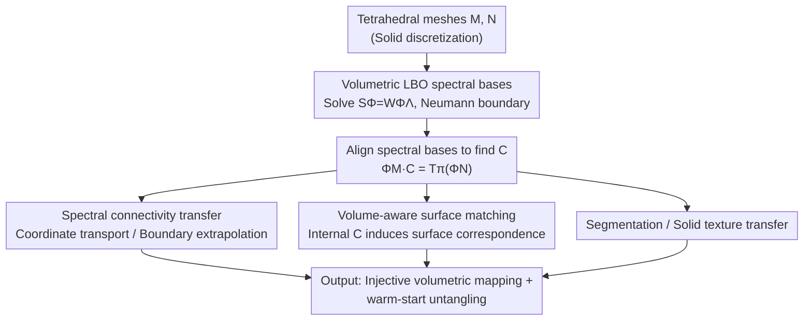

# Volumetric Functional Maps

**Conference**: CVPR 2026  
**Paper**: [CVF Open Access](https://openaccess.thecvf.com/content/CVPR2026/html/Maggioli_Volumetric_Functional_Maps_CVPR_2026_paper.html)  
**Code**: https://github.com/filthynobleman/vol-fmaps  
**Area**: 3D Vision  
**Keywords**: Functional maps, volumetric correspondence, Laplacian spectrum, tetrahedral meshes, geometry processing

## TL;DR
This paper is the first to extend the mature functional maps framework from surface geometry processing to 3D volumes (tetrahedral meshes). By constructing a discretization-invariant function space using the eigenfunctions of the volumetric Laplacian operator, it establishes dense correspondences within the volume interior, supporting applications such as connectivity transfer, segmentation transfer, and solid textures, while also improving the accuracy of classical surface shape matching.

## Background & Motivation
**Background**: Establishing correspondences between shapes on surfaces (triangle meshes) follow two mature paths. One is piece-wise linear mapping, relying on vertex-to-vertex correspondence and barycentric interpolation. The other is spectral/functional maps, which transform the difficult-to-optimize discrete "point-to-point correspondence" problem into a "linear mapping between two function spaces"—using the eigenfunctions of the Laplace-Beltrami operator (LBO) as a basis, common correspondences are compressed into a small $k\times k$ matrix $C$. Both paths are well-established on surfaces and integrated into commercial tools.

**Limitations of Prior Work**: When moving from "surfaces" to "volumes" (i.e., solid 3D objects discretized as tetrahedral meshes), the problem becomes stuck. Volumetric correspondence is critical in medical imaging (non-invasively registering digital organ copies to standard poses), mesh generation, statistical shape analysis, and industrial digital twins, yet it remains largely an open problem. Lifting piece-wise linear methods to volumes is extremely difficult; since even constructing a surjective mapping to a convex polyhedron is notoriously hard, tools like Tutte embedding fail on tetrahedral meshes. The few existing "robust" volumetric embedding algorithms rely on precise numerical construction and exponential mesh subdivision, making them impractical. The fallback approach—coarse correspondence followed by untangling—is an ill-posed problem that may have no solution for fixed connectivity, with mainstream algorithms reporting numerous failures on public data.

**Key Challenge**: The piece-wise linear path is inherently tied to mesh connectivity and injectivity constraints, making it unscalable to volumes. Conversely, the functional maps path—which does not rely on point-wise correspondence but on a set of function bases—has never been tested on volumes, leaving its potential in volumetric data processing completely untapped.

**Goal**: To extend the functional maps framework to the volumetric domain for the first time, demonstrating that unlike piece-wise linear methods, it is **naturally scalable to volumes**. This provides a theoretically consistent and practically useful platform for volumetric correspondence and verifies its capability to support real-world applications such as connectivity transfer, segmentation transfer, and solid textures, while even improving surface matching itself.

**Key Insight**: The key observation is that the LBO is not exclusive to surfaces. It can be defined on Riemannian manifolds of any dimension and always possesses a spectral decomposition. Consequently, the volumetric Laplacian of a tetrahedral mesh also has a set of eigenfunctions. The function space they span is "completely agnostic to the underlying discrete mesh," allowing correspondences to be established between two solid meshes with different densities and connectivities.

**Core Idea**: Use the spectrum (eigenfunctions) of the volumetric Laplacian as the function basis, porting the entire mechanism of surface functional maps (descriptor alignment, ZoomOut refinement, basis substitution, etc.) directly to volumes.

## Method

### Overall Architecture
The main pipeline of the method is straightforward: the input consists of **tetrahedral meshes** $\mathcal{M}=(V_\mathcal{M}, T_\mathcal{M})$ (the outer surface is its triangle face set $\partial\mathcal{M}$). First, discretize the volumetric LBO on the mesh and solve the generalized eigenvalue problem to obtain a set of volumetric spectral bases $\Phi_\mathcal{M}$. Once both shapes have their bases, find a small matrix $C$ to align them; this $C$ is the volumetric functional map. Finally, use $C$ to transfer various signals (coordinates, connectivity, segmentation labels, textures) from one volume to another and recover point-wise correspondences via nearest-neighbor search. The paper centers on three applications of $C$: connectivity transfer, volume-aware surface matching, and segmentation/texture transfer.

### Key Designs

**1. Volumetric LBO Spectral Bases: Compressing "Correspondence" into a Mesh-Independent Matrix**

The pain point of piece-wise linear methods is their dependency on connectivity and injectivity constraints. This method bypasses that: since the LBO has spectral decomposition on manifolds of any dimension, the stiffness matrix $S$ and mass matrix $W$ are discretized directly on the tetrahedral mesh using the $n$-dimensional cotangent formula. Solving the generalized eigenvalue problem $S\Phi = W\Phi\Lambda$ yields the volumetric eigenfunctions $\Phi$. With two sets of bases $\Phi_\mathcal{M}, \Phi_\mathcal{N}$, the transport of any function $f$ reduces to matrix multiplication:

$$T_\pi(f) \approx \Phi_\mathcal{M}\, C\, \Phi_\mathcal{N}^{\dagger}\, f,\qquad C\in\mathbb{R}^{k\times k}$$

where $\dagger$ is the Moore-Penrose pseudoinverse, and $C$ is only as large as the basis size (truncated to $k$ eigenfunctions). Point-to-point correspondence is then retrieved using $\mathrm{NN}(\Phi_\mathcal{N}, \Phi_\mathcal{M}C)$. This ports the essence of functional maps to volumes: correspondence is no longer a discrete variable per vertex but a low-dimensional linear operator, naturally allowing for two solid meshes with completely different densities and connectivities. A key engineering detail: since most applications analyze information on the surface (the boundary of the tetrahedral mesh), the authors **enforce Neumann boundary conditions** to prevent eigenfunctions from degenerating to zero at the surface—a critical distinction from the surface case.

**2. Spectral Connectivity Transfer: Recovering Volume Correspondence from Boundary Trajectories**

Many applications (digital manufacturing, medicine, hexahedral mesh generation) require two volumetric meshes with "the same connectivity but different vertex coordinates." This paper provides two paths to transfer connectivity from $\mathcal{M}$ to the target domain. The first is **functional connectivity transfer**: given a surface correspondence $\pi:\partial\mathcal{M}\to\partial\mathcal{N}$, while the internal volume correspondence is unknown. The key insight comes from control theory—under Neumann boundaries, the "boundary trajectories" (restriction to boundary) of eigenfunctions for any elliptic operator are linearly independent. Thus, the restricted basis $\Phi_{\partial\mathcal{M}}$ on the surface has a left inverse, and the volumetric functional map can be approximated solely from surface correspondence:

$$C \approx \Phi_{\partial\mathcal{M}}^{\dagger}\, T_\pi(\Phi_{\partial\mathcal{N}})$$

After obtaining $C$, the **full spectrum** is used to transport the coordinates of $\mathcal{N}$ onto $\mathcal{M}$. The second is **spectral extrapolation of coordinates**: a watertight surface already encodes internal volume information. Leveraging the smooth reconstruction properties of LBO, internal coordinates can be extrapolated purely from the surface: $T_{\pi'}(x_\mathcal{N}) = \Phi_\mathcal{M}\Phi_{\partial\mathcal{M}}^{\dagger}T_\pi(x_{\partial\mathcal{N}})$. This avoids a separate volumetric spectral decomposition of the target, making it approximately $2\times$ faster. To better reconstruct extrinsic information, the authors also extend the basis to CMH (Coordinates Manifold Harmonics, adding 3 functions encoding xyz coordinates).

**3. Volume-Aware Surface Matching: Improving Surface Correspondence with Internal Information**

This is an "inverse dividend." The intuition is that a solid volume carries more local and global information than its shell; therefore, a functional map between two tetrahedral meshes should be more accurate and stable than one between two triangle meshes. As established, the $C$ relating two volumetric bases also relates their restrictions on the surface. One merely needs to tetrahedralize two surfaces $\partial\mathcal{M}, \partial\mathcal{N}$ to obtain volumes $\mathcal{M}, \mathcal{N}$, solve for a volumetric $C$ satisfying $\Phi_\mathcal{M}C=T_\pi(\Phi_\mathcal{N})$, restrict it to the surface $(\Phi_\mathcal{M})_\partial C$, and extract the surface correspondence via $\mathrm{NN}(\Phi_{\partial\mathcal{M}}C, \Phi_{\partial\mathcal{N}})$. While this introduces extra computation from internal vertices, experiments prove this "detour into the volume" approach is more accurate than pure surface pipelines across all datasets.

### Mechanism Example
Take "warm-starting volumetric mesh untangling" using this method as an example: given a pair of volumetric meshes to be matched, first utilize a small part of the spectrum (e.g., 5% of eigenfunctions) to calculate the volumetric $C$. Transfer the connectivity to obtain an initial mapping—at this stage, there are a few flipped tetrahedra (< 5% flips with 5% spectrum, < 1% with 20%, and fully injective at 25%). Feed this initial guess into existing untangling algorithms (e.g., Garanzha et al.), replacing the standard Tutte 3D embedding initialization which often fails on volumes. In a large-scale validation of [76], **85%** of the 1405 cases where Tutte failed were successfully resolved into injective mappings using this initial guess, significantly boosting pipeline success rates.

## Key Experimental Results

### Main Results: Volumetric Information Improves Surface Matching (Tab. 2)
Comparing "pure surface functional maps" with the "volumetric version" across 4 datasets, reporting Mean Geodesic Error (AGE Surf. vs AGE Vol.) and the percentage of pairs where our method achieved lower AGE (Success Rate). Selected results under Orthoprods basis:

| Dataset | AGE Surf. | AGE Vol. | Success Rate | Slowdown | Vertex Ratio |
|--------|----------|----------|--------|----------|--------|
| VOL | 5.82e-7 | 3.19e-7 | 60.00% | 1.92× | 1.40× |
| SHREC'19 | 1.11e-1 | 7.13e-2 | 56.42% | 2.03× | 1.59× |
| TOPKIDS | 1.17e-1 | 8.13e-2 | 64.00% | 2.51× | 2.16× |
| SHREC'20 | 1.83e-1 | 3.01e-1 | 8.24% | 1.01× | 0.80× |

Conclusion: The volumetric version is consistently more accurate on VOL / SHREC'19 / TOPKIDS. SHREC'20 (strong non-isometry + topological changes) is the exception where Orthoprods worsened, as topological errors from tetrahedralization pollute the basis—switching to CMH bases (using coordinates as regularization) brings errors back down (55.49% success on SHREC'20 with CMH). Slowdown is highly correlated with the vertex ratio, indicating the volumetric pipeline is not inherently slow, but slower due to the increased vertex count.

### Connectivity Transfer: Flips Decay Elegantly as Spectrum Increases (Tab. 1)

| Method | 5% Eigen. | 10% | 15% | 20% | Time(s) |
|------|---------|-----|-----|-----|---------|
| Transfer (LBO) | 4.63% | 1.50% | 1.18% | 0.93% | 1127 |
| Transfer (CMH) | 4.75% | 0.84% | 0.45% | 0.34% | 1127 |
| Extrapolation (LBO) | 4.39% | 1.45% | 1.15% | 0.92% | 554 |
| Extrapolation (CMH) | 4.90% | 0.99% | 0.56% | 0.42% | 554 |

The percentage of flipped tetrahedra decreases monotonically as the basis size increases, reaching full injectivity at 25% of the spectrum. CMH yields fewer flips at the same spectral budget (better for transferring discrete connectivity signals). The extrapolation version takes about half the time of the transfer version.

### Key Findings
- **Basis Choice Determines the Ceiling**: Under simple datasets (watertight, shared connectivity), volumetric information only shows an advantage when paired with the stronger Orthoprods basis; on difficult datasets (topological noise), CMH is more robust due to coordinate regularization. No single basis is optimal for all cases; it depends on the noise type.
- **The Greatest Practical Value is "Warm-Starting"**: Even with a small fraction of the spectrum and a few flips remaining, it serves as a better initialization than Tutte for untangling, raising the success rate of SOTA algorithms to 85% on previously failed cases.
- **Slowdown Stems from Vertex Count, Not Algorithm**: The slowdown is almost linearly related to the ratio of surface-to-volume vertices, indicating the overhead is caused by the extra vertices needed for volume discretization rather than framework inefficiency.

## Highlights & Insights
- **The Elegance of "Porting the Entire Toolchain"**: Because LBO provides spectral decomposition in any dimension, mechanisms from surface functional maps—ZoomOut, descriptor alignment, basis substitution (CMH/Orthoprods)—port to volumes with almost zero changes. This demonstrates the framework's high level of abstraction.
- **Clever Boundary Trajectory Argument**: Using the control theory principle that "boundary trajectories of elliptic operator eigenfunctions under Neumann conditions are linearly independent" to justify that $\Phi_{\partial\mathcal{M}}$ can be left-inverted provides a solid foundation for solving what seems like an underdetermined problem.
- **Intriguing Inverse Dividends**: Originally intended to solve volumetric correspondence, the method revealed that "detouring into the volume and back to the surface" actually improves classic surface matching. This implies that when volumetric discretization is available, lifting the matching into the volume interior is a worthwhile trade-off.

## Limitations & Future Work
- **High Cost of Full Injectivity**: Connectivity transfer requires a significantly large portion of the spectrum to be completely flip-free, which quickly becomes computationally expensive. Finding ways to retain more accuracy within a fixed spectral budget is a valuable future direction.
- **Accuracy Equals Slowness, Inherently**: The most expensive steps (eigen-decomposition + basis alignment) grow with the number of vertices. Since volumes naturally have more vertices, they are slower; mitigation requires spectral algorithms specifically designed for volumetric scalability.
- **Lack of Datasets and Theory**: There is a scarcity of public datasets for volumetric shape matching; surface datasets are often difficult to tetrahedralize with high quality (gaps, self-intersections, non-manifolds). Furthermore, a theoretical analysis of "properties preserved under volumetric functional maps" is still lacking.

## Related Work & Insights
- **vs. Piece-wise Linear Volumetric Mapping (Tutte 3D / Untangling)**: These perform vertex-wise injective mapping but are tied to connectivity and injectivity constraints, making them either impractical (exponential subdivision) or ill-posed (no guarantees for untangling). This paper uses function space correspondence, which is naturally scalable and can provide better initializations for untangling.
- **vs. Surface Functional Maps (FMap / ZoomOut / Orthoprods / CMH)**: This work is an "elevation" rather than a replacement—porting the same basis alignment mechanisms to volumes and proving that volumetric information improves surface matching.
- **vs. Diffeomorphic Registration (LDDMM)**: LDDMM succeeds on grid-like dense volumetric data (MRI/CT), but diffeomorphic mappings are limited by grid structure and hard to generalize to flexible tetrahedral meshes. This spectral method is discretization-agnostic and handles solid meshes with different connectivities.

## Rating
- Novelty: ⭐⭐⭐⭐⭐ First to extend the functional maps framework to the volumetric domain, opening a new direction in "spectral volumetric mapping."
- Experimental Thoroughness: ⭐⭐⭐⭐ Covers connectivity/segmentation/texture transfer and surface matching across multiple tasks and bases, though the main validation set (40 pairs) is constrained by the lack of public volumetric data.
- Writing Quality: ⭐⭐⭐⭐ Clear motivation, self-consistent derivations, and solid boundary trajectory arguments; key proofs are located in the supplement.
- Value: ⭐⭐⭐⭐⭐ Provides a practical and scalable new platform for volumetric correspondence in medicine, mesh generation, and digital twins, accompanied by open-source code.

<!-- RELATED:START -->

## Related Papers

- [\[CVPR 2026\] PackUV: Packed Gaussian UV Maps for 4D Volumetric Video](packuv_packed_gaussian_uv_maps_for_4d_volumetric_video.md)
- [\[CVPR 2025\] Denoising Functional Maps: Diffusion Models for Shape Correspondence](../../CVPR2025/3d_vision/denoising_functional_maps_diffusion_models_for_shape_correspondence.md)
- [\[CVPR 2026\] Radiance Meshes for Volumetric Reconstruction](radiance_meshes_for_volumetric_reconstruction.md)
- [\[CVPR 2026\] FunREC: Reconstructing Functional 3D Scenes from Egocentric Interaction Videos](funrec_reconstructing_functional_3d_scenes_from_egocentric_interaction_videos.md)
- [\[CVPR 2026\] FunFact: Building Probabilistic Functional 3D Scene Graphs via Factor-Graph Reasoning](funfact_building_probabilistic_functional_3d_scene_graphs_via_factor-graph_reaso.md)

<!-- RELATED:END -->
