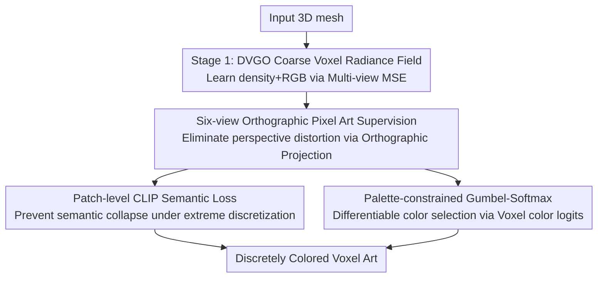

# Voxify3D: Pixel Art Meets Volumetric Rendering

**Conference**: CVPR2026  
**arXiv**: [2512.07834](https://arxiv.org/abs/2512.07834)  
**Code**: [Project Page](https://yichuanh.github.io/Voxify-3D/)  
**Area**: 3D Vision  
**Keywords**: Voxel Art, Volumetric Rendering, DVGO, Orthographic Projection Supervision, Gumbel-Softmax Discrete Quantization

## TL;DR
Transforming 3D meshes into "Lego/pixel block" style voxel art: This work utilizes a differentiable two-stage voxel radiance field. First, coarse geometry and color are learned via DVGO. Then, stylization is achieved through six-view orthographic pixel art supervision, patch-level CLIP semantic loss, and palette-constrained Gumbel-Softmax discrete color optimization. The framework produces voxel art with clear semantics, clean color blocks, and controllable abstraction (2-8 colors, 20$\times$-50$\times$ resolution), achieving a CLIP-IQA of 37.12 and 77.90% user preference.

## Background & Motivation
**Background**: Voxel art is a prevalent style in games and digital media—minimalist, discrete, and blocky. However, existing methods for automatically generating high-quality voxel art from 3D meshes are limited; they often rely on manual artistic creation or procedural tools (e.g., Blender Geometry Nodes) requiring tedious parameter tuning. While 2D pixel art stylization has reached maturity, these techniques cannot be directly transferred to 3D voxels.

**Limitations of Prior Work**: Direct application of existing methods is ineffective. ① Simple downsampling loses semantic features, causing critical structures like faces and limbs to blur or disappear. ② Voxel NeRFs (e.g., DVGO) are designed for photorealistic rendering rather than stylized abstraction. ③ Neural editing methods (IN2N, Vox-E) fail to produce clean, discrete color blocks; Vox-E results in over-smoothed volumes while IN2N exhibits multi-view inconsistency under varying guidance. ④ Procedural methods in Blender are equivalent to simple downsampling, lacking semantic alignment and requiring manual adjustment.

**Key Challenge**: Voxel art generation faces three entangled difficulties that cannot be solved by piece-meal techniques: (1) **Alignment**: Under perspective projection, pixel and voxel positions do not align perfectly, leading to blurred gradients during optimization. (2) **Semantic Maintenance**: Critical features like facial details and joints suffer from "semantic collapse" at low resolutions, as global perceptual losses fail to capture local semantic importance. (3) **Discrete Optimization**: Voxel art requires a small palette (2-8 colors), yet gradient-based methods naturally output continuous values, and existing quantization methods are either non-differentiable or offer uncontrollable palettes.

**Goal**: To solve "precise pixel-voxel alignment + semantic maintenance under extreme discretization + end-to-end discrete color optimization" within a unified differentiable framework, while allowing users to control the level of abstraction (color count, resolution, palette strategy).

**Key Insight**: Utilize **orthographic rendering to eliminate perspective distortion** for point-to-point pixel-voxel alignment, **patch-level CLIP** to preserve semantics under extreme discretization, and **palette-constrained Gumbel-Softmax** to transform discrete color selection into a differentiable optimization. These must be precisely coordinated across rendering strategies, loss formulations, and quantization timing.

## Method

### Overall Architecture
Voxify3D takes a 3D mesh as input and outputs a discretely colored voxel grid (voxel art). The pipeline consists of two stages: **Stage 1: Coarse Voxel Training**, which uses DVGO under multi-view MSE supervision to learn a coarse voxel radiance field (density grid + RGB color grid) for stable initialization. **Stage 2: Orthographic Pixel Art Fine-tuning** is the core of stylization—applying **orthographic projection** from six axis-aligned directions to align the voxel grid with pixel art generator outputs. This is combined with depth and alpha losses for geometry preservation and patch-level CLIP loss for semantic preservation. Finally, the RGB color grid is replaced with a **color logit grid**, and **Gumbel-Softmax** differentiable quantization is applied to a palette extracted from the six-view pixel art, forcing each voxel color into discrete blocks.

### Key Designs

**1. Six-view Orthographic Supervision: Eliminating Pixel-Voxel Mismatch via Parallel Projection**

Perspective projection is detrimental to discrete stylization: voxels at different depths can project to the same pixel, preventing a one-to-one mapping between pixel color and voxel position, which smears gradients and blurs results. Voxify3D employs **orthographic rendering** from six axis-aligned views (front, back, left, right, top, bottom) using parallel ray casting $\mathbf{r}_i(t)=\mathbf{o}_i+t\mathbf{d}$. All ray directions $\mathbf{d}$ are fixed and parallel, resulting in natural point-to-point alignment without perspective distortion. The supervision comes from a pixel art generator $C_{\text{pixel}}$. Basic constraints include pixel loss $\mathcal{L}_{\text{pixel}}=\|C(\mathbf{r})-C_{\text{pixel}}\|_2^2$, depth loss $\mathcal{L}_{\text{depth}}=\|D(\mathbf{r})-D_{\text{gt}}\|_1$, and an alpha loss $\mathcal{L}_\alpha=\|\mathcal{M}_\alpha\odot\bar{\alpha}\|^2$ to suppress background density through a binary mask $\mathcal{M}_\alpha$ derived from the pixel art.

**2. Patch-level CLIP Semantic Loss: Maintaining Identity at 20$\times$-50$\times$ Resolution**

As voxel resolution decreases, critical semantic regions like faces and limbs tend to collapse. Global perceptual losses often miss these local semantic nuances. The authors implement a **patch-level CLIP perceptual loss**: during training, half of the rays are sampled as a patch. The rendered patch $\hat{I}_{\text{patch}}$ and the corresponding mesh patch $I^{\text{mesh}}_{\text{patch}}$ are passed through a CLIP image encoder to calculate the cosine similarity loss $\mathcal{L}_{\text{clip}}=1-\cos(\text{CLIP}(\hat{I}_{\text{patch}}),\ \text{CLIP}(I^{\text{mesh}}_{\text{patch}}))$. Aligning CLIP features at the patch level ensures the stylized output remains semantically faithful to the input mesh while remaining memory-efficient by using small $80\times80$ patches.

**3. Palette-constrained Gumbel-Softmax: Differentiable and Controllable Selection**

Voxel art requires small palettes (2-8 colors), but gradient optimization is inherently continuous. Voxify3D stores a color logit vector $\boldsymbol{\lambda}_{i,j,k}\in\mathbb{R}^C$ for each voxel $(i,j,k)$, where $C$ is the palette size. During training, Gumbel noise $\mathbf{G}$ is added, and a tempered softmax $s_{i,j,k,n}(\tau)=\frac{\exp(Y_{i,j,k,n}/\tau)}{\sum_{n'}\exp(Y_{i,j,k,n'}/\tau)}$ calculates the probability of selecting the $n$-th color. The sampled RGB is $\text{RGB}_{i,j,k}=\sum_n s_{i,j,k,n}\cdot\mathbf{c}_n$. The system uses "straight-through" estimation in later stages—using $\arg\max_n s$ for the forward pass while maintaining soft gradients for the backward pass. The temperature $\tau$ is annealed from 1.0 to 0.1 to tighten selections into discrete blocks.

### Loss & Training
- **Stage 1**: $\mathcal{L}_{\text{total}}=\mathcal{L}_{\text{render}}+\lambda_d\mathcal{L}_{\text{density}}+\lambda_b\mathcal{L}_{\text{bg}}$. $\mathcal{L}_{\text{render}}$ is the MSE between rendered and target colors; $\mathcal{L}_{\text{density}}$ includes noise suppression and TV regularization; $\mathcal{L}_{\text{bg}}$ uses entropy loss to clear backgrounds.
- **Stage 2 (Fine-tuning)**: $\mathcal{L}_{\text{total}}=\lambda_{\text{pixel}}\mathcal{L}_{\text{pixel}}+\lambda_{\text{depth}}\mathcal{L}_{\text{depth}}+\lambda_{\text{alpha}}\mathcal{L}_{\text{alpha}}+\lambda_{\text{clip}}\mathcal{L}_{\text{clip}}$.
- **Training Strategy**: Stage 1 runs for 8000 iterations for global structure. Stage 2 fine-tunes for 6500 iterations at $1200\times1200$ resolution with $80\times80$ patches for CLIP. Gumbel-Softmax temperature anneals from 1.0 to 0.1.

## Key Experimental Results

### Main Results
Datasets: Rodin, Unique3D, TRELLIS (primarily character-based 3D assets). Metric: CLIP-IQA (using GPT-4 generated prompts "A voxel art of..." and ViT-B/32 CLIP similarity).

| Method | CLIP-IQA | Description |
|------|---------|------|
| IN2N [30] | 23.93 | Language-guided editing; inconsistent across views |
| Vox-E [82] | 35.02 | Language-to-voxel; semantic-heavy but lacks blockiness |
| Pixel→3D extension | 35.53 | Naive baseline: Render→Pixelate→DVGO |
| Blender Geometry Nodes | 36.31 | Procedural; equivalent to downsampling without alignment |
| **Ours** | **37.12** | Superior semantic alignment and stylization |

User Study Results (35 cases, 72 participants):

| Dimension | Ours | Others |
|------|------|--------|
| Abstract | **77.90%** | 22.10% |
| Appeal | **80.36%** | 19.64% |
| Geometry | **96.55%** | 3.45% |

### Ablation Study
Removing components (CLIP-IQA, 5-object average):

| Configuration | CLIP-IQA | Description |
|------|---------|------|
| (1) w/o Stage 1 | 28.42 | No geometry initialization $\rightarrow$ Distorted shapes |
| (3) w/o Ortho (w/ Persp) | 27.38 | Pixel-voxel mismatch $\rightarrow$ Severe color misalignment |
| (2) w/o Stage 2 | 34.32 | Regresses to coarse DVGO; no abstraction |
| (5) w/o CLIP loss | 39.23 | Decreased semantic clarity |
| (6) w/o Gumbel | 39.31 | Mixed colors; no clean block boundaries |
| (4) w/o depth loss | 39.75 | Loss of global 3D structure |
| **(7) Ours (Full)** | **40.06** | Best balance of geometry, semantics, and color |

### Key Findings
- **Orthographic Projection and Stage 1 are Fundamental**: Removing these leads to the most significant performance drops (27.38 / 28.42), proving that alignment and initialization are prerequisites for voxel art.
- **Each Component Serves a Specific Role**: Depth loss preserves 3D structure, CLIP loss preserves semantic clarity, and Gumbel-Softmax ensures clean discrete color boundaries.
- **Palette Controllability**: Smaller palettes result in higher abstraction; different clustering strategies (K-means, Max-Min, etc.) offer varying stylistic outcomes.
- **Manufacturability**: The discrete structure and limited palette are suitable for physical reconstruction (e.g., Lego-style assembly).

## Highlights & Insights
- **Orthographic Projection is the Key Solution**: While many attempt 2D pixel-to-3D voxel transfer, perspective mismatch usually causes failure. Using orthographic rendering across six axis-aligned views makes pixel-voxel alignment naturally satisfied.
- **Patch-level CLIP is a Win-Win**: It overcomes the insensitivity of global perceptual losses to local semantic collapse while remaining memory-efficient. This technique is transferable to other low-resolution stylization tasks.
- **Differentiable Palette Selection via Gumbel-Softmax**: Transforming discrete selection into an optimization process and exposing palette strategies to the user bridges the gap between algorithmic output and creative tools.

## Limitations & Future Work
- **Limitations**: The method struggles with extremely fine structures (e.g., thin parts) which are lost at low voxel resolutions. It relies on external 2D pixel art generators, meaning supervision quality is capped by the generator's performance.
- **Future Work**: Plans to introduce geometric priors for enhanced detail and explore "assembly-aware" manufacturing strategies for physical Lego-like construction.

## Related Work & Insights
- **vs DVGO [86]**: While DVGO is for photorealistic radiance fields, this work adapts the architecture for discrete stylization via logit grids and Gumbel-Softmax.
- **vs IN2N [30] / Vox-E [82]**: These methods focus on language-guided editing. Voxify3D achieves significantly better geometric and semantic consistency through orthographic pixel-level supervision.
- **vs 2D Pixel Art Stylization**: Unlike methods that stop at 2D, this work uses 2D pixel art as a supervision signal to bridge the gap into 3D voxels via orthographic alignment and discrete quantization.
- **vs VQGAN [20]**: Instead of a fixed, non-differentiable codebook, this method provides a differentiable selection process with user-definable palettes.

## Rating
- Novelty: ⭐⭐⭐⭐ The first framework to bridge 2D pixel art supervision with 3D voxel optimization through a combination of orthographic alignment and Gumbel-Softmax.
- Experimental Thoroughness: ⭐⭐⭐⭐ Comprehensive testing across three datasets, four baselines, and extensive user/expert studies, though the sample size for some ablations is small.
- Writing Quality: ⭐⭐⭐⭐ Clear mapping between challenges and design solutions with detailed formulas and visualizations.
- Value: ⭐⭐⭐⭐ High utility for gaming, digital media, and physical toy manufacturing.

<!-- RELATED:START -->

## Related Papers

- [\[CVPR 2026\] Mirror Illusion Art](mirror_illusion_art.md)
- [\[CVPR 2026\] Global Structure-from-Motion Meets Feedforward Reconstruction](global_structure-from-motion_meets_feedforward_reconstruction.md)
- [\[CVPR 2026\] Radiance Meshes for Volumetric Reconstruction](radiance_meshes_for_volumetric_reconstruction.md)
- [\[CVPR 2026\] ART: Articulated Reconstruction Transformer](art_articulated_reconstruction_transformer.md)
- [\[NeurIPS 2025\] LinPrim: Linear Primitives for Differentiable Volumetric Rendering](../../NeurIPS2025/3d_vision/linprim_linear_primitives_for_differentiable_volumetric_rendering.md)

<!-- RELATED:END -->
