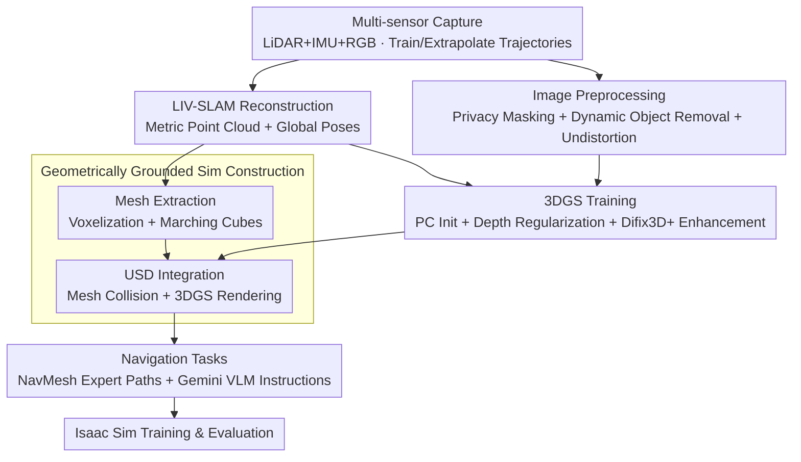

# Wanderland: Geometrically Grounded Simulation for Open-World Embodied AI

**Conference**: CVPR 2026  
**arXiv**: [2511.20620](https://arxiv.org/abs/2511.20620)  
**Code**: [https://ai4ce.github.io/wanderland/](https://ai4ce.github.io/wanderland/)  
**Area**: 3D Vision / Embodied AI / Simulation Environments  
**Keywords**: real-to-sim, 3D Gaussian Splatting, LiDAR-Inertial-Visual SLAM, navigation simulation, geometric grounding, novel view synthesis  

## TL;DR

This paper introduces the Wanderland real-to-sim framework, which utilizes handheld multi-sensor scanners (LiDAR+IMU+RGB) to capture open-world indoor and outdoor scenes. By employing LIV-SLAM to obtain metric-grade precise geometry and camera poses, combined with 3DGS for photorealistic rendering and geometrically grounded collision simulation, the authors construct a large-scale dataset of 530 scenes, 420,000 frames, and 3.8 million $m^2$. The system demonstrates that pure visual reconstruction falls far short of LiDAR-enhanced solutions in terms of metric accuracy, mesh quality, and the reliability of navigation policy training and evaluation.

## Background & Motivation

**Open-world embodied navigation requires high-fidelity simulation**: As embodied AI expands from indoor settings to open environments such as city streets, campuses, and commercial districts, simulation environments with large spatial scales, mixed indoor-outdoor coverage, high-fidelity sensor simulation, and reliable physical interaction are needed.

**Classic RGB-D datasets are limited to interiors**: Datasets like Matterport3D, ScanNet, and HM3D rely on tripod-based RGB-D capture. These are unsuitable for outdoor environments due to sunlight interference and limited ranging depth; furthermore, significant pose drift occurs in large-scale, low-texture environments.

**Video-3DGS solutions lack geometric reliability**: Frameworks like Vid2Sim and GaussGym construct simulation environments from online videos but suffer from three fundamental flaws: (a) pure RGB SfM or depth estimation results in non-metric poses; (b) collision meshes extracted from 3DGS opacity are fragmented and lack metric grounding; (c) single-video trajectories lead to a sharp decline in rendering quality for extrapolated viewpoints.

**Varying simulation needs for training vs. evaluation**: While video-3DGS environments might suffice for training, their geometric unreliability prevents them from serving as standardized benchmarks for reproducible closed-loop evaluation.

**Lack of large-scale outdoor metric benchmarks for 3D reconstruction and NVS**: Existing outdoor datasets lack high-precision geometric ground truth, limiting the evaluation of reconstruction and Novel View Synthesis (NVS) methods.

## Method

### Overall Architecture

Wanderland addresses the lack of "geometrically reliable and photorealistic" simulators for open-world embodied navigation. Pure video-3DGS routes provide non-metric poses, fragmented collision meshes, and failing extrapolated views, making them unsuitable for standardized benchmarks. The core insight is the **decoupling of geometry and appearance**: geometry is derived from LiDAR to ensure metric accuracy, while appearance is handled by 3DGS for realism, both sharing a unified coordinate system. The pipeline includes: handheld multi-sensor capture → LIV-SLAM reconstruction of globally consistent metric point clouds and camera poses → 3DGS initialization from point clouds with depth-regularized training → collision mesh extraction from the same point clouds → integration into USD scenes → deployment in Isaac Sim for navigation training and evaluation.

### Key Designs

**1. Multi-sensor Capture: Anchoring Geometry with LiDAR and Supporting Extrapolation via Trajectory Design**

The root problem of visual-only routes is non-metric poses and drift in low-texture areas. Wanderland utilizes a MetaCam Air handheld scanner to simultaneously capture Livox Mid-360 non-repetitive LiDAR (with built-in IMU), RTK-GNSS, and two synchronized 4K fisheye cameras (>180° FOV). The LiDAR tilt is optimized to balance ground detail with camera FOV overlap. The capture protocol is specifically designed for simulation:

- Scene scales range from 5,000 to 10,000 $m^2$.
- Non-fixed frame rates; RGB is triggered by displacement/angle thresholds to ensure uniform viewpoints.
- **Training trajectories** follow closed-loop paths with dense multi-view coverage; **extrapolation trajectories** simulate natural navigation with minimal overlap with training paths, enabling evidence-based extrapolation evaluation.
- Quality control: Minimizing dynamic obstacles/reflective surfaces and maintaining consistent lighting.

**2. LIV-SLAM Reconstruction + Image Preprocessing: Metric Geometry and Clean Pixels**

The geometric foundation is built via MetaCam Studio using LiDAR-Inertial-Visual-GNSS fusion, outputting dense point clouds with millimeter-level spacing. On the image side, EgoBlur masks faces/plates for privacy, and YOLOv11 detects and masks dynamic objects (pedestrians/vehicles) to filter invalid pixels during 3DGS training. Fisheye images are cropped to 120° for perspective undistortion.

**3. 3DGS Training: Metric Point Cloud Initialization + Depth Regularization**

3DGS is initialized directly from the LIV-SLAM dense colored point clouds (downsampled to ~5 million points/scene). Depth regularization is the key: rather than using monocular depth as pseudo-GT, the initialized Gaussians are projected to camera poses to obtain GT depth maps for joint optimization with photometric loss. Finally, the Difix3D+ model is used to generate clean novel views further from the training trajectory to stabilize large-scale training.

**4. Geometrically Grounded Simulation Construction**

Collision meshes are not extracted from 3DGS opacity. Instead, the global point cloud is voxelized into occupancy grids, and Marching Cubes is applied to extract clean, complete, and metric-accurate meshes. Since the Mesh and 3DGS share the same origin, they are integrated into USD where the Mesh acts as the physics layer and 3DGS as the renderer.

**5. Task Definition: NavMesh Expert Trajectories + VLM Instructions**

Expert trajectories are generated using NavMesh baking in Unity to find collision-free shortest paths. Language instructions are generated by feeding first-person video of these trajectories into Gemini VLM, followed by human verification, ensuring scalability and consistency across scenes.

## Key Experimental Results

| Metric | Value |
|:---|:---|
| Total Scenes | 530 |
| Total Frames | 420K+ |
| Total Capture Time | 100+ Hours |
| Coverage Area | 3.8M+ $m^2$ |
| Scene Types | Mixed Indoor/Outdoor (Residential/Commercial/Street/Campus) |
| Per-scene Data | Fisheye RGB + Calib + Global Poses + Colored PC + 3DGS + Mesh + USD |

### 1. 3D Reconstruction Accuracy (Q1: Pure Vision vs. LIV-SLAM)

Using LIV-SLAM poses as ground truth (GT), the camera pose accuracy of 8 pure vision methods was evaluated:

| Method | T-ATE_raw (m) ↓ | T-ATE_scaled (m) ↓ | R-ATE (°) ↓ | AUC@30 ↑ | Success Rate ↑ |
|:---|:---|:---|:---|:---|:---|
| DUSt3R | 15/14 | 20/18 | 73/60 | 0.12/0.07 | 0.39 |
| MUSt3R | 7.8/5.7 | 10/3.7 | 26/13 | 0.53/0.61 | 0.81 |
| π³ | 15/14 | 4.7/1.4 | 21/6.9 | 0.64/0.76 | 0.89 |
| COLMAP_calib | 10/9.7 | 4.8/0.30 | 15/5.0 | 0.73/0.83 | 0.87 |
| **All Methods Best** | **2.8** | **0.30** | **5.0** | **0.83** | **0.89** |

**Key Findings**: Even taking the "best" combination of all methods, the raw metric error remains in the meter range for scenes under 100m. Pure vision methods' inherent modal limitations in metric accuracy have not yet been bridged by modern foundation models.

### 2. Photorealistic Simulation (Q2: NVS Quality)

Novel View Synthesis quality was evaluated on the Wanderland dataset:

| Method | Interp. PSNR ↑ | Interp. SSIM ↑ | Extrap. PSNR ↑ | Extrap. SSIM ↑ |
|:---|:---|:---|:---|:---|
| 3DGS (COLMAP) | 18.27 | 0.658 | 16.90 | 0.624 |
| Vid2Sim | 17.20 | 0.549 | 16.49 | 0.573 |
| GaussGym | 12.17 | 0.440 | 12.63 | 0.436 |
| **Wanderland (Ours)** | **20.37** | **0.688** | **17.92** | **0.591** |

**Key Findings**: Wanderland significantly outperforms others in interpolation PSNR (by 2+ dB) and maintains the highest PSNR for extrapolation. GaussGym performs the worst due to inaccurate VGGT reconstruction.

### 3. Navigation Policy Training & Evaluation (Q3: Simulation Reliability)

**RL Training Comparison**: Models trained in Vid2Sim environments generally deteriorated (CityWalker Success Rate dropped by 21%) because inaccurate geometry encouraged locally short but globally unreliable behavior. In Wanderland, all models improved significantly (CityWalker SR increased by 14%).

**Evaluation Reliability**: Evaluating the same model in a Vid2Sim environment showed lower success rates and higher intervention rates, indicating that geometrically unreliable environments cannot support faithful evaluation.

## Limitations & Future Work

1. **Capture Frame Rate**: Restricted to 1 FPS, leading to insufficient viewpoint density in complex scenes.
2. **Static Scene Assumption**: Does not model dynamic urban elements (pedestrians, cars); future work will integrate behavior prediction and interactive simulation.

## Highlights & Insights

1. **Quantifying the Necessity of Geometric Grounding**: The paper providing quantitative analysis on how simulation geometry affects downstream navigation policies. RL training in unreliable environments is not just ineffective but counterproductive.
2. **Scalability vs. Accuracy Trade-off**: The framework's reliance on professional hardware (MetaCam) contrasts with "zero-cost" video-based routes like GaussGym. The two approaches may eventually converge into a hybrid solution where LiDAR provides high-quality anchor scenes for calibration.
3. **Metric Benchmark for Scene Understanding**: Wanderland's multi-sensor data is ideal for evaluating the latest feed-forward 3D reconstruction models (e.g., DUSt3R), potentially serving as a GT benchmark beyond just navigation simulation.

<!-- RELATED:START -->

## Related Papers

- [\[CVPR 2026\] SAGE: Scalable Agentic 3D Scene Generation for Embodied AI](sage_scalable_agentic_3d_scene_generation_for_embodied_ai.md)
- [\[CVPR 2026\] P3Sim: Perceptual 3D Simulation with Physical World Modeling](perceptual_3d_simulation_with_physical_world_modeling.md)
- [\[CVPR 2026\] OnlineHMR: Video-based Online World-Grounded Human Mesh Recovery](onlinehmr_video-based_online_world-grounded_human_mesh_recovery.md)
- [\[CVPR 2026\] PhysHead: Simulation-Ready Gaussian Head Avatars](physhead_simulation-ready_gaussian_head_avatars.md)
- [\[CVPR 2026\] FSFSplatter: Geometrically Accurate Reconstruction with Free Sparse-view Images within 2 minutes](fsfsplatter_geometrically_accurate_reconstruction_with_free_sparse-view_images_w.md)

<!-- RELATED:END -->
## Related Papers

- [\[CVPR 2026\] SAGE: Scalable Agentic 3D Scene Generation for Embodied AI](sage_scalable_agentic_3d_scene_generation_for_embodied_ai.md)
- [\[CVPR 2026\] OnlineHMR: Video-based Online World-Grounded Human Mesh Recovery](onlinehmr_video-based_online_world-grounded_human_mesh_recovery.md)
- [\[CVPR 2026\] GaussianFluent: Gaussian Simulation for Dynamic Scenes with Mixed Materials](gaussianfluent_gaussian_simulation_for_dynamic_scenes_with_mixed_materials.md)
- [\[CVPR 2026\] Choreographing a World of Dynamic Objects](choreographing_a_world_of_dynamic_objects.md)
- [\[CVPR 2026\] FluidGaussian: Propagating Simulation-Based Uncertainty Toward Functionally-Intelligent 3D Reconstruction](fluidgaussian_propagating_simulation-based_uncertainty_toward_functionally-intel.md)

<!-- RELATED:END -->
