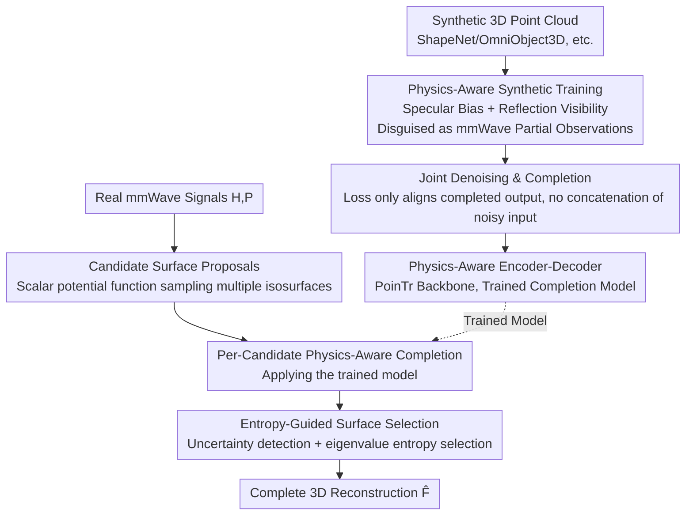

# Wave-Former: Through-Occlusion 3D Reconstruction via Wireless Shape Completion

**Conference**: CVPR 2026  
**Paper**: [CVF Open Access](https://openaccess.thecvf.com/content/CVPR2026/html/Dodds_Wave-Former_Through-Occlusion_3D_Reconstruction_via_Wireless_Shape_Completion_CVPR_2026_paper.html)  
**Code**: None  
**Area**: 3D Vision  
**Keywords**: mmWave sensing, through-occlusion reconstruction, shape completion, specular reflection, physics-aware learning  

## TL;DR
Wave-Former utilizes millimeter-wave (mmWave) wireless signals to penetrate occlusions such as cardboard boxes and clutter, completing sparse point clouds that "only see the front-facing surfaces" into complete 3D shapes of hidden objects. This is achieved through a "physics-aware shape completion" framework that directly encodes mmWave physical characteristics (specular reflection, anisotropic visibility, and strong noise) into the training data and losses. Consequently, trained **entirely on synthetic point clouds**, the model generalizes well to real-world measurements, improving the recall rate from 54% to 72% on real-world occluded datasets while maintaining a precision of 85%.

## Background & Motivation

**Background**: Reconstructing the 3D geometry of fully occluded objects (e.g., inside boxes or under clutter) is an open problem in computer vision, valuable for robotic grasping, AR, and logistics sorting. Optical sensors like cameras and LiDAR cannot penetrate occlusions, whereas mmWave signals can penetrate common obstructions and reflect off the surfaces of hidden objects. Consequently, recent works (such as Backprojection and mmNorm) have attempted to leverage these reflections for **partial** reconstruction of hidden objects.

**Limitations of Prior Work**: mmWave can only reconstruct a small fraction of the surface directly facing the radar, failing to obtain the complete shape. The root cause is that mmWave reflection is fundamentally different from visible light: visible light exhibits **diffuse reflection** (scattering in all directions) on most surfaces, whereas mmWave primarily exhibits **specular reflection** (mirror-like directional reflection). As a result, most of the object's surface reflects signals away and remains "invisible" to the sensor, leading to extremely low coverage. Compounded by mmWave point clouds having roughly 5 times more noise than depth cameras and lower spatial resolution, complete reconstruction is exceptionally challenging.

**Key Challenge**: A seemingly natural remedy is to "cascade off-the-shelf visual shape completion models (such as PoinTr) after partial mmWave point clouds," but this path fails. Visual completion models are designed for high-coverage, low-noise, and diffuse camera/LiDAR point clouds, implicitly assuming that "the input partial point cloud is uniform, reliable, and can be directly concatenated and retained." These assumptions do not hold for mmWave. Consequently, directly applying them yields highly noisy and geometrically distorted reconstructions. Ultimately, what is missing is a completion framework that **explicitly models mmWave physical properties**.

**Core Idea**: Directly embed mmWave physics (specularity, reflection-dependent visibility, and strong noise) **into the learning process**. This involves modifying both the training data generation (making synthetic partial point clouds resemble real-world mmWave observations) and the loss function (allowing the model to denoise rather than retain noisy inputs), paired with an inference pipeline for real-world signals (generating a pool of candidate surfaces, completing each, and selecting the optimal one using entropy). This enables the model to be **trained entirely on off-the-shelf synthetic 3D datasets** while generalizing to real mmWave signals to reconstruct complete 3D shapes of diverse objects.

## Method

### Overall Architecture

Wave-Former decouples the problem into two complementary tracks: the **training side** (Fig. a, fully synthetic), which teaches a transformer-based shape completion network "how partial observations look under mmWave perspective and how to complete them," and the **inference side** (Fig. b, real signals), which translates a sequence of raw mmWave measurements into a single high-fidelity 3D reconstruction.

Formally, the input consists of complex-valued time-domain measurements $H\in\mathbb{C}^{N\times T}$ acquired at $N$ known sensor positions $P\in\mathbb{R}^{N\times3}$. The goal is to learn a mapping $f_p:(H,P)\mapsto\hat F$ that outputs the complete point cloud $\hat F$. The training side relies on three physical techniques (specular bias, reflection visibility, and joint denoising/completion) to "disguise" synthetic point clouds as mmWave partial observations for training the completion network. The inference side employs a three-stage serial process: ① converting raw reflections into a **set** of candidate partial surfaces, ② performing physics-aware completion on each candidate to obtain a set of candidate complete reconstructions, and ③ selecting the optimal reconstruction guided by entropy.

### Key Designs

**1. Physics-Aware Synthetic Training: Embedding mmWave "Specularity + Anisotropic" Visibility into Training Partial Point Clouds**

Visual completion models operate on "camera-style" partial point clouds, assuming diffuse reflection with broad and uniform coverage. This inductive bias fundamentally conflicts with mmWave characteristics; thus, directly training on them forces the network to complete inputs of an unseen distribution. Wave-Former redefines the generation rules for "partial observations," making the synthetic partial point clouds as sparse, specular, and anisotropic as real mmWave observations through a two-step process:

**Specularity-Aware Inductive Bias**: For a complete synthetic point cloud $F$, only points that can generate specular echoes and are on the front-facing surface (unoccluded by the object itself) are retained to construct the partial observation:
$$O=\{\,s_i\in F\mid \theta_P(s_i)<\tau \;\cap\; V(s_i)=1\,\}$$
where $\theta_P(s_i)=\min_{k\in P}|\arccos(n_i\cdot u_{k,i})|$ is the minimum angle between the normal $n_i$ of point $s_i$ and the direction vector $u_{k,i}$ pointing to each sensor (specular visibility requires a small angle), and $V(s_i)$ denotes whether the point is directly facing the radar (computed using Open3D's Hidden Point Removal). Intuitively, this retains only points where specular reflection returns signals to the sensors and there is no self-occlusion, simulating real mmWave coverage.

**Reflection-Dependent Visibility**: Specularity alone is insufficient; mmWave visibility is highly anisotropic. Surfaces with identical geometry but different materials can exhibit vastly different visible regions. Therefore, an additional horizontal/vertical angular constraint is applied to $O$ to generate anisotropic partial point clouds:
$$O_A=\{\,s_i\in O\mid \theta_H(n_i)<\tau_H \;\cap\; \theta_V(n_i)<\tau_V\,\}$$
where $\theta_H, \theta_V$ are the horizontal and vertical angles of the specular echo at that point, and $\tau_H, \tau_V$ are tunable thresholds used to simulate different material properties. Sampling these thresholds across a range during training makes the model robust to various material visibilities. Combining these two steps injects the physical laws of "which points on an object are actually visible to mmWave" directly into the training data, enabling the model to learn from **purely synthetic data** while successfully generalizing to real-world mmWave partial observations.

**2. Joint Denoising and Completion: Allowing the Model to Rewrite Noisy Points Instead of Concatenating Noise**

Visual completion models assume that the input partial point cloud is clean enough, directly **concatenating** and retaining the input points with the newly generated points during completion. However, mmWave noise is about 5 times higher than that of depth cameras, and its resolution is low; replicating this concatenation strategy propagates severe distortions directly into the final reconstruction. Wave-Former instead adopts "joint denoising and completion." During training, noise is actively injected into the inputs to match real mmWave behavior, and the loss function is modified to output a **complete 3D shape without concatenating the input**. This allows the model to "reinterpret" unreliable points rather than blindly preserving them. The loss uses the **bidirectional Chamfer Distance** between the completed/denoised output $\hat F$ and the ground truth $F$:
$$L=\frac{1}{|\hat F|}\sum_{s_i\in\hat F}\min_{g\in F}\|s_i-g\|+\frac{1}{|F|}\sum_{g\in F}\min_{s_i\in\hat F}\|g-s_i\|$$
Crucially, the loss only measures "output vs. ground truth" and imposes no requirement to preserve the input points, giving the network the freedom to "discard or correct bad points" and substantially improving generalization to real noisy measurements. These three strategies (specular bias, reflection visibility, and joint denoising/completion) are integrated into a transformer encoder-decoder $\hat F=f_p(O)$ based on the PoinTr backbone, forming an mmWave-specific physics-aware completion network.

**3. Candidate Surface Proposals: Sampling Isosurfaces via a Scalar Potential Function instead of Priori Guessing a Single Surface**

The first major challenge in real-world inference is converting raw mmWave reflections into reliable partial point clouds. Traditional approaches threshold a 3D power map, but this introduces massive false points (a pitfall that the Backprojection baseline suffers from). Wave-Former adopts the idea from mmNorm, translating raw reflections into a **scalar potential function** consistent with the mmWave normal field:
$$f(v)=\sum_{r\in R}N(v_r)\cdot d_r$$
where $N(v_r)$ is the estimated mmWave normal field, $f(v_0)=0$ at a reference voxel, $R$ is a discrete path connecting $v_0$ to $v$, and $d_r$ is the path direction—$f(v)$ is thus the field line integral along the path. Each of its **isosurfaces** corresponds to a potential partial surface. Unlike previous methods that hastily estimate a single "best" surface, Wave-Former samples an **entire set** of candidate surfaces from this scalar potential function to encapsulate the physically plausible space of partial surfaces:
$$C_{p,i}=\{v\mid |f(v)-I(i)|<\delta\}$$
where $I(i)$ is the value of the $i$-th sampled isosurface and $\delta$ is a numerical tolerance. This preserves all available geometric information from the reflections and avoids irreversible errors caused by "prematurely choosing the wrong surface"—postponing the surface decision until after the completion results are observed.

**4. Entropy-Guided Surface Selection: Selecting the Smoothest and Most Self-Consistent Candidate via Local Geometric Entropy**

Phase 1 produces a set of candidate partial surfaces, and Phase 2 applies the trained model to each candidate to obtain a set of candidate complete reconstructions $C_{F,i}=f_p(C_{p,i})$. Phase 3 must then resolve "which candidate to select."

When the SNR is high, standard methods (comparing the simulated mmWave response of each candidate with the actual measurement) suffice; however, under weak reflections and noisy normal fields, standard methods often fail. Wave-Former introduces an entropy-guided strategy for these challenging cases.

First, **high uncertainty detection** is performed: noise causes the scalar field to produce "vertically stacked, irregular voxels" rather than smooth isosurfaces. Thus, the vertical dispersion of voxels acts as an uncertainty proxy. A high-uncertainty state is identified when the ratio of projected 2D points satisfies $\frac{|C^{xy}_{p,i}|}{|C_{p,i}|}<0.6$.

Then, for high-uncertainty candidates, **the optimal one is chosen via local entropy**: physically consistent inputs yield continuous, locally planar completed reconstructions, whereas incorrect or noisy inputs generate high-entropy point clouds dispersed over larger volumes. Specifically, the covariance eigenvalues $\lambda_1\ge\lambda_2\ge\lambda_3$ are computed in each local neighborhood (kNN with $k=30$). In planar regions, two eigenvalues dominate, while in high-entropy regions, all three are of comparable magnitudes. Defining the entropy score as $\lambda_3/\lambda_1$, the candidate with the minimum 75th percentile of local entropy scores is selected:
$$i^\star=\arg\min_i\Big\{\,\mathrm{pcntl}\big(\tfrac{\lambda_{3,p}}{\lambda_{1,p}}\;\forall p\in C_{F,i}\big),\,75\Big\}$$
with the final output being $\hat F=C_{F,i^\star}$. This elevates "surface selection" from mere "signal matching" to "geometric self-consistency identification," proving to be a savior in weak reflection scenes.

### A Complete Example

Take a power drill inside a box as an inference example: raw mmWave signals are first converted into a scalar potential function in Phase 1. For instance, five candidate partial surfaces are sampled along different isosurfaces (each representing a hypothesis of where the object's surface might be, avoiding premature errors). In Phase 2, the trained physics-aware completion network is applied to these five candidates, yielding five candidate complete reconstructions of the drill. In Phase 3, high-uncertainty candidates (where voxels vertically stack and the 2D ratio is $<0.6$) are identified. For these, the local eigenvalue-based entropy score $\lambda_3/\lambda_1$ is calculated. The candidate where the drill handle and bit are continuous and locally planar yields the lowest entropy and is selected as the final $\hat F$, while candidates with blurry handles and dispersed points are eliminated due to high entropy.

### Loss & Training

Training is conducted entirely on synthetic 3D data (OmniObject3D, Toys4K-3D, and the Thingiverse subset of Objaverse, totaling 25K+ objects), with datasets split 80%/20% for training/testing. The core loss is the bidirectional Chamfer Distance in Eq. (4), paired with noise injection during training and visibility parameter sampling within a range of $\tau_H,\tau_V$. The backbone is PoinTr. During real-world evaluation, raw mmWave radar data is directly fed into the model without extra masking or augmentation, only performing a vertical translation alignment with the ground truth as is standard practice.

## Key Experimental Results

### Main Results

Evaluations are conducted on the real-world mmWave dataset **MITO** (61 YCB objects featuring diverse materials and geometries under line-of-sight and fully occluded setups) against 4 SOTA mmWave reconstruction baselines:

| Method | CD ↓ | F-Score ↑ | Precision ↑ | Recall ↑ |
|------|------|-----------|-------------|----------|
| Backprojection | 0.180 | 40% | 43% | 45% |
| mmNorm | 0.214 | 45% | **89%** | 34% |
| R-Map | 0.273 | 23% | 40% | 17% |
| R-Map (Finetuned) | 0.330 | 62% | 81% | 54% |
| **Wave-Former** | **0.069** | **75%** | 85% | **72%** |

Recall is improved from 54% of the best baseline to **72%** (+18%), while maintaining a precision of **85%**. The Chamfer Distance of 0.069 is significantly lower than the best baseline's 0.18. mmNorm shows slightly higher precision (89%) because, as a first-principles method, it only reconstructs visible surfaces without inferring complete geometry, resulting in very low recall (34%).

Comparisons are further made with the "mmNorm partial point clouds + visual completion model" combinations (all finetuned on the same synthetic data):

| Method | CD ↓ | F-Score ↑ | Precision ↑ | Recall ↑ |
|------|------|-----------|-------------|----------|
| mmNorm + PoinTr | 0.104 | 62% | 81% | 53% |
| mmNorm + SnowFlakeNet | 0.097 | 66% | 80% | 60% |
| mmNorm + SeedFormer | 0.095 | 66% | 83% | 59% |
| mmNorm + PCN | 0.138 | 58% | 70% | 56% |
| **Wave-Former** | **0.069** | **75%** | **85%** | **72%** |

Wave-Former outperforms on all metrics, pushing recall from the best alternative's 60% to 72% and achieving the highest precision of 85%. This directly proves that "encoding physical characteristics into the completion model" is far more effective than "applying off-the-shelf visual models to raw mmWave partial point clouds."

### Ablation Study

Progressively removing the three key components (lower CD is better; %Inc. refers to marginal degradation relative to the previous row):

| Configuration | Physics Bias | Joint Denoising & Completion | Entropy Selection | Average CD | 75th Percentile CD |
|------|:---:|:---:|:---:|------|---------|
| Wave-Former (Full) | ✓ | ✓ | ✓ | 0.069 | 0.072 |
| A: w/o Physics Bias | | ✓ | ✓ | 0.105 (+52%) | 0.120 (+67%) |
| B: further w/o Joint Denoising & Completion | | | ✓ | 0.115 (+10%) | 0.122 (+2%) |
| C: further w/o Entropy Selection | | | | 0.116 (+1%) | 0.145 (+19%) |

> ⚠️ The checkmarks in Table 3 of the paper slightly differ from the sequence of removal described in the text. Here, it is organized based on the text's logic to "first remove Physics Bias → then remove Joint Denoising & Completion → then remove Entropy Selection." **Please refer to the original paper for the exact table.**

### Key Findings

- **Physics Bias (specularity + reflection visibility) contributes the most**: Removing it causes the average CD to surge by 52% and the 75th percentile to spike by 67%, demonstrating that "making training partial point clouds resemble real mmWave observations" is the bedrock of the entire framework.
- **Joint Denoising & Completion primarily safeguards average quality**: Further removing it results in another 10% increase in average CD, validating the necessity of "allowing the model to rewrite noisy points" under highly noisy mmWave conditions.
- **Entropy-Guided Selection targets tail-end hard samples**: It has minimal impact on the average CD (+1%) but significantly affects the **75th percentile** CD (+19%). It specifically rescues objects that present weak reflections and are most difficult, leading to dramatic qualitative improvements in their reconstruction.
- **Robustness to Occlusion**: In micro-benchmarks, baselines like R-Map (Finetuned) experience severe degradation when transitioning from line-of-sight to fully occluded scenarios (e.g., CD degrades from 0.091 to 0.581), whereas Wave-Former is designed natively for occluded scenarios.

## Highlights & Insights

- **"Physics as Data Augmentation"**: Encoding physical laws like specular reflection, anisotropic visibility, and noise directly into the generation rules of synthetic partial point clouds utilizes physical priors to bypass the bottleneck of "extremely scarce real-world mmWave data." Training purely on synthetic data while generalizing to real-world signals is a paradigm easily transferable to other sensory modalities with challenging data collection (e.g., sonar, ToF, event cameras).
- **Delayed Decision-Making + Geometric Self-Consistency Selection**: Phase 1 avoids rushing to choose a single surface, instead sampling a set of candidates. This postpones the choice until after completion, using the local eigenvalue entropy $\lambda_3/\lambda_1$. This "cast a wide net first, then select based on downstream consistency" paradigm is highly generic and beneficial for any pipeline where front-end estimation is unreliable and prone to error.
- **Loosening the "preserve input" constraint in the loss function**: Refraining from concatenating noisy inputs and leaving the network free to rewrite corrupted points is a subtle yet crucial change that directly addresses the noise gap between mmWave and visual point clouds.

## Limitations & Future Work

- **Dependency on mmNorm-style normal field estimation**: The scalar potential function in Phase 1 relies heavily on the estimated normal field. When the normal field itself is highly noisy (due to weak reflections), it drags down the entire pipeline; entropy-guided selection acts merely as a post-hoc remedy rather than a cure.
- **Alignment using ground-truth vertical translation**: During evaluation, the reconstruction is vertically aligned with the ground truth via translation (which the authors claim can be inferred from mmWave depth). However, this step introduces some ground-truth information, and true end-to-end unaligned performance is not fully shown.
- **Approximating physical visibility via adjustable thresholds**: Simulating material properties with $\tau_H,\tau_V$ is empirical and sampled across ranges. Generalization to extreme materials (strong absorbing/multiple reflections) outside the training distribution remains unknown.
- **Missing runtime/acquisition costs**: Complete 3D reconstruction requires measurements from $N$ sensor locations. The actual acquisition time, hardware costs, and real-time viability are not discussed, indicating a gap before real-world online robotic grasping can be achieved.

## Related Work & Insights

- **vs. Backprojection / mmNorm (First-principles mmWave Imaging)**: These only reconstruct the surface facing the radar, resulting in restricted coverage and extremely low recall (34–45%). Wave-Former layers a physics-aware completion on top of them (especially using mmNorm's normal field) to complete "half a face" into a full 3D shape, raising recall to 72%.
- **vs. Visual Shape Completion (PoinTr / SeedFormer / SnowFlakeNet / PCN)**: These methods assume diffuse reflection, high coverage, and low noise, leading to noise explosion when directly applied to mmWave partial point clouds. Wave-Former uses the exact same PoinTr backbone but modifies the training data generation, loss, and inference pipeline to outperform them across all metrics—showing the performance gap lies in physical modeling rather than network capacity.
- **vs. RMap (Learning-based mmWave Reconstruction)**: RMap is geared towards scene-level understanding, achieving only 54% recall even when fine-tuned on the same data. Wave-Former targets object-level complete shapes, reaching 72% using synthetic data + physics bias.
- **vs. Other Penetrative Modalities (X-ray / Ultrasound / Thermal / NLOS Laser)**: X-rays carry ionizing radiation, ultrasound suffers from air-to-cardboard impedance mismatch, thermal imaging is only suited for warm objects, and non-line-of-sight laser cannot penetrate opaque structures. mmWave balances penetration and human safety, offering a far more practical modality for through-occlusion sensing.

## Rating
- Novelty: ⭐⭐⭐⭐⭐ The first through-occlusion mmWave complete 3D completion framework for diverse objects. The dual ideas of "physics as data" and delayed surface selection are highly elegant.
- Experimental Thoroughness: ⭐⭐⭐⭐ Extensive evaluations on the real-world MITO dataset against 8 baselines, along with ablation studies and occlusion micro-benchmarking. However, runtime/cost analysis is missing, and alignment relies on ground-truth translation.
- Writing Quality: ⭐⭐⭐⭐⭐ Clear physical motivations, intuitive Fig. 1 & Fig. 3, and a smooth three-stage logic flow.
- Value: ⭐⭐⭐⭐ Through-occlusion sensing has solid value for robotics, logistics, and AR. Purely synthetic training lowers deployment barriers.

<!-- RELATED:START -->

## Related Papers

- [\[CVPR 2026\] Unified Primitive Proxies for Structured Shape Completion](unified_primitive_proxies_for_structured_shape_completion.md)
- [\[CVPR 2026\] TouchDream: 3D Object Completion through Imagined Touch](touchdream_3d_object_completion_through_imagined_touch.md)
- [\[CVPR 2026\] X-Part: High Fidelity And Structure Coherent Shape Decomposition And Completion](x-part_high_fidelity_and_structure_coherent_shape_decomposition_and_completion.md)
- [\[CVPR 2026\] NVGS: Neural Visibility for Occlusion Culling in 3D Gaussian Splatting](nvgs_neural_visibility_for_occlusion_culling_in_3d_gaussian_splatting.md)
- [\[CVPR 2026\] Seeing through boxes: Non-Line-of-Sight 3D Reconstruction from Radar Signals](seeing_through_boxes_non-line-of-sight_3d_reconstruction_from_radar_signals.md)

<!-- RELATED:END -->
