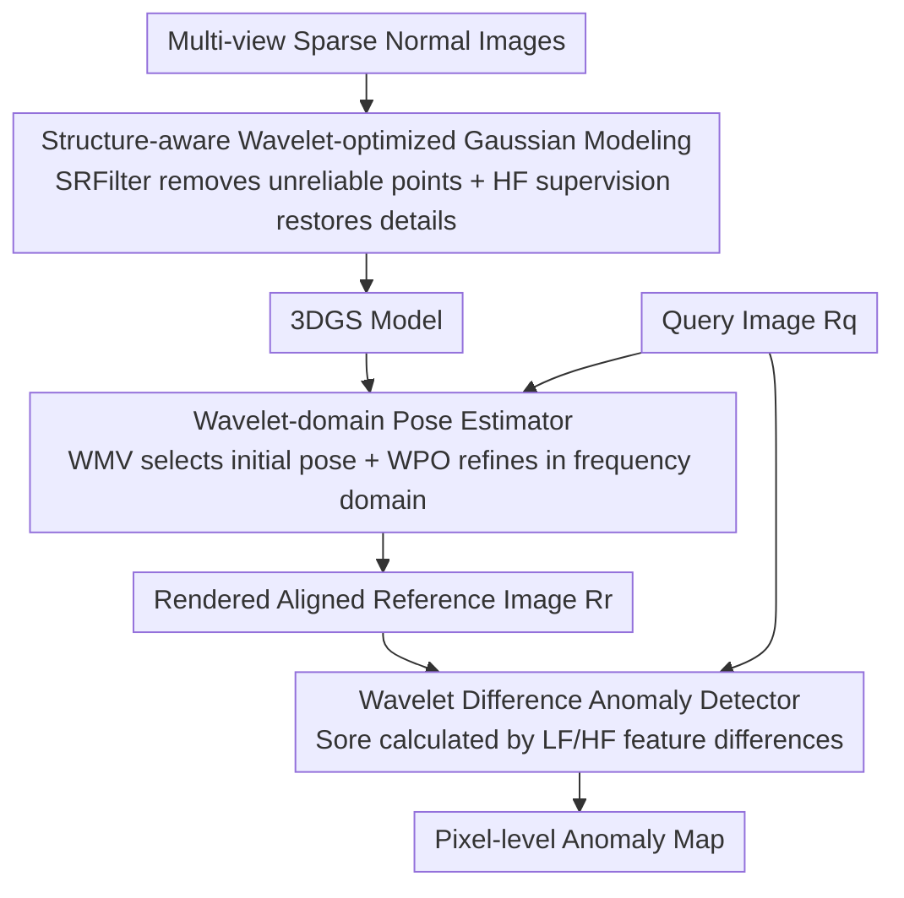

# Wavelet-Driven 3D Anomaly Detection under Pose-Agnostic and Sparse-View

**Conference**: CVPR 2026  
**Paper**: [CVF Open Access](https://openaccess.thecvf.com/content/CVPR2026/html/Shao_Wavelet-Driven_3D_Anomaly_Detection_under_Pose_Agnostic_and_Sparse-View_CVPR_2026_paper.html)  
**Code**: TBD  
**Area**: 3D Vision / Industrial Anomaly Detection  
**Keywords**: Pose-agnostic Anomaly Detection, Sparse-View, Wavelet Transform, 3D Gaussian Splatting, Frequency Domain Localization

## TL;DR
Addressing the issues of overfitting and pose misalignment in Pose-Agnostic Anomaly Detection (PAD) due to insufficient observations in sparse-view scenarios, this paper proposes Wave-Pose3D. The method migrates 3D Gaussian reconstruction, pose estimation, and anomaly scoring into the wavelet frequency domain, utilizing low frequencies for global structure and high frequencies for details. SOTA performance is achieved under 10% and 20% sparse-view conditions.

## Background & Motivation
**Background**: Pose-agnostic Anomaly Detection (PAD) addresses 3D defect localization when the pose of the test image is unknown. Leading approaches involve training a 3D representation (NeRF or 3D Gaussian Splatting) using multi-view normal images, performing pose estimation on the query image, and finally calculating anomaly scores by comparing the rendered image with the query image in the spatial domain. Recent works like SplatPose, IGSPAD, and PIAD rely on 3DGS for fast and high-quality reconstruction and rendering.

**Limitations of Prior Work**: Existing methods assume the availability of **dense multi-view** inputs, which are expensive and impractical in industrial settings. When reduced to 10%–20% views, the pipelines fail—sparse observations cause 3DGS to overfit, leading to lost geometric details and incomplete 3D models. Simultaneously, reliable keypoint correspondences decrease, amplifying pose estimation errors and causing rendering artifacts, which results in inaccurate anomaly localization.

**Key Challenge**: The three steps of the standard PAD paradigm (representation building, pose estimation, and anomaly scoring) are **all conducted in the spatial domain**. The spatial domain is highly sensitive to textureless regions, local ambiguities, and slight pose misalignments—issues that are masked by redundant information in dense views but exposed in sparse ones.

**Goal**: To achieve complete reconstruction, accurate pose estimation, and robust anomaly localization under sparse-view conditions.

**Key Insight**: The authors observe that the wavelet transform decomposes an image into one low-frequency component (LL, capturing global structure) and three high-frequency components (LH/HL/HH, capturing horizontal/vertical/diagonal details), naturally providing joint spatial-frequency localization. Low frequencies are insensitive to noise and misalignment, making them suitable for global alignment, while high frequencies precisely capture edge textures, suitable for detail restoration and detecting minor defects. Sparse views lack structural stability and detail fidelity, which aligns with the strengths of low and high frequencies, respectively.

**Core Idea**: Transition all three stages of PAD from the spatial domain into the **wavelet frequency domain**. Using low-frequency components for robust structural alignment and high-frequency components for detail restoration and defect highlighting solves the issues of overfitting, pose misalignment, and fragile localization simultaneously.

## Method

### Overall Architecture
Wave-Pose3D takes several multi-view normal images $\{R^i_c\}_{i=1}^N$ as input and outputs a pixel-level anomaly map for the query image $R_q$. The pipeline consists of three sequential modules: **SWGM** builds a 3DGS representation that resists overfitting and preserves detail; **WPE** estimates the pose of the query image in the wavelet domain to render an aligned reference image $R_r$; and **WDAD** compares $R_r$ with $R_q$ in the wavelet domain to produce anomaly scores. All components share the philosophy of "low frequency for structure, high frequency for detail."

### Key Designs

**1. Structure-aware Wavelet-optimized Gaussian Modeling (SWGM): Anti-overfitting and Detail-preserving in Sparse Views**

In sparse views, 3DGS tends to fit noise points, leading to structural incompleteness. SWGM addresses this with two mechanisms. First is **Structure-aware Region Filtering (SRFilter)**, which calculates a "retention score" for each Gaussian point based on structural complexity and depth consistency. Structural complexity is measured by the variance of Gaussian point coordinates, $s_{var}=\frac{\|v\|_2}{\max(\|v\|_2+\epsilon)}$ where $v=\mathrm{Var}(X)$; higher variance suggests volatile geometry or noise. Depth consistency $s_{depth,i}=\frac{d_i-\min(d)}{\max(d)-\min(d)+\epsilon}$ normalizes the distance to the camera center. The retention score is $r_i=\omega\cdot s_{depth,i}+(1-\omega)\cdot s_{low,i}$, where $s_{low,i}=(1-s_{depth,i})(1-s_{var,i})$ represents a low-frequency prior. Using a cosine-annealed dropout rate $\delta_t$, the retention probability $p_i=\delta_t\cdot r_i$ suppresses unreliable points, outperforming uniform dropout.

Second is **High-frequency Detail Supervision**: A wavelet transform is applied to both rendered and ground truth images, and an L1 consistency constraint is applied to the three high-frequency components: $\mathcal{L}_{HF\text{-}cons}=\sum_{d\in\{H,V,D\}}\lambda_d\|c^{render}_d-c^{gt}_d\|_1$. This forces the model to maintain edges and textures in the frequency domain.

**2. Wavelet-domain Pose Estimator (WPE): Low Frequency for Global Alignment, High Frequency for Local Refinement**

To handle the lack of reliable features in sparse views, WPE uses a two-stage process. **Wavelet Matching Verification (WMV)** handles initialization: it filters candidates using MAE and then matches $R_q$ with candidates in the wavelet domain using EfficientLoFTR. High-frequency and low-frequency matching scores are fused as $M^i_{fusion}=\eta\cdot M^i_{HF}+(1-\eta)\cdot M^i_{LF}$ to select the initial pose $P_{init}$.

**Wavelet Pose Optimization (WPO)** handles refinement: camera poses are parameterized on the $SE(3)$ manifold. The optimization minimizes a weighted sum of low and high-frequency reconstruction losses in wavelet space: $\mathcal{L}_{opt}=\lambda_{opt}\mathcal{L}^{lf}_{opt}+(1-\lambda_{opt})\mathcal{L}^{hf}_{opt}$, with a bias toward high-frequency details to ensure precise alignment.

**3. Wavelet Difference Anomaly Detector (WDAD): Frequency Domain Comparison for Misalignment Robustness**

Spatial domain anomaly scoring is vulnerable to slight misalignments. WDAD extracts multi-scale features via EfficientNet-B4 from $R_r$ and $R_q$, performs a wavelet transform to obtain $LF$ and $HF$ components, and calculates L2 differences: $S^l_L=\|LF^l_r-LF^l_q\|^2_2$ and $S^l_H=\|HF^l_r-HF^l_q\|^2_2$. The final score is $S=\alpha\cdot S^l_L+\beta\cdot S^l_H$. Frequency domain differencing decouples structural inconsistencies from texture noise, naturally suppressing spatial misalignment errors.

## Key Experimental Results

### Main Results
Evaluated on MAD_sim and PIAD_synt with 10% and 20% sparse-view sampling. Metrics are Image-level (I) and Pixel-level (P) AUROC.

| Method | MAD_sim(10%) I | MAD_sim(20%) I | PIAD_synt(10%) I | PIAD_synt(20%) I |
|------|------|------|------|------|
| OmniPoseAD | 57.0 | 59.7 | 61.9 | 69.7 |
| SplatPose | 58.4 | 60.0 | 65.3 | 71.0 |
| PIAD | 60.2 | 64.5 | 67.4 | 75.4 |
| DropGaussian | 62.3 | 67.5 | 70.1 | 77.8 |
| **Ours** | **64.6** | **69.1** | **73.2** | **82.3** |

The method leads across all settings, outperforming the second-best DropGaussian by 4.5 points in some scenarios. It also achieves superior results on the real-world PIAD_real dataset.

### Ablation Study
Breakdown on PIAD_synt(20%):

| Configuration | P AUROC | I AUROC | Description |
|------|---------|---------|------|
| Baseline | 95.89 | 71.89 | No SWGM, spatial domain pose/anomaly |
| w/o SWGM | 97.69 | 80.05 | Remove modeling module |
| w/o WPE | 97.51 | 78.65 | Use spatial domain pose |
| w/o WDAD | 97.65 | 80.20 | Use spatial domain scoring |
| **Full** | **97.75** | **82.34** | Complete model |

### Key Findings
- **WPE contributes most**: Switching to spatial pose estimation causes the largest drop in Image-AUROC (3.69 points), confirming pose misalignment as the primary bottleneck in sparse views.
- **High-frequency importance**: Optimal weights for WMV ($\eta=0.8$), WPO ($1-\lambda_{opt}=0.6$), and WDAD ($\beta=3$) all emphasize high-frequency components, indicating that detail correspondence is more discriminative than coarse structure under sparse views.
- **Pixel-level saturation**: Improvements in Pixel-AUROC are marginal compared to significant gains in Image-AUROC, suggesting the modules primarily enhance the discriminative power for image-level classification.

## Highlights & Insights
- **Unified Frequency Domain Philosophy**: Unlike methods that stack unrelated tricks, this work applies a consistent "low frequency for structure, high frequency for detail" wavelet perspective across reconstruction, pose estimation, and detection.
- **Intelligent Filtering in SRFilter**: By using coordinate variance and camera distance as proxies for geometric reliability, the method implements "weighted soft pruning" for 3DGS, which is more effective than random dropout for sparse reconstruction.
- **Robustness of Frequency Domain Differencing**: Performing comparisons in wavelet space naturally suppresses pixel-wise errors caused by slight pose offsets, a common issue in render-and-compare frameworks.

## Limitations & Future Work
- **Reliance on Synthetic Data**: Most evaluations use MAD_sim and PIAD_synt. Generalization to real-world industrial noise remains a challenge due to pose errors in real datasets.
- **Pixel-level Bottleneck**: The impact on boundary accuracy for defects is limited, as shown by the saturated Pixel-AUROC.
- **Fixed Wavelet Base**: Only the Haar wavelet was utilized; higher-order wavelets or learnable frequency decompositions could be explored.

## Related Work & Insights
- **vs OmniPoseAD**: OmniPoseAD utilizes NeRF, which is slower to train and optimize. Wave-Pose3D uses 3DGS and frequency-domain operations for better efficiency and stability in sparse views.
- **vs SplatPose / PIAD**: These methods assume dense views and operate in the spatial domain. Wave-Pose3D specializes in sparse scenes by introducing wavelet-based processing.
- **vs DropGaussian**: While DropGaussian focuses on sparse reconstruction, it can produce artifacts. Wave-Pose3D’s SRFilter and high-frequency supervision provide cleaner surfaces and more accurate localization.

## Rating
- Novelty: ⭐⭐⭐⭐ Unified wavelet integration across three PAD stages specialized for sparse views.
- Experimental Thoroughness: ⭐⭐⭐⭐ Extensive ablations and multi-dataset testing, though real-world data remains challenging.
- Writing Quality: ⭐⭐⭐⭐ Clear motivation, complete formulations, and high-quality visualizations.
- Value: ⭐⭐⭐⭐ Addresses the real-world pain point of sparse-view industrial detection with reusable frequency-domain insights.

<!-- RELATED:START -->

## Related Papers

- [\[CVPR 2026\] Multi-view Crowd Tracking Transformer with View-Ground Interactions Under Large Real-World Scenes](multi-view_crowd_tracking_transformer_with_view-ground_interactions_under_large_.md)
- [\[CVPR 2026\] GS-CLIP: Zero-shot 3D Anomaly Detection by Geometry-Aware Prompt and Synergistic View Representation Learning](gs-clip_zero-shot_3d_anomaly_detection_by_geometry-aware_prompt_and_synergistic_.md)
- [\[CVPR 2026\] Reasoning-Driven Anomaly Detection and Localization with Image-Level Supervision](reasoning-driven_anomaly_detection_and_localization_with_image-level_supervision.md)
- [\[CVPR 2026\] Geometry-Aligned and Anomaly-Aware Reconstruction for 3D Anomaly Detection](geometry-aligned_and_anomaly-aware_reconstruction_for_3d_anomaly_detection.md)
- [\[ICCV 2025\] VOccl3D: A Video Benchmark Dataset for 3D Human Pose and Shape Estimation under Real Occlusions](../../ICCV2025/object_detection/voccl3d_a_video_benchmark_dataset_for_3d_human_pose_and_shape_estimation_under_r.md)

<!-- RELATED:END -->
