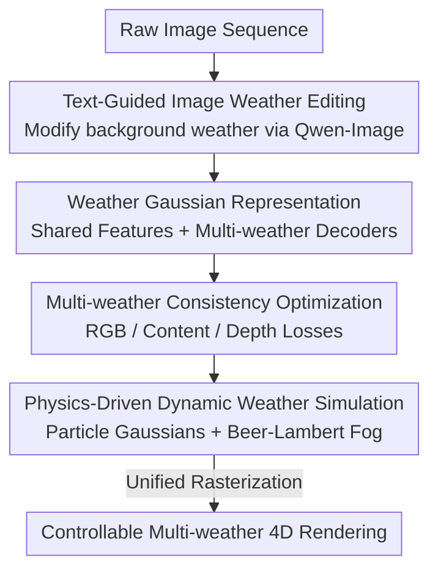

# WeatherCity: Urban Scene Reconstruction with Controllable Multi-Weather Transformation

**Conference**: CVPR 2026  
**Paper**: [CVF Open Access](https://openaccess.thecvf.com/content/CVPR2026/html/Wu_WeatherCity_Urban_Scene_Reconstruction_with_Controllable_Multi-Weather_Transformation_CVPR_2026_paper.html)  
**Code**: https://github.com/IRMVLab/WeatherCity  
**Area**: 3D Vision / Urban Scene Reconstruction  
**Keywords**: 4D Reconstruction, Gaussian Splatting, Multi-weather Editing, Autonomous Driving Simulation, Physical Particle Simulation

## TL;DR
WeatherCity integrates "2D image weather editing + a multi-weather Gaussian representation with shared features + physics-driven particle simulation" into a unified framework. This allows 4D autonomous driving scenes to undergo controllable switching and intensity adjustment for sunny, rainy, snowy, and foggy conditions after reconstruction. It leads in metrics such as CLIP-S and Sem-CS on Waymo/nuScenes datasets and achieves a rendering speed of 25.67 FPS.

## Background & Motivation

**Background**: Closed-loop simulation and end-to-end training for autonomous driving require "editable high-fidelity 4D scenes" that can both replicate real road conditions and generate extreme conditions (rain/snow/fog) unseen during training. NeRF/3DGS and street-view oriented methods like StreetGaussians and OmniRe have achieved realistic reconstruction of dynamic urban scenes.

**Limitations of Prior Work**: Existing reconstruction methods "can only replicate the weather at the time of data acquisition"—data collected on a sunny day remains sunny forever in the reconstruction. Conversely, 2D image-level weather editing (such as WeatherGAN or ControlNet/InstructPix2Pix) suffers from two major flaws: first, **content hallucinations**, where vehicles are distorted, lane lines are shifted, and buildings are deformed; second, **temporal flickering** caused by frame-independent editing, which fails to maintain geometric consistency in 4D scenes. Current 3D-level editing (ClimateNeRF, WeatherGS) either only supports deraining or simulates **static** weather effects like accumulation of snow/water, failing to model dynamic phenomena like falling rain or snow.

**Key Challenge**: The "appearance" of weather is entangled with the "geometric structure" of the scene. Editing appearance in 2D disrupts geometric consistency, while reconstruction methods bake the weather appearance from the acquisition phase into the geometry, preventing decoupled control.

**Goal**: Build a unified framework that "lifts" 2D image editing to 4D simulation, simultaneously satisfying three requirements: reconstruction, editing, and simulation.

**Key Insight**: Decouple "intrinsic scene texture" from "weather-related appearance" using shared appearance features and multiple weather-specific decoders. A separate physical particle system is then used to supplement dynamic falling rain and snow which 2D editing cannot produce.

**Core Idea**: Color a set of Gaussians with shared geometry and features through multiple "weather decoders," ensuring structural consistency with interchangeable appearances. Dynamic weather is handled by physics-driven particle Gaussians, integrated into a single Gaussian Scene Graph for unified rendering.

## Method

### Overall Architecture

Given a raw captured image sequence, WeatherCity performs joint 4D dynamic reconstruction and controllable weather editing through four modules. First, **Text-Guided Image Weather Editing** uses Qwen-Image to modify the original images into target weathers (rain/snow/fog) to create multi-weather supervision. Next, the **Weather Gaussian Representation** uses shared features and multi-weather decoders to decouple geometry/texture from weather appearance, ensuring structural consistency across weathers. Then, **Consistency Optimization** uses RGB loss, content consistency loss, and depth loss to align rendered images with original and edited images, suppressing jitter introduced by 2D frame-wise editing. Finally, **Physics-Driven Dynamic Weather Simulation** uses particle Gaussians to simulate falling rain/snow and the Beer–Lambert law for fog, integrating weather particles as nodes into the Gaussian Scene Graph for unified rendering.

### Key Designs

**1. Text-Guided Image Weather Background Editing: Offloading Supervision Generation to Foundation Models**

4D reconstruction/editing requires "images under target weather" as supervision, which are absent in real datasets. The authors leverage Qwen-Image, a powerful text-guided editing model. For each target weather, a prompt is designed to describe the weather effect (e.g., "a rainy city street") while **explicitly emphasizing the strict preservation of original scene content**. Frame-wise editing of the raw sequence $\{I^{raw}_t\}_{t=1}^N$ yields multi-weather image sequences $\{I^w_t \mid w \in \mathcal{W}\}$. This step provides "appearance references" but inherently suffers from frame-to-frame inconsistency, which the content consistency loss later addresses.

**2. Weather Gaussian Representation: Decoupling Geometry and Appearance via Shared Features and Decoders**

As the core of the paper, this design addresses the entanglement of weather appearance and geometry. Following the dynamic Gaussian Scene Graph of OmniRe (sky, background, rigid vehicles, non-rigid pedestrians), each Gaussian primitive is re-parameterized as:

$$G_i = \{\mu_i, s_i, r_i, o_i, f_i\}$$

where $\mu_i\in\mathbb{R}^3$ is the center, $s_i$ is scale, $r_i\in\mathbb{R}^4$ is the rotation quaternion, $o_i\in[0,1]$ is opacity, and crucially, $f_i\in\mathbb{R}^d$ is a **shared appearance feature** encoding intrinsic texture and material. For each weather $w$, a weather-specific MLP $\phi_w$ decodes the same $f_i$ into different colors $c_i^w = \phi_w(f_i)$. Thus, the shared geometry $\{\mu_i,\Sigma_i,o_i\}$ paired with different weather colors yields multi-weather Gaussians. During rendering, Gaussians are projected to the camera, 2D covariances are calculated via $\Sigma' = JW\Sigma W^\top J^\top$, and alpha blending is performed by depth sorting to obtain $\hat I_t^w$ and depth $\hat D_t$. This design ensures that geometric parameters are shared across all weathers, making the **structure naturally consistent**, while switching weather only requires changing the decoder.

**3. Multi-weather Consistency Optimization: Correcting 2D Editing Jitter via Content Loss**

Since Qwen-Image edits frames independently, it introduces temporal flickering and local geometric distortions. A composite loss aligns rendered results with both raw and edited images. The RGB loss calculates L1 + SSIM for original and edited conditions:

$$\mathcal{L}_{rgb} = \sum_{t=1}^N \sum_{w \in \mathcal{W}\cup\{raw\}} (1-\lambda)\lVert \hat I_t^w - I_t^w \rVert_1 + \lambda(1-\mathrm{SSIM}(\hat I_t^w, I_t^w))$$

The **Content Consistency Loss** $\mathcal{L}_{cc}$ is critical: it utilizes a pre-trained VGG network $\Phi$ to extract content features, pulling the rendered features of weather $w$ back toward the raw weather features: $\mathcal{L}_{cc} = \sum_t\sum_{w}\lVert \Phi(\hat I_t^w) - \Phi(I_t^{raw})\rVert$. This enforces "change weather, not content"—correcting areas distorted by 2D editing back to the original structure. Combined with a depth loss $\mathcal{L}_{depth} = \sum_t \lVert \hat D_t - D_t \rVert$ supervised by sparse LiDAR depth, as well as opacity and regularization terms, the total loss is $\mathcal{L}_{total} = \mathcal{L}_{rgb} + \lambda_{cc}\mathcal{L}_{cc} + \lambda_{depth}\mathcal{L}_{depth} + \lambda_{opacity}\mathcal{L}_{opacity} + \mathcal{L}_{reg}$.

**4. Physics-Driven Dynamic Weather Simulation: Particle Gaussians and Beer–Lambert Fog**

The previous steps solve the "background weather appearance," but dynamic particles like falling rain and snow cannot be rendered consistently by 2D editing. The authors model particles using Gaussian ellipsoids: raindrops use a single elongated Gaussian to capture vertical stretch and motion blur; snowflakes use three concentric Gaussian ellipsoids of the same scale at 60° intervals to form a crystal shape. Particles are initialized within a spatial bounding volume over the scene, with position, rotation, and opacity adjusted to control weather intensity. Movement is updated per frame via physical velocity:

$$\mathbf{v}_{rain} = \mathbf{v}_{fall} + \mathbf{v}_{wind}, \quad \mathbf{v}_{snow} = \mathbf{v}_{fall} + \mathbf{v}_{wind} + \mathbf{v}_{turb}$$

where $\mathbf{v}_{fall}$ is constant falling speed, $\mathbf{v}_{wind}$ is global wind (intensity/angle/direction), and $\mathbf{v}_{turb}$ is random turbulence added ONLY to snowflakes (creating non-linear falling). **Unified Rendering** is achieved by integrating rain/snow particle Gaussians as weather nodes $N_{rain}/N_{snow}$ directly into the dynamic Gaussian Scene Graph, allowing standard rasterization with scene Gaussians. This naturally ensures correct occlusion and blending. Fog is simulated using a Beer–Lambert depth-aware model: $c^{fog}_{render} = f\,c_{render} + (1-f)c_{fog}$, where transmittance is $f = e^{-d_f d_{render}}$. Adjusting $c_{fog}$ and fog density $d_f$ controls the color and thickness of the fog.

### Loss & Training
The shared Gaussian feature dimension is 32. Weather MLP decoders consist of two linear layers with ReLU and a Sigmoid output for RGB. Training uses the Adam optimizer for 30,000 steps at a learning rate of $10^{-4}$. Loss weights are $\lambda_{cc}=1.0$, $\lambda_{depth}=0.01$, $\lambda_{SSIM}=0.2$. Content loss utilizes the relu4_1 features of VGG-19. Dynamic weather employs 40,000 rain particles and 16,000 snow particles. Fog parameters are $c_{fog}=[0.80, 0.80, 0.85]$ and $d_f=0.2$. All Gaussians are rasterized via a standard 3DGS pipeline on an RTX 8000 GPU.

## Key Experimental Results

### Main Results
Evaluations were conducted on 5 dynamic scenes from Waymo Open Dataset and nuScenes (30 frames each). Comparisons were made against image editing (ControlNet, TurboEdit), video editing (FRESCO), and the editing base Qwen-Image. Metrics: CLIP-S (content preservation), CLIP-DS (text alignment), Sem-CS (semantic consistency via weighted segmentation IoU).

| Dataset | Method | CLIP-S↑ | CLIP-DS↑ | Sem-CS↑ |
|--------|------|---------|----------|---------|
| Waymo | ControlNet | 0.634 | 0.238 | 0.695 |
| Waymo | TurboEdit | 0.830 | 0.220 | 0.801 |
| Waymo | FRESCO | 0.720 | 0.213 | 0.824 |
| Waymo | Qwen-Image | 0.785 | 0.279 | 0.843 |
| Waymo | **WeatherCity** | **0.872** | **0.303** | **0.915** |
| nuScenes | Qwen-Image | 0.804 | 0.279 | 0.902 |
| nuScenes | **WeatherCity** | **0.870** | **0.302** | **0.968** |

The significant lead in CLIP-S and Sem-CS demonstrates superior content and semantic preservation. Qualitatively, baselines exhibited vehicle distortion, hallucinated structures, and lane misalignment, and failed to produce depth-aware fog. Furthermore, being based on the dynamic Gaussian Scene Graph, the framework supports object-level editing (e.g., removing all cars except the central one while changing to snow).

The rendering speed shows a massive gap over baselines:

| Method | Speed (FPS)↑ |
|------|-------------|
| ControlNet | 0.033 |
| TurboEdit | 0.097 |
| FRESCO | 0.142 |
| **WeatherCity** | **25.67** |

### Ablation Study
| Configuration | CLIP-S↑ | CLIP-DS↑ | Sem-CS↑ | Description |
|------|---------|----------|---------|------|
| a. Baseline (Qwen-Image only) | 0.735 | 0.276 | 0.891 | No proposed modules |
| b. w/o WGS (Standard 3DGS) | 0.781 | 0.212 | 0.894 | No Gaussian decoupling |
| c. w/o $\mathcal{L}_{cc}$ | 0.817 | 0.289 | 0.916 | No jitter correction |
| **WeatherCity (Full)** | **0.880** | **0.320** | **0.943** | Full model |

### Key Findings
- **Weather Gaussians (WGS) are vital for structural decoupling**: Removing WGS caused CLIP-DS to drop from 0.320 to 0.212, as the model failed to separate intrinsic texture from weather appearance (Fig.6b). This confirms that "shared features + weather-specific decoders" successfully isolate scene attributes from transient weather.
- **Content consistency loss ensures semantic/geometric consistency**: Without it, consistency metrics declined and local artifacts from Qwen-Image's frame-wise editing remained. VGG feature alignment effectively pulls these distortions back to the original structure.
- **Physical particle simulation provides temporal coherence**: Compared to dynamic weather prompts (e.g., "heavy rain falling, snow drifting with wind"), Qwen-Image generated inconsistent frames, whereas physical motion equations ensured smooth transitions (Fig.7).

## Highlights & Insights
- **"Shared geometry + multi-decoders" is a clean decoupling paradigm**: By keeping geometry shared and changing only color, cross-weather structural consistency is naturally guaranteed. Switching weather is simply changing a decoder, not a scene. This can be extended to any controllable editing (day/night, seasons, material styles).
- **Treating dynamic weather as nodes in the scene graph** for unified rasterization avoids separate passes and ensures correct occlusion/blending. This is the fundamental reason for achieving real-time 25.67 FPS with physical consistency.
- **The strategy of "using 2D editing for supervision and 3D consistency loss for correction"** is a practical combination. it leverages the editing power of foundation models while using $\mathcal{L}_{cc}$ to suppress their frame-wise inconsistency, preventing content hallucinations.

## Limitations & Future Work
- **Weather quality is capped by Qwen-Image**: Appearance supervision relies on a single editing base; bias or distortions in the base are propagated to 3D. $\mathcal{L}_{cc}$ only corrects local inconsistencies, not systemic incorrect appearances.
- **Physical particles follow manual rules**: Shapes, motion equations, and parameters (density, fog density) are manually set and may not perfectly match meteorological statistics. Intensity control remains empirical.
- **Evaluation scale is limited**: Only 5 scenes × 30 frames were tested. Metrics like CLIP-S/DS/Sem-CS focus on semantic alignment; direct verification of downstream closed-loop simulation effectiveness is missing.
- Future Directions: Include learnable particle parameters calibrated from real weather data; incorporate multiple editing bases to reduce bias; perform closed-loop validation (synthetic training for real extreme weather testing).

## Related Work & Insights
- **vs StreetGaussians / OmniRe**: These excel at dynamic urban reconstruction but only perform "object-level" editing. Weather is fixed to acquisition conditions. This work utilizes the scene graph from OmniRe but adds decoupling for weather.
- **vs ControlNet / InstructPix2Pix / TurboEdit (2D Editing)**: These edit weather based on text but lack temporal consistency and depth-aware effects. This work lifts 2D editing to temporally consistent 4D through 3D representation and consistency losses.
- **vs ClimateNeRF / WeatherGS (3D Editing)**: ClimateNeRF only handles static weather (snow/water accumulation); WeatherGS focuses on removing weather artifacts. This work supports both background appearance and dynamic foreground particles with fine-grained control.
- **vs Fiebelman et al. (Gaussian-Particle hybrid)**: They primarily focus on foreground particles without synchronous background editing. This work provides synchronized background and foreground control for higher realism.

## Rating
- Novelty: ⭐⭐⭐⭐ The combination of "shared features + multi-weather decoders" and "2D editing for supervision with 3D correction" is a strong new strategy, though components are clever assemblies of existing tech.
- Experimental Thoroughness: ⭐⭐⭐⭐ Multi-dataset, quantitative/qualitative/ablation/speed results are provided. Specific module contributions are clear, though scene count is relatively small.
- Writing Quality: ⭐⭐⭐⭐ Clear structure, complete formulas, and logical flow.
- Value: ⭐⭐⭐⭐ Directly addresses the extreme weather data gap in autonomous driving simulation. The combination of real-time rendering, controllable intensity, and object-level editing is highly practical. Code is open-sourced.

<!-- RELATED:START -->

## Related Papers

- [\[CVPR 2026\] PrITTI: Primitive-based Generation of Controllable and Editable 3D Semantic Urban Scenes](pritti_primitive-based_generation_of_controllable_and_editable_3d_semantic_urban.md)
- [\[CVPR 2026\] NimbusGS: Unified 3D Scene Reconstruction under Hybrid Weather](nimbusgs_unified_3d_scene_reconstruction_under_hybrid_weather.md)
- [\[CVPR 2026\] P2GS: Physical Prior-guided Gaussian Splatting for Photometrically Consistent Urban Reconstruction](p2gs_physical_prior-guided_gaussian_splatting_for_photometrically_consistent_urb.md)
- [\[CVPR 2026\] Coherent Human-Scene Reconstruction from Multi-Person Multi-View Video in a Single Pass](coherent_humanscene_reconstruction_from_multiperso.md)
- [\[CVPR 2026\] BRepGaussian: CAD Reconstruction from Multi-View Images with Gaussian Splatting](brepgaussian_cad_reconstruction_from_multi-view_images_with_gaussian_splatting.md)

<!-- RELATED:END -->
