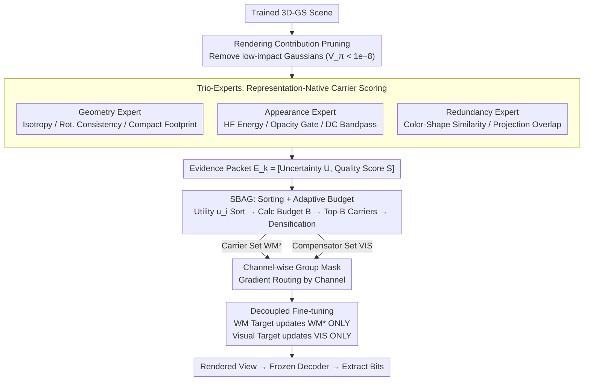

# Where, What, Why: Toward Explainable 3D-GS Watermarking

**Conference**: CVPR2026  
**arXiv**: [2603.08809](https://arxiv.org/abs/2603.08809)  
**Authors**: Mingshu Cai (Waseda University), Jiajun Li (Southeast University), Osamu Yoshie, Yuya Ieiri, Yixuan Li (NTU)
**Code**: Not open-sourced  
**Area**: 3D Vision  
**Keywords**: 3D Gaussian Splatting, Digital Watermarking, Copyright Protection, Explainability, Robust Embedding

## TL;DR

Ours proposes a representation-native 3D-GS watermarking framework that selects carriers via Trio-Experts (**where**), controls gradients using a Channel-wise Group Mask (**what**), and achieves auditable attribution through decoupled fine-tuning (**why**). It surpasses Prev. SOTA in both rendering quality (PSNR +0.83 dB) and bit accuracy (+1.24%).

## Background & Motivation

**Background**: 3D-GS has become the mainstream paradigm for 3D content creation due to its explicit parameterization, real-time rendering, and high fidelity. It is widely used in film, gaming, autonomous driving, and digital humans.  
**Limitations of Prior Work**: Direct editability of Gaussian parameters introduces security risks: attackers can easily replicate models, tamper with content, or strip authorship for illegal redistribution. Existing radiance field watermarking methods (WateRF, 3DGSW, GuardSplat) face two core gaps in explicit 3D-GS representations:
1.  **Carrier Selection**: Difficulty in selecting watermark carriers from massive heterogeneous Gaussian primitives based on visibility, frequency cues, and geometric/appearance stability.
2.  **Robust & Invisible Embedding**: Challenges in embedding robust watermarks without degrading visual quality, ensuring extraction remains viable after perturbations like cropping, compression, or format conversion.

## Core Problem

To uniformly solve three key questions: **Where** (which Gaussians to watermark), **What** (what to write and how to control update magnitudes), and **Why** (the rationale for carrier selection/explainable attribution).

## Method

### Overall Architecture

3D-GS explicitly encodes scenes into editable Gaussians, which facilitates editing but allows easy tampering. The framework operates in three phases:  
1. **Initialization**: Pruning redundant Gaussians by rendering contribution, extracting carrier priors via Trio-Experts, and selecting/densifying carriers via SBAG.  
2. **Decoupled Fine-tuning**: Routing gradients of watermark carriers and visual compensators independently using a Channel-wise Group Mask.  
3. **Inference**: Extracting watermark bits from rendered views via a frozen decoder.  
Pruning follows the 3D-GSW strategy: introducing temporary color $C'$, using the auxiliary loss gradient $V_\pi = \partial L_\pi^{aux}/\partial C'$ as a contribution score, and removing low-impact Gaussians where $V_\pi < 10^{-8}$.

### Key Designs

**1. Trio-Experts: Carrier Scoring in 3D Parameter Space**

Prior methods selected carriers using image-domain gradients or HF heuristics, which vary across viewpoints. Trio-Experts are **representation-native**, anchoring evidence in 3D-GS parameter space. Parameters are grouped into $\mathcal{C}_{geo}=\{\mathbf{x}, \mathbf{s}, \mathbf{q}\}$, $\mathcal{C}_{app}=\{\alpha, \mathbf{h}^{(0)}, \mathbf{h}^{(\geq 1)}\}$, and $\mathcal{C}_{red}=\{\mathbf{x}, \mathbf{s}, \mathbf{q}, \mathbf{h}^{(0)}\}$. Evaluation is performed via $k$-NN neighborhoods $\mathcal{N}_k(i)$:
- **Geometry Expert**: Calculates isotropy $\text{Iso}_i$, neighborhood quaternion consistency $\text{RotCons}_i$, and compact footprint $\overline{fp}_i$.
- **Appearance Expert**: Measures AC high-frequency energy ratio $\rho_i^{hf}$, bilateral opacity gate $g(\alpha_i)$, and DC intensity bandpass $c_i$ for cross-view consistency.
- **Redundancy Expert**: Estimates substitutability using color-shape similarity $r_{ij}$ and projection overlap $w_{ij}$.
Each expert maps features $z_k(i)$ to an **Evidence Packet** $E_k(i)=[U_k(i), S_k(i)]$, decoupling quality $S_k$ from uncertainty $U_k$ (derived from neighborhood dispersion).

**2. SBAG: Sorting and Budgeting for Adaptive Carrier Selection**

SBAG avoids fixed-ratio selection. It first **sorts** by point-level utility $u_i=(R_1(i)\cdot R_2(i)\cdot R_3(i))^{1/3}$, where $R_k(i)$ is a surrogate score $\text{clip}(S_k(i)-\beta U_k(i), 0, 1)$. Then, it performs a **single-pass rendering** to obtain visibility $v_i$ and crowding factor $\eta$, calculating an **adaptive budget**: $B=\lceil M/(\kappa_0\cdot\bar{v}\cdot\eta)\rceil$ for message length $M$. After selecting the top-$B$ initial set $\mathcal{WM}_0$, it expands to $\mathcal{WM}_{parent}$ via neighbor recruitment. Each parent Gaussian is densified into $N_s$ children: one for the watermark carrier set $\mathcal{WM}_\star$, and the rest for the visual compensator set $\mathcal{VIS}$.

**3. Channel-wise Group Mask: Gradient Routing to Decouple Quality and Watermark**

To prevent optimization conflict, the Group Mask computes two masks across five parameter groups $g$:
- **VIS Mask** $m_g^{vis}$: Average channel weights on compensators, clipped with a minimum update floor $\text{floor}_g$.
- **WM Mask** $m_g^{wm}$: Median channel weights on carriers.
Gradients are routed as:
$$\nabla_{\theta_i^g} \mathcal{L} = \begin{cases} m_g^{wm}(i) \nabla_{\theta_i^g} \mathcal{L}_{wm}, & i \in \mathcal{WM}_\star \\ m_g^{vis}(i) \nabla_{\theta_i^g} \mathcal{L}_{vis}, & i \in \mathcal{VIS} \end{cases}$$
This orthogonal gradient application eliminates optimization interference.

### Loss & Training

Decoupled fine-tuning applies distinct objectives to specific sets:
- **Visual Target** (VIS only): $\mathcal{L}_{vis}=\lambda_{rec}\mathcal{L}_{rec}+\lambda_{lpips}\mathcal{L}_{lpips}+\lambda_{wav}^{high}\mathcal{L}_{wav}^{high}$, where $\mathcal{L}_{wav}^{high}$ penalizes DWT high-frequency subbands.
- **Watermark Target** ($\mathcal{WM}_\star$ only): $\mathcal{L}_{wm}=\lambda_{wm}^{clean}\mathcal{L}_{wm}^{clean}+\lambda_{wm}^{eot}\mathcal{L}_{wm}^{eot}+\lambda_{wav}^{low}\mathcal{L}_{wav}^{low}$. It employs EOT (Expectation Over Transformation) for robustness against blur, rotation, scaling, etc. Watermarks are embedded only in DWT low-frequency (LL) subbands.

## Key Experimental Results

### Main Results

| Method | 32-bit Acc↑ | PSNR↑ | SSIM↑ | 48-bit Acc↑ | PSNR↑ | 64-bit Acc↑ | PSNR↑ |
|---|---|---|---|---|---|---|---|
| WateRF+3D-GS | 93.28 | 30.57 | 0.954 | 84.39 | 30.06 | 74.92 | 25.73 |
| GuardSplat | 95.58 | 35.32 | 0.978 | 93.29 | 33.36 | 90.14 | 32.25 |
| 3D-GSW | 97.22 | 35.15 | 0.977 | 93.59 | 33.26 | 91.31 | 32.52 |
| **Ours** | **98.46** | **35.98** | **0.982** | **94.29** | **33.45** | **91.65** | **32.71** |

At 32-bit, PSNR shows a **Gain** of +0.83 dB (vs 3D-GSW), with bit accuracy improving by +1.24%.

### Image-level Robustness (32-bit)

| Attack Type | WateRF | GuardSplat | 3D-GSW | **Ours** |
|---|---|---|---|---|
| No Attack | 93.28 | 95.58 | 97.22 | **98.46** |
| Gauss Noise | 78.12 | 90.11 | 83.71 | **91.22** |
| Rotation | 81.47 | 95.87 | 88.05 | **96.18** |
| JPEG 50% | 82.03 | 89.92 | 92.54 | **92.95** |
| Combined | 64.73 | 88.64 | 90.96 | **91.30** |

Ours achieves the best performance across all attack types, particularly in noise and rotation scenarios.

### Ablation Study

SBAG, Group Mask, and Decoupled Finetuning are all critical. Removing all components drops accuracy to 94.70% and PSNR to 30.00 dB. The adaptive budget achieves the optimal balance between accuracy and storage (98.46%/178MB).

## Highlights & Insights

1.  **Novelty**: Decisions are anchored in 3D-GS parameter space, ensuring view consistency without relying on pixel-domain heuristics.
2.  **Architecture**: A three-layer decoupled system (Experts $\to$ Gating $\to$ Routing) provides clear explainability.
3.  **Audition**: Per-Gaussian attribution reveals exactly where watermarks are embedded and why those carriers were chosen.
4.  **Mechanism**: Scene-aware carrier estimation ($\kappa_{eff}$) prevents over- or under-utilization of resources.
5.  **Quality**: Negligible rendering loss (PSNR 35.98 dB, SSIM 0.982 at 32-bit), nearly identical to unwatermarked models.

## Limitations & Future Work

1.  Sensitivity to frequency-domain loss weights requires careful tuning.
2.  Performance upper bound is limited by the fixed pre-trained HiDDeN decoder.
3.  Additional computational overhead for $k$-NN and two-pass backpropagation is not fully quantified.
4.  Verification on dynamic scenes is mentioned but lacks experimental data.
5.  Robustness against targeted adversarial attacks remains unexplored.

## Related Work & Insights

- **Vs. WateRF**: NeRF-based frequency watermarking fails to maintain accuracy under 3D-GS perturbations without EOT (Combined attack: 64.73%).
- **Vs. GuardSplat**: Relies heavily on CLIP decoders; sensitivity to complex perturbations is higher than ours.
- **Vs. 3D-GSW**: Lacks carrier-compensator decoupling, leading to sub-optimal quality/robustness trade-offs.

## Rating

- Novelty: ⭐⭐⭐⭐
- Experimental Thoroughness: ⭐⭐⭐⭐
- Writing Quality: ⭐⭐⭐⭐
- Value: ⭐⭐⭐⭐

<!-- RELATED:START -->

## Related Papers

- [\[CVPR 2026\] Write Where It Matters: Policy-Guided Watermarks for 3D Gaussian Splatting](write_where_it_matters_policy-guided_watermarks_for_3d_gaussian_splatting.md)
- [\[CVPR 2026\] Robust3DGSW: Toward Robust Watermarking for Quantization-Aware 3D Gaussian Splatting](robust3dgsw_toward_robust_watermarking_for_quantization-aware_3d_gaussian_splatt.md)
- [\[AAAI 2026\] Can Protective Watermarking Safeguard the Copyright of 3D Gaussian Splatting?](../../AAAI2026/3d_vision/can_protective_watermarking_safeguard_the_copyright_of_3d_gaussian_splatting.md)
- [\[CVPR 2026\] Mark4D: Temporally-Consistent Watermarking for 4D Gaussian Splatting](mark4d_temporally-consistent_watermarking_for_4d_gaussian_splatting.md)
- [\[CVPR 2026\] What Makes Good Synthetic Training Data for Zero-Shot Stereo Matching?](what_makes_good_synthetic_training_data_for_zero-shot_stereo_matching.md)

<!-- RELATED:END -->
