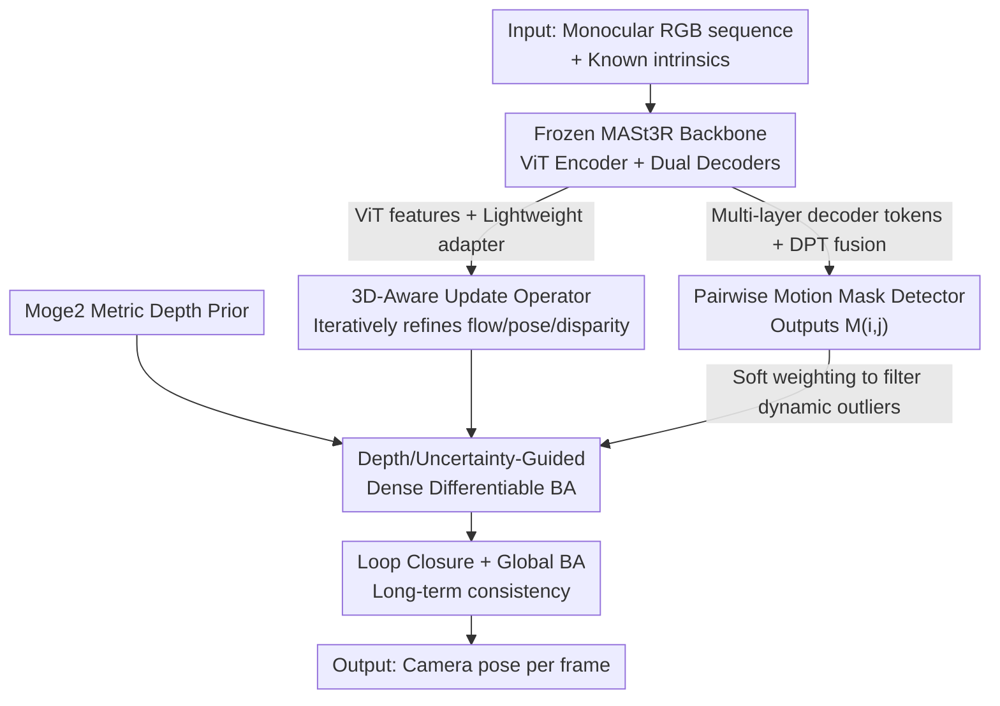

# WildPose: A Unified Framework for Robust Pose Estimation in the Wild

**Conference**: CVPR 2026  
**Paper**: [CVF Open Access](https://openaccess.thecvf.com/content/CVPR2026/html/Zheng_WildPose_A_Unified_Framework_for_Robust_Pose_Estimation_in_the_CVPR_2026_paper.html)  
**Code**: https://wildpose.github.io (Project page, code link can be found on the project page)  
**Area**: 3D Vision / Visual SLAM / Camera Pose Estimation  
**Keywords**: Monocular SLAM, Differentiable BA, Dynamic Scenes, MASt3R Features, Motion Mask

## TL;DR
WildPose grafts the robust perceptual front-end of the feed-forward 3D reconstruction model MASt3R into the differentiable bundle adjustment (BA) optimization back-end of DROID-SLAM. Paired with a high-capacity "pairwise" motion mask detector to filter out dynamic interference, it establishes a unified monocular camera pose estimation framework resilient across dynamic, static, and low-displacement short sequences.

## Background & Motivation

**Background**: Monocular camera pose estimation (SfM / SLAM) is currently dominated by two deep learning approaches: feed-forward reconstruction models (DUSt3R, MASt3R, VGGT, π³), which directly regress 3D point maps and camera parameters in a single forward pass; and differentiable optimization frameworks (DROID-SLAM), which use a learnable update operator and pass the results to a differentiable BA layer for end-to-end pose and geometry optimization.

**Limitations of Prior Work**: Both paradigms heavily assume a "static world," leading to performance collapse in the presence of moving objects. Existing dynamic-aware methods also exhibit distinct bottlenecks. Semantic segmentation-based methods (MASK-SLAM, ViPE) are fragile, limited to pre-defined categories, struggle to detect unseen dynamic objects, and are highly sensitive to segmentation quality (e.g., in sequences where a person pushes a table, the table is treated as static, causing ViPE's error to skyrocket). WildGS-SLAM relies on online training of a sequence-specific 3DGS rendering inconsistency MLP, which fails for short sequences or insufficient viewpoint coverage. MegaSaM trains a more generic motion network, but it decodes motion as an afterthought from the hidden states of an optical flow ConvGRU—this low-capacity representation is designed for propagating flow rather than segmentation, and its synthetic training corpus has limited diversity, causing domain gaps on long real-world trajectories.

**Key Challenge**: Almost no single method achieves both robust performance in dynamic scenes and no degradation in purely static ones. Methods specialized for dynamic scenes (MegaSaM, ViPE) degrade significantly on static benchmarks, yet real-world applications inevitably involve a mixture of both scenarios.

**Goal**: Develop a unified framework that is robust in high-dynamic environments while maintaining state-of-the-art (SOTA) performance in static, short-sequence, and low-displacement environments.

**Key Insight**: The authors leverage a key insight: connecting two powerful paradigms in modern 3D vision—the **rich perceptual front-end** of feed-forward models and the **end-to-end optimization back-end** of differentiable BA.

**Core Idea**: Utilizing DROID-SLAM's differentiable BA pipeline as the backbone, the method enhances it in two ways: (1) replacing the simple CNN encoder trained from scratch with frozen pre-trained MASt3R features to build a "3D-aware" update operator; (2) feeding multi-layer features from the same frozen backbone into a dedicated high-capacity motion mask detector to inject dynamic regions as soft weights into the BA optimizer.

## Method

### Overall Architecture
The input is a monocular RGB sequence $\{I_i\}_{i=1}^N$ with known intrinsic parameters, and the output is the camera pose per frame $\{\omega_i\}_{i=1}^N \in SE(3)$. The system inherits DROID-SLAM's backbone structure ("keyframe graph + iterative refinement via update operator + joint optimization using differentiable BA") but integrates a frozen MASt3R backbone at two critical components. First, its **ViT encoder features** (processed by a lightweight adapter) are passed to the update operator to serve as a 3D-aware front-end. Second, its **multi-layer decoder correspondence tokens** (fused via DPT-style layers + CNN motion head) are transformed into pairwise motion masks. These two outputs, combined with a metric depth prior provided by Moge2, are fed into a "depth and uncertainty-guided dense BA" layer to optimize the trajectory while filtering out dynamic outliers. During online inference, local BA is performed in a sliding window, complemented by loop closure and global BA to ensure long-term consistency.

### Key Designs

**1. 3D-Aware Update Operator: Replacing the CNN Front-End Trained from Scratch with Frozen MASt3R ViT Features**

The front-end of DROID-SLAM's update operator is a simple CNN trained from scratch, which only extracts weak feature maps to feed into the ConvGRU, lacking geometric priors and making it vulnerable to in-the-wild inputs. This work is the first to replace this CNN with a pre-trained MASt3R backbone, injecting strong 3D geometric prior. However, direct integration is non-trivial: MASt3R consists of a ViT encoder and two interleaved decoders (DecBlk1/DecBlk2), outputting complex, multi-scale correspondence tokens incompatible with DROID's update operator input. Furthermore, directly fusing decoder tokens with ConvGRU is too computationally expensive for training and inference. Therefore, the authors extract only the **patch features from the ViT encoder** and use a lightweight adapter (consisting of two residual convolutional layers) to map them to the local feature maps and global context required by ConvGRU. The update operator $F$ iteratively refines intermediate quantities just like in DROID:

$$(\hat{f}^{t+1}_{i,j},\ \hat{w}^{t+1}_{i,j},\ \hat{\eta}^{t+1},\ \hat{u}^{t+1}) = F(I_i, I_j, \tilde{f}^{t}_{i,j}, r^{t}_{i,j})$$

where $\hat{f}$ is the predicted optical flow, $\hat{w}$ is the optical flow confidence, $\hat{\eta}$ is the damping factor to stabilize BA, $\hat{u}$ is the disparity upsampling mask, and $r$ is the residual between the predicted flow and the geometrically induced flow $\tilde{f}$. Empirically, the authors find that among several feed-forward backbones (MASt3R, VGGT, π³), MASt3R features perform the best. This is likely because MASt3R's point map accuracy and its 2D pixel correspondence pre-training objectives are highly aligned with the update operator's target of "estimating optical flow," yielding cleaner and more relevant features than more "general-purpose" models.

**2. Pairwise Motion Mask Detector: Utilizing Multi-Layer Decoder Features from the Same Backbone for High-Capacity Dynamic Segmentation**

In static scenes, the BA objective is strictly defined by ego-motion $\tilde{f}_{ij}$. In dynamic scenes, however, the real optical flow of a moving point is a superposition of camera motion and object self-motion: $\tilde{f}^{\star}_{i,j} = \Pi_c(\hat{\omega}_j^{-1}\hat{\omega}_i\Pi_c^{-1}(p_i,\hat{d}_i)) + X_{i,j}(p_i)$, where $X_{i,j}$ represents the 3D displacement of the object. Directly minimizing the BA objective forces the optimizer to compensate for the large residuals of dynamic pixels, incorrectly adjusting poses and disparities. To address this, the authors design a dedicated detector to output downsampled motion maps $\hat{M}_{i,j}\in\mathbb{R}^{\frac{H}{8}\times\frac{W}{8}}$, which downweight the BA residuals of dynamic regions. Unlike MegaSaM, which decodes motion from the weak hidden states of ConvGRU, this detector is an **independent, high-capacity** module: it aggregates **multi-layer correspondence tokens from the MASt3R transformer decoder** through a DPT-style fusion layer, followed by a CNN motion head to regress the motion map on reference frame $i$.

The most clever design here is the choice of "**pairwise**" rather than "frame-wise" or "global" masks. An object may move only briefly and remain static throughout the rest of the sequence; assigning it a single-frame "dynamic" label is unreliable (for instance, a box that is moved remains static in most frames, which global consistency methods like WildGS-SLAM often fail to detect). WildPose's masks are defined for frame pairs $(I_i, I_j)$: the object is only masked if it moves relative to this specific pair. If it is static in the pair, it is kept as a valid constraint. This resolves temporal ambiguity and integrates seamlessly with the optimization of each edge in the BA graph.

### Loss & Training
The two learnable modules (update operator and motion detector) are trained in three steps using a **multi-stage curriculum**:

- **Stage 1 (Purely Static)**: The update operator is trained end-to-end only on static data to learn ego-motion-induced pairwise optical flow. The loss is defined as $\mathcal{L}_1 = w_{cam}\mathcal{L}_{cam} + w_{flow}\mathcal{L}_{flow} + w_{res}\mathcal{L}_{res}$ (pose loss + loss of geometrically induced flow against ground-truth flow + residual loss of geometric flow against predicted flow).
- **Stage 2 (Mixed Static + Dynamic)**: The operator is fine-tuned on mixed data, directly injecting ground-truth motion masks $M$ into the BA covariance weight matrix $\bar{\Sigma}^{-1}_{ij} = \mathrm{diag}(\hat{w}_{i,j} M_i)$, forcing the operator to adapt to masked inputs and generalize to dynamic outliers.
- **Stage 3 (Motion Detector Training)**: The operator and the differentiable BA are frozen. The predicted masks from the detector replace the ground-truth masks. The flow and residual losses are disabled, keeping only the pose and mask quality losses: $\mathcal{L}_2 = w_{cam}\mathcal{L}_{cam} + w_{mask}\mathcal{L}_{BCE}$.

The training data mixes synthetic static datasets (TartanAir V2, TartanGround) with dynamic ones (Dynamic Replica, OmniWorld-Game). Additionally, the Kubric simulator is used to synthesize camera motions that are underrepresented in common datasets: pure translation, pure rotation, and target-locked (camera moving while focusing on a fixed point). The entire curriculum takes about two weeks on $8\times$ A100 GPUs. During inference, new keyframes are initialized with metric depth from Moge2 to seed disparities, and a disparity regularization term $\lambda\sum_i\|\hat{d}_i - 1/D_i\|^2$ is added to the BA objective; however, this depth regularization is disabled during final global BA—since metric depth is beneficial for initialization, but its inherent noise becomes harmful once the estimates are highly refined.

## Key Experimental Results

### Main Results
Evaluated using ATE RMSE (Absolute Trajectory Error Root Mean Squared Error, lower is better) on multiple SLAM benchmarks. Trajectories are aligned to ground truth using Sim(3) Umeyama alignment before calculation.

| Dataset (Type) | Metric | WildPose | Second-Best Baseline | Note |
|--------|------|------|----------|------|
| Wild-SLAM MoCap (Dynamic, cm) | ATE Avg. | **0.39** | 0.46 (WildGS-SLAM) | Best across all sequences |
| Bonn RGB-D (Dynamic, cm) | ATE Avg. | 2.36 | **2.31** (WildGS-SLAM) | Second, very close gap |
| TUM Dynamic (Dynamic, cm) | ATE Avg. | **1.57** | 1.58 (WildGS-SLAM/MegaSaM) | Best |
| Sintel (Low-displacement, normalized) | ATE Avg. | **0.017** | 0.018 (MegaSaM) | Best |
| TUM (Static, m) | ATE Avg. | **0.027** | 0.030 (MASt3R-SLAM) | Best among full-trajectory estimators |
| 7-Scenes (Static, m) | ATE Avg. | 0.049 | **0.047** (MASt3R-SLAM*) | Best among full-trajectory estimators |

Key comparisons: ViPE, designed specifically for dynamic scenes, suffers from massive errors on Table1/Table2 sequences in Bonn where a person pushes a table, as its semantic priors classify the table as "static" and thus miss it. MegaSaM and ViPE perform well on dynamic scenes but degrade noticeably on static benchmarks. In contrast, WildPose remains robust on both ends, demonstrating the value of a "unified" framework. For downstream applications, replacing the depth optimization pipeline of MegaSaM with WildPose's camera poses and motion masks yields Abs.Rel. 0.12 and $\delta_{1.25}$ 96.3 on Bonn long-video depth estimation, outperforming all baselines (including MegaSaM at 0.13 and 94.5), proving that more accurate poses directly benefit depth estimation.

### Ablation Study
Ablation of three design components on Wild-SLAM, Bonn, and TUM (ATE RMSE ↓ in cm):

| Mix.Ft. | Mot.Mask | GBA Dep.Off | Wild-SLAM | Bonn | TUM |
|:---:|:---:|:---:|:---:|:---:|:---:|
| ✗ | ✗ | ✓ | 2.16 | 5.58 | 2.10 |
| ✓ | ✗ | ✓ | 0.76 | 2.61 | 1.58 |
| ✗ | ✓ | ✓ | 0.61 | 2.55 | 1.66 |
| ✓ | ✓ | ✗ | 2.34 | 2.60 | 2.13 |
| ✓ | ✓ | ✓ (Full) | **0.39** | **2.50** | **1.54** |

- **Mix.Ft.**: Fine-tuning the update operator with mixed static + dynamic data;
- **Mot.Mask**: Motion mask detector downweighting dynamic regions;
- **GBA Dep.Off**: Removing the depth regularization term during final global BA.

### Key Findings
- Looking at Wild-SLAM, removing mixed fine-tuning (increasing to 2.16) or removing the motion mask (degrading from 0.39) leads to a clear drop in performance, showing that the "3D-aware operator" and "dynamic mask" are complementary rather than redundant.
- **Most counter-intuitive result**: Keeping the depth regularization during final global BA (GBA Dep.Off = ✗) severely degrades performance, raising the error on Wild-SLAM from 0.39 to 2.34, and on TUM from 1.54 to 2.13. This supports the hypothesis that metric depth priors are beneficial for initialization but their noise becomes toxic in later refinement stages.
- WildGS-SLAM is powerful on long dynamic sequences but performs worse than static methods on short Sintel sequences. This is because short sequences are insufficient to reconstruct a high-quality 3DGS map to train its uncertainty MLP, exposing the main flaw of sequence-specific online optimization methods.

## Highlights & Insights
- **"Grafting" rather than "Reinventing"**: The core success lies in embedding pre-trained features of a feed-forward foundation model (MASt3R) into a differentiable optimization pipeline instead of training a system from scratch. Feeding ViT encoder features to the operator and decoder tokens to the mask detector achieves a highly efficient "two uses for one frozen backbone" design, saving compute while improving performance.
- **Pairwise motion masking** is the most refreshing design: It reframes the absolute "is this object dynamic?" question from a global/single-frame classification into a relative pairwise judgment on each edge of the BA graph. This elegantly resolves temporal ambiguities for briefly moving objects and naturally fits the graph structure of BA.
- **Honest negative results**: The authors explicitly include the finding that "depth regularization is harmful during the global BA stage" in their ablation study, sending a clear message to future researchers on when and how to apply metric depth priors.
- **Transferability**: The strategy of "extracting different layer features of a feed-forward backbone to serve different sub-tasks (encoder layers for the operator, correspondence layers for segmentation)" can be easily extended to other geometric vision tasks that aim to inject pre-trained perceptual priors into optimization-based pipelines.

## Limitations & Future Work
- Dependence on the frozen MASt3R backbone and Moge2 depth prior means the upper bound of the system's performance is hard-capped by these external models. The need to resolve metric depth noise by manually toggling regularization at different stages suggests that the prior fusion is not yet fully elegant.
- High training costs (two weeks on $8\times$ A100s, multi-stage curriculum, and the need to synthesize data via Kubric) pose a non-trivial barrier to reproduction.
- Slightly underperforms WildGS-SLAM on Bonn, which the authors attribute to WildGS-SLAM's explicit handling of illumination changes—indicating room for improvement in WildPose's robustness to varying light across frames.
- Detailed limitations and future work are relegated to the supplementary material rather than fully discussed in the main paper. The robustness of pairwise masks under extremely long trajectories or repetitive motion patterns still requires more validation.

## Related Work & Insights
- **vs DROID-SLAM**: Both share the differentiable BA + update operator framework. However, DROID's front-end is a simple CNN trained from scratch purely on static data, while WildPose adopts the frozen MASt3R features and a mixed dynamic training curriculum, upgrading from "robust only in static" to "robust in both static and dynamic."
- **vs MASt3R-SLAM**: While both use MASt3R, MASt3R-SLAM is completely training-free, bottom-up, and directly uses MASt3R's 3D point map outputs, focusing mainly on static scenes. WildPose integrates MASt3R's internal features into a learnable optimization pipeline, enabling it to handle highly dynamic scenarios.
- **vs MegaSaM**: Both train a generic motion estimator. However, MegaSaM decodes motion from the low-capacity hidden state of an optical flow ConvGRU and is trained on synthetic corpora with limited diversity. WildPose uses a dedicated, high-capacity detector + 3D-aware features + pairwise masking, achieving superior dynamic detection and long-sequence generalization.
- **vs WildGS-SLAM**: WildGS-SLAM relies on online training of a sequence-specific 3DGS uncertainty MLP, heavily depending on reconstruction quality and wide viewpoint coverage; it is slow and fails on short sequences. WildPose uses an offline-trained feed-forward detector that remains robust on short sequences without online reconstruction overhead.

## Rating
- Novelty: ⭐⭐⭐⭐ Successfully implements the "grafting" of feed-forward perception onto a differentiable BA back-end, and the pairwise motion mask is a distinctive new design. However, the overall skeleton remains an enhancement over the DROID-SLAM framework.
- Experimental Thoroughness: ⭐⭐⭐⭐⭐ Covers multiple benchmarks across dynamic/static/low-displacement scenarios and downstream depth estimation. Ablations thoroughly validate all three designs and the counter-intuitive depth regularization behavior.
- Writing Quality: ⭐⭐⭐⭐ The motivation progresses logically, clearly analyzing the shortcomings of each baseline. Some critical details (architecture, limitations) are pushed to the supplementary material.
- Value: ⭐⭐⭐⭐⭐ Solving "unified robustness on both static and dynamic scenes" targets a key real-world pain point. It achieves SOTA and benefits downstream tasks like depth estimation, indicating high practical value.

<!-- RELATED:START -->

## Related Papers

- [\[CVPR 2026\] ComPose: A Unified Completion-Pose Framework for Robust Category-Level Object Pose Estimation](compose_a_unified_completion-pose_framework_for_robust_category-level_object_pos.md)
- [\[CVPR 2026\] PoseMaster: A Unified 3D Native Framework for Stylized Pose Generation](posemaster_a_unified_3d_native_framework_for_stylized_pose_generation.md)
- [\[CVPR 2026\] PoseGAM: Robust Unseen Object Pose Estimation via Geometry-Aware Multi-View Reasoning](posegam_robust_unseen_object_pose_estimation_via_geometry-aware_multi-view_reaso.md)
- [\[CVPR 2026\] Egocentric Visibility-Aware Human Pose Estimation](egocentric_visibility-aware_human_pose_estimation.md)
- [\[CVPR 2026\] Exploring 6D Object Pose Estimation with Deformation](exploring_6d_object_pose_estimation_with_deformation.md)

<!-- RELATED:END -->
