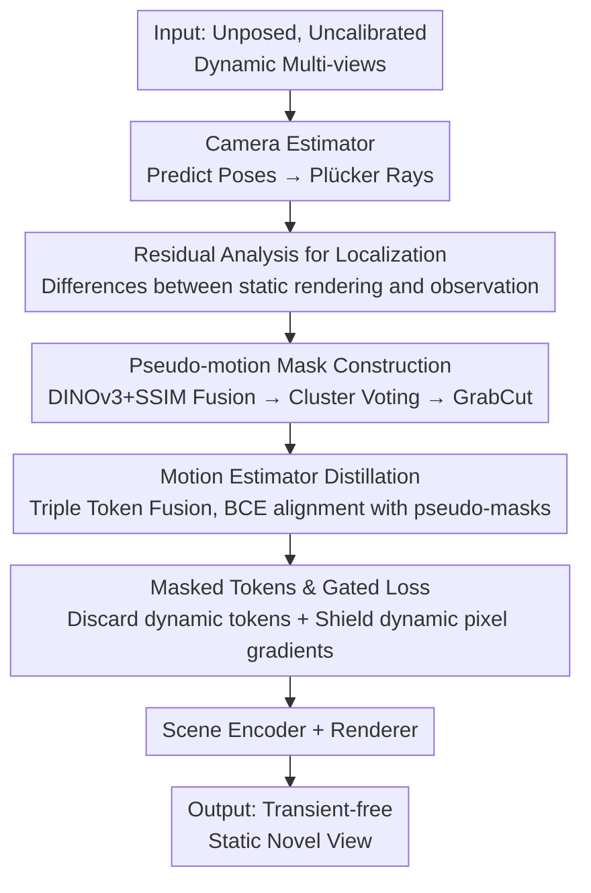

# WildRayZer: Self-supervised Large View Synthesis in Dynamic Environments

**Conference**: CVPR 2026  
**Paper**: [CVF Open Access](https://openaccess.thecvf.com/content/CVPR2026/html/Chen_WildRayZer_Self-supervised_Large_View_Synthesis_in_Dynamic_Environments_CVPR_2026_paper.html)  
**Code**: Project Page https://wild-rayzer.cs.virginia.edu/ (Dataset and code committed to being open-source)  
**Area**: 3D Vision / Novel View Synthesis  
**Keywords**: Self-supervised Novel View Synthesis, Dynamic Scenes, Motion Masks, Feed-forward Rendering, Residual Analysis

## TL;DR
WildRayZer extends RayZer, a self-supervised pose-free large view synthesis model, to real-world "moving camera and moving objects" scenarios. By utilizing a static renderer that only captures rigid structures, the model automatically discovers dynamic objects through rendering residuals, distills a motion mask estimator to discard dynamic tokens before scene encoding, and gates dynamic pixels in the rendering loss. This enables the synthesis of clean "transient-free" novel views in a single feed-forward pass without any pose or mask annotations.

## Background & Motivation

**Background**: Novel View Synthesis (NVS) has evolved from per-scene optimization (e.g., NeRF, 3DGS) to paths like LVSM and RayZer, which use large transformers to learn general priors across massive datasets for feed-forward inference. RayZer represents the state-of-the-art in this direction—it is **self-supervised**, **pose-free at inference**, and can implicitly reconstruct scenes and render novel views from sparse, uncalibrated images without 3D labeling.

**Limitations of Prior Work**: However, RayZer and almost all feed-forward NVS models rest on the rigid assumption that **the scene is static**. Training and inference require inputs without moving objects, limiting use to static datasets like RealEstate10K. In contrast, the real world is inherently dynamic, filled with walking people, pets, and vehicles in handheld videos. Once dynamic content enters the input, multi-view consistency is violated, leading to ghosting artifacts, hallucinated geometry, and collapsed pose estimation. This effectively excludes the richest data source: "in-the-wild" videos.

**Key Challenge**: Self-supervised NVS in dynamic scenes faces two major hurdles. First, **how to locate moving objects without any dynamic mask annotations?** Self-supervision requires the model to discover "what is moving" on its own. Second, **how to train and evaluate this task when existing large-scale 3D datasets are almost entirely static?** Dynamic NVS datasets typically contain fewer than ten sequences, insufficient for large-scale learning.

**Key Insight**: The authors observe that **dynamic objects are precisely the parts that a static renderer cannot explain**. If a renderer designed only for rigid structures fails to reconstruct a region, resulting in high residuals, that region likely contains motion. This transforms dynamic localization from a supervised problem into a self-supervised analysis-by-synthesis test.

**Goal**: To build a system that utilizes a camera-driven static renderer to explain the rigid background, treats its rendering residuals as evidence for dynamic regions to construct pseudo-motion masks, distills a motion estimator, and uses masks to both "block input tokens" and "gate loss gradients." This focuses the supervision signal on cross-view background completion, yielding transient-free static novel views in one forward pass.

## Method

### Overall Architecture

WildRayZer introduces a **motion estimator** $E_{mot}$ alongside RayZer's original "camera estimator + scene encoder + renderer" triplet. The input consists of unposed, uncalibrated dynamic multi-views $\mathcal{I}$ (containing both camera and object motion), and the output is a **static novel view of the scene with transient objects removed**.

**Mechanism**: The camera estimator predicts per-view poses and shared intrinsics, converted into pixel-aligned Plücker rays. A **camera-only static renderer** then generates what it perceives the "rigid scene" should look like. The residual between this prediction $\hat{\mathcal{I}}_\mathcal{B}$ and the ground truth target $\mathcal{I}_\mathcal{B}$ exposes dynamic regions. These residuals are sharpened into clean masks via a pseudo-motion mask pipeline to **distill** the motion estimator. During inference, the trained motion estimator nullifies dynamic tokens before encoding and utilizes the same mask to shield dynamic pixels in the photometric rendering loss. Training involves **alternating optimization**: first freezing the rendering stack to learn masks, then freezing the motion head to train the masked renderer.

### Key Designs

**1. Residual Analysis for Localization: Defining motion as what static renderers cannot explain**

The biggest obstacle to self-supervision is the lack of dynamic mask labels. WildRayZer avoids using an external supervised segmenter, instead performing an analysis-by-synthesis test. It employs a pre-trained RayZer as a **static renderer for rigid structures**. For each held-out view $I \in \mathcal{I}_\mathcal{B}$, the static renderer provides a prediction $\hat{I}$. In rigid background areas, the renderer succeeds and residuals are low; in moving areas, multi-view inconsistency causes the renderer to fail, resulting in high residuals. Thus, "high residual = dynamic region" becomes a natural signal requiring no labels.

**2. Pseudo-motion Mask Construction: Refining noisy residuals into clean boundaries**

Pure MSE residuals are often noisy and fragmented due to imperfect rendering. This design employs a pipeline to sharpen coarse residuals into usable supervision. It calculates semantic dissimilarity using DINOv3 patch features $D_{\text{DINO}}(p)=1-\langle \Phi_p(I),\Phi_p(\hat{I})\rangle$ and pixel-level appearance dissimilarity via SSIM $D_{\text{SSIM}}(x)=1-\text{SSIM}(I,\hat{I})(x)$. After z-score normalization at patch resolution, they are fused using **rendering-fidelity adaptive weighting**:

$$D_{\text{bin}}(p)=w_{\text{DINO}}\,Z(D_{\text{DINO}}(p))+w_{\text{SSIM}}\,Z(D_{\text{SSIM}}(p)),\quad w_{\text{DINO}}+w_{\text{SSIM}}=1$$

Early in training, $w_{\text{DINO}}$ is prioritized for stable semantic cues; as photometric quality improves, $w_{\text{SSIM}}$ is increased to capture fine-grained appearance. **Cross-frame consistency voting** is then applied via K-means clustering across $B$ frames, identifying clusters that are consistently salient. Finally, GrabCut and morphological smoothing refine the boundaries.

**3. Motion Estimator Distillation: Triple token fusion for end-to-end inference**

As pseudo-masks are generated offline and the target view is unavailable at inference, this capability is **distilled** into a feed-forward module $E_{mot}$. It predicts per-pixel logits $S(I)\in\mathbb{R}^{H\times W}$ using three aligned signals: (a) DINOv3 patch features, (b) RayZer image tokens, and (c) Plücker ray tokens. These are fused via a small MLP and a shallow transformer. Crucially, the image tokens are extracted **before the camera estimator**, ensuring the motion head does not depend on target-view signals during inference.

**4. Masked Tokens & Gated Loss: Concentrating signals on cross-view background completion**

To prevent transient pollution of the static scene representation, the motion estimator's probability map is downsampled to the token grid. Dynamic token positions are **zeroed out** before reaching the scene encoder $E_{scene}$. Only static tokens participate in reconstruction, resulting in a scene representation $z$ explicitly cleared of transients. The same pseudo-masks **gate the photometric rendering loss**, shielding gradients from dynamic pixels in the target view. This forces the reconstruction supervision to focus solely on cross-view background completion.

### Loss & Training

Ours follows the self-supervised photometric objective of RayZer: for each held-out target $\hat{I}\in\hat{\mathcal{I}}_\mathcal{B}$,

$$\mathcal{L}=\frac{1}{|\mathcal{I}_\mathcal{B}|}\sum_{\hat{I}\in\hat{\mathcal{I}}_\mathcal{B}}\big[\text{MSE}(I,\hat{I})+\lambda\,\text{Percep}(I,\hat{I})\big]$$

where $\lambda=0.2$, and gradients from dynamic pixels are gated. The motion estimator is distilled using standard BCE-with-logits. Training features **alternating optimization** across three stages. The model utilizes 28 transformer layers, 768 scene tokens, and is trained on 4×H100 GPUs at $256^2$ resolution.

## Key Experimental Results

### Main Results

Evaluated on two dynamic benchmarks with sparse views (2/3/4 inputs, 6 targets). WildRayZer outperforms both optimization-based and feed-forward baselines across all metrics.

| Dataset / Views | Metric | WildRayZer | Runner-up Baseline | Gain |
|-----------------|--------|------------|--------------------|------|
| D-RE10K, v=2    | PSNRs ↑| **21.78**  | 19.01 (RayZer+SAV) | +2.77|
| D-RE10K, v=4    | PSNRs ↑| **22.38**  | 20.73 (RayZer+SAV) | +1.65|
| D-RE10K-iPhone, v=2 | PSNR ↑| **20.89** | 19.57 (RayZer+SAV) | +1.32|
| D-RE10K-iPhone, v=2 | LPIPS ↓| **0.364** | 0.428 (RayZer+SAV) | -0.064|

Optimization-based methods (e.g., NeRF On-the-go, WildGaussians) fail to suppress transients and reconstruct geometry under sparse 2–4 view settings.

### Ablation Study

| Configuration | D-RE10K | D-RE10K-iPhone | Note |
|---------------|---------|----------------|------|
| Copy–Paste only | 18.2 | 11.1 | Synthetic transients do not transfer to real video |
| Pseudo-Mask only| 53.9 | 45.3 | Real residual masks are the primary driver |
| Copy–Paste + Pseudo-Mask | 53.9 | 49.7 | Joint training improves cross-domain generalization |

Incorporating DINOv3 features reduced the steps needed to reach mIoU=30 from 20k to 1.5k, and improved final mIoU from 29.4 to 39.4.

### Key Findings
- **Completion must be learned**: Simply nullifying tokens results in blurry artifacts; cross-view background completion must be learned end-to-end via the masked renderer.
- **Residuals are sparse-robust**: Mask quality remains stable even with few views, whereas optical-flow/tracker baselines collapse at 2 views.
- **DINOv3 as an accelerator**: It speeds up mask "emergence" by an order of magnitude.
- **Copy-paste synergy**: Synthetic augmentation alone is ineffective but significantly improves generalization to datasets like DAVIS when combined with real pseudo-masks.

## Highlights & Insights
- **Parasitic Dynamic Localization**: Extracting motion from what a static renderer cannot explain provides "free" self-supervision. This analysis-by-synthesis perspective can be applied to many tasks.
- **Patch-resolution efficiency**: Performing clustering and fusion on the patch grid reduces computation by 100×, making the pipeline scalable without pre-storing heavy features.
- **Mask + Gating Duality**: Using the same mask for both input token filtering and loss gradient gating is a clean, effective design pattern.
- **Surpassing Supervised Segmentation**: In sparse-view settings, the "internal" rendering residual is a more reliable motion signal than external supervised trackers or flow models.

## Limitations & Future Work
- **Static Background Bias**: Evaluated primarily on RealEstate10K; generalization to highly non-rigid or outdoor scenes with extreme lighting remains a challenge.
- **"Removal" Objective**: The goal is to remove transients. It does not address the 4D reconstruction of the moving objects themselves.
- **Dependency on Initialization**: Mask quality depends on the initial pre-trained static renderer; failure in the renderer (e.g., due to reflections) can lead to erroneous masks.
- **Future Directions**: Integrating residual signals with explicit flow/depth consistency and enabling controllable editing for re-inserting objects.

## Related Work & Insights
- **vs RayZer**: WildRayZer adds the motion estimator and masked training to handle dynamic inputs, which RayZer cannot process.
- **vs WildGaussians / Spotless-Splats**: These involve per-scene optimization and require accurate poses/dense views. Ours is feed-forward and pose-free at inference.
- **vs Motion Segmentation (SAV, MegaSAM)**: These rely on video sequences or trajectories. Ours uses rendering residuals, which are more stable in sparse-view, posing-free scenarios.

## Rating
- **Novelty**: ⭐⭐⭐⭐⭐ A powerful framework utilizing "static rendering residual as dynamic evidence."
- **Experimental Thoroughness**: ⭐⭐⭐⭐⭐ Built a 15K dataset; comprehensive coverage of NVS, segmentation, and ablation benchmarks.
- **Writing Quality**: ⭐⭐⭐⭐ Logical flow; though some notations ($\mathcal{I}_\mathcal{A}/\mathcal{I}_\mathcal{B}$) benefit from cross-referencing figures.
- **Value**: ⭐⭐⭐⭐⭐ Advances feed-forward self-supervised NVS to real dynamic scenes and contributes a significant large-scale dataset.

<!-- RELATED:START -->

## Related Papers

- [\[CVPR 2026\] From None to All: Self-Supervised 3D Reconstruction via Novel View Synthesis](from_none_to_all_self-supervised_3d_reconstruction_via_novel_view_synthesis.md)
- [\[CVPR 2026\] RF4D: Neural Radar Fields for Novel View Synthesis in Outdoor Dynamic Scenes](rf4dneural_radar_fields_for_novel_view_synthesis_in_outdoor_dynamic_scenes.md)
- [\[ICCV 2025\] RayZer: A Self-supervised Large View Synthesis Model](../../ICCV2025/3d_vision/rayzer_a_self-supervised_large_view_synthesis_model.md)
- [\[ICLR 2026\] True Self-Supervised Novel View Synthesis is Transferable](../../ICLR2026/3d_vision/true_self-supervised_novel_view_synthesis_is_transferable.md)
- [\[CVPR 2026\] Dynamic-Static Decomposition for Novel View Synthesis of Dynamic Scenes with Spiking Neurons](dynamic-static_decomposition_for_novel_view_synthesis_of_dynamic_scenes_with_spi.md)

<!-- RELATED:END -->
