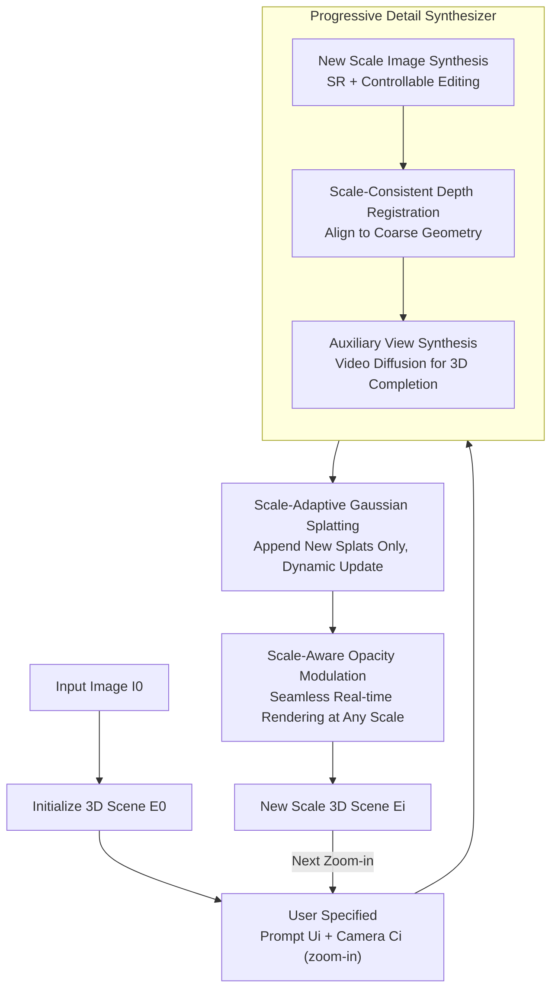

# WonderZoom: Multi-Scale 3D World Generation

**Conference**: CVPR 2026  
**Paper**: [CVF Open Access](https://openaccess.thecvf.com/content/CVPR2026/html/Cao_WonderZoom_Multi-Scale_3D_World_Generation_CVPR_2026_paper.html)  
**Code**: [wonderzoom.github.io](https://wonderzoom.github.io/) (Project page, committed to open source)  
**Area**: 3D Vision  
**Keywords**: Multi-scale 3D generation, Gaussian Splatting, world generation, progressive synthesis, real-time rendering  

## TL;DR
Starting from a single image, WonderZoom allows users to interactively "zoom in" on any area of a 3D scene, autoregressively synthesizing finer-scale content that did not exist previously (ranging from vast landscapes to microscopic details like a ladybug on a petal). Using an incrementally updatable scale-adaptive Gaussian Splatting representation combined with a progressive detail synthesizer, it significantly outperforms existing video and 3D world generation models in both quality and text alignment.

## Background & Motivation
**Background**: 3D world generation (synthesizing immersive 3D environments from minimal input) has gained significant attention. Methods such as WonderJourney, WonderWorld, LucidDreamer, CAT3D, and HunyuanWorld can generate navigable 3D scenes of rooms, landscapes, or even cities from a single image or text.

**Limitations of Prior Work**: These methods are restricted to a **single spatial scale**. If provided with an image of a field, they can generate the entire field for translation-based navigation, but they cannot "look closer" at a ladybug on a sunflower within that field. They generate either landscapes, rooms, or cities, but fail to produce content with cross-scale coherence. Once forced to zoom in, 3D methods (Gaussian Splatting/Meshes) only render blurred magnifications because the details at that scale were never present initially.

**Key Challenge**: The fundamental issue is the **lack of a scale-adaptive 3D representation suitable for "generation."** Traditional LoD (Levels of Detail) and recent hierarchical representations (Hierarchical 3DGS, Mip-NeRF, Octree-GS) assume that images and geometry for all scales are **available from the start**, focusing on one-time optimization for "rendering/reconstruction." However, the essence of generation is the opposite: images do not exist initially; coarse scales must be created first, followed by iterative synthesis of fine scales conditioned on coarse structures and user prompts. This requires the representation to **grow dynamically** with new content rather than being a pre-optimized static hierarchy. Directly applying hierarchical representations would require "simultaneous generation of all scales," which is computationally infeasible and contradicts the naturally coarse-to-fine sequence of multi-scale synthesis.

**Goal**: (1) Design a 3D representation that can grow during generation while remaining real-time renderable at any scale; (2) Design a generator capable of synthesizing **entirely new** fine-scale structures in specified regions based on user prompts while maintaining consistency with coarse-scale geometry and appearance.

**Key Insight**: Utilize "incrementally appendable splats + native-scale opacity modulation" as a scale-adaptive Gaussian Splatting representation, coupled with a "super-resolution → editing → depth registration → auxiliary view" progressive detail synthesizer. This transforms 3D world generation from a "reconstruction paradigm" into a true "coarse-to-fine multi-scale generation paradigm."

## Method

### Overall Architecture
Given an input image $I_0$, a sequence of user prompts $\{U_1,\dots,U_n\}$, and corresponding progressively zoomed-in camera views $\{C_0,\dots,C_n\}$, WonderZoom generates a sequence of 3D scenes $\{E_0,E_1,\dots,E_n\}$ with increasing spatial granularity. $E_0$ is the initial scene reconstructed from the input image, and each $E_i$ ($i>0$) is spatially nested within $E_{i-1}$, representing finer content. The process is an interactive control loop: the user selects a region and provides a prompt, the system synthesizes new content at that scale and merges it into the 3D representation. This can theoretically be repeated for infinite zooming.

Each "zoom" round is completed by two collaborative components. The **Progressive Detail Synthesizer** first renders the target region as a coarse observation, creates a new scale image via super-resolution and semantic editing, performs scale-consistent depth registration, and uses video diffusion to supplement auxiliary views. This provides a complete set of new-scale image-depth pairs. These pairs are dynamically merged into the **Scale-Adaptive Gaussian Splatting** representation using an "append-only" strategy. Meanwhile, **Scale-Aware Opacity Modulation** ensures that only the appropriate splats for a given scale are displayed, enabling seamless real-time rendering.

### Key Designs

**1. Scale-Adaptive Gaussian Splatting: Growth via "Append-Only" 3D Canvas**

The pain point of hierarchical representations is the requirement for simultaneous optimization. WonderZoom builds the scene as a set of Gaussian splats $\{g_j\}$, where each splat $g=\{p,q,s,o,c,s^{\text{native}}\}$ includes a key attribute $s^{\text{native}}$—the **native scale at which it was created**. This attribute is essential for scale-aware rendering. The dynamic update mechanism is simple yet effective: generate $N_0$ splats for $E_0$ from $I_0$; when the user zooms to $C_1$ to create $E_1$, **only add** $N_1$ new splats, bringing the total to $N_0+N_1$. For $E_i$, append $N_i$ splats for a total of $N=\sum_{k=0}^{i}N_k$. Crucially, **old splats are never modified**, and each new scale merely "attaches" details to the existing representation.

The new splats are initialized using pixel-aligned methods: position $p$ is back-projected from estimated depth, orientation $q$ follows the surface normal, and scale $s$ follows the Nyquist sampling theorem to ensure coverage without excessive overlap. Colors are taken from pixel RGB, and opacity is initialized to $o=0.1$. Subsequently, only opacity, orientation, and scale are fine-tuned using Adam under the photometric loss $\mathcal{L}=0.8\mathcal{L}_1+0.2\mathcal{L}_{\text{D-SSIM}}$ (position, color, and native scale are frozen). Lightweight optimization refines the geometry without destroying the multi-scale structure.

**2. Scale-Aware Opacity Modulation: "Soft LoD" for Seamless Transitions**

The cost of never deleting splats is that a single surface area might be covered by multiple layers of splats from $E_0$ to $E_i$. Rendering all of them causes aliasing and latency. This design ensures that each splat is most visible at its "intended" scale and smoothly fades out when deviating. A splat's native scale is defined as $s^{\text{native}}=d^{\text{native}}/\sqrt{f_x^{\text{native}}f_y^{\text{native}}}$ (where $d^{\text{native}}$ is the depth relative to camera $C_i$ and $f$ is focal length); during rendering under camera $C_{\text{render}}$, the current rendering scale $s^{\text{render}}=d^{\text{render}}/\sqrt{f_x^{\text{render}}f_y^{\text{render}}}$ is calculated. The final opacity is modulated as $\tilde o = o\cdot\alpha$, where $\alpha$ is 1 at the native scale, linearly interpolated in log-space between parent/child scale boundaries, and 0 elsewhere:

$$\alpha=\begin{cases}\dfrac{\log(s^{\text{parent}})-\log(s^{\text{render}})}{\log(s^{\text{parent}})-\log(s^{\text{native}})} & s^{\text{parent}}\ge s^{\text{render}}\ge s^{\text{native}}\\[2mm]\dfrac{\log(s^{\text{render}})-\log(s^{\text{child}})}{\log(s^{\text{native}})-\log(s^{\text{child}})} & s^{\text{native}}\ge s^{\text{render}}\ge s^{\text{child}}\\[1mm]1 & \text{No parent and } s^{\text{render}}\ge s^{\text{native}}\text{, or no child and }s^{\text{render}}\le s^{\text{native}}\\0 & \text{otherwise}\end{cases}$$

This design forms a **partition of unity** (Proposition 1): for two overlapping splats $g_j,g_k$ from adjacent scales, when the rendering scale is between their native scales, $\alpha_k+\alpha_j=1$. This ensures that the total contribution of overlapping splats remains constant during zooming, eliminating "popping" artifacts and ensuring visual continuity. Ablation (Table 3) shows that without this, VRAM usage is 7.96G and the frame rate is only 1.4 FPS, whereas with it, VRAM drops to 3.40G and FPS reaches 97.2.

**3. Progressive Detail Synthesizer: SR → Editing → Depth Registration → Auxiliary View**

Zooming in usually involves scales where images do not exist, and prompts often require **entirely new structures** (e.g., a beetle on a flower) that cannot be generated by simple super-resolution. The synthesizer operates in three stages. **(a) New Scale Image Synthesis**: The previous scene is rendered as a coarse observation $O_i=\text{render}(E_{i-1},C_i)$. Since $O_i$ lacks detail, extreme super-resolution (SR) is applied. However, extreme magnification requires semantic guidance, so a VLM extracts context $S=\text{VLM}(O_{i-1})$, yielding $I'_i=\text{SR}(O_i,S)$. Then, a controllable image editing model $I_i=\text{Edit}(I'_i,U_i)$ inserts the user-specified new structures. SR ensures faithful enhancement of existing structures, while editing injects new content.

**(b) Scale-Consistent Depth Registration**: To fit new content into the geometry of $E_{i-1}$, the target depth $D_i^{\text{target}}=\text{render\_depth}(E_{i-1},C_i)$ is rendered from existing geometry. A monocular depth estimator $\mathcal{D}_\theta$ is fine-tuned to align with it using a mask-weighted $L_1$ loss: $\mathcal{L}_{\text{depth}}=\frac{\sum_{u,v}\|D_i^{\text{target}}(u,v)-\mathcal{D}_\theta(I_i)(u,v)\|\cdot m(u,v)}{\sum_{u,v}m(u,v)}$, where $m(u,v)=1$ for defined regions. Newly revealed regions are unconstrained. SAM masks and Grounded SAM are used for piecewise alignment of edited structures. **(c) Auxiliary View Synthesis**: A single $I_i$ is insufficient for 3D reconstruction. A camera-controllable video diffusion model generates consistent temporal views $\{I_i^k\}=\text{VideoDiff}(\{O_i^k\},\{M_i^k\})$ based on the local scene $E_i^{\text{partial}}$. These views allow for the optimization of a complete $E_i$ without "gray holes" in new perspectives.

### Loss & Training
The method does not train a large model but assembles existing foundation models with lightweight optimization per scale. Splat parameters are fine-tuned using Adam with $\mathcal{L}=0.8\mathcal{L}_1+0.2\mathcal{L}_{\text{D-SSIM}}$. Depth registration uses mask-weighted $L_1$. Implementation uses Chain-of-Zoom for SR, Gen3C for video diffusion, MoGe for image depth, GeometryCrafter for video depth, and Grounded SAM for segmentation.

## Key Experimental Results

### Main Results
Testing was conducted on 8 input images (field, city, forest, underwater, etc.) with 4 new scales per image (32 scenes total). Baselines include WonderWorld, HunyuanWorld, Gen3C, and Voyager.

| Method | CLIP score↑ | CLIP-IQA+↑ | Q-align IQA↑ | NIQE↓ | Q-align IAA↑ | Latency/s |
|------|------|------|------|------|------|------|
| WonderWorld | 0.2687 | 0.5064 | 1.081 | 21.74 | 1.339 | 9.3 |
| HunyuanWorld | 0.2510 | 0.2827 | 1.058 | 15.21 | 1.302 | 704.2 |
| Gen3C | 0.3004 | 0.5489 | 2.992 | 4.924 | 2.018 | 306.7 |
| Voyager | 0.2609 | 0.5746 | 3.148 | 4.913 | 2.929 | 596.6 |
| **WonderZoom (Ours)** | **0.3432** | **0.7035** | **3.926** | **3.695** | **2.986** | 62.1 |

WonderZoom leads in text alignment, image quality, and aesthetic metrics. It is significantly faster than high-quality video/3D baselines. A 2AFC human preference study (200 groups) shows:

| Contrast | Zoom-in Accuracy | Visual Quality | Prompt Match |
|------|------|------|------|
| vs WonderWorld | 80.7% | 98.3% | 98.2% |
| vs HunyuanWorld | 83.2% | 98.7% | 98.9% |
| vs Gen3C | 77.8% | 83.8% | 96.1% |
| vs Voyager | 76.1% | 81.7% | 90.9% |

### Ablation Study

| Configuration | Key Metric | Description |
|------|---------|------|
| Full model | 3.40G VRAM / 97.2 FPS | Complete model |
| w/o Opacity Modulation | 7.96G VRAM / 1.4 FPS | Real-time multi-scale rendering infeasible |
| w/o Depth Registration | Geometry distortion | New structures (e.g., beetle) distort in new views |
| w/o Auxiliary Synthesis | Missing parts | Gray holes appear in new perspectives |

### Key Findings
- **Opacity modulation is critical for real-time rendering**: Without it, FPS drops from 97.2 to 1.4 and VRAM doubles due to redundant rendering of overlapping splats.
- **Depth registration ensures geometric consistency**: Without it, edited structures do not align with the coarse geometry, causing distortion.
- **Auxiliary synthesis ensures 3D completeness**: Single views cannot cover all surfaces; video diffusion fills occlusion gaps necessary for navigation.

## Highlights & Insights
- **Converting "LoD" from hard switching to differentiable soft blending**: Using native scales and log-space interpolation for opacity creates a partition of unity, eliminating popping during zooming.
- **"Append-only" decoupling for growth**: Freezing old splats while adding new ones prevents the computational explosion of global re-optimization.
- **Explicit separation of "Super-resolution" and "Generation"**: SR enhances existing structures, while editing injects new content. This allows for semantic discoveries during zooming (e.g., finding a bug on a flower).
- **Assembling foundation models**: Using off-the-shelf components (SR, VLM, editing) makes the system easy to reproduce and upgrade.

## Limitations & Future Work
- **High dependency on external models**: Errors in any component (SR, VLM, editing) propagate through the pipeline.
- **"Hallucinated" vs. authentic content**: Zoomed-in details are synthesized by the generator, not derived from reality, making it unsuitable for high-fidelity digitization (e.g., industrial inspection).
- **Interactive sequence vs. full automation**: Each scale takes ~62s, which accumulates during deep zooms.
- **Evaluation scale**: The test set is relatively small (8 images), and baselines are compared in settings they were not specifically designed for.

## Related Work & Insights
- **vs 3D World Gen (WonderWorld, HunyuanWorld)**: These render blurred views during zoom-in; WonderZoom enables incremental growth and soft LoD.
- **vs Video Gen (Gen3C, Voyager)**: These lack explicit 3D and have imprecise camera control; WonderZoom provides real-time 3D rendering and tighter prompt alignment.
- **vs Hierarchical 3DGS**: These require all-scale data upfront; WonderZoom is designed for dynamic "generation-as-you-go."

## Rating
- Novelty: ⭐⭐⭐⭐⭐ First implementation of multi-scale 3D world generation from a single image.
- Experimental Thoroughness: ⭐⭐⭐⭐ Strong metrics and ablation, but small dataset.
- Writing Quality: ⭐⭐⭐⭐⭐ Excellent motivation and clear technical propositions.
- Value: ⭐⭐⭐⭐⭐ Opens a new dimension for interactive creation and virtual exploration.

<!-- RELATED:START -->

## Related Papers

- [\[CVPR 2026\] OLATverse: A Large-scale Real-world Object Dataset with Precise Lighting Control](olatverse_a_large-scale_real-world_object_dataset_with_precise_lighting_control.md)
- [\[CVPR 2026\] Extend3D: Town-Scale 3D Generation](extend3d_town-scale_3d_generation.md)
- [\[CVPR 2026\] RayNova: Scale-Temporal Autoregressive World Modeling in Ray Space](raynova_scale-temporal_autoregressive_world_modeling_in_ray_space.md)
- [\[CVPR 2026\] Multi-view Consistent 3D Gaussian Head Avatars 'without' Multi-view Generation](multi-view_consistent_3d_gaussian_head_avatars_without_multi-view_generation.md)
- [\[CVPR 2026\] PointNSP: Autoregressive 3D Point Cloud Generation with Next-Scale Level-of-Detail Prediction](pointnsp_autoregressive_3d_point_cloud_generation_with_next-scale_level-of-detai.md)

<!-- RELATED:END -->
