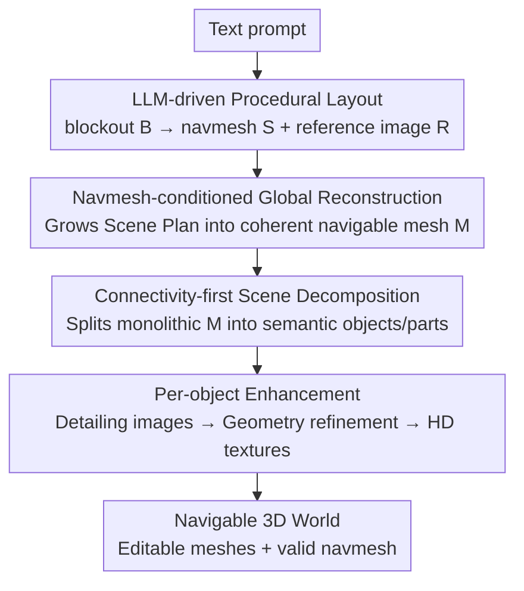

# WorldGen: From Text to Traversable and Interactive 3D Worlds

**Conference**: CVPR 2026  
**Paper**: [CVF Open Access](https://openaccess.thecvf.com/content/CVPR2026/html/Wang_WorldGen_From_Text_to_Traversable_and_Interactive_3D_Worlds_CVPR_2026_paper.html)  
**Code**: To be confirmed (Reality Labs, Meta)  
**Area**: 3D Vision / Text-to-3D Scene Generation  
**Keywords**: Text-to-3D Worlds, Navigable Scenes, navmesh-conditioned generation, Compositional 3D Reconstruction, Game Assets

## TL;DR
WorldGen decomposes the "Text → Traversable, Editable 3D World" process into a four-stage pipeline: "Procedural Layout → Navmesh-conditioned Global Reconstruction → Scene Decomposition → Per-object Enhancement." It utilizes an LLM-driven procedural generator to fix traversable structures first, then employs image generators and image-to-3D priors to complete appearance and details. It produces a $50\times50$ meter scene—directly importable into game engines with support for character climbing and jumping—in approximately 5 minutes.

## Background & Motivation

**Background**: 3D generative AI now enables non-experts to obtain high-quality textured 3D meshes from a single prompt. However, these models (e.g., TRELLIS, various image-to-3D models) primarily focus on generating **single objects**. Generating an entire "game world"—which is both aesthetically pleasing and allows characters to navigate from start to finish without getting stuck—remains largely an open problem.

**Limitations of Prior Work**: Existing 3D scene generation approaches involve trade-offs between diversity, completeness, and correctness. Viewpoint-based generation (Text2Room, Text2NeRF, SynCity, etc.) uses 2D/video generators to extend and reconstruct frame-by-frame, resulting in **monolithic, non-decomposable** geometry with low resolution and stitching artifacts. Compositional methods place objects together but fail to scale (limited to a few objects) and lack contextual reasoning, leading to misalignments and messy occluded regions. 3D latent models (SceneFactor, BlockFusion, NuiScene, etc.) can output complete scene meshes but lack diversity due to the scarcity of 3D scene training data, often lacking object structures and textures.

**Key Challenge**: Training an end-to-end "Text → Functionally Complete 3D World" generator is hindered by the lack of **large-scale annotated 3D scene datasets**. Furthermore, pure image/3D generators do not inherently guarantee "traversability"—they lack mechanisms to constrain where a character can walk.

**Goal**: To end-to-end generate large-scale, fully formed, freely navigable 3D worlds from a single text prompt, decomposed into editable high-quality meshes that can run directly in standard game engines (supporting collision and pathfinding).

**Key Insight**: Procedural Generators (PG) are "narrow" (based on code and rules with low diversity) but can easily enforce structural constraints and provide scene massing and walkable surfaces (i.e., navmesh). Image/3D generators provide high diversity but cannot manage functionality. The authors observe that **letting PG manage function and generators manage appearance allows for mutual complementarity**.

**Core Idea**: An LLM-driven procedural layout produces a "functionally correct skeleton (blockout + navmesh + reference image)." Subsequently, a **navmesh-conditioned global image-to-3D diffusion** grows the skeleton into a coherent, navigable scene mesh. Finally, the scene is decomposed into objects for individual enhancement—injecting "navigability" as a hard constraint into the generation rather than a post-hoc fix.

## Method

### Overall Architecture

WorldGen is a four-stage serial pipeline. It takes a text prompt $y$ as input and outputs a navigable 3D world decomposed into several high-fidelity, editable meshes with a valid navmesh. The four stages are:

1.  **Stage I: Scene Planning**: An LLM parses the prompt into JSON parameters to drive a procedural generator, creating a coarse blockout $B$. From this, a navigable mesh $S$ (navmesh) and a reference image $R$ are derived. Together, they form the "Scene Plan" $L=(B,R,S)$, ensuring functional correctness and end-to-end traversability.
2.  **Stage II: Scene Reconstruction**: A navmesh-conditioned image-to-3D diffusion model grows the scene plan into a global mesh $M$ that adheres to the reference image’s appearance while strictly following the traversable regions encoded by the navmesh (maintaining coherence even in occluded areas).
3.  **Stage III: Scene Decomposition**: The monolithic mesh $M$ from Stage II is autoregressively decomposed into semantically meaningful objects/parts for individual editing and enhancement. The authors adapt and accelerate AutoPartGen for scene-level tasks.
4.  **Stage IV: Scene Enhancement**: High-resolution images are generated per object to add details, followed by geometry refinement via a mesh enhancement model, and finally, high-quality texture generation to produce game-ready assets.

The entire pipeline runs in about 5 minutes (with sub-modules like per-object enhancement and texture generation parallelized across GPUs).

### Key Designs

**1. LLM-driven Procedural Layout: Locking Traversable Structures via "Narrow but Controllable" PG**

The bottleneck is that image/3D generators cannot control functionality, whereas PG excels at enforcing structural constraints. The authors built a text-conditioned procedural generation (PG) pipeline with an LLM front-end that translates prompt $y$ into terrain and layout JSON parameters. The PG creates blockout $B$ in three steps: **Terrain Generation** (large-scale geometry like elevation and slopes), **Space Partitioning** (dividing terrain into functional zones like open areas or building clusters), and **Hierarchical Asset Placement** (placing landmarks for structure followed by small props).

$B$ is a 3D mesh composed of simple primitives (planes and boxes). From this: navmesh $S$ is extracted using standard algorithms (e.g., Recast); reference image $R$ is rendered as an isometric depth map (approx. $45°$ angle) and fed into a depth-conditioned image generator. A small trick involves adding Gaussian noise proportional to depth to the non-terrain depth values, preventing overly rigid right-angled contours and making structural lines more natural.

**2. Navmesh-conditioned Global Reconstruction: Injecting "Navigability" as a Hard Condition in 3D Diffusion**

The challenge is the lack of 3D scene datasets for training "navmesh-conditioned image-to-3D" and the fact that generators do not naturally guarantee traversability. The solution is two-fold. First, **Two-stage Training**: pre-train an image-to-3D model (a latent 3D diffusion transformer like VecSet) on a large set of general object categories, then fine-tune it on self-collected scene triplets $(M,R,S)$. Second, **Navmesh Encoding and Condition Injection**: use a VecSet-like encoder to tokenize navmesh $S$. Points are sampled uniformly on the surface of $S$ to get a dense point cloud $P\in\mathbb{R}^{M\times3}$, then downsampled via Farthest Point Sampling (FPS) to a sparse set $\hat{P}=\mathrm{FPS}(P\,|\,K)\in\mathbb{R}^{K\times3}$. Both sets are mapped to $D$-dimensional features via positional encoding. Sparse points attend to dense points via cross-attention to absorb fine-grained geometry beforeBeing injected into the denoising diffusion transformer backbone.

A key finding: the authors compared "updating only the new cross-attention layers" with "end-to-end fine-tuning the entire transformer." The former resulted in a **25% degradation** in navmesh alignment (Chamfer distance), indicating that faithful adherence to navmesh requires whole-network adaptation.

**3. Connectivity-first Decomposition with Remainder Token: Scale AutoPartGen from Objects to Scenes**

Stage II outputs a monolithic mesh $M$ that is difficult to edit individually. The authors build upon AutoPartGen (autoregressive generation of parts conditioned on the global mesh) but address its two flaws: slow inference and lack of generalization to large scenes.

To address speed, the authors **change the generation order**: while AutoPartGen uses a fixed lexicographical order (z-x-y), WorldGen uses **connectivity** (how many other parts a part collides with) in descending order to prioritize "hub parts" (pivots). For example, in an outdoor scene, the ground usually has the highest connectivity; once the ground is extracted, other objects can be efficiently recovered via connected component analysis of the residual geometry. A **binary flag token** is used to treat "remainder geometry" as a special part—once activated, the model spits out all remaining geometry in one forward pass. This reduces decomposition time from **10 minutes to about 1 minute**. For generalization, the authors **curated a scene-level part dataset** using VLMs to pick "scene-like" assets from internal 3D libraries and applying a heuristic pipeline to convert raw geometry into meaningful object/part decompositions.

**4. Three-step Per-object Enhancement + Global Context Validation: Upgrading Coarse Meshes to Game-ready Assets**

Stage IV refines the coarse mesh: **per-object image enhancement** adds detail, a mesh enhancement model (conditioned on coarse mesh VAE latents) **refines geometry** while maintaining alignment, and **high-quality textures** are generated via multi-view rendering conditioned on normals/position maps and back-projected to UV.

To handle **style consistency**, the authors first apply an initial coarse texture to the global mesh using TRELLIS. Then, during per-object enhancement, the generator is fed an "overhead view of the entire scene with the target object highlighted in orange" to provide spatial context, along with a global reference image. Finally, a **validation** step compares the enhanced image with the coarse rendering; if the contour deviates too much, it is rejected and regenerated to prevent hallucinations.

## Key Experimental Results

### Main Results: Navmesh Alignment (Chamfer Distance, lower is better)

On a benchmark of 50 procedural scenes ($50\times50$m), navmeshes extracted from generated scenes were compared to ground-truth navmeshes. WorldGen outperformed baselines by **40–50%**.

| Model | NavMesh Chamfer ↓ |
|------|-------------------|
| Model A | 0.038 |
| Model B | 0.049 |
| Model C | 0.048 |
| Baseline | 0.042 |
| Baseline* (Finetuned on our scene triplets) | 0.038 |
| **Ours** | **0.022** |

### Scene Decomposition: Quality and Speed (Table 2)

| Model | Chamfer ↓ | F-score@0.01 ↑ | F-score@0.05 ↑ | Time |
|------|-----------|----------------|----------------|------|
| Top PartGen Model A | 0.171 | 0.090 | 0.443 | 1 min |
| Top PartGen Model B | 0.136 | 0.155 | 0.633 | 3 min |
| AutoPartGen | 0.144 | 0.281 | 0.683 | 10 min |
| **Ours** | **0.061** | **0.322** | **0.853** | **1 min** |

### Ablation Study

| Configuration | Key Metrics | Note |
|------|---------|------|
| Full end-to-end fine-tuning | Best navmesh alignment | Full pipeline |
| Updating cross-attention layers only | **25% degradation** in Chamfer | Condition layers alone cannot handle non-trivial alignment |
| Connectivity-first + remainder token | Time 10 min → **~1 min** | Hubs first + residue analysis |

### Key Findings
- **Traversability as a Hard Constraint is Effective**: Navmesh conditioning reduces Chamfer distance by 40–50%. Even when reference images and navmesh are intentionally inconsistent, the model follows the navmesh, proving it learns "spatial organization" rather than just copying images.
- **Condition Injection Must be Deep**: Fine-tuning only the new layers leads to a 25% performance drop, confirming that navmesh-to-mesh alignment requires whole-network adaptation.
- **Decomposition Order Dictates Efficiency**: Swapping lexicographical order for connectivity-based order and using a remainder token is key to compressing 10 minutes into 1 minute.
- **Style Consistency via Global Context**: Highlighting target objects in orange on an overhead view and using global reference images prevents style drift during independent object enhancement.

## Highlights & Insights
- The **"Function to PG, Appearance to Generator"** paradigm is clean: using procedural layouts for traversability bypasses the "3D scene data scarcity" and "functionality failure" issues of pure generators.
- **Navmesh as a 3D editable condition** is more elegant than editing 2D images. Editing the walkable surface directly in 3D provides clear semantic intent and precise control.
- **Connectivity-first + remainder flag tokens** solve the speed bottleneck of autoregressive decomposition.
- **Global reconstruction then decomposition** ensures that objects in occluded areas are coherent and "fit back together," unlike "segment-then-reconstruct" approaches.

## Limitations & Future Work
- **Single Reference View Ceiling**: Dependence on a single reference image currently limits generation to bounded, single-layer scenes (no multi-story buildings).
- **Lack of Asset Instantiating**: Identical assets are not reused, affecting rendering efficiency.
- **Lack of Quantitative Playability Metrics**: Evaluation focuses on Chamfer distance and decomposition quality; "fun" and "immersion" rely on qualitative assessment.
- **Internal Asset Dependency**: Relies on Meta’s internal 3D libraries and closed-source sub-models, creating high barriers to reproduction.

## Related Work & Insights
- **vs. Viewpoint-based Generation**: These produce monolithic, non-decomposable geometry with artifacts; WorldGen produces **decomposed, editable meshes with valid navmeshes**.
- **vs. Compositional Generation**: These often have misaligned objects and lack scale; WorldGen uses **global reconstruction** to ensure contextual consistency.
- **vs. 3D Latent Scene Models**: These lack diversity and textures; WorldGen leverages **text-to-image generators** to provide rich diversity and high-quality textures.
- **vs. Marble (World Labs)**: Marble uses Gaussian Splatting and degrades far from the initial viewpoint; WorldGen maintains **geometric and stylistic consistency** across a $50\times50$m range.

## Rating
- Novelty: ⭐⭐⭐⭐⭐ Injecting "navigability" as a hard constraint via a hybrid PG-generator paradigm significantly advances the field.
- Experimental Thoroughness: ⭐⭐⭐⭐ Strong quantitative results for navmesh and decomposition, though scene-level comparisons rely on some anonymous/commercial baselines.
- Writing Quality: ⭐⭐⭐⭐⭐ Clear four-stage motivation and well-explained design trade-offs.
- Value: ⭐⭐⭐⭐⭐ High potential for interactive content creation, delivering game-ready 3D worlds in 5 minutes.

<!-- RELATED:START -->

## Related Papers

- [\[CVPR 2026\] Text–Image Conditioned 3D Generation](text-image_conditioned_3d_generation.md)
- [\[ICCV 2025\] Text2VDM: Text to Vector Displacement Maps for Expressive and Interactive 3D Sculpting](../../ICCV2025/3d_vision/text2vdm_text_to_vector_displacement_maps_for_expressive_and_interactive_3d_scul.md)
- [\[CVPR 2026\] Aligning Text, Images and 3D Structure Token-by-Token](aligning_text_images_and_3d_structure_token-by-token.md)
- [\[CVPR 2026\] Are We Ready for RL in Text-to-3D Generation? A Progressive Investigation](are_we_ready_for_rl_in_text-to-3d_generation_a_progressive_investigation.md)
- [\[CVPR 2026\] DynamicTree: Interactive Real Tree Animation via Sparse Voxel Spectrum](dynamictree_interactive_real_tree_animation_via_sparse_voxel_spectrum.md)

<!-- RELATED:END -->
