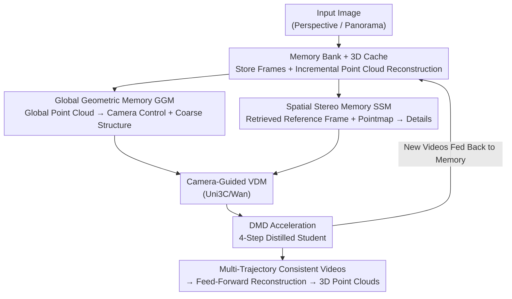

# WorldStereo: Bridging Camera-Guided Video Generation and Scene Reconstruction via 3D Geometric Memories

**Conference**: CVPR 2026  
**Paper**: [CVF Open Access](https://openaccess.thecvf.com/content/CVPR2026/html/Zhang_WorldStereo_Bridging_Camera-Guided_Video_Generation_and_Scene_Reconstruction_via_3D_CVPR_2026_paper.html)  
**Code**: https://github.com/FuchengSu/WorldStereo (To be open-sourced)  
**Area**: 3D Vision  
**Keywords**: Camera-Guided Video Generation, 3D Scene Reconstruction, World Model, Geometric Memory, Video Diffusion Model

## TL;DR
WorldStereo grafts two complementary "geometric memory" ControlNet branches—Global Geometric Memory (GGM) to preserve structure and camera precision via incrementally updated point clouds, and Spatial Stereo Memory (SSM) to preserve details via retrieved reference frames and pointmap-constrained attention—onto off-the-shelf video diffusion models (VDM). This generates mutually consistent videos along multiple camera trajectories, which yields high-fidelity point clouds when fed into feed-forward 3D reconstruction. Furthermore, distribution matching distillation (DMD) is utilized to compress inference to 4 steps, achieving a 20× speedup.

## Background & Motivation

**Background**: Under the "generate first, then reconstruct" paradigm, using camera-guided video diffusion models (camera-guided VDMs) to generate videos along specified trajectories and then applying feed-forward 3D reconstruction (such as DUSt3R variants, WorldMirror) to convert the videos into point clouds/3DGS is currently one of the most popular routes for single-image to 3D scene generation. Camera control signals have also expanded from Plücker rays to explicit geometric guides like point clouds, meshes, optical flow, and tracking points.

**Limitations of Prior Work**: Although the generated videos look realistic, they often blur or collapse when used for 3D reconstruction. The root cause is that a single video trajectory does not cover enough viewpoints. Extending the video to cover more viewpoints simultaneously introduces three issues: ① explosive training/inference costs for long sequences, ② deterioration of video quality, and ③ poor camera control precision and error accumulation in autoregressive (AR) VDMs. Crucially, content generated across different camera trajectories conflicts (memoryless visual conflicts)—the exact same scene looks different from different directions, causing the reconstruction to collapse.

**Key Challenge**: There is a tension between broad viewpoint coverage and cross-trajectory consistency, high image quality, and accurate camera control. Long videos from a single trajectory sacrifice quality/computation for coverage; multi-trajectory short videos have high quality but suffer from mutual inconsistency. Furthermore, when pure point cloud conditions guide VDMs, the models tend to "ignore" the geometry (even if the point cloud is perfectly reconstructed) to preserve their generalization capability, rendering the structural constraints ineffective.

**Goal**: Allow off-the-shelf VDMs to generate videos along multiple complementary mid-length trajectories, such that all trajectories maintain structural and detailed consistency with one another. This avoids the cost of long-sequence generation while retaining the generalization and utility of pre-trained VDMs, ultimately reconstructing high-quality 3D scenes.

**Key Insight**: The authors reframe the "cross-trajectory consistency" problem as a **memory** problem—each time a new video segment is generated, its visual content and reconstructed point cloud are saved to memory, which is actively retrieved to constrain subsequent trajectory generation. Coarse structures rely on global point cloud memory, while fine details rely on reference frames and 3D correspondence (pointmap) memory, analogous to traditional stereo matching.

**Core Idea**: Introduce two complementary geometric memory ControlNet branches—**GGM for the "skeleton", SSM for the "skin"**—onto a frozen camera-guided VDM (Uni3C). These use incremental point clouds and retrieval-based stereo attention to anchor multi-trajectory generation to the exact same geometry. Because all conditions are pixel-wise aligned and injected via ControlNet, the entire pipeline is naturally compatible with DMD distillation, enabling 4-step accelerated inference without joint training.

## Method

### Overall Architecture
WorldStereo is built on top of the camera-guided VDM **Uni3C** (constructed on a frozen Wan2.1-14B-I2V with a lightweight ControlNet camera branch) and extends it with "memory generation" capabilities. Given an input image, the framework executes a loop of "generation $\rightarrow$ reconstruction $\rightarrow$ memory $\rightarrow$ re-generation":

1. **Infrastructure (Memory Bank + 3D Cache)**: The generated video frames are temporally downsampled and stored in a 2D memory bank $\{I_{mem}\}_{m=0}^{M}$ (the initial conditioning image and perspective views cropped from 360° panoramas also enter the bank). The images in the memory bank are incrementally reconstructed into a global point cloud set $X_{cache}$ using the feed-forward reconstruction model WorldMirror and stored in a 3D cache. For long sequences, different caches are aligned via Umeyama transform using overlapping viewpoints and merged.
2. **GGM Branch (Camera ControlNet)**: The guidance in Uni3C, which originally only used reference frame point clouds, is upgraded to an incrementally updated **global** point cloud $X^g_{pcd}$. This provides both accurate camera control and injects a coarse geometric prior.
3. **SSM Branch (New ControlNet, trained 20-layer DiT from scratch)**: Retrieves the reference frame with the largest spatial overlap with the target viewpoint from the memory bank, horizontally concatenates it with the target viewpoint, overlays a pointmap, and applies restricted attention so that each target frame only attends to its retrieved reference frame to restore fine-grained details.
4. **DMD Acceleration**: Since both control branches are pixel-wise aligned, the VDM backbone can be distilled into a 4-step student. The memory/control branches can transfer directly without joint fine-tuning.

The outputs of both ControlNet branches are added back element-wise to the main VDM blocks via zero-linear layers. Newly generated videos are fed back into the memory bank/3D cache to support the next trajectory—forming the "memory" loop.

### Key Designs

**1. Memory Bank + 3D Cache: Solidifying "Generation History" into Retrievable 2D/3D Memories**

This serves as the foundation for the next two designs, specifically addressing the pain point where multi-trajectory generation processes operate independently and conflict. Generated video frames are temporally downsampled and stored in a **2D memory bank** $\{I_{mem}\}_{m=0}^{M}$ to retrieve spatially similar reference viewpoints for SSM; initial conditioning images and perspective crops of 360° panoramas are also stored here. The **3D cache** $X_{cache}$ uses the feed-forward reconstruction model WorldMirror to incrementally reconstruct images from the memory bank into a global point cloud—updating with each new video segment. For long sequences, 3D caches from different temporal stages are aligned via the **Umeyama transform** using overlapping point clouds and merged into a unified coordinate system. This "generate-while-memorizing" design ensures subsequent trajectories do not hallucinate from scratch, but instead reference a continuously growing geometric ledger, acting as the physical anchor for consistency.

**2. Global Geometric Memory GGM: Forcing the VDM to Truly "Listen" to Geometry instead of Using Point Clouds as Mere Camera Prompts**

This targets the issue of VDMs ignoring point cloud geometry to preserve generalization. In vanilla Uni3C, point clouds only act as camera guidance and do not force the VDM to fit a 3D representation; though this maintains generalization (avoiding degradation from poor monocular depth), it causes the model to largely ignore the geometric structure provided by the point cloud. GGM **fine-tunes the camera control branch** by upgrading the conditional input from target-viewpoint point clouds $X_{pcd}$ (Eq. 1, back-projected from monocular depth MoGe: $X_{pcd}(x) \simeq R_{c\rightarrow w} D(x) K^{-1}\hat{x}$) to global point clouds concatenated with other views:

$$X^g_{pcd} = [X_{pcd}, \hat{X}_{pcd}]$$

where $\hat{X}_{pcd}$ represents point clouds from other viewpoints. During inference, this is directly supplied by the incrementally updated 3D cache and aligned with $X_{pcd}$ via the Umeyama transform. To prevent overfitting to new viewpoint point clouds during training, a **point cloud masking strategy** is introduced: randomly discarding a portion of the target viewpoint's points forces the model to be robust to "partially missing geometry" (directly matching incomplete point clouds in real inference). Consequently, GGM stabilizes coarse structure and improves camera accuracy under large viewpoint changes, while being naturally compatible with panoramas by using MoGe panoramic depth estimation to construct 360° point clouds as the initial 3D cache.

**3. Spatial Stereo Memory SSM: Leveraging Stereo Matching to Anchor Target Frames to Retrieved Reference Frames via Restricted Attention**

GGM only preserves the coarse structure, while details remain blurry (Fig. 5). Prior works retrieve historical reference frames and model all frames jointly using full attention, which requires heavy post-training to adapt to long sequences and fails to guarantee reference frame continuity (e.g., reference views in panoramic scenes are discrete and unordered), thus hindering VDM learning. SSM draws inspiration from traditional **stereo matching** and reference-based inpainting. Given $N$ target poses, it first uniformly samples $F = N/4$ frames and retrieves their nearest neighbors from the memory bank as references—where the retrieval criterion extends from 2D planes to 3D space, selecting the viewpoint with the **maximum overlapping volume of camera frustums (FoV)** between the target and reference. Each reference frame is individually encoded via 3D-VAE into $\{z_{ref}\}$, and **horizontally concatenated** with the target latent to form $z_{stitch}=[z_{tar}; z_{ref}] \in \mathbb{R}^{F\times 2HW\times C}$. This is overlaid with a pointmap (which records the 3D world coordinates of the target-reference point cloud pairs, normalized and color-coded as RGB, and encoded as $\hat{z}_{pm}=[\hat{z}_{tar};\hat{z}_{ref}]$) to yield the input for the SSM branch: $z_{ssm}=z_{stitch}+\hat{z}_{pm}$. The critical "stereo" constraint lies in the attention mechanism: the features are rearranged to $[BF, H{*}2W, C]$, and **attention is restricted to the $H{*}2W$ dimension**. This means each target-ref pair only attends to itself, preventing entanglement with other pairs. After computation, only the target features are added back to the main VDM blocks. Ablations show that the 3D correspondence provided by the pointmap is crucial for SSM, as it guides attention to the correct matching regions. Multi-view target-ref training pairs are synthesized from existing multi-view datasets using **temporally staggered sampling** (with temporal overlap between reference and target controlled at 30%–90%), followed by random shuffling and masking to simulate the unordered and discrete nature of real retrieval.

**4. DMD Acceleration: Zero-Joint-Training 4-Step Inference enabled by Decoupling Pixel-Wise Aligned Control Branches**

To deploy a 14B VDM, acceleration is necessary, but standard methods jointly train control and acceleration, which is costly and damages generalization. WorldStereo leverages a key insight: all pixel-wise aligned conditions are injected through ControlNet, meaning **DMD can be trained purely using camera-guided video generation (without any memory training)**. DMD utilizes variational score distillation, approximating the KL divergence to distill the student $G_\theta$ using the difference between a frozen real score $s_{real}$ and a trainable fake score $s_{fake}$:

$$\nabla \mathcal{L}_{\text{DMD}} = -\mathbb{E}_t\left(\int \left(s_{\text{real}}(x_t,t) - s_{\text{fake}}(x_t,t)\right)\frac{dx_t}{d\theta}\,dz\right)$$

$G_\theta$, $s_{real}$, and $s_{fake}$ are initialized from Uni3C. $s_{real}$ is frozen, and for each generator update, $s_{fake}$ is trained 5 times. Random gradient clipping is used to stabilize training, and the GAN loss is omitted (as it slows training with minimal benefit). To decouple "control" from "few-step generation", **the generator's camera control branch is frozen, and only the backbone is trained**. Consequently, both the camera branch and the memory branches can be transferred directly to the distilled $G_\theta$ **without any joint fine-tuning**. The authors also found that retaining high-quality, relatively simple trajectories is critical to stabilizing DMD training (as the student easily learns oversaturation/hallucination artifacts from the teacher on difficult trajectories); this data filtering does not hurt camera controllability (verified in Table 2). Ultimately, inference steps are reduced from 40 to 4, and CFG 5.0 real scores are converted to a CFG-free generator, speeding up inference by approximately 20×.

### Loss & Training
The training is divided into three stages + DMD distillation: ① The camera ControlNet is retrained for 8,000 steps according to the Uni3C configuration (batch size 32); ② The GGM stage fine-tunes the camera ControlNet with global point cloud augmentation for 4,000 steps; ③ The SSM stage trains the new branch from scratch for 6,000 steps using custom memory-retrieval data. Training the two memory mechanisms takes 60 hours on 64×H20 GPUs. DMD training takes 1,000 steps / 13 hours. All training data is 480p with variable aspect ratios, and the model generalizes well to 720p during validation.

## Key Experimental Results

### Main Results: OOD Camera Control + Visual Quality (Table 2)
100 high-quality images from the WorldScore static subset (encompassing realistic/stylized/indoor/outdoor scenes) were selected as first frames, paired with complex trajectories generated by combining translation, rotation, and translation. WorldMirror was used to solve the camera poses from the generated videos, comparing rotation error RotErr, translation error TransErr, Absolute Trajectory Error (ATE), and quality metrics like Q-Align and CLIP-IQA+. For a fair comparison, both Uni3C and the WorldStereo series were evaluated at 512p and 81 frames.

| Method | RotErr↓ | TransErr↓ | ATE↓ | Q-Align-V↑ | CLIP-IQA+↑ | Time(s) |
|------|---------|-----------|------|-----------|-----------|---------|
| Voyager | 0.678 | 0.630 | 1.343 | 0.664 | 0.414 | 343 |
| SEVA | 0.171 | 0.540 | 1.023 | 0.782 | 0.514 | 90 |
| Gen3C | 0.220 | 0.275 | 1.071 | 0.820 | 0.518 | 158 |
| Uni3C (base) | 0.155 | 0.192 | 0.572 | 0.846 | 0.549 | 162 |
| WorldStereo* | 0.132 | 0.178 | 0.542 | 0.860 | 0.559 | 162 |
| WorldStereo-GGM | **0.129** | **0.162** | 0.706 | **0.875** | **0.572** | 162 |
| WorldStereo-Full | 0.145 | 0.253 | 0.667 | 0.866 | 0.561 | 173 |
| WorldStereo-DMD | 0.146 | 0.203 | **0.504** | 0.874 | 0.573 | **9** |

The base version WorldStereo* (without any memory) already outperforms competing methods in both camera precision and image quality (RotErr 0.132 vs Uni3C 0.155). In this setting, the memory bank/3D cache only stores first-frame information—meaning the memory mechanism yields no gain under single-image conditions, but it demonstrates that training with memory **does not degrade** generalization and quality. GGM further improves image quality (Q-Align-V 0.875), while SSM slightly drops in overall metrics under this setting but brings strong fine-grained detail recovery (Fig. 5d). The DMD version compresses inference from 162s to **9s** with almost no drop in camera control and quality.

### Single-Image Reconstruction Benchmark (Table 3)
The authors built a 3D reconstruction benchmark using Tanks-and-Temples (with GT point clouds) and MipNeRF360 (reconstructed with MVS and foreground-cropped as pseudo-GT), providing only a single first frame for each scene. Videos were generated along four predefined trajectories (up/left/right rotation + orbit), reconstructed with WorldMirror, aligned to the GT, and evaluated using point cloud F1, AUC, and camera errors.

| Dataset | Method | F1↑ | AUC↑ | RotErr↓ | TransErr↓ | ATE↓ |
|--------|------|-----|------|---------|-----------|------|
| Tanks&Temples | Uni3C | 0.424 | 0.378 | 0.362 | 0.1017 | 0.1572 |
| | Gen3C | 0.416 | 0.380 | 0.342 | 0.0949 | 0.1704 |
| | VMem | 0.386 | 0.375 | 0.533 | 0.1510 | 0.1922 |
| | WorldStereo* | 0.447 | 0.389 | 0.377 | 0.0990 | 0.1545 |
| | WorldStereo-GGM | 0.485 | 0.411 | **0.224** | **0.0885** | **0.1350** |
| | **WorldStereo-Full** | **0.578** | **0.437** | 0.247 | 0.0927 | 0.1501 |
| | WorldStereo-DMD | 0.534 | 0.410 | 0.291 | 0.1001 | 0.1547 |
| MipNeRF360 | Uni3C | 0.352 | 0.347 | 0.112 | 0.0086 | 0.0104 |
| | Gen3C | 0.356 | 0.340 | 0.349 | 0.0220 | 0.0318 |
| | WorldStereo* | 0.350 | 0.342 | 0.097 | 0.0076 | **0.0099** |
| | **WorldStereo-Full** | **0.406** | **0.402** | 0.114 | 0.0080 | 0.0132 |
| | WorldStereo-DMD | 0.390 | 0.387 | 0.159 | 0.0106 | 0.0267 |

The full model improves the F1 score on Tanks&Temples from 0.447 (base version) to **0.578** (vs. Uni3C's 0.424 and Gen3C's 0.416). It also leads on MipNeRF360 with an F1 of 0.406 and AUC of 0.402. The DMD version still yields strong reconstruction performance (T&T F1 0.534), proving that consistency is preserved even with massive acceleration.

### Ablation Study (Tables 2/3 + Fig. 5)

| Configuration | T&T F1 | Note |
|------|--------|------|
| Baseline (No memory) | 0.447 | New views randomly hallucinate new objects |
| + GGM | 0.485 | Preserves coarse structure, improves camera accuracy under large viewpoint changes |
| + GGM + SSM (Full) | **0.578** | Recovers fine-grained details on top of coarse structures |
| GGM+SSM w/o Pointmap | (Fig. 5c, significantly worse) | Removing 3D correspondence causes attention to focus on incorrect regions |

- **GGM manages coarse structures, SSM manages details, and they are complementary**: Removing memory causes the model to fabricate random objects in new views; the incremental 3D cache in GGM stabilizes the overall skeleton; and SSM anchors details back to reference frames using restricted attention and pointmaps. The largest jump in reconstruction scores comes from combining both (0.447 to 0.578).
- **Pointmaps are critical for SSM**: Removing the pointmap (Fig. 5c) causes the attention mechanism to focus on incorrect matching regions, leading to severe degradation in detail recovery—indicating that 3D correspondence is far more important than simple reference frame retrieval.
- **Memory training does not harm generalization**: Under the single-image setting, the memory mechanism provides no gain for camera control but does not degrade performance, showing that adding memory does not damage the original capabilities of the VDM.
- **DMD data filtering**: Retaining high-quality, relatively simple trajectories is critical to stabilizing training; otherwise, the student easily learns oversaturation/hallucination artifacts from the teacher on difficult trajectories. This filtering does not hurt camera controllability.
- **Panoramic extension**: Cropping a panorama into 27 frames (FoV 90°×120°) as the initial memory bank and constructing the 3D cache via MoGe panoramic depth enables high-resolution 3D panorama generation at 576p (Fig. 6).

## Highlights & Insights
- **Re-framing "cross-trajectory consistency" as a memory problem**: Rather than forcing long-sequence generation, the model incrementally accumulates visual and geometric data into a 2D memory bank and a 3D cache during generation, allowing subsequent trajectories to actively query memory. This bypasses the computational barrier of long videos while preserving the generalization of off-the-shelf VDMs—a highly clever framing.
- **GGM addresses the issue of "ineffective point cloud guidance"**: The authors identify a hidden pain point: VDMs tend to ignore point cloud geometry to preserve generalization (even when the point cloud is perfect). GGM uses global point cloud augmentation and point cloud masking to force the model to truly "listen" to geometry.
- **SSM brings stereo matching into attention blocks**: Horizontally concatenating target-reference frames and restricting attention only along the $H{*}2W$ dimension is equivalent to performing "soft stereo matching" for each target-reference pair, while the pointmap provides explicit 3D correspondence. This design is easily transferable to any generation task requiring "retrieval-based detailed consistency" (such as video extension or reference-based editing).
- **ControlNet alignment leads to decoupled DMD**: Because all conditions are pixel-wise aligned, the memory/control branches can be transferred to the distilled student at zero cost, achieving 4-step 20× acceleration with virtually no drop in reconstruction quality. This "architecture designed for distillability" is highly instructive.

## Limitations & Future Work
- **Heavy reliance on feed-forward reconstruction quality**: The 3D cache is incrementally reconstructed by WorldMirror. Errors from monocular depth estimation (MoGe) and WorldMirror propagate through the memory loop and can accumulate; although the authors mitigate this via Umeyama/ICP alignment, the ceiling of the base reconstructor ultimately limits WorldStereo.
- **Multi-trajectory coverage still relies on predefined/heuristic paths**: The reconstruction benchmark uses four preset trajectories (up/left/right + orbit), and panoramas use "heuristic wander trajectories". These manually designed paths may not provide optimal coverage for complex scenes.
- **No gain for SSM under single-image settings**: As shown in Table 2, SSM slightly drops overall metrics in single-image setups. Its true value emerges during multi-trajectory/multi-view retrieval, meaning the benefits of the method heavily depend on having a sufficiently diverse history of viewpoints in the memory bank.
- **High training cost**: Training the two memory mechanisms takes 60 hours on 64×H20 GPUs for a 14B backbone, representing a relatively high barrier to reproduction.
- ⚠️ Concrete sampling/masking details during training and panorama trajectory designs are placed in the supplementary materials and not fully elaborated in the main text; readers should refer to the original paper.

## Related Work & Insights
- **vs. Uni3C (base)**: Uni3C uses Plücker rays and reference-frame point clouds for single-trajectory camera control. WorldStereo upgrades point clouds to incremental global point clouds (GGM) and introduces a new retrieval-based spatial stereo memory (SSM) to transition from "single-trajectory controllable" to "multi-trajectory consistent + reconstructible", raising the reconstruction F1 score on T&T from 0.424 to 0.578.
- **vs. Gen3C / SEVA (generate-first reconstruction pipelines)**: These also follow the "generate-first, then reconstruct" pipeline, but their generated videos are too short or lack cross-trajectory consistency, leading to blurry and incomplete reconstructions. WorldStereo preserves cross-trajectory consistency via its memory mechanism, yielding significantly higher point cloud completeness and accuracy.
- **vs. Long-context / AR memory video generation**: Expanding the context window or compressing historical frames into attention layers is either computationally expensive or suffers from information loss that harms 3D consistency. WorldStereo models 3D correspondences and applies restricted attention to preserve both 3D consistency and details.
- **vs. End-to-end "generation-as-reconstruction" (jointly modeling depth/3DGS/pointmap)**: These methods are data-hungry, require heavy training, and easily damage the generalization of the base models. WorldStereo retains the original representation space and generalization of the VDM while adding consistency solely via its memory mechanism, making it lighter and more versatile.

## Rating
- **Novelty**: ⭐⭐⭐⭐⭐ Re-framing cross-trajectory consistency as a joint 2D+3D geometric memory problem, along with the complementary GGM/SSM designs and stereo-matching-style restricted attention, is highly creative.
- **Experimental Thoroughness**: ⭐⭐⭐⭐⭐ Comprehensive evaluations across dual tracks (OOD camera control and a self-built single-image reconstruction benchmark), supplemented with thorough ablations of memory, pointmaps, and DMD. The conclusions are self-consistent.
- **Writing Quality**: ⭐⭐⭐⭐ The motivation progresses logically, and Figs. 2 and 3 clearly illustrate the pipeline; some specific sampling and trajectory details are deferred to the supplementary materials.
- **Value**: ⭐⭐⭐⭐⭐ Plug-and-play compatibility with off-the-shelf VDMs, achieving 4-step 20× acceleration with practically zero performance loss in reconstruction—highly practical for utilizing VDMs as world models for 3D generation.

<!-- RELATED:START -->

## Related Papers

- [\[CVPR 2026\] Image-Guided Geometric Stylization of 3D Meshes](image-guided_geometric_stylization_of_3d_meshes.md)
- [\[CVPR 2026\] Illumination-Consistent Human-Scene Reconstruction from Monocular Video](illumination-consistent_human-scene_reconstruction_from_monocular_video.md)
- [\[CVPR 2026\] Gen3R: 3D Scene Generation Meets Feed-Forward Reconstruction](gen3r_3d_scene_generation_meets_feed-forward_reconstruction.md)
- [\[CVPR 2026\] Complet4R: Geometric Complete 4D Reconstruction](complet4r_geometric_complete_4d_reconstruction.md)
- [\[CVPR 2026\] Geometry-Guided 3D Visual Token Pruning for Video-Language Models](geometry-guided_3d_visual_token_pruning_for_video-language_models.md)

<!-- RELATED:END -->
