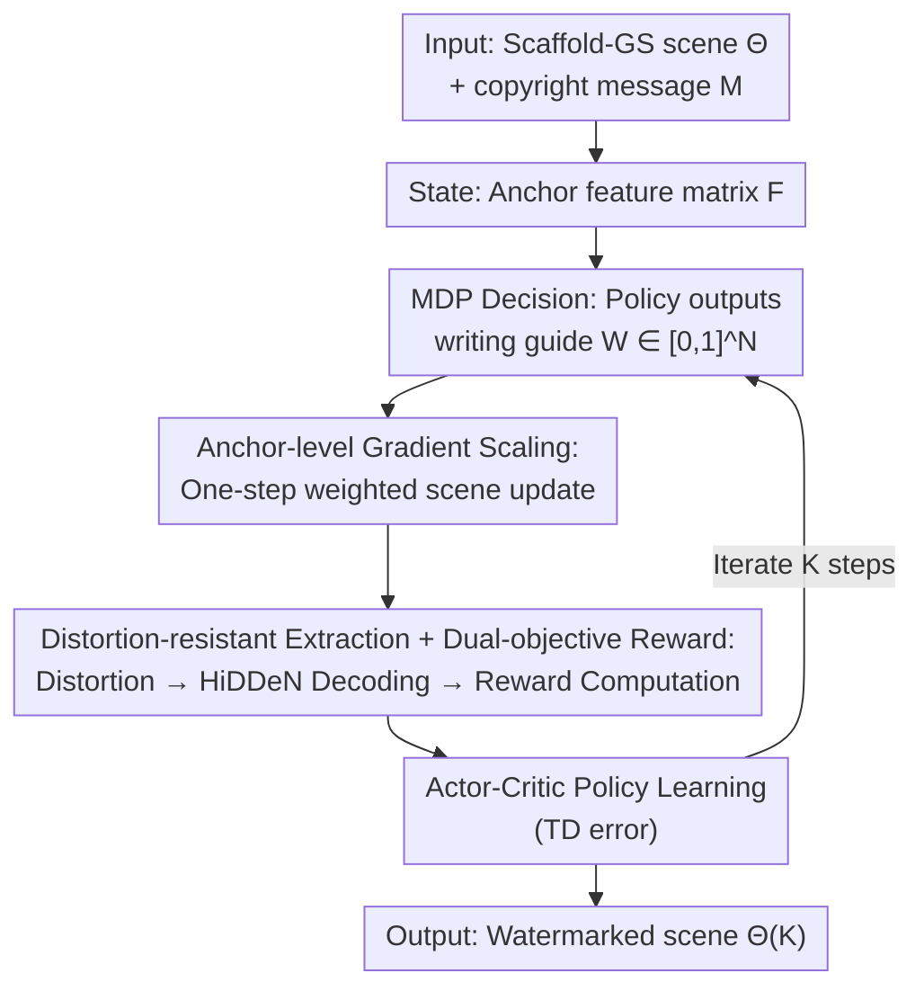

# Write Where It Matters: Policy-Guided Watermarks for 3D Gaussian Splatting

**Conference**: CVPR 2026  
**Paper**: [CVF Open Access](https://openaccess.thecvf.com/content/CVPR2026/html/Li_Write_Where_It_Matters_Policy-Guided_Watermarks_for_3D_Gaussian_Splatting_CVPR_2026_paper.html)  
**Code**: To be confirmed  
**Area**: 3D Vision  
**Keywords**: 3D Gaussian Splatting, Digital Watermarking, Reinforcement Learning, Copyright Protection, Scaffold-GS

## TL;DR
This work reformulates "embedding copyright watermarks into 3D Gaussian scenes" as a Markov Decision Process (MDP). A lightweight policy network determines "where to write and how much to update" on a per-anchor basis. The policy is trained using a joint reward based on rendering invisibility and distortion-resistant decoding. At a cost of approximately 9 minutes per scene, this method achieves state-of-the-art (SOTA) bit accuracy and rendering fidelity across three datasets: Blender, LLFF, and Mip-NeRF 360.

## Background & Motivation

**Background**: 3D Gaussian Splatting (3DGS) has become the de facto standard for 3D digital asset exchange due to its ability to achieve photorealistic real-time rendering via differentiable rasterization. However, since assets can be copied and forwarded with high fidelity, copyright risks of misappropriation and tampering arise. Consequently, 3DGS watermarking has emerged, which embeds secret bitstrings into Gaussian scenes while maintaining visual fidelity for ownership verification and traceability.

**Limitations of Prior Work**: The authors categorize existing 3DGS watermarking methods into three types: (1) prior-guided parameter updates (using 3DGS priors to find "writable areas" and restrictively modifying appearance parameters like spherical harmonics (SH)); (2) decoder-supervised fine-tuning (reordering Gaussians based on structural saliency/frequency domain first, then fine-tuning with a saliency/frequency-weighted objective under a pre-trained decoder); and (3) single-forward encoder-decoder pipelines (training a universal embedding-extraction network in a single pass). All of these methods rely on **globally fixed static heuristic thresholds or pre-trained mappings**, where "where to write and how much to update" is predefined, making them insensitive to the characteristics of individual scenes—the embedding behavior remains static and scene-agnostic.

**Key Challenge**: Watermarking must simultaneously satisfy two conflicting objectives: **invisibility** (the watermarked rendering should be almost identical to the original image under the same viewpoint) and **robustness** (the bits must still be decodable after image-level and model-level distortions). Fixed heuristics fail to adaptively allocate "watermark energy" to stable yet inconspicuous regions based on the geometric and textural characteristics of each scene, thus suffering from a sub-optimal trade-off between invisibility and robustness.

**Goal**: The goal is to let "where to write (spatial selection)" and "how much to update (magnitude of update)" be determined by scene-specific, data-driven feedback rather than static heuristics.

**Key Insight**: The authors advocate that 3DGS watermarking should be treated as a **goal-oriented decision-making process**—an agent observes the current rendering feedback, makes local modification decisions, and updates 3DGS parameters to maximize a joint reward reflecting both rendering fidelity and decoding success. This naturally fits the framework of a Markov Decision Process (MDP) combined with Reinforcement Learning (RL).

**Core Idea**: To use RL to learn a per-anchor "writing guide" policy, precisely distributing watermark energy to areas most beneficial to the joint reward—hence the paper's title "Write Where It Matters". Since modern 3DGS contains hundreds of thousands to millions of Gaussians, making per-Gaussian control computationally prohibitive, the authors instead perform policy-guided **anchor-level gradient scaling** on the **sparse learnable anchors of Scaffold-GS**, achieving equivalent control at a much lower cost. To the best of the authors' knowledge, this is the first RL framework designed for 3DGS watermarking.

## Method

### Overall Architecture

W2M (Write Where It Matters) formulates watermark embedding as an **iterative step-by-step decision-making process**. Built upon Scaffold-GS as the backbone which organizes Gaussians via sparse anchors, at each step an actor-critic policy observes the current scene and outputs the "writing guide" weight for each anchor. Based on this, the environment performs a weighted update of the scene. The updated rendered image undergoes random distortions and is then decoded by the decoder to extract the bitstring. Finally, "invisibility + distortion-resistant decoding + scale regularization" are aggregated into a reward to train the policy. During inference, only rendering and decoding are required, with no policy loop runtime.

Specifically, let the copyright message be a bitstring $M \in \{0,1\}^B$. Scaffold-GS uses a differentiable mapping to transform the anchor features $\mathbf{f}_i \in \mathbb{R}^d$ into Gaussian attributes $\theta_i = \mathcal{F}(\mathbf{f}_i) = \{\mathbf{R}_i, \mathbf{S}_i, c_i, \alpha_i\}$. The parameters of the entire scene are denoted as $\Theta = \mathcal{F}(\mathbf{F})$, where $\mathbf{F} = [\mathbf{f}_1^\top, \dots, \mathbf{f}_N^\top]^\top \in \mathbb{R}^{N\times d}$ is the feature matrix formed by stacking $N$ anchors row by row. The entire RL loop operates on this $\mathbf{F}$.

### Key Designs

**1. Formulating 3DGS Watermarking as an MDP: Learning "Where to Write and How Much to Update"**

To address the limitation of "static and scene-agnostic embedding behavior", W2M avoids fixed thresholds and models embedding as sequential decision-making. **State**: The scene at the $k$-th step is represented by the anchor feature matrix $\mathbf{F}^{(k)} \in \mathbb{R}^{N\times d}$. Since each anchor organizes a cluster of locally correlated Gaussians, $\mathbf{F}^{(k)}$ serves as a compact and differentiable description of the current 3D field, acting as the agent's observation. **Action**: The policy network $\pi_\phi$ takes $\mathbf{F}^{(k)}$ as input and outputs a per-anchor "writing guide" vector $\mathbf{W}^{(k)} = [w_1^{(k)}, \dots, w_N^{(k)}]^\top$, where $w_i^{(k)} \in [0,1]$ scales the update gradient of the $i$-th anchor. Larger values allow stronger editing, while smaller values (or zero) suppress unnecessary perturbations. In this way, "which anchor/region to write into" and "how much to update" are unified in a single action vector, learned entirely from reward feedback rather than being hardcoded.

**2. Anchor-level Gradient Scaling: Translating Policy Actions to Directional First-order Edits of the Gaussian Field**

Ideally, the policy should make update decisions per Gaussian. However, binding reward feedback to millions of Gaussians is both inefficient and redundant (due to high spatial redundancy among neighboring splats). Instead, the authors leverage the sparse anchors of Scaffold-GS to achieve equivalent but computationally cheaper control. The state transition is a **weighted update step**: first, a viewpoint-distortion pair $(\Pi^{(k)}, T^{(k)})$ is sampled and cached, and the clean reference image $\mathbf{I}^{(k)}_{\mathrm{clean}}$ from the same viewpoint is rendered, then:

$$\mathbf{f}_i^{(k+1)} = \mathbf{f}_i^{(k)} - w_i^{(k)}\, \mathbf{g}_i^{(k)}, \quad i=1,\dots,N$$

where $\mathbf{g}_i^{(k)} = \nabla_{\mathbf{f}_i^{(k)}} \mathcal{L}^{(k)}_{\mathrm{embed}}$ is the gradient of the local **Imprint objective** with respect to the anchor features. This Imprint objective simultaneously balances robustness, fidelity, and geometric stability:

$$\mathcal{L}^{(k)}_{\mathrm{embed}} = \lambda_{\mathrm{rob}}\,\mathcal{L}_{\mathrm{rob}}(\hat{\mathbf{M}}^{(k)}, \mathbf{M}) + \lambda_{\mathrm{inv}}\,\mathcal{L}_{\mathrm{inv}}(\mathbf{I}^{(k)}_{\mathrm{embed}}, \mathbf{I}^{(k)}_{\mathrm{clean}}) + \sigma\,\mathcal{R}_{\mathrm{scale}}(\Theta^{(k)})$$

Here, $\mathcal{L}_{\mathrm{rob}}$ is the binary cross-entropy (BCE) loss on the decoded bit probabilities, $\mathcal{L}_{\mathrm{inv}}$ is the perceptual discrepancy measured by L1 + SSIM, and $\mathcal{R}_{\mathrm{scale}}$ regularizes the Gaussian scales. Since $\Theta = \mathcal{F}(\mathbf{F})$ is differentiable, a first-order approximation gives $\Delta\Theta^{(k)} \approx -\sum_i w_i^{(k)}(J_{\theta\leftarrow\mathbf{f}_i}\,\mathbf{g}_i^{(k)})$. Thus, scaling the anchor feature gradients is equivalent to performing a **directional first-order modification** on the Gaussian field. Since $\mathcal{L}_{\mathrm{embed}}$ is conditioned on the target message $M$, its gradient naturally encodes message-specific information. Consequently, the parameter displacement $\Delta\Theta^{(k)}$ writes the watermark into the Gaussian field in a differentiable and distributed manner.

**3. Distortion-resistant Extraction + Dual-objective Reward: Directly Integrating Invisibility and Robustness into RL Feedback**

To address how the robustness objective enters learning signals, W2M embeds a **distortion-resistant extraction** process within each RL step. It leverages a pre-trained HiDDeN decoder $D_\chi$ and samples a distortion $T^{(k)}$ from a distortion set $\mathcal{T}$. Image-level attacks perturb the rendered image directly before decoding, whereas model-level attacks perturb the Gaussian parameters before rendering and decoding. Within the same step, the Imprint objective and the reward reuse the same cached $T^{(k)}$ to ensure optimization consistency. After a scene update is performed, the reward is evaluated on the **updated** field $\Theta^{(k+1)}$, using the same viewpoint-distortion pair and clean reference:

$$r^{(k)} = -\lambda_{\mathrm{rob}}\,\mathcal{L}_{\mathrm{rob}}(\hat{\mathbf{M}}^{(k+1)}, \mathbf{M}) - \lambda_{\mathrm{inv}}\,\mathcal{L}_{\mathrm{inv}}(\mathbf{I}^{(k+1)}_{\mathrm{reward}}, \mathbf{I}^{(k)}_{\mathrm{clean}}) - \sigma\,\mathcal{R}_{\mathrm{scale}}(\Theta^{(k+1)})$$

The reward simultaneously rewards viewpoint fidelity (invisibility), penalizes BCE decoding errors after distortion (robustness), and regularizes the growth of Gaussian scales. Crucially, distortions and decoding can be non-differentiable or characterized by long horizons, which are difficult to optimize directly with traditional gradient methods. Under the RL framework, non-differentiable objectives like "whether the watermark can still be decoded after distortion" can be directly fed back into policy learning. This serves as the fundamental rationale for introducing RL to 3DGS watermarking.

**4. Actor-Critic On-Policy Learning**

The policy is trained using an on-policy Actor-Critic (A2C) framework. The Actor network $\pi_\phi$ yields the writing guide $\mathbf{W}^{(k)}$, and the Critic network $V_\psi$ predicts the state value $V_\psi(\mathbf{F}^{(k)})$. Both are lightweight two-layer MLPs, keeping the policy overhead minimal. After executing an update step and calculating $r^{(k)}$, a single-step TD error is computed as:

$$\delta^{(k)} = r^{(k)} + \gamma\,V_\psi(\mathbf{F}^{(k+1)}) - V_\psi(\mathbf{F}^{(k)})$$

To update the networks, the Actor climbs the policy gradient scaled by $\delta^{(k)}$, while the Critic minimizes $(\delta^{(k)})^2$. With a discount factor $\gamma = 0.99$, the iteration proceeds for multiple rounds until the message is stably written into the scene (Algorithm 1).

### Loss & Training
Loss weights are set to $\lambda_{\mathrm{inv}}=10$, $\lambda_{\mathrm{rob}}=1$, and $\sigma=0.01$. The backbone uses Scaffold-GS, with each scene first pre-trained for 3,000 iterations (Adam). During the watermarking stage, camera intrinsics and extrinsics are fixed, standard opacity filtering is enabled, and the growing/pruning of anchors is disabled. The message decoder directly uses the pre-trained HiDDeN network released by GaussianMarker without per-scene fine-tuning. Actor-Critic training is conducted for 1 to 5 epochs, with 1,000 steps per epoch and one viewpoint sampled per step. All experiments are executed on a single RTX 3090 GPU. Distortions follow the setups of prior works: image-level distortions include Gaussian noise, rotation, scaling, blur, cropping, JPEG compression, and their combinations; model-level distortions include removing 20% of Gaussians, cloning 20% of Gaussians, and adding parameter noise.

## Key Experimental Results

Datasets: Blender (synthetic), LLFF (real forward-facing scenes), Mip-NeRF 360 (large-scale real environments). Baselines include three representative 3DGS watermarking methods: GaussianMarker (NeurIPS'24), 3D-GSW (CVPR'25), and GuardSplat (CVPR'25). Evaluation covers three aspects: invisibility (PSNR/SSIM/LPIPS), robustness (bit accuracy under various distortions), and capacity (32/48/64 bits).

### Main Results

Average bit accuracy and rendering quality across three datasets (**bold** indicates the best performance):

| Bit Length | Method | Bit Acc↑ | PSNR↑ | SSIM↑ | LPIPS↓ |
|---------|------|---------|-------|-------|--------|
| 32 bits | GaussianMarker | 97.89 | 32.93 | 0.951 | 0.053 |
| 32 bits | 3D-GSW | 97.37 | 35.08 | 0.978 | 0.043 |
| 32 bits | GuardSplat | 94.10 | 36.03 | 0.973 | **0.014** |
| 32 bits | **W2M (Ours)** | **98.34** | **36.16** | **0.979** | 0.023 |
| 48 bits | GuardSplat | 93.53 | 35.12 | 0.970 | **0.035** |
| 48 bits | **W2M (Ours)** | **97.80** | **35.93** | **0.973** | **0.032** |
| 64 bits | 3D-GSW | 90.45 | 32.47 | 0.967 | 0.049 |
| 64 bits | **W2M (Ours)** | **91.17** | **32.79** | **0.970** | **0.040** |

W2M achieves the highest bit accuracy across all three bit lengths, while rendering fidelity remains comparable or superior. As the number of bits increases, both accuracy and image quality experience expected trade-offs, yet W2M consistently yields a superior balance. Under 32-bit capacity, GuardSplat is slightly better in LPIPS (0.014), but its bit accuracy lags behind significantly (94.10%).

### Robustness (Image-level + Model-level Distortions, 32-bit Average on Three Datasets)

| Attack | GaussianMarker | 3D-GSW | GuardSplat | **W2M** |
|------|---------------|--------|-----------|--------|
| None | 97.89 | 97.37 | 94.10 | **98.34** |
| Noise σ=0.1 | 96.24 | 83.84 | 89.89 | **97.20** |
| Rotation ±π/6 | 79.76 | 87.94 | 88.89 | **91.86** |
| Scaling 75% | 97.07 | 94.64 | 93.51 | **97.34** |
| Blur σ=0.1 | 92.51 | 96.01 | 91.16 | **97.81** |
| Cropping 40% | 89.18 | 92.86 | 85.83 | **95.80** |
| JPEG 50% | 92.51 | 92.65 | 87.63 | **92.77** |
| Combined | 90.06 | 90.84 | 87.92 | **94.49** |
| Model-level · Noise | 87.12 | 89.11 | 84.19 | **91.57** |
| Model-level · Remove 20% | 97.48 | 96.87 | 94.43 | **98.07** |
| Model-level · Clone 20% | 97.45 | 95.99 | 93.04 | **97.89** |

W2M achieves optimal performance under almost all distortions, with particularly notable gains under geometric changes (rotation, cropping) and combined pipelines, indicating that the learned policy places watermark energy on anchors that are insensitive to structural edits.

### Ablation Study

Anchor-level vs. Per-Gaussian (GS-RL, Blender, 48 bit) — Efficiency Validation:

| Method | Bit Acc↑ | PSNR↑ | SSIM↑ | LPIPS↓ | Time↓ | GPU Memory↓ |
|------|---------|-------|-------|--------|------|------|
| GS-RL (Per-Gaussian) | 98.97 | 35.53 | 0.979 | 0.021 | 42 min | 16.04 GB |
| W2M (Anchor-level) | 96.76 | 34.05 | 0.977 | 0.042 | **9 min** | **9.52 GB** |

Per-Gaussian control (using Point Transformer to extract per-Gaussian features as the state, and per-Gaussian parameter updates as the action) achieves higher bit accuracy, but training on a single Blender scene takes 42 minutes and consumes 16 GB of GPU memory, which is impractical. The anchor-level approach groups Gaussians into spatially coherent anchors, keeping accuracy competitive while reducing training time to 9 minutes and memory to 9.52 GB.

Reward Item Ablation (LLFF, 48 bit):

| $\mathcal{L}_{\mathrm{inv}}$ | $\mathcal{L}_{\mathrm{rob}}$ | $\mathcal{R}_{\mathrm{scale}}$ | Bit Acc↑ | PSNR↑ | SSIM↑ | LPIPS↓ |
|:---:|:---:|:---:|---------|-------|-------|--------|
| ✓ |  |  | 54.17 | 46.10 | 0.998 | 0.002 |
| ✓ | ✓ |  | 99.17 | 36.02 | 0.9766 | 0.0258 |
| ✓ | ✓ | ✓ | 98.75 | 38.10 | 0.985 | 0.016 |

Employing only $\mathcal{L}_{\mathrm{inv}}$ preserves excellent fidelity (46.10 dB) but fails to embed any watermark, dropping bit accuracy to 54.17%. Adding $\mathcal{L}_{\mathrm{rob}}$ raises the accuracy to 99.17% but severely degrades invisibility (due to over-aggressive edits and out-of-control Gaussian scaling). Introducing $\mathcal{R}_{\mathrm{scale}}$ restores the balance (98.75% / 38.10 dB / 0.985 / 0.016). Each of the three terms serves an indispensable role and they cannot substitute one another.

### Key Findings
- **Anchor-level is more cost-effective than per-Gaussian**: Although per-Gaussian optimization is slightly more accurate (98.97 vs 96.76), its training cost is roughly 5× higher (42 vs 9 min) and memory usage is ~1.7× higher. Anchor-level control offers the sweet spot for efficiency and performance.
- **Geometric attacks remain the primary bottleneck for robustness**: While W2M achieves the highest accuracy of 91.86% under rotation, it experiences the steepest drop compared to None (98.34%), signifying that geometric deformation is a shared vulnerability for current 3DGS watermarking methods.
- **All three reward terms are indispensable**: $\mathcal{L}_{\mathrm{rob}}$ determines decodability, while $\mathcal{R}_{\mathrm{scale}}$ is essential for maintaining image quality while achieving high accuracy.
- **Saturating point of anchor count** (Fig. 4, LLFF, 48 bit): As the number of anchors increases from a small amount, both bit accuracy and PSNR rise rapidly. Beyond a moderate threshold, both metrics saturate, and adding more anchors only consumes extra computation. The authors adopt a configuration near this saturation point (approx. 98.75% / 38.10 dB).

## Highlights & Insights
- **Converting "where to write" from a heuristic into a learnable decision**: Representing both "spatial selection" and "update magnitude" using the anchor weights $w_i \in [0,1]$ is a highly elegant design that treats the action vector directly as a gradient scaler. This seamlessly bridges the RL action with differentiable 3DGS updates; the first-order expansion $\Delta\Theta \approx -\sum_i w_i J\mathbf{g}_i$ is both interpretable and computationally inexpensive.
- **Bypassing non-differentiable/long-horizon objectives with RL**: Whether a watermark can be decoded post-distortion is fundamentally non-differentiable. Rather than designing complex, hand-crafted differentiable proxies, the authors directly feed this signal into the reward, encouraging the policy to learn the allocation from binary "decoding success/failure" feedback. This represents a robust application of RL in watermarking that could be extended to modalities beyond LLMs and code.
- **Controlling on top of Scaffold-GS is a crucial engineering trade-off**: Anchors naturally aggregate millions of Gaussians into hundreds of thousands of controllable units, rendering RL feasible (transitioning from "intractable per-Gaussian RL" to "tractable per-anchor RL"). This paradigm of "policy control on compressed representations" serves as a valuable reference for editing other large-scale differentiable assets.

## Limitations & Future Work
- **The authors acknowledge** that relying on a pre-trained message decoder and a fixed distortion set simplifies deployment but restricts end-to-end adaptiveness. They plan to incorporate the decoder into the RL loop, enabling the policy and the decoder to update alternately and co-evolve according to scene statistics and attack patterns.
- **Geometric attacks remain a vulnerability**: Accuracy under rotation (91.86%) is noticeably lower than the pristine setup without attacks (98.34%), indicating room for improvement in handling strong geometric transformations.
- **Fidelity-efficiency trade-off gap**: The gap between per-Gaussian optimization (98.97%) and the anchor-level method (96.76% on Blender 48-bit) indicates that anchor aggregation sacrifices peak accuracy for speed. Adaptive anchor resolution (local refinement) may bridge this discrepancy.
- **Manual reward weight tuning**: The reward weights (e.g., $\lambda_{\mathrm{inv}}=10$) are manually tuned. Whether these weights require recalibration across different datasets, or if they can adapt dynamically, is not fully explored.

## Related Work & Insights
- **vs. GaussianMarker / GuardSplat (Prior-guided parameter updates)**: These methods utilize 3DGS priors to locate writable areas and restrictively modify appearance parameters like SH, relying on static heuristics for spatial selection. W2M delegates the decision of "where to write and how much to update" to the RL policy to learn adaptively from scene feedback, leading to the most apparent performance gains under geometric and combined attacks.
- **vs. 3D-GSW (Decoder-supervised fine-tuning)**: This approach reorders Gaussians based on frequency-domain saliency and fine-tunes them under a pre-trained decoder, meaning the spatial selection is still predetermined. W2M avoids reordering and instead employs reward-driven, per-anchor directional edits at each step.
- **vs. Single-forward encoder-decoder pipelines**: These methods train a general-purpose embedding-extraction network to prioritize fast deployment but lack file-specific or asset-specific policies. W2M trades off embedding overhead (approximately 9 minutes per scene) for significantly stronger scene adaptivity using per-scene RL optimization.
- **vs. LLM / Code RL watermarking**: While existing works utilize RL to balance multiple objectives over text/code tokens, W2M is, to the best of the authors' knowledge, the first to apply RL to 3DGS watermarking. The core challenge stems from the tight coupling of rendering-level and model-level distortions, alongside high-dimensional and scene-dependent action spaces. The authors successfully circumvent the dimensionality issue via anchor-level control.

## Rating
- Novelty: ⭐⭐⭐⭐⭐ First 3DGS watermarking framework formulated as RL/MDP. Anchor-level gradient scaling makes "intractable per-Gaussian optimization" tractable.
- Experimental Thoroughness: ⭐⭐⭐⭐ Comprehensive evaluation on 3 datasets $\times$ 3 bit lengths $\times$ image/model-level distortions, alongside ablations on per-Gaussian control, reward components, and anchor counts. However, exploration on geometric attacks and cross-scene weight sensitivity could be deeper.
- Writing Quality: ⭐⭐⭐⭐ Logical flow from MDP to anchor-level gradients, rewards, and Actor-Critic optimization is clear. The mathematics and Algorithm 1 are complete, though minor notations (e.g., weights in Eq. 6) require verification against the original text.
- Value: ⭐⭐⭐⭐ Provides an adaptive, interpretable new paradigm for 3DGS copyright protection, with a practical computational cost of only 9 minutes per scene.

<!-- RELATED:START -->

## Related Papers

- [\[CVPR 2026\] Where, What, Why: Toward Explainable 3D-GS Watermarking](where_what_why_toward_explainable_3d-gs_watermarking.md)
- [\[CVPR 2026\] Spatial Matters: Position-Guided 3D Referring Expression Segmentation](spatial_matters_position-guided_3d_referring_expression_segmentation.md)
- [\[CVPR 2026\] Let it Snow! Animating 3D Gaussian Scenes with Dynamic Weather Effects via Physics-Guided Score Distillation](let_it_snow_animating_3d_gaussian_scenes_with_dynamic_weather_effects_via_physic.md)
- [\[CVPR 2026\] LangRef3DGS: Natural Language-Guided 3D Referential Segmentation from Partial Observations via 3D Gaussian Splatting](langref3dgs_natural_language-guided_3d_referential_segmentation_from_partial_obs.md)
- [\[CVPR 2026\] Robust3DGSW: Toward Robust Watermarking for Quantization-Aware 3D Gaussian Splatting](robust3dgsw_toward_robust_watermarking_for_quantization-aware_3d_gaussian_splatt.md)

<!-- RELATED:END -->
