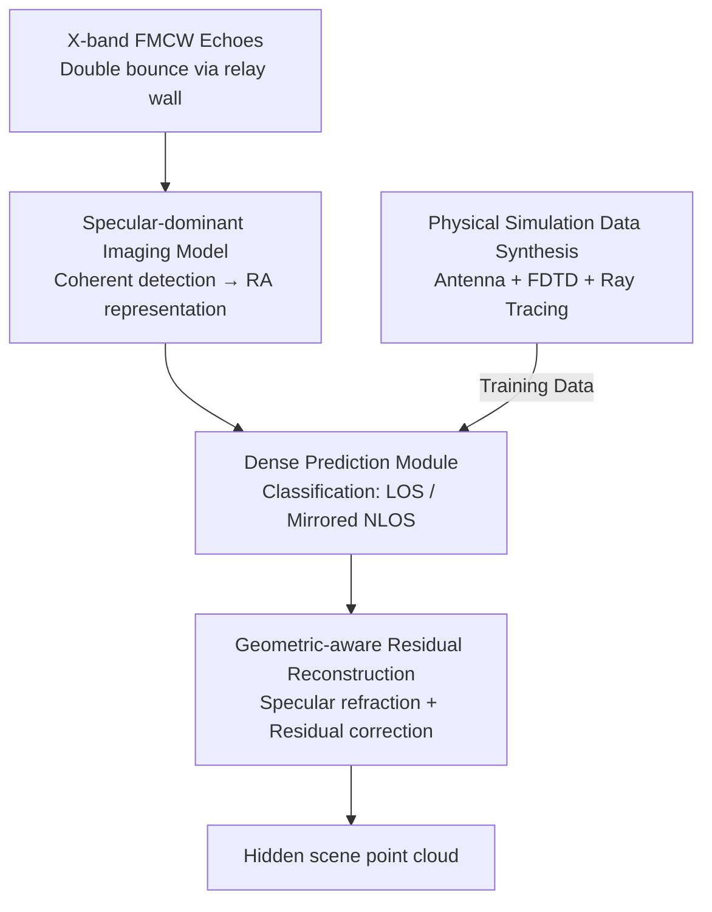

# X-band Radar Non-Line-of-Sight Imaging

**Conference**: CVPR 2026  
**Paper**: [CVF Open Access](https://openaccess.thecvf.com/content/CVPR2026/html/Du_X-band_Radar_Non-Line-of-Sight_Imaging_CVPR_2026_paper.html)  
**Code**: To be confirmed  
**Area**: Computational Imaging / Radar Perception  
**Keywords**: Non-Line-of-Sight Imaging, X-band Radar, Specular Reflection, Geometric-aware Reconstruction, Autonomous Driving Perception

## TL;DR
This work replaces optical and millimeter-wave (mmWave) sensors with 10 GHz X-band radar for non-line-of-sight (NLOS) imaging. By leveraging longer wavelengths, it transforms "diffuse reflection" on rough walls into "specular reflection." A neural network utilizing "dense prediction + geometric-aware residual reconstruction" is employed to counter the low angular resolution inherent in long wavelengths, extending the effective "corner imaging" distance from a few meters (optical) to 40 m in real-world scenarios.

## Background & Motivation
**Background**: NLOS imaging aims to "see around corners"—objects are not in the direct line-of-sight (LOS), but signals emitted or reflected by them reach the sensor after multiple bounces off a relay wall, allowing for the reconstruction of hidden geometry. Over the past decade, most work has focused on optical (visible/IR) bands using SPADs and femtosecond lasers for transient imaging, reconstructed via inverse methods like f-k migration, LCT, or phasor fields.

**Limitations of Prior Work**: Optical NLOS faces a fundamental physical bottleneck: it relies on multiple **diffuse reflections**. Signal strength decays quadratically with distance for each bounce. After two or three bounces, the signal falls below the noise floor, further constrained by eye-safety power limits. Thus, optical NLOS is limited to a range of a **few meters**, making it impractical for outdoor scenarios like autonomous driving requiring decameter-scale perception. Some works shift to mmWave (77 GHz, $\lambda \approx 3.9$ mm), but since the wavelength is comparable to the surface roughness of typical walls ($\sigma \approx 10^{-4}$–$10^1$ mm), the walls remain **strongly diffuse**, resulting in weak energy propagation into hidden zones.

**Key Challenge**: Wavelength is a double-edged sword. Shorter wavelengths offer higher angular resolution and reconstruction accuracy but suffer from severe diffuse scattering and rapid attenuation. Longer wavelengths (X-band 10 GHz, $\lambda = 30$ mm) see walls as "smooth" surfaces where specular reflection dominates, allowing energy to travel further, but at the cost of degraded angular resolution and blurred spatial information. Optical/mmWave systems sacrifice distance for resolution; this work chooses the latter and aims to mitigate the "low resolution" side effect.

**Key Insight**: Free-space path loss increases monotonically with frequency—10 GHz has ~20 dB less loss than 77 GHz and ~150 dB less than optical bands. Simultaneously, surface scattering is strongly suppressed as wavelength increases, significantly raising the specular-to-diffuse ratio. Consequently, at X-band, a rough wall effectively becomes a "mirror," specularly reflecting waves toward the hidden area.

**Core Idea**: **Utilize X-band radar to bring NLOS into the "specular scattering regime" for ultra-long range, then employ neural network reconstruction to recover the angular resolution lost to the long wavelength.** Physical modeling ensures range, while the learning module ensures clarity.

## Method

### Overall Architecture
The system input consists of echoes from an X-band phased-array radar transmitting FMCW signals, received after two bounces off a relay wall. The output is a Cartesian point cloud of the hidden object (NLOS recovery). The pipeline consists of three stages: first, a **specular-dominant NLOS imaging model** is derived to process echoes via coherent detection into a Range-Azimuth (RA) representation; second, a **Swin-UNet dense prediction module** performs pixel-wise peak localization on the blurred RA map, classifying points as LOS or mirrored NLOS (mNLOS); third, a **geometric-aware residual reconstruction module** remaps mNLOS points to their true physical positions based on specular geometry. Training data is synthesized by a **physical simulator**—an end-to-end radar simulator implementing the imaging model.

### Key Designs

**1. Specular-dominant X-band Imaging Model: Collapsing the Wall into a Mirror**

A general NLOS forward model requires a triple integral (Eq. 1) over the relay wall $\Pi$ and hidden object $O$ for all feasible paths $L(\mathbf{w}_1,\mathbf{o},\mathbf{w}_2)$, involving beam patterns $B_t, B_r$, surface reflectances, and path attenuation. This work simplifies this by exploiting X-band physics: at long wavelengths, the wall is nearly specular, and the BRDF $\rho_\Pi(\mathbf{w}_1)$ degenerates into a Dirac delta kernel $\rho_\Pi(\mathbf{w}_1)\approx\alpha(\mathbf{w}_1)\,\delta(\mathbf{n}\mathbf{r}_{\mathbf{w}_1\mathbf{o}}-\mathbf{n}\mathbf{r}_{\mathbf{l}\mathbf{w}_1})$ (Eq. 2). This constraint collapses the triple integral into unique specular points $\mathbf{w}_1^\star, \mathbf{w}_2^\star$ (Eq. 3).

Furthermore, since the wall acts as a mirror, the reflection operator $R_\Pi$ maps the hidden object $O$ to a virtual object $O'$ behind the wall. The NLOS measurement is equivalent to "viewing a virtual scene through a transparent interface" (Eq. 5). Path attenuation simplifies to single-hop free-space propagation: two specular bounces are equivalent to a direct path of length $r_t+r_r$, where power decays with the inverse square of the effective distance $A=1/L^2$ (Eq. 4), rather than the successive squared decay of diffuse reflection. This "diffuse-to-specular" transition provides a $\sim 10\times$ range increase over optical NLOS at equivalent power.

**2. Dense Prediction Module: Peak Extraction and Classification**

Low angular resolution at X-band results in wide, blurred peaks and low SNR in RA maps. Standard CFAR detection misses low-SNR targets and fails to distinguish between LOS and mNLOS echoes. The complex RA measurements $\kappa\in\mathbb{C}^{H\times W}$ are fed into a Swin-UNet Transformer backbone to model long-range spatial dependencies and local geometric details for precise peak localization. The decoded features are projected via linear layers and an element-wise Sigmoid to produce a dense confidence map $c\in[0,1]^{H\times W\times 2}$, where channels encode probabilities of a pixel being an LOS point $\mathbf{w}$ or an mNLOS point $\mathbf{o}'$.

Training utilizes Gaussian heatmaps with focal loss (Eq. 8, $\alpha=2, \beta=4$). Unlike binary labels, Gaussian heatmaps account for peaks naturally spanning multiple RA cells—avoiding the failures of per-cell supervision seen in prior works like "Further Than CFAR." The Transformer's global context is critical; replacing Swin-UNet with a standard UNet drops the Macro-F1 by 21.2%. This step effectively "upsamples" the angular resolution lost due to the long wavelength.

**3. Geometric-aware Residual Reconstruction: Physics-based Remapping with Learning Correction**

The mNLOS points $\mathbf{o}'$ identified by dense prediction are at virtual locations "behind the mirror." They must be "refracted" back to true hidden points $\mathbf{o}$. A naive analytical approach estimates the wall normal $\mathbf{n}$ by clustering LOS points and performs specular reflection. However, sparse LOS sampling makes analytical normals noisy, and non-ideal wall properties (e.g., curves) introduce systematic bias. 

The solution overlays a **learned residual** $\Delta\mathbf{o}_\theta$ on the analytical specular reflection:

$$\mathbf{o} = R_\Pi(\mathbf{o}') + \Delta\mathbf{o}_\theta = \big(\mathbf{o}' - 2(\mathbf{n}^\top\mathbf{o}'+b)\mathbf{n}\big) + \Delta\mathbf{o}_\theta$$

Where $b$ is the wall offset and $\Delta\mathbf{o}_\theta$ is predicted via attention-based aggregation of neighboring points. The residual is supervised by an $\ell_1$ loss between the GT point and the analytical mirror point (Eq. 9). The analytical term provides a strong geometric prior, while the residual term corrects for non-ideal wall deviations. Ablations show that removing the residual drops the reconstruction F1 from 0.45 to 0.40 and increases Chamfer Distance (CD) from 8.2 to 9.2.

**4. Physics-informed Simulation for Data Synthesis: End-to-End Simulation**

Large-scale real-world X-band NLOS data with dense ground truth is difficult to collect. The authors built an end-to-end radar simulator based on the imaging model: it models the 3D radiation pattern, element coupling, and geometry of a 4x8 antenna array; solves reflection coefficients and propagation loss using FDTD; extracts materials and geometry from Unreal Engine; and uses a custom ray tracer to model multi-path propagation. This produced 2,160 RA maps with GT across urban, parking, and residential scenes for training the dense prediction module.

### Loss & Training
Two-stage supervision: The dense prediction module is pre-trained with Gaussian heatmaps and focal loss (Eq. 8), using $(1-c)^{\alpha}\log c$ for positive samples and a distance-weighted $(1-Y)^{\beta}$ decay for negatives ($\alpha=2, \beta=4$). The geometric module uses an $\ell_1$ loss (Eq. 9) to align predicted residuals with the difference between GT and analytical points. The model is trained on simulation data and evaluated on real prototype data.

## Key Experimental Results

### Main Results
Evaluation is split into **Dense Prediction** (localization/classification of points before reflection) and **Reconstruction** (full point cloud after remapping), using Macro-F1 and Chamfer Distance (CD). Baselines include NLOS-CFAR, Further Than CFAR, and RTN. Results on the simulation set (Table 2):

| Method | Dense Pred Macro-F1 ↑ | Rec. F1 ↑ | Rec. CD [m²] ↓ |
|-----------|------|------|------|
| NLOS-CFAR | 0.23 | 0.03 | 29.7 |
| RTN | 0.57 | 0.20 | 14.0 |
| Further Than CFAR | 0.41 | 0.16 | 13.5 |
| **Ours (Proposed)** | **0.85** | **0.45** | **8.2** |

Ours outperforms RTN by 32.9% in Macro-F1 and reduces CD by 65.3% relative to the best baseline. On real prototype data (122 frames across 15 scenes), the mNLOS F1 reached 0.20, successfully reconstructing NLOS vehicles at a distance of 40 m (80 m round-trip).

### Ablation Study

| Configuration | Dense Pred Macro-F1 ↑ | Rec. F1 ↑ | Rec. CD [m²] ↓ | Description |
|------|------|------|------|------|
| Proposed (Full) | 0.85 | 0.45 | 8.2 | Swin-UNet + Residual Reconstruction |
| Proposed w/o residual | 0.85 | 0.40 | 9.2 | Removal of partial learned residual |
| Proposed + UNet | 0.67 | 0.27 | 11.9 | Swin-UNet replaced by standard UNet |

### Key Findings
- **Backbone impacts "visibility" more than the detection head**: Replacing Swin-UNet with UNet dropped Macro-F1 by 21.2%, proving that global Transformer context is essential for distinguishing LOS/mNLOS in low-SNR X-band maps.
- **Learned residuals improve "precision"**: Removing the residual term didn't affect dense prediction F1 but degraded reconstruction CD, indicating its role in correcting non-ideal wall geometries.
- **Cross-modal validation confirms physical intuition**: At an equivalent 1.6 mW power, 850 nm SPAD-LiDAR loses NLOS completely at range; 77 GHz mmWave is still limited by diffuse reflection; only X-band treats the same wall as a mirror, extending the range by $\sim 10\times$.

## Highlights & Insights
- **Geometric prior + learned residual**: This hybrid paradigm (analytical solution + learned correction) is significantly more effective and interpretable than pure end-to-end regression.
- **Gaussian heatmaps for wide peaks**: Radar peaks at long wavelengths naturally span multiple bins; modeling detection as heatmap regression instead of binary classification is a critical design choice.
- **Physics-driven range extension**: Rather than fighting attenuation in optical bands, shifting the physical regime to specular reflection via wavelength choice is a "physical layer" breakthrough.

## Limitations & Future Work
- **Lack of Doppler info**: Current prototypes do not utilize Doppler cues, which could improve dynamic object reconstruction.
- **Sim-to-Real gap**: Performance on real data (F1=0.20) is notably lower than in simulation (F1=0.45).
- **Specular assumption**: The method relies on the wall being near-specular; performance may degrade on extremely rough or complex multi-bounce surfaces.

## Related Work & Insights
- **vs. Optical NLOS**: Optical offers cm-level precision but is range-limited due to diffuse decay. Ours scales range by $10\times$ at the cost of resolution.
- **vs. 77 GHz mmWave**: mmWave still experiences heavy diffuse scattering on standard walls; 10 GHz provides much higher specular-to-diffuse energy throughput.
- **vs. UWB NLOS**: UWB has sufficient range but poor angular resolution (10°–14°); ours achieves 4°.

## Rating
- **Novelty**: ⭐⭐⭐⭐⭐ First to push NLOS into X-band by trading diffuse for specular reflection.
- **Experimental Thoroughness**: ⭐⭐⭐⭐ Includes simulation, real prototype validation, and cross-modal comparisons.
- **Value**: ⭐⭐⭐⭐⭐ Significant potential for autonomous driving "around-the-corner" perception at meaningful distances.

<!-- RELATED:START -->

## Related Papers

- [\[CVPR 2026\] Seeing through boxes: Non-Line-of-Sight 3D Reconstruction from Radar Signals](seeing_through_boxes_non-line-of-sight_3d_reconstruction_from_radar_signals.md)
- [\[CVPR 2026\] DENALI: A Dataset Enabling Non-Line-of-Sight Spatial Reasoning with Low-Cost LiDARs](denali_a_dataset_enabling_non-line-of-sight_spatial_reasoning_with_low-cost_lida.md)
- [\[CVPR 2026\] Kaleidoscopic Scintillation Event Imaging](kaleidoscopic_scintillation_event_imaging.md)
- [\[CVPR 2026\] LocateAnything3D: Vision-Language 3D Detection with Chain-of-Sight](locateanything3d_vision-language_3d_detection_with_chain-of-sight.md)
- [\[CVPR 2026\] RISE: Single Static Radar-based Indoor Scene Understanding](rise_single_static_radar-based_indoor_scene_understanding.md)

<!-- RELATED:END -->
