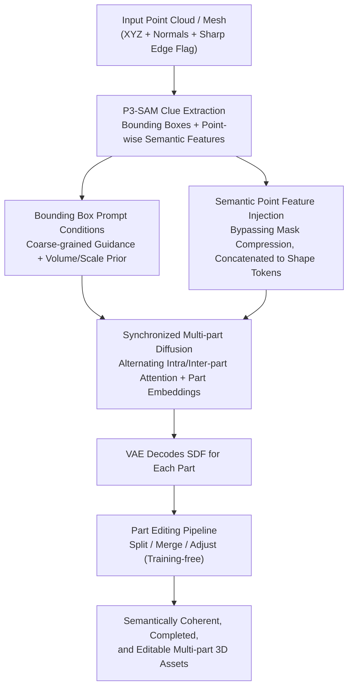

# X-Part: High Fidelity And Structure Coherent Shape Decomposition And Completion

**Conference**: CVPR 2026  
**Paper**: [CVF Open Access](https://openaccess.thecvf.com/content/CVPR2026/html/Yan_X-Part_High_Fidelity_And_Structure_Coherent_Shape_Decomposition_And_Completion_CVPR_2026_paper.html)  
**Code**: To be open-sourced (The paper states it will be released, Project Page: https://yanxinhao.github.io/Projects/X-Part/)  
**Area**: 3D Vision  
**Keywords**: Part-level 3D generation, shape decomposition and completion, multi-part diffusion, bounding box prompt, semantic point feature  

## TL;DR
X-Part decomposes a complete 3D object into semantically meaningful, structurally coherent, and occlusion-completed parts. The core idea is to use "bounding boxes" as part prompts and inject point-wise semantic features as guidance, generating all parts at once in a synchronized multi-part diffusion framework, achieving state-of-the-art (SOTA) performance on both part decomposition and overall generation tasks.

## Background & Motivation
**Background**: In 3D content creation, decomposing a monolithic mesh into "meaningful parts" is crucial—mesh retopology, UV unwrapping, 3D printing, and simulation all rely on part-level structures. Currently, mainstream part generation follows the latent vecset diffusion paradigm (inheriting from 3DShape2VecSet), where each part is represented by an independent set of latent codes. These parts are generated either independently one by one (e.g., HoloPart) or synchronously altogether (e.g., PartCrafter, PartPacker).

**Limitations of Prior Work**: Both types of methods have critical drawbacks. (1) Segmentation-dependent methods (like HoloPart, which directly take 2D/3D segmentation results as input) are highly sensitive to segmentation errors; once the segmentation is inaccurate, the generated part geometry degrades. Furthermore, segmentation only provides "semantic partitioning clues" without completing the full geometry of occluded areas. (2) Segmentation-free methods (e.g., PartCrafter, PartPacker) rely on multi-instance DiTs to automatically generate parts but suffer from **poor controllability** and blurry part boundaries, preventing users from specifying "how many parts to split here and how large they should be." Other methods (e.g., CoPart is limited to at most 8 parts, and OmniPart cannot complete occluded geometry) are constrained by the number of parts and completion capabilities.

**Key Challenge**: The tension between controllability and robustness. Achieving controllability requires fine-grained segmentation (point-level masks), but if these fine-grained signals contain noise, the model **overfits to incorrect segmentation boundaries**. To achieve robustness, one might discard explicit segmentation altogether, but this sacrifices user control over part partitioning.

**Goal**: To simultaneously achieve three goals within a single framework: (1) semantically meaningful parts, (2) plausible completion of occluded/internal geometries, and (3) user controllability and editability.

**Key Insight**: Two key observations by the authors. First, **bounding boxes** are coarser than point-level segmentation. Crucially, this "coarseness" is an advantage: it prevents the model from memorizing the exact boundaries of the input mask (mitigating overfitting) while providing volume and scale priors for parts, which is especially useful for partially occluded parts. Second, the **high-dimensional point-wise semantic features** output by P3-SAM are more robust than its final predicted masks, as the mask prediction head compresses high-dimensional information; directly using semantic features bypasses this information bottleneck.

**Core Idea**: Instead of feeding segmentation masks, the model takes "bounding boxes + point-wise semantic features" as conditions to achieve controllable, robust, and completed part-level decomposition within a synchronized multi-part diffusion process.

## Method

### Overall Architecture
The input is an object point cloud (or point clouds sampled from a watertight mesh generated from an image by an off-the-shelf image-to-3D model), and the output is a set of geometrically complete and semantically plausible part meshes. The overall pipeline is: first use an off-the-shelf native 3D segmenter **P3-SAM** to automatically extract the "initial part segmentation + bounding boxes for each part + point-wise semantic features" from the input point cloud. This step acts only as a **clue extractor** rather than using its raw segmentation as the final output. Next, the pipeline enters the core **synchronized multi-part diffusion**—it injects the global object condition $f_o'$ and individual part conditions $f_p'$ (both concatenated with semantic features) into a DiT. The model generates latent tokens for all $K$ parts simultaneously, which are decoded into SDF/geometries of individual parts by a fine-tuned VAE. Finally, a **training-free part editing pipeline** is introduced to support part splitting, merging, and adjustment.

The entire method is built upon a pre-trained vecset 3D diffusion model: the VAE encodes the point cloud (containing XYZ, normals, and a flag indicating if it is on a sharp edge, totaling 7 dimensions) into latent tokens, and the diffusion model uses flow matching to model the latent space. The authors additionally fine-tune the VAE on part shape datasets and allocate **fewer tokens** to each part (since the geometric complexity of an individual part is much lower than that of the entire object).

### Key Designs

**1. Bounding Box Prompts Instead of Segmentation Masks: Trading 'Coarseness' for Controllability and Robustness against Overfitting**

The most straightforward approach is to directly feed the segmentation results of P3-SAM. However, the authors avoid this because segmentation is point-level and fine-grained, causing the model to easily overfit to these exact (and often noisy) boundaries. Instead, X-Part uses **bounding boxes** as part prompts: points $X_{inbox}$ are sampled from the object point cloud within the designated box, and then encoded into the part condition $f_p = E_p(X_{inbox})$ via a learnable part encoder $E_p$. Bounding boxes act as a coarse-grained guidance, preventing the model from memorizing exact boundaries. Crucially, boxes also convey **volume and scale information**—for partially visible, heavily occluded parts, the box informs the model of the actual physical scale of the part, facilitating geometric completion and controllability. During training, random translation and scaling augmentations are applied to the bounding boxes to enhance robustness against box perturbations at inference time. Note that a part's bounding box might include points from neighboring parts, but using the semantic features and inter-part attention described below, the model can effectively filter out irrelevant points during generation.

**2. High-dimensional Semantic Point Feature Injection: Bypassing Mask Compression Bottlenecks for Better Robustness**

The second observation is that the masks predicted by P3-SAM are less robust than its **intermediate high-dimensional point-wise semantic features**. This is because the mask prediction head compresses rich information into low-dimensional labels, whereas semantic features preserve the complete representation space. X-Part directly interpolates and concatenates the point-wise features from the semantic encoder $E_{sem}$ onto the shape tokens, forming enhanced conditions:

$$f_o' = \mathrm{Concat}(f_o, \mathrm{Interp}(E_{sem}(X), X)), \quad f_p' = \mathrm{Concat}(f_p, \mathrm{Interp}(E_{sem}(X), X_{inbox}))$$

here, $f_o = E_o(X)$ is the global object condition output by the frozen shape VAE encoder, and $f_p$ is the part condition. Semantic features are interpolated based on the downsampled XYZ positions output by the shape encoder to align their quantities with the shape tokens. To prevent the model from over-relying on these high-dimensional features, a random dropout is applied to them during training. This robust semantic guidance ensures that the decomposition yields both semantically meaningful and structurally coherent results.

**3. Synchronized Multi-part Diffusion + Part Embeddings: Alternating Intra/Inter-part Attention to Break the Part-limit Barrier**

X-Part uses **multi-part diffusion** to synchronously generate latents for all parts. An object consists of $K$ parts, concatenated as $O = \mathrm{Concat}(\{z_i\}_1^K) \in \mathbb{R}^{nK \times C}$, with $n$ tokens per part. The diffusion block is repeated $N$ times, where each block consists of one self-attention and two cross-attentions. The key lies in the **alternating odd-even blocks** of self-attention: even blocks compute self-attention **within** each part (intra-part attention, ensuring self-consistent single-part geometry), whereas odd blocks compute self-attention **across all parts** (inter-part attention, exchanging information between parts to coordinate the global structure):

$$\mathrm{Attn}_{intra} = \mathrm{softmax}\!\Big(\tfrac{\sigma_q(z_i)\sigma_k(z_i)^T}{\sqrt{d}}\Big)\sigma_v(z_i), \quad \mathrm{Attn}_{inter} = \mathrm{softmax}\!\Big(\tfrac{\sigma_q(z_i)\sigma_k(O)^T}{\sqrt{d}}\Big)\sigma_v(O)$$

The two cross-attention layers inject the global condition $f_o'$ and part conditions $f_p'$. In addition, a **learnable part embedding codebook** $E \in \mathbb{R}^{l \times C}$ is introduced to assign a unique embedding to each part (repeated $n$ times and added to the corresponding part's tokens), enhancing the distinctiveness between parts. An ingenious design is that, to enable decomposition into more parts than the maximum count found in any single training object, the codebook size $l$ is set **much larger** than practically needed during training, and unique embeddings are randomly assigned to each part. Consequently, inference is free from the maximum part limit of the training set, allowing support for up to **50 parts**. Training uses a flow matching objective: with forward noise $z_t = t z_0 + (1-t)\varepsilon$, the model predicts the velocity field $v = \varepsilon - z_0$:

$$\mathcal{L} = \mathbb{E}_{z,t,\varepsilon}\big\|(\varepsilon - z_0) - v_\theta(z_t, t, f_o', f_p')\big\|^2$$

**4. Training-free Part Editing Pipeline: Splitting, Merging, and Adjusting via Local Resampling**

X-Part seamlessly extends its generative framework into an interactive editing pipeline. Inspired by Repaint, it achieves three kinds of edits **entirely training-free**: part split (splitting a bounding box to generate multiple parts accordingly), part merge (merging parts), and part adjust (modifying a box to regenerate the target part and its neighbors). The mechanism is unified: for the target parts specified by the bounding boxes, their latent tokens are resampled and denoised from scratch, while **the tokens of other parts remain unchanged**. This local modification keeps other parts intact, offering intuitive box-level control for users—a key highlight emphasized as "editable and production-ready."

## Key Experimental Results

Evaluation is conducted on 200 samples of the **ObjaversePart-Tiny** dataset. Merits evaluated include Chamfer Distance (CD↓) and F-Score↑ at two thresholds [0.1, 0.05]. Objects are normalized to $[-1, 1]$, and pose-invariant evaluation is performed by taking the best score across rotations of $[0, 90, 180, 270]$ degrees.

### Main Results

**Part Decomposition (Table 1)**: Given ground-truth watertight meshes as input, the model generates decomposed parts, which are compared against ground-truth parts. Baseline methods include segmentation-based methods (SAMPart3D, PartField, which can only segment the surface and cannot complete full part geometry) and generation-based methods (HoloPart, OmniPart, with their segmentations unified to P3-SAM, and OmniPart is fed with ground-truth 2D masks to eliminate the influence of segmentation quality).

| Method | CD↓ | Fscore-0.1↑ | Fscore-0.05↑ |
|------|------|------------|-------------|
| SAMPart3D | 0.15 | 0.73 | 0.63 |
| PartField | 0.17 | 0.68 | 0.57 |
| HoloPart | 0.26 | 0.59 | 0.43 |
| OmniPart | 0.23 | 0.63 | 0.46 |
| **X-Part (Ours)** | **0.11** | **0.80** | **0.71** |

Even when OmniPart is fed with ground-truth 2D masks, X-Part still consistently outperforms it across all metrics.

**Overall Shape Generation (Table 2)**: Extended to image-to-3D part generation—where watertight meshes are first generated with an off-the-shelf image-to-3D model before being fed into the pipeline for decomposition. Since different methods yield distinct part divisions, making one-to-one matching with ground truth difficult, only the **overall geometry** from assembly of all parts is compared here.

| Method | CD↓ | Fscore-0.1↑ | Fscore-0.05↑ |
|------|------|------------|-------------|
| Part123 | 0.42 | 0.36 | 0.20 |
| HoloPart | 0.09 | 0.88 | 0.73 |
| PartCrafter | 0.20 | 0.66 | 0.45 |
| PartPacker | 0.11 | 0.85 | 0.65 |
| OmniPart | 0.08 | 0.91 | 0.77 |
| **X-Part (Ours)** | **0.08** | **0.92** | **0.78** |

The overall geometric quality also meets or exceeds the strongest baselines, achieving finer decomposition and frequently generating a larger number of semantically reasonable parts.

### Ablation Study

Based on ground-truth bounding boxes, part-level and overall-level metrics are evaluated on ObjaversePart-Tiny (CD↓ / F1-0.1↑ / F1-0.05↑):

| Configuration | Part CD↓ | Part F1-0.1↑ | Part F1-0.05↑ | Details |
|------|---------|-------------|--------------|------|
| Full (Ours) | **0.11** | **0.80** | **0.71** | Full configuration |
| w/o part embedding | 0.13 | 0.78 | 0.68 | No part embeddings, distinctiveness decreases |
| w/o object-cond | 0.12 | 0.79 | 0.70 | No global condition, lacks overall prior |
| **w/o part-cond** | **0.27** | **0.57** | **0.47** | No part conditions, **most severe performance drop** |
| w/o semantic-feat | 0.12 | 0.78 | 0.69 | No semantic features, coherence decreases |
| w/o inter-part self-attn | 0.12 | 0.79 | 0.70 | No inter-part attention, lacks global coordination |

### Key Findings
- **Part condition (bounding box prompt) contributes the most**: removing it causes the part-level CD to jump from 0.11 to 0.27, and F1-0.1 to drop from 0.80 to 0.57. This confirms that "using bounding boxes to specify part locations and scales" is the core of controllable decomposition, without which the model has almost no guidance on where to split.
- The other components (part embeddings, global conditions, semantic features, and inter-part attention) yield moderate but consistent drops, demonstrating their cooperative effect: semantic features govern "semantic coherence", inter-part attention coordinates "global consistency", and part embeddings enhance "part distinctiveness".
- Overall-level metrics are largely insensitive to individual components (remaining mostly around 0.97/0.98). This indicates that these designs primarily improve the **correctness of part partitioning** rather than the overall shape envelope—which is exactly the primary challenge in part-level tasks.

## Highlights & Insights
- **Counter-intuitive design of "coarser is better"**: Bounding boxes are coarser than segmentation masks, but this very coarseness prevents the model from overfitting to noisy segmentation boundaries, while naturally providing volume and scale priors. This concept of "reducing conditioning precision to gain robustness and controllability" can be transferred to other "segmentation-guided generation" tasks (such as 2D part editing and layout generation).
- **Bypassing the mask prediction head to capture intermediate features**: Using P3-SAM's high-dimensional point-wise semantic features instead of its final mask is essentially "utilizing rich upstream representations rather than compressed downstream outputs." This is a versatile trick—whenever using off-the-shelf perception models as conditioning, intermediate features are often much more robust than final discrete predictions.
- **Over-initializing the codebook to bypass the part-limit**: Setting the part embedding codebook size far larger than the actual part counts during training and randomly assigning them enables inference to support up to 50 parts without being bottlenecked by the training distribution. This technique of "intentional over-parameterization during training to generalize to more instances" is extremely clever.
- **Training-free editing strictly via local resampling**: Splitting, merging, and adjusting are unified under the mechanism of "resampling only target part tokens while freezing the rest." This brings interactive editability without any extra training, rendering it highly practical for engineering pipelines.

## Limitations & Future Work
- The authors acknowledge that the method **relies purely on geometric clues** for decomposition, lacking physical principles. Consequently, it cannot satisfy task-specific decomposition requirements that demand physical reasoning (e.g., splitting based on movable joints or load-bearing structures).
- Since the latents of all parts are simultaneously processed through the diffusion steps, **inference time scales with the number of parts**, making real-time performance difficult with numerous parts—a severe bottleneck for highly detailed objects.
- Independent critique/limitations: The performance heavily relies on the quality of P3-SAM. Although bounding boxes and semantic features mitigate segmentation noise, the initial clues still originate from P3-SAM. If it completely fails on certain object categories, both the bounding boxes and semantic features will be misleading. Furthermore, evaluations are only conducted on 200 samples of ObjaversePart-Tiny, lacking sufficient validation on out-of-domain/real-world scanned datasets.
- Future directions: Incorporating physical/mobility priors to perform physics-aware decomposition; using sparse or hierarchical part tokens to mitigate the linear relationship between part counts and inference time.

## Related Work & Insights
- **vs HoloPart**: HoloPart completes geometry for each part independently based on 3D segmentations, making it highly sensitive to segmentation errors. X-Part adopts bounding boxes + semantic features for synchronized multi-part generation, yielding significantly higher part decomposition quality (CD 0.11 vs. 0.26) and better robustness against segmentation noise.
- **vs PartCrafter / PartPacker**: These methods do not rely on explicit segmentations and extract parts automatically via multi-instance DiTs, resulting in poor controllability and blurry boundaries. X-Part reclaims user control with bounding box prompts and is capable of completing occluded geometry.
- **vs OmniPart**: OmniPart also employs bounding box prompts and relies on Trellis-based explicit representations, but it cannot complete occluded geometry and requires generating coarse geometry beforehand. X-Part directly performs decomposition and completion on existing 3D shapes, outperforming OmniPart even when the latter is fed with ground-truth masks.
- **vs CoPart / BANG / AutoPartGen**: CoPart supports up to 8 parts and cannot decompose existing shapes; BANG utilizes explosive decomposition but easily loses fine geometric details; AutoPartGen generates parts autoregressively, which is computationally expensive and offers weak control. X-Part is comprehensively superior in terms of part count (up to 50), controllability, and completion capability.

## Rating
- Novelty: ⭐⭐⭐⭐ The conditioning design of "bounding box prompts + intermediate semantic features" is highly counter-intuitive and clever, though the synchronized multi-part diffusion framework inherits from the PartCrafter paradigm.
- Experimental Thoroughness: ⭐⭐⭐⭐ It evaluates both decomposition and overall generation tasks, compares against multiple strong baselines, and ablation studies clearly identify part conditioning as the core; however, evaluation is restricted to a dataset of only 200 samples.
- Writing Quality: ⭐⭐⭐⭐ The derivation of motivations and conditioning design are clearly explained, and the three experimental tables are self-consistent.
- Value: ⭐⭐⭐⭐ Directly serves the 3D asset production pipeline (retopology, UV mapping, editing); controllable, completed, and editable part-level decomposition holds high practical value.

<!-- RELATED:START -->

## Related Papers

- [\[CVPR 2026\] EI-Part: Explode for Completion and Implode for Refinement](ei-partexplode_for_completion_and_implode_for_refinement.md)
- [\[CVPR 2026\] Multi-modal Frequency Decomposition Network for Semantic Scene Completion](multi-modal_frequency_decomposition_network_for_semantic_scene_completion.md)
- [\[CVPR 2026\] Unified Primitive Proxies for Structured Shape Completion](unified_primitive_proxies_for_structured_shape_completion.md)
- [\[CVPR 2026\] Learning 3D Shape Fidelity Metric from Real-world Distortions](learning_3d_shape_fidelity_metric_from_real-world_distortions.md)
- [\[CVPR 2026\] HyperGaussians: High-Dimensional Gaussian Splatting for High-Fidelity Animatable Face Avatars](hypergaussians_high-dimensional_gaussian_splatting_for_high-fidelity_animatable_.md)

<!-- RELATED:END -->
