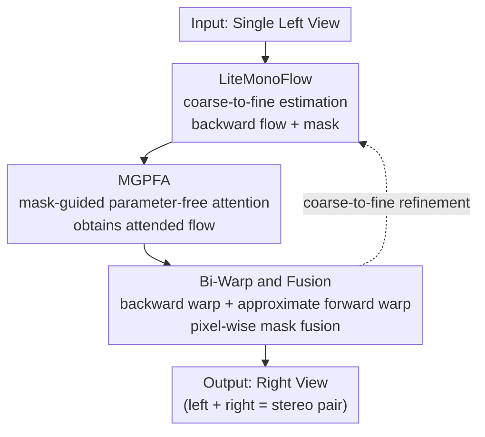

# XPaintNet: An eXtreme Lightweight Framework for Stereoscopic Conversion without Inpainting Network

**Conference**: CVPR 2026  
**Paper**: [CVF Open Access](https://openaccess.thecvf.com/content/CVPR2026/html/Yoon_XPaintNet_An_eXtreme_Lightweight_Framework_for_Stereoscopic_Conversion_without_Inpainting_CVPR_2026_paper.html)  
**Code**: To be confirmed  
**Area**: 3D Vision  
**Keywords**: Stereoscopic conversion, 2D-to-3D, Bidirectional Warp, Real-time rendering, Optical flow

## TL;DR
To address the issues of slow performance and artifacts at occlusion boundaries in the traditional "depth estimation + forward warping + heavy inpainting network" pipeline for 2D-to-3D stereoscopic conversion, this paper proposes Bi-Warp (bidirectional warp fusion) to completely eliminate the inpainting network. Based on this, a lightweight network named XPaintNet is constructed, which achieves 100+ FPS at 2K resolution while matching SOTA quality.

## Background & Motivation

**Background**: The goal of stereoscopic conversion is to synthesize a corresponding right view from a single left view to form a stereoscopic pair for AR/VR/3D displays. Mainstream approaches fall into two categories: geometric methods first estimate disparity/depth and then forward-warp the left view to the right view position; appearance-based methods (such as Deep3D) directly use disparity-weighted blending of the left view. Recently, diffusion-based methods have emerged, directly "hallucinating" the right view using learned priors.

**Limitations of Prior Work**: Forward warping inevitably leaves holes in disoccluded regions (backgrounds invisible in the left view but revealed in the right view), which requires an auxiliary inpainting network for completion. This not only increases computational overhead but also generates pixels out of "thin air" without geometric constraints, leading to left-right view inconsistencies and halos/blurred boundaries. While diffusion-based methods produce visually pleasing quality, they require iterative sampling and are far too slow for real-time applications. Moreover, they often hallucinate structures entirely absent in the left view, causing stereo discomfort when viewed as a pair.

**Key Challenge**: The prior for the right view is non-existent, and forward warping is inherently non-invertible, making hole formation inevitable. The act of hole-filling itself conflicts with maintaining left-right geometric consistency—the more one tries to inpaint unobserved regions, the easier it is to disrupt stereoscopic alignment. Furthermore, geometric methods generally assume an ideal rectified parallel camera setup and only model horizontal disparity. However, real-world footage often contains residual vertical disparity (due to rig misalignment, lens asymmetry, electronic image stabilization, cropping, etc.), and pure horizontal warping tends to tear at depth discontinuities.

**Goal**: (1) Handle disocclusion without introducing an inpainting network; (2) dispense with the ideal rectification assumption that only models horizontal disparity; (3) compress the entire pipeline to achieve true real-time performance (2K @ 100+ FPS).

**Key Insight**: The authors re-examine the warping operation itself: forward warping preserves geometry in valid regions but leaves holes, while backward warping (sampling pixels from the observed left view via grid sampling) produces blurriness at occlusion boundaries but provides dense coverage of disoccluded regions. These two are spatially complementary. Since backward warping can fill the background using "neighboring observed pixels," there is no need for generative inpainting. Additionally, the method switches from 1D disparity to a 2D vector field (optical flow) to model both horizontal and vertical displacements.

**Core Idea**: Use "bidirectional warping + learnable mask fusion" to replace the inpainting network, which both maintains geometric consistency and eliminates the heaviest computational bottleneck.

## Method

### Overall Architecture

XPaintNet takes a single left view $I_L$ as input and outputs the corresponding right view $\hat I_R$, without using any inpainting networks in the entire pipeline. It adopts a coarse-to-fine structure connecting three components: the **LiteMonoFlow** lightweight unidirectional optical flow estimator first predicts the backward flow $F_{R\to L}$ and a fusion mask $M$; the **MGPFA** module weights the optical flow using the mask to obtain the attended flow (without introducing any learnable parameters); **Bi-Warp and Fusion** uses this flow to perform both backward warping and an approximated forward warping (derived from the backward-forward relationship) to yield two complementary candidate right views, which are then fused pixel-by-pixel using the mask. During training, a **Bi-Warp Perceptual Refinement Loss** is additionally employed to specifically reinforce the disoccluded regions selected by backward warping.

### Key Designs

**1. LiteMonoFlow: Unidirectional Flow Estimation with 2D Vector Fields instead of Horizontal Disparity**

Addressing the two pain points of "invalidity of ideal rectification assumption + heavy computation of bidirectional flow". The authors first present a toy experiment demonstrating that while displacement in an ideal parallel rig is 1D ($u=\tfrac{fb}{Z},\ v\approx 0$, where $f$ is focal length, $b$ is baseline, $Z$ is depth), practical pitch/roll misalignments, off-axis, and toe-in setups generate a residual vertical disparity $v(x,y,Z)\approx \tfrac{f\theta_x + f(-t_y + y_n t_z)}{Z}$, causing significant y-axis motion at depth boundaries. Therefore, XPaintNet employs 2D optical flow (modeling both horizontal and vertical components) instead of pure horizontal disparity. The paper empirically shows that a "Vertical Component Gain Map" reduces holes and tears. The optical flow estimation itself is made extremely lightweight: each pyramid level takes a $1/N$ ($N\in\{4,2,1\}$) downsampled input, applies pixel-unshuffle to fold spatial details into channels (reducing line-buffer pressure and improving locality), passes through 8 consecutive convolutional layers, and then applies pixel-shuffle to reconstruct the original resolution flow. This design deliberately avoids heavy residual/attention blocks and long skip connections, enabling deployment on memory-constrained edge devices. The key trade-off is **estimating only unidirectional backward flow**: during end-to-end learning with image reconstruction (photometric/perceptual) loss, supervising forward flow in disoccluded regions is ill-posed (non-invertible mapping, undefined targets), whereas supervising backward flow provides dense and stable signals via backward sampling from the observed left view. The other direction is then approximated based on forward-backward consistency.

**2. MGPFA: Reusing the Fusion Mask as a "Zero-Parameter" Attention Map**

Targeting the issue "demanding stronger supervision at disocclusion boundaries without introducing extra parameters/computation." The confidence mask $M\in[0,1]$ estimated by LiteMonoFlow implicitly encodes occluded/disoccluded regions, serving naturally as an attention map indicating where blurriness is present and where stronger supervision is needed. Thus, the authors directly design the Mask-Guided Parameter-Free Attention: $F^{att}_{R\to L}=F_{R\to L}+(F_{R\to L}\odot M)$, where $\odot$ denotes element-wise multiplication. This effectively reforms a simple attention mechanism into a parameter-free manner, which demands zero extra computation while providing stronger learning signals to regions near disoccluded boundaries, noticeably sharpening fine details and thin structures.

**3. Bi-Warp and Fusion: Complementary Bidirectional Warping to Replace the Inpainting Network**

This is the core contribution of the paper, directly addressing the tension between "forward warping leaving holes" and "inpainting disrupting geometric consistency." For simplicity, the pipeline is benchmarks against the estimated backward flow $F_{R\to L}$: first, backward warping yields $\tilde I^{BW}_R(x)=W_{bw}(x,F_{R\to L})=I_L(x+F_{R\to L}(x))$, which densely covers disoccluded regions but is blurry around occlusions. Then, the forward flow is approximated from the backward flow as $F_{L\to R}\approx A(F_{R\to L})=-W_{bw}(F_{R\to L},-F_{R\to L})$. Forward warping is applied to get $\tilde I^{FW}_R(x)=W_{fw}(x,F_{L\to R})$, which preserves sharp geometry in valid regions but leaves holes in disoccluded areas. Finally, a learnable pixel-wise mask is used for fusion:

$$\hat I_R = M\odot \tilde I^{FW}_R + (1-M)\odot \tilde I^{BW}_R$$

The mask adaptively selects sharp details from the forward warp in reliable regions and dense coverage from the backward warp in disoccluded regions. The "unidirectional flow estimation + bidirectional approximation" design brings two benefits: it reduces parameters/latency and structurally enforces forward-backward consistency. The fundamental difference from inpainting is that Bi-Warp **reuses observed pixels instead of hallucinating unobserved content**, ensuring inherent left-right geometric alignment. This fusion module incurs almost zero extra cost ($\approx 0$ MACs/params).

### Loss & Training

The total training loss is $L_{total}=\alpha\cdot L_{bi\text{-}perc}+L_1$ with $\alpha=0.5$. The **Bi-Warp Perceptual Refinement Loss** is designed specifically to mitigate weak supervision, blurriness/drift, and unstable fusion masks in disoccluded regions covered by backward warping:

$$L_{bi\text{-}perc}=\sum_l (1-M)\odot \big(\phi_l(\hat I_R)-\phi_l(I_R)\big)^2$$

where $\phi_l(\cdot)$ represents the $l$-th layer activation of a pre-trained feature extractor (e.g., VGG/Alex). The weight $(1-M)$ concentrates the perceptual penalty on disoccluded areas covered by backward warping, enhancing sharp, geometrically consistent synthesis without an inpainting network, while stabilizing the mask. Training uses 110K high-quality stereoscopic movie pairs (merging MiDaS movie training data and Mono2Stereo training data, keeping MiDaS preprocessing). It is optimized via Adam with a cosine annealing scheduler, starting at 1e-4, decaying by 0.5 every 300K iterations, for a total of 1M iterations, with batch size 8 on a single RTX 3090 GPU.

## Key Experimental Results

Evaluation and benchmarking are performed using LPIPS (perceptual similarity), SIoU (disparity consistency/edge alignment), and iSQoE (VR stereoscopic viewing comfort) on Mono2Stereo (5 subsets) and the Inria3D movie dataset. All efficiency statistics are measured in FP32 on a single RTX 3090 GPU.

### Main Results

**Bi-Warp vs Inpainting Networks (512×512, standardized using DepthAnything V2 for depth estimation + forward warping followed by hole-filling)**: Bi-Warp outperforms inpainting/diffusion methods in both perceptual and geometric metrics, while cutting efficiency costs by 1 to 2 orders of magnitude.

| Method (Inpainting Module) | Mono2Stereo LPIPS↓ | Mono2Stereo SIoU↑ | Inria3D LPIPS↓ | MACs(G) | Params(M) | Latency (ms) |
|------|------|------|------|------|------|------|
| FuseFormer | 0.146 | 0.262 | 0.193 | 72.69 | 61.38 | 25.34 |
| ProPainter | 0.130 | 0.260 | 0.171 | 591.31 | 64.22 | 243.55 |
| StrDiffusion | 0.133 | 0.262 | 0.174 | 782916.55 | 325.26 | 103715.45 |
| StereoCrafter | 0.233 | 0.237 | 0.246 | 5913.37 | 2279.24 | 1137.35 |
| **Bi-Warp (Ours)** | **0.079** | **0.306** | **0.122** | **40.55** | **24.79** | **14.27** |

**XPaintNet vs SOTA Stereoscopic Conversion Networks (2K Resolution)**: XPaintNet achieves the best LPIPS on Mono2Stereo and ranks second (tied with Mono2Stereo) on Inria3D, while significantly outperforming others in efficiency—achieving 109 FPS with only 15.04 GMACs and 1.48M parameters.

| Method | Mono2Stereo LPIPS↓ | SIoU↑ | iSQoE↓ | MACs(G) | Params(M) | FPS |
|------|------|------|------|------|------|------|
| Deep3D | 0.115 | 0.279 | 0.621 | 190.17 | 1.8 | 17.92 |
| StereoCrafter | 0.233 | 0.237 | 0.700 | 46069.58 | 2254.45 | 0.01 |
| Mono2Stereo | 0.109 | 0.265 | 0.621 | 75852.08 | 974.37 | 0.12 |
| **XPaintNet (Ours)** | **0.092** | **0.293** | **0.618** | **15.04** | **1.48** | **109.05** |

### Ablation Study

The baseline is "weighted fusion of forward/backward warps without masks." Stepwise incorporation of Bi-Warp (with mask), MGPFA, and Refinement Loss monotonically decreases LPIPS.

| Bi-Warp | MGPFA | $L_{bi\text{-}perc}$ | Mono2Stereo LPIPS↓ | SIoU↑ | iSQoE↓ |
|------|------|------|------|------|------|
| ✗ | ✗ | ✗ | 0.356 | 0.256 | 0.668 |
| ✗ | ✓ | ✗ | 0.221 | 0.277 | 0.659 |
| ✓ | ✗ | ✗ | 0.138 | 0.289 | 0.652 |
| ✓ | ✓ | ✗ | 0.099 | 0.292 | 0.631 |
| ✓ | ✓ | ✓ | **0.092** | **0.293** | **0.618** |

A brief vertical component toy experiment (Tab.1, Mono2Stereo) compares horizontal-only vs horizontal+vertical warping: PSNR improves from 30.954 to 31.301 (+0.353), LPIPS from 0.081 to 0.077, SIoU from 0.488 to 0.502, and iSQoE from 0.643 to 0.638. This demonstrates stable gains in modeling vertical motion even on nominally rectified materials.

### Key Findings
- The largest contributor is **Bi-Warp itself**: pushing LPIPS from the baseline (0.356) to 0.138, thanks to explicit estimation of occluded regions and complementary bidirectional warping, which significantly improves hole and boundary stability.
- MGPFA further drives LPIPS from 0.138 to 0.099 (Bi-Warp + MGPFA), mainly recovering fine details such as textures and thin structures without adding any parameters.
- The Refinement Loss further compresses LPIPS from 0.099 to 0.092, and improves iSQoE from 0.631 to 0.618, primarily sharpening boundaries and high-frequency regions.
- Efficiency "Aha!" moment: The Bi-Warp/Fusion module itself costs $\approx 0$ MACs/params. In Tab.2, the 40.55 GMACs almost entirely originate from the DepthAnything V2 backbone. When replaced with the end-to-end LiteMonoFlow, the entire network requires only 15.04 GMACs at 2K.

## Highlights & Insights
- **Replacing "hallucinated inpainting" with "complementary geometry"**: By casting the disocclusion problem from a generative one into a pure geometric problem of "forward warp (sharpness) + backward warp (dense coverage) + mask fusion," the heaviest inpainting network is removed while ensuring structural consistency between left and right views—this is the cleverest aspect of the paper.
- **Triple-use of the mask**: The same confidence mask serves simultaneously as the fusion weight, the parameter-free attention map (MGPFA), and the spatial mask for the perceptual loss $(1-M)$, extracting maximum utility from the "unreliability" information with zero extra parameters.
- **Unidirectional flow estimation + bidirectional approximation**: The approximation $F_{L\to R}\approx -W_{bw}(F_{R\to L},-F_{R\to L})$ halves the computational cost of the optical flow network and inherently enforces forward-backward consistency, which is key to making "extreme lightweight" design viable.
- **Transferability**: The approach of "stable backward flow supervision + bidirectional warp fusion" can be transferred to other tasks facing disocclusion, such as frame interpolation and novel view synthesis.

## Limitations & Future Work
- The authors acknowledge that the pipeline only relies on grid sampling from the left view to "stabilize" unobserved regions and **cannot truly generate non-existent structures**. When the disoccluded background is entirely absent in the left view, it remains ineffective. The authors leave "geometry-aware completion" for future work.
- Self-observation: Implementation details regarding edge-device real-time efficiency and comparisons with diffusion baselines like StereoCrafter are relegated to the supplementary material, making them unverifiable in the main text. Additionally, performance metrics are all evaluated under FP32 on a single RTX 3090, leaving the relative rankings under other hardware/precisions unknown.
- Backward warping remains somewhat blurry at occlusion boundaries; although mitigated by MGPFA and Refinement Loss, it is not fundamentally resolved. The performance on Inria3D is still slightly inferior to Mono2Stereo, indicating that pure geometric reuse has a lower upper bound than generative methods in certain scenarios.
- Ideas for improvement: In regions with extremely low mask confidence where no observations are available in either view, on-demand integration of an extremely lightweight, geometrically constrained completion branch could serve as a fallback for Bi-Warp.

## Related Work & Insights
- **vs Deep3D (Appearance-based)**: Deep3D uses disparity-weighted blending of the left view, implicitly assuming ideal rectification and pure horizontal disparity, resulting in blurry high-frequency regions. XPaintNet models both horizontal and vertical displacements via 2D optical flow and explicitly performs geometric warping, producing sharper boundaries (2K LPIPS 0.092 vs 0.115).
- **vs Mono2Stereo (Geometric/Generative)**: Mono2Stereo excels in overall quality but requires 75,852 GMACs, running at 0.12 FPS, and often loses structural elements like text and thin lines. XPaintNet achieves comparable or better LPIPS with approximately 1/5000 of the computation, running in true real-time at 109 FPS.
- **vs StereoCrafter (Diffusion-based)**: Diffusion-based methods produce visually pleasing individual right views but often hallucinate structures absent in the left view, disrupting stereoscopic consistency (poor iSQoE of 0.700) and running slowly at 0.01 FPS due to iterative sampling. XPaintNet avoids hallucination by solely reusing observed pixels, enjoying superior stereoscopic comfort (iSQoE 0.618) and speed.
- **vs Inpainting Networks (ProPainter/FuseFormer, etc.)**: These can patch small holes but result in blurred edges and lost textures in large disoccluded regions. Bi-Warp replaces them with dense geometric coverage from backward warping, delivering better LPIPS (0.079 vs 0.130 at 512×512) while saving the entire hole-filling network.

## Rating
- **Novelty**: ⭐⭐⭐⭐⭐ The formulation of "eliminating the inpainting network and exploiting complementary bidirectional warps with mask fusion" is clean, counter-intuitive, and highly effective.
- **Experimental Thoroughness**: ⭐⭐⭐⭐ Includes two sets of main comparisons, abaltions, and a vertical component toy experiment. However, critical validations such as edge device latency and approximation validity are relegated to the supplementary materials.
- **Writing Quality**: ⭐⭐⭐⭐ Clear logical progression: motivation $\to$ analysis $\to$ method. The formulas are complete; though some details (such as whether efficiency in Tab.2 includes the backbone) require careful reading.
- **Value**: ⭐⭐⭐⭐⭐ 2K @ 100+ FPS with only 1.48M parameters has high deployment value for AR/VR/3D displays.

<!-- RELATED:START -->

## Related Papers

- [\[CVPR 2026\] Elastic3D: Controllable Stereo Video Conversion with Guided Latent Decoding](elastic3d_controllable_stereo_video_conversion_with_guided_latent_decoding.md)
- [\[CVPR 2026\] Emergent Extreme-View Geometry in 3D Foundation Models](emergent_extreme-view_geometry_in_3d_foundation_models.md)
- [\[CVPR 2026\] Seele: A Unified Acceleration Framework for Real-Time Gaussian Splatting on Mobile Devices](seele_a_unified_acceleration_framework_for_real-time_gaussian_splatting_on_mobil.md)
- [\[CVPR 2025\] A Lightweight UDF Learning Framework for 3D Reconstruction Based on Local Shape Functions](../../CVPR2025/3d_vision/a_lightweight_udf_learning_framework_for_3d_reconstruction_based_on_local_shape_.md)
- [\[CVPR 2026\] DiffSoup: Direct Differentiable Rasterization of Triangle Soup for Extreme Radiance Field Simplification](diffsoup_direct_differentiable_rasterization_of_triangle_soup_for_extreme_radian.md)

<!-- RELATED:END -->
