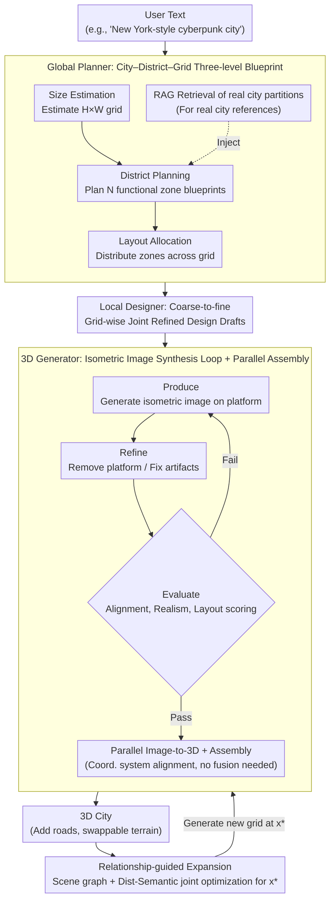

# Yo'City: Personalized and Boundless 3D Realistic City Scene Generation via Self-Critic Expansion

**Conference**: CVPR 2026  
**arXiv**: [2511.18734](https://arxiv.org/abs/2511.18734)  
**Code**: To be confirmed  
**Area**: 3D Vision  
**Keywords**: 3D City Generation, Multi-Agent Framework, Hierarchical Planning, Isometric Image Synthesis, Scene Graph Expansion, LLM-driven

## TL;DR

The Yo'City multi-agent framework is proposed, achieving personalized text-driven boundless 3D city generation through a "City–District–Grid" hierarchical planning, a "Produce–Refine–Evaluate" isometric image synthesis loop, and a scene graph-guided expansion mechanism. The method comprehensively outperforms existing approaches like SynCity in semantic consistency and visual quality.

---

## Background & Motivation

**High demand for 3D city models**: Applications in virtual reality, gaming, urban planning, digital twins, and robotic simulation rely heavily on high-quality 3D city models, yet manual modeling is extremely time-consuming.

**Limitations of prior work**: Procedural modeling and image-based reconstruction methods rely on manual rules or street-view data, offering poor scalability. GAN- or diffusion-based methods require map or satellite data for training, making them difficult to handle user text input.

**Issues with SynCity**: SynCity employs an autoregressive tile-by-tile pipeline. It lacks explicit hierarchical planning, leading to spatial inconsistencies (e.g., some tiles being too dense while others are sparse), blurry textures, and simplified geometries during large-scale city generation.

**Opportunities in LLM/VLM**: The world knowledge and reasoning capabilities of Large Language Models (LLMs) offer new possibilities for urban planning, yet agentic 3D city generation remains largely unexplored.

**Key Challenge**: Cities are open, large-scale, and highly structured spaces. The diversity of objects and spatial density far exceed those of indoor scenes, requiring sophisticated hierarchical reasoning and expansion mechanisms.

---

## Method

### Overall Architecture

Yo'City addresses a complex challenge: starting from a single user text prompt (e.g., "build a New York-style cyberpunk city"), the system must determine the city's scale, functional zones, and individual grid designs, eventually assembling a geometrically consistent, infinitely expandable 3D city. It decomposes the task into a "plan-generate-expand" pipeline executed by four agent modules: the **Global Planner** conceptualizes the abstract text into a city-level layout; the **Local Designer** refines the layout into detailed designs for each grid; the **3D Generator** converts these designs into aligned 3D assets; and the **Expansion Module** enables the city to grow outward.

The entire city is modeled as an $H \times W$ grid $\mathcal{T} = \{0, \ldots, H-1\} \times \{0, \ldots, W-1\}$, where each tile $(x, y)$ corresponds to a 3D scene. Unlike SynCity's tile-by-tile autoregressive approach, which requires each tile to reference previously generated neighbors, Yo'City generates all tiles **in parallel** after a global blueprint is established. Since the layout is unified during the planning phase, causal dependencies between tiles are removed, preventing error accumulation while significantly increasing generation speed.

### Key Designs

**1. Global Planner: Hierarchical decomposition into a City–District–Grid blueprint**

Asking an LLM to output a full city layout in one step often results in uneven density and a lack of organized structure. The Global Planner decomposes this into three steps: **Size Estimation** determines the city dimensions $H \times W$; **District Planning** defines $N$ functional zones and generates a set of blueprints $\{B_i \mid i=1,\ldots,N\}$ detailing the purpose and architectural types for each zone; and **Layout Allocation** places these zones onto the grid based on proximity constraints. When a user references a real city, a RAG mechanism retrieves real-world partition structures from Wikipedia, which are refined by GPT-4o-mini to provide an evidence-based foundation for the planning.

**2. Local Designer: Coarse-to-fine grid refinement**

The blueprints $\{B_i\}$ constitute high-level functional divisions. The Local Designer uses $B_i$ and the global prompt $p_0$ to generate detailed designs $\{d_i \mid i=1,\ldots,H \times W\}$ for every grid cell, specifying architectural styles, density, landmarks, and surroundings. Critically, it performs **joint planning** for all grids within the same functional zone rather than generating them in isolation, ensuring spatial and stylistic coherence. This hierarchical refinement allows the LLM to apply implicit reasoning, resulting in more realistic urban layouts.

**3. 3D Generator: Produce–Refine–Evaluate isometric image loop**

Directly inputting grid descriptions $d_i$ into text-to-image models often results in misaligned objects or clipped buildings. The 3D Generator utilizes an iterative loop: **Produce** generates an initial isometric image on a predefined ground platform that acts as a common anchor for scale and spatial alignment; **Refine** edits the image to remove the platform, fix geometric artifacts, and enhance visual diversity; **Evaluate** uses a specialized evaluator to score alignment, realism, and layout. Only images passing the threshold are converted to 3D via Hunyuan3D. Because assets are anchored to the same platform and share a coordinate system, they can be assembled without complex 3D fusion.

**4. Relationship-guided Expansion: Scene graph + Joint optimization for boundless growth**

Real cities follow proximity rules—residential areas are near schools while industrial zones stay distant. The expansion module formulates this as an optimization problem. Given an existing city, a VLM generates a description $d_{\text{new}}$ for a new grid and constructs a **scene graph** where edges encode qualitative distance relationships (near, far, etc.). A Breadth-First Search (BFS) identifies candidate positions $\mathcal{X}$, and the optimal location $x^*$ is found by balancing spatial relationships and semantic compatibility. The spatial term $L_{\text{dist}}$ is defined as:

$$L_{\text{dist}}(x) = \sum_{g \in \mathcal{G}} \gamma_{r(g)} \|x - g\|_2$$

where $\gamma_{r(g)}$ denotes proximity (positive) or separation (negative) weights. The semantic term $L_{\text{sem}}$ encourages compatibility with neighbors:

$$L_{\text{sem}}(x) = -\sum_{y \in \mathcal{N}(x)} \text{Embedding\_Sim}(d_{\text{new}}, d_y)$$

The final target is:

$$x^* = \arg\min_{x \in \mathcal{X}} \left[ L_{\text{dist}}(x) + \lambda \, L_{\text{sem}}(x) \right]$$

---

## Key Experimental Results

### Main Results

**Table 1: City-level Quantitative Comparison (VQAScore + GPT-5/Human win rate)**

| Method | VQAScore | Geometry Fidelity (GPT-5/Human) | Texture Clarity (GPT-5/Human) | Layout Coherence (GPT-5/Human) | Overall Realism (GPT-5/Human) |
|------|----------|--------------------------|--------------------------|--------------------------|--------------------------|
| Trellis | 0.6189 | 6.5% / 7.0% | 4.5% / 6.0% | 6.5% / 3.5% | 9.0% / 5.0% |
| Hunyuan3D | 0.6198 | 12.0% / 7.0% | 12.5% / 9.5% | 7.0% / 5.5% | 12.0% / 6.5% |
| CityCraft | 0.5639 | 9.5% / 8.0% | 6.0% / 6.0% | 15.0% / 16.5% | 12.0% / 13.5% |
| SynCity | 0.6975 | 15.0% / 12.0% | 21.5% / 18.5% | 14.0% / 10.5% | 15.5% / 12.0% |
| **Ours** | **0.7151** | **85.0–93.5%** | **78.5–95.5%** | **85.0–93.5%** | **84.5–95.0%** |

Ours dominates across all dimensions, achieving the highest VQAScore and a win rate of over 78.5% against the strongest baseline, SynCity.

**Table 2: Grid-level Comparison (SynCity vs. Ours)**

| Method | Alignment Score | Aesthetic Score |
|------|----------------|-----------------|
| SynCity | 0.6572 | 4.95 |
| **Ours** | **0.6927** (+0.0355) | **5.52** (+0.57) |

### Ablation Study

**Table 3: Impact of Coarse-to-fine Planning**

| Metric | w/o reasoning | w/ reasoning |
|------|-----------|-----------|
| VQAScore | 0.7034 | **0.7151** |
| Layout Coherence (win rate) | 27.0% | **73.0%** |
| Overall Realism (win rate) | 24.5% | **75.5%** |

Hierarchical reasoning (Global Planner + Local Designer) improves layout coherence win rates by 46%, validating the necessity of the approach.

---

## Highlights & Insights

- **First hierarchical agentic city generation framework**: The "City–District–Grid" structure mimics real urban logic, proving superior to flat tile-by-tile methods.
- **Parallel generation breakthrough**: By removing causal dependencies between tiles, error accumulation is avoided and speed is significantly enhanced.
- **RAG-enhanced realism**: Injecting real-world knowledge from Wikipedia ensures that descriptive prompts have factual grounding.
- **Produce–Refine–Evaluate loop**: The self-critic feedback mechanism effectively addresses spatial alignment issues in vanilla text-to-image models.
- **Relationship-guided expansion**: Scene graph and joint optimization allow for boundless growth that respects urban proximity principles.

---

## Limitations & Future Work

1. **Dependence on closed-source models**: The pipeline relies on proprietary APIs (GPT-4o, Hunyuan3D), which limits reproducibility and increases costs.
2. **Subjectivity in evaluation**: Quality assessments rely heavily on pairwise comparisons by GPT-5 and humans; there is a lack of objective geometric metrics.
3. **Lack of real-world data comparison**: Reconstruction accuracy against real-world data like Google Earth has not been evaluated.
4. **Risk of semantic drift**: Long-term stylistic consistency over dozens of expansion steps remains to be fully verified.
5. **Hard grid boundaries**: The assembly relies on filling gaps with roads; the framework currently lacks support for large-scale buildings that span across grid tiles.

---

## Related Work & Insights

- **SynCity**: Uses autoregressive tile-by-tile generation but suffers from large-scale spatial inconsistency. Yo'City’s hierarchical planning and parallel generation solve these issues directly.
- **CityCraft**: Relying on predefined assets limits its versatility. Yo'City's generative approach handles a wider range of styles (e.g., cyberpunk, ancient).
- **LayoutGPT**: While successful in controlled indoor scenes, urban environments require the hierarchical decomposition introduced in this work to manage higher density and object diversity.
- **Insight**: The "RAG + Hierarchical Planning" paradigm is highly applicable to other structured large-scale generation tasks beyond urban environments, such as park planning or highway networks.

---

## Rating

| Dimension | Rating |
|------|------|
| Novelty | ⭐⭐⭐⭐ |
| Theoretical Depth | ⭐⭐⭐ |
| Experimental Thoroughness | ⭐⭐⭐ |
| Value | ⭐⭐⭐ |

<!-- RELATED:START -->

## Related Papers

- [\[CVPR 2026\] MajutsuCity: Language-driven Aesthetic-adaptive City Generation with Controllable 3D Assets and Layouts](majutsucity_language-driven_aesthetic-adaptive_city_generation_with_controllable.md)
- [\[CVPR 2026\] Towards Realistic and Consistent Orbital Video Generation via 3D Foundation Priors](orbital_video_3d_foundation_priors.md)
- [\[ICCV 2025\] Sat2City: 3D City Generation from A Single Satellite Image with Cascaded Latent Diffusion](../../ICCV2025/3d_vision/sat2city_3d_city_generation_from_a_single_satellite_image_with_cascaded_latent_d.md)
- [\[ICCV 2025\] Benchmarking Egocentric Visual-Inertial SLAM at City Scale](../../ICCV2025/3d_vision/benchmarking_egocentric_visualinertial_slam_at_city_scale.md)
- [\[ICCV 2025\] GeoProg3D: Compositional Visual Reasoning for City-Scale 3D Language Fields](../../ICCV2025/3d_vision/geoprog3d_compositional_visual_reasoning_for_city-scale_3d_language_fields.md)

<!-- RELATED:END -->
