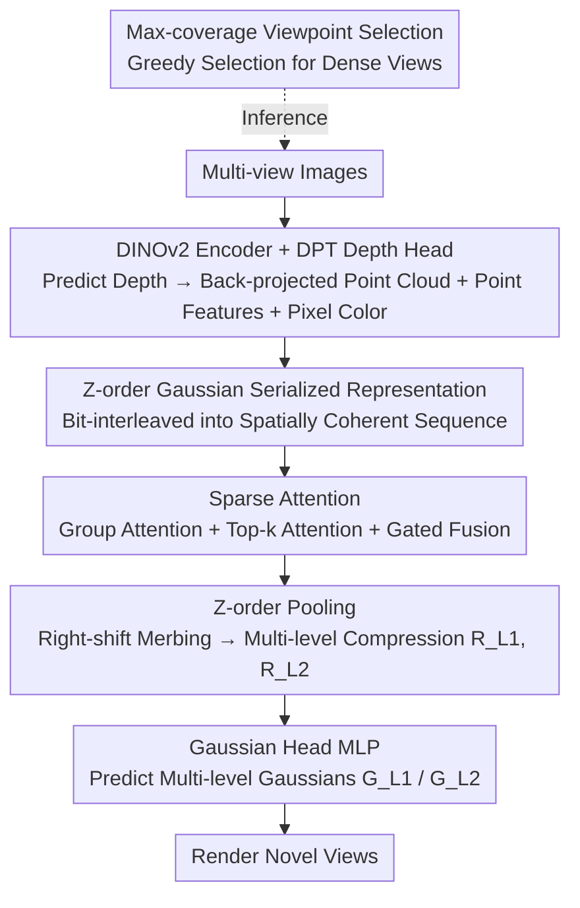

# Z-Order Transformer for Feed-Forward Gaussian Splatting

**Conference**: CVPR 2026  
**arXiv**: [2605.13465](https://arxiv.org/abs/2605.13465)  
**Code**: None  
**Area**: 3D Vision  
**Keywords**: Feed-Forward Gaussian Splatting, Z-order curve, Sparse Attention, Novel View Synthesis, Gaussian Compression

## TL;DR
The method utilizes Z-order (Morton) space-filling curves to rearrange cluttered per-pixel Gaussians into 1D sequences that maintain spatial locality. Combined with a sparse Transformer employing "group attention + top-k attention" and Z-order pooling, it predicts high-quality 3D Gaussians in a single feed-forward pass. This reduces the number of Gaussians to 1/2–1/3 of DepthSplat/AnySplat, while inference is approximately 1000x faster than per-scene optimized 3DGS.

## Background & Motivation

**Background**: 3D Gaussian Splatting (3DGS) enables photo-realistic real-time novel view synthesis, but the original version requires several minutes of per-scene gradient optimization, lacking generalization capabilities. Consequently, feed-forward GS methods (e.g., PixelSplat, DepthSplat, AnySplat) utilize a neural network to directly predict the position, scale, opacity, and color of each Gaussian from input images in one pass.

**Limitations of Prior Work**: Current mainstream feed-forward GS methods rely on "per-pixel Gaussians"—each pixel in every input view is associated with one or more Gaussians, with positions back-projected into 3D using depth. This approach is simple but leads to an explosion in the number of Gaussians: two 512×512 views produce over 500,000 Gaussians, causing memory and rendering overhead to swell rapidly with resolution and view count. To reduce redundancy, voxel-based GS aggregates neighboring Gaussians into voxel grids, but fixed grids introduce quantization errors (blurred details and sharp boundaries) and voxel counts grow cubically with resolution, wasting computation on empty cells in sparse or irregular regions.

**Key Challenge**: Gaussian sets are **unstructured and unordered** point sets, yet for Transformers or aggregation operations to be efficient, "points adjacent in 3D space should also be adjacent in the sequence." Per-pixel methods lack aggregation and are thus redundant, while voxel methods use rigid grids that introduce quantization errors—neither provides an ordered representation that maintains spatial locality without relying on dense grids.

**Goal**: Design a feed-forward function $\mathcal{F}$ that is efficient and predicts high-fidelity Gaussians using **as few points as possible**.

**Key Insight**: The authors draw inspiration from point cloud serialization (e.g., Point Transformer V3)—Z-order curves map multi-dimensional coordinates into 1D sequences via bit-interleaving while preserving spatial locality. Applying this to 3DGS allows spatial neighbors to remain close in the sequence without constructing voxel grids, supporting fast neighborhood access, consistent spatial grouping, and scalable sparse attention.

**Core Idea**: Replace voxel grids with Z-order serialization to organize unstructured Gaussians, perform sparse attention aggregation and hierarchical pooling compression on this "spatially coherent sequence," and obtain compact, high-quality Gaussians in one feed-forward pass.

## Method

### Overall Architecture
Given a set of multi-view images, the method follows four steps: ① A Transformer encoder (DINOv2-Small) + DPT depth head predicts depth maps for each view, which are back-projected into world-coordinate point clouds to initialize Gaussian centers. Global features from the encoder and geometric features from the depth head are fused into point-wise features $\mathbf{F}$, with pixel colors $\mathbf{I}$ preserved for spherical harmonic (SH) color initialization. ② The Gaussian representation $\mathbf{R}=\{\mathbf{P},\mathbf{F},\mathbf{I}\}$ is fed into ZFormer blocks: first rearranged via Z-order serialization, then processed through sparse attention to aggregate context, and finally compressed via Z-order pooling. ③ Two ZFormer blocks are stacked to obtain compressed representations at two levels, $\mathbf{R}_{L1}$ and $\mathbf{R}_{L2}$ (with sequentially fewer points), which are processed by MLP Gaussian heads to predict multi-level Gaussians $G_{L1}$ and $G_{L2}$ for rendering. ④ During inference with dense views, a Z-order maximum coverage viewpoint selection algorithm picks a few highly informative views before feed-forward processing to eliminate redundancy.

The key to the entire pipeline is the "Z-order serialization" unified representation, which allows the sparse attention and pooling in ② to be completed efficiently on a sequence that maintains spatial locality, avoiding the high overhead of voxel grids and full attention.

### Key Designs

**1. Z-order Gaussian Serialized Representation: Organizing unstructured Gaussians into locality-preserving sequences**

To address the key challenge of "unordered Gaussian sets, inefficient aggregation, and voxel quantization errors," the paper serializes 3D points using Z-order (Morton) curves. For a point $P=(x,y,z)$, each coordinate is represented by up to $d$ bits. The Z-order code is generated by **interleaving the bits of the three coordinates**:

$$\mathbf{Z}(x,y,z)=\sum_{i=0}^{d-1}\Big(x_i\cdot 2^{3i}+y_i\cdot 2^{3i+1}+z_i\cdot 2^{3i+2}\Big)$$

Points $\mathbf{P}$ from all views are concatenated into $\hat{\mathbf{P}}\in\mathbb{R}^{(NHW)\times3}$, and the Z-order code for each point is calculated. Sorting by these codes yields the ordered set $\{\mathbf{P}_{\text{sorted}},\mathbf{F}_{\text{sorted}},\mathbf{I}_{\text{sorted}}\}$, where spatially adjacent Gaussians are near each other in the sequence. This forms the foundation for subsequent operations: it eliminates the need for dense voxel grids, saving memory and computation, while naturally providing spatial meaning to "block/group" operations on the sequence (contiguous segments represent spatial clusters), supporting fast neighbor access and scalable feed-forward.

**2. Sparse Attention: Dual-path Gated Fusion of Group and Top-k Attention**

Performing full attention on the ordered sequence remains expensive ($O(n^2)$), so two types of sparse attention are designed. **Group Attention** partitions the sequence into $B=NHW/L$ non-overlapping blocks of length $L$. Block-level representations $\hat{\mathbf{Q}},\hat{\mathbf{K}},\hat{\mathbf{V}}$ are generated using an intra-block average pooling operator $\mathcal{C}(\mathbf{X})_i=\frac{1}{L}\sum_{j=1}^{L}\mathbf{X}_{(i-1)L+j}$, followed by scaled dot-product attention $\mathbf{Attn}_{\text{grp}}=\text{softmax}(\hat{\mathbf{Q}}\hat{\mathbf{K}}^\top/\sqrt{d})\hat{\mathbf{V}}$, significantly reducing complexity while capturing local context. Since block averaging **dilutes fine-grained information**, a parallel **Top-k Attention** path is added: weighting $w=\text{softmax}(\hat{\mathbf{Q}}\hat{\mathbf{K}}^\top/\sqrt{d})$ from the group attention is reused as differentiable block importance scores to select the most relevant K/V blocks for detailed attention $\mathbf{Attn}_{\text{sel}}=\text{softmax}(\mathbf{Q}\mathbf{K}_{\text{sel}}^\top/\sqrt{d})\mathbf{V}_{\text{sel}}$. Finally, a gating network adaptively fuses the two paths:

$$\mathbf{F}_{\text{gate}}=g_1(\mathbf{F}_{\text{sorted}})\odot\mathbf{Attn}_{\text{grp}}+g_2(\mathbf{F}_{\text{sorted}})\odot\mathbf{Attn}_{\text{sel}}$$

Group attention manages "global/local coarse-grained context," while Top-k attention provides "fine-grained compensation for key blocks." The gating allows the model to allocate weights between the two as needed, leveraging the locality of the Z-order sequence while avoiding the high cost of full attention. Ablations show that removing sparse attention (w/o SA) in favor of full attention leads to a significant performance drop, proving it is not merely a computational compromise.

**3. Z-order Pooling: Bitwise Right-shift for Multi-level Aggregation**

After aggregation, the number of points must be reduced. The method utilizes the hierarchical nature of Z-order codes: performing a **bitwise right-shift** $\mathbf{Z}=\mathbf{Z}\,\texttt{>>}\,h$ (where $h$ is pooling depth). Points with the **same resulting code naturally fall into the same spatial cluster**. Average pooling and a linear projection are applied within each cluster to produce the compressed representation $\{\mathbf{P}_{\text{pool}},\mathbf{F}_{\text{pool}},\mathbf{I}_{\text{pool}}\}$, where $M\ll NHW$. Two stacked ZFormer blocks produce levels $\mathbf{R}_{L1}$ and $\mathbf{R}_{L2}$ with decreasing point counts. Unlike voxel discretization, these "clusters" derive from the space-filling curve without fixed grids, preventing empty grid waste in sparse regions. Ablations indicate two levels offer the best trade-off between "preventing degradation" and "maintaining low Gaussian counts."

**4. Gaussian Parameter Prediction and Initialization: Residual Centers and Pixel-to-SH**

The Gaussian head consists of two MLP layers predicting parameters from point representations. Two initializations are critical: Gaussian centers use pooled points $\mathbf{P}_{\text{pool}}$ as a baseline, predicting only the residual $\mu=\mathbf{P}_{\text{pool}}+\Delta\mu$, allowing the network to fine-tune reliable geometric priors. Color uses pooled pixel colors $\mathbf{I}_{\text{pool}}$ converted to spherical harmonic (SH) coefficients. Ablations (w/o SH) show that removing SH initialization decreases training stability and convergence quality.

**5. Max-coverage Viewpoint Selection: Greedy Representative Selection for Dense Views**

If many views are provided during inference, using all of them is redundant and slow. The algorithm first performs Z-order serialization on the point cloud of each view to get compact coverage representations. The "Z-order coverage" of each viewpoint is placed in a max-priority heap. In each round, the viewpoint with the **maximum coverage gain** is greedily selected and added to the selected set $\mathcal{S}$, updating the covered set $\mathcal{C}$, until no viewpoint provides sufficient new coverage. Ablations (Tab. 6) show this stable Z-order selection outperforms random selection in image quality and is more efficient than using all views.

### Loss & Training
The depth estimator is initialized with pre-trained depth-anything-v2-small but is **not frozen**. Since 2D depth is not always accurate, joint training allows the model to compensate for errors, constrained by a distillation loss $\mathcal{L}_{\text{depth}}=|\mathcal{F}_{\text{depth}}(\mathbf{I})-\hat{\mathcal{F}}_{\text{depth}}(\mathbf{I})|$. Rendering supervision calculates MSE + LPIPS for each Z-order level: $\mathcal{L}_{\text{color}}=\sum_{i=1}^{M}[\text{MSE}(\mathcal{R}(G_{Li},\mathbf{c}),\mathbf{I}_{\text{gt}})+\text{LPIPS}(\mathcal{R}(G_{Li},\mathbf{c}),\mathbf{I}_{\text{gt}})]$. The depth branch uses a low learning rate of $2\times10^{-6}$, while the ZFormer and Gaussian heads use $2\times10^{-4}$. Trained on 8×A100 for 100K steps (~2 days) using AdamW and cosine scheduling. Group attention block size is 32, with top-k selecting half the blocks, and FlashAttention is used for acceleration.

## Key Experimental Results

Datasets: RealEstate10K (360×640), DL3DV (256×448), ACID (256×256, cross-dataset only). Baselines include optimized 3DGS / MipSplatting and feed-forward DepthSplat / AnySplat. Ours#L1 / Ours#L2 denote versions with one or two Z-order compression blocks.

### Main Results

In fixed-view comparisons (RealEstate10K), Ours#L1 leads across almost all metrics, with the **advantage becoming more pronounced as the number of views decreases** (most notably at 2 views):

| Views | Metric | DepthSplat | AnySplat | Ours#L1 |
|--------|------|------------|----------|---------|
| 2 | PSNR / SSIM / LPIPS | 26.03 / 0.873 / 0.158 | 22.55 / 0.757 / 0.229 | **26.43 / 0.873 / 0.147** |
| 8 | PSNR / SSIM / LPIPS | 26.17 / 0.876 / 0.152 | 26.71 / 0.886 / 0.131 | **27.25 / 0.897 / 0.123** |
| 12 | PSNR / SSIM / LPIPS | 26.33 / 0.880 / 0.143 | 26.94 / 0.892 / 0.122 | **28.56 / 0.901 / 0.110** |

Cross-dataset generalization (→ACID) and variable view inputs also show leading results:

| Setting | Metric | DepthSplat | AnySplat | Ours#L1 |
|------|------|------------|----------|---------|
| Variable Views (2–12) | PSNR / SSIM / LPIPS | 26.11 / 0.871 / 0.151 | 26.54 / 0.875 / 0.133 | **28.07 / 0.890 / 0.125** |
| RealEstate10K→ACID | PSNR / SSIM / LPIPS | 26.05 / 0.810 / 0.181 | 22.71 / 0.685 / 0.298 | **27.56 / 0.853 / 0.172** |
| DL3DV→ACID | PSNR / SSIM / LPIPS | 25.58 / 0.796 / 0.203 | 23.64 / 0.737 / 0.242 | **27.34 / 0.845 / 0.169** |

Inference time and Gaussian count (360×640, #GS unit $\times10^5$):

| Method | 2 Views Time / #GS | 12 Views Time / #GS |
|------|-------------------|---------------------|
| 3DGS | 2m15s / 6.27 | 8m21s / 8.51 |
| DepthSplat | 0.142s / 4.61 | 0.384s / 27.6 |
| AnySplat | 0.692s / 3.53 | 1.212s / 13.2 |
| Ours#L1 | **0.123s** / 2.85 | 0.337s / 17.8 |
| Ours#L2 | 0.135s / **1.42** | 0.355s / **8.05** |

Achieves ~1000x acceleration over 3DGS; Gaussian count is reduced by ~2–3x compared to DepthSplat.

### Ablation Study

12 views, RealEstate10K:

| Config | PSNR↑ | SSIM↑ | LPIPS↓ | Description |
|------|-------|-------|--------|------|
| Ours (Full) | **28.56** | **0.901** | **0.110** | Full model |
| w/o Z-order (Conv) | 24.86 | 0.794 | 0.225 | Replacing ZFormer block with convolutions |
| w/o SA (Full Attn) | 26.79 | 0.847 | 0.174 | Using full attention instead of sparse |
| w/o SH (No Init) | 27.81 | 0.874 | 0.129 | Removing pixel color SH initialization |
| Ours-Fix-Depth | 28.15 | 0.893 | 0.119 | Freezing the depth head |

Viewpoint Selection Strategy (NA.=All, RS.=Random, ZS.=Z-order):

| Input Views | Selection | PSNR↑ | LPIPS↓ | Time(s)↓ |
|----------|------|-------|--------|----------|
| 24 | NA. | 28.91 | 0.102 | 0.622 |
| 24 | RS. 16 | 27.97 | 0.113 | 0.417 |
| 24 | ZS. 16 | 28.73 | 0.108 | 0.448 |

### Key Findings
- **ZFormer block (Z-order + Sparse Attention) is the primary contributor**: Removing it causes PSNR to plummet from 28.56 to 24.86, showing that "ordered sequences + sparse attention" is the source of quality, not just capacity.
- **Sparse attention is not a compromise**: Replacing it with full attention drops PSNR to 26.79, as Z-order locality makes group+top-k more compatible with the spatial structure.
- **Joint depth training outperforms freezing**: Since 2D depth contains errors, end-to-end training allows rendering loss to correct geometry.
- **Viewpoint selection**: Selecting 16 views via Z-order (28.73) nearly matches using all 24 views (28.91) while reducing time from 0.622s to 0.448s.

## Highlights & Insights
- **Transferring point cloud serialization to 3DGS**: While Point Transformer V3 uses Z-order for backbone efficiency, this work realizes that "feed-forward Gaussian sets are also unstructured point sets," solving both "Gaussian redundancy" and "aggregation inefficiency" with one representation.
- **Bitwise right-shift for hierarchical pooling**: Pooling is achieved via `Z >> h`, where bit-shifting directly corresponds to multi-resolution clusters without fixed grids. This trick is transferable to any task requiring multi-scale downsampling of unordered points.
- **Complementarity of Group + Top-k**: Using block averages for coarse context and top-k to recover fine details addresses the loss of resolution in local attention mechanisms.

## Limitations & Future Work
- **Dependence on geometric quality**: The pipeline relies on point clouds from monocular depth for initialization; regions with depth failure (weak texture/reflections) may still be limited.
- **Discretization error**: The Z-order bit depth $d$ and pooling depth $h$ define quantization granularity. While more adaptive than voxels, it is still a spatial discretization; extremely fine geometry may degrade with deeper pooling.
- **Code availability**: No open-source code is currently available; implementation details for differentiable top-k selection and gated structures remain unclear for reproduction.

## Related Work & Insights
- **vs. Per-pixel Feed-forward GS (DepthSplat)**: They map Gaussians per pixel, leading to Gaussian explosion (27.6×10⁵ for 12 views). Ours uses serialization and hierarchical pooling to reduce this to 8.05×10⁵ while improving quality.
- **vs. Voxel-based Feed-forward GS (AnySplat)**: AnySplat uses grids which introduce quantization and waste computation on empty space. Z-order adaptive clustering prevents empty cell waste and stabilizes cross-dataset generalization.
- **vs. Point Transformer V3**: PTv3 used Z-order for discrimination/understanding. This work migrates the paradigm to generative Gaussian prediction, adding top-k sparse attention and hierarchical pooling.

## Rating
- Novelty: ⭐⭐⭐⭐ Systematically introduces Z-order serialization to feed-forward 3DGS with a self-consistent pipeline of sparse attention, pooling, and selection.
- Experimental Thoroughness: ⭐⭐⭐⭐ Strong results across three datasets and cross-dataset testing; robust ablation studies.
- Writing Quality: ⭐⭐⭐⭐ Clear framework and formulas; well-aligned figures and text.
- Value: ⭐⭐⭐⭐ Simultaneously improves quality and speed while reducing Gaussian count, offering practical value for real-time edge deployment.

<!-- RELATED:START -->

## Related Papers

- [\[CVPR 2026\] AnchorSplat: Feed-Forward 3D Gaussian Splatting with 3D Geometric Priors](anchorsplat_feed-forward_3d_gaussian_splatting_with_3d_geometric_priors.md)
- [\[CVPR 2026\] SparseSplat: Towards Applicable Feed-Forward 3D Gaussian Splatting with Pixel-Unaligned Prediction](sparsesplat_towards_applicable_feed-forward_3d_gaussian_splatting_with_pixel-una.md)
- [\[CVPR 2026\] EcoSplat: Efficiency-controllable Feed-forward 3D Gaussian Splatting from Multi-view Images](ecosplat_efficiency-controllable_feed-forward_3d_gaussian_splatting_from_multi-v.md)
- [\[CVPR 2026\] MoRe: Motion-aware Feed-forward 4D Reconstruction Transformer](more_motion-aware_feed-forward_4d_reconstruction_transformer.md)
- [\[CVPR 2026\] GIFSplat: Generative Prior-Guided Iterative Feed-Forward 3D Gaussian Splatting from Sparse Views](gifsplat_generative_prior-guided_iterative_feed-forward_3d_gaussian_splatting_fr.md)

<!-- RELATED:END -->
