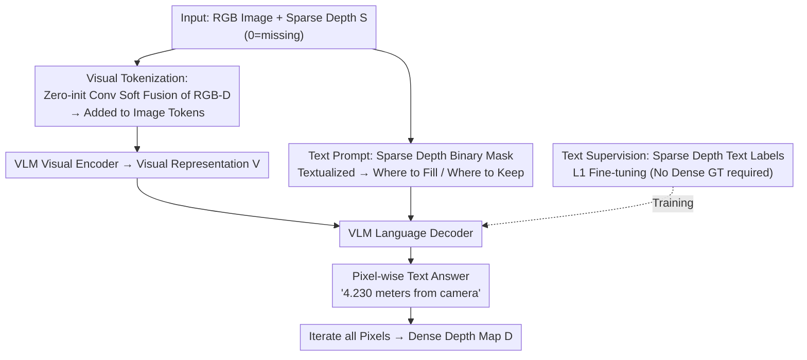

# Zero-Shot Depth Completion with Vision-Language Model

**Conference**: CVPR 2026  
**Paper**: [CVF Open Access](https://openaccess.thecvf.com/content/CVPR2026/html/Yan_Zero-Shot_Depth_Completion_with_Vision-Language_Model_CVPR_2026_paper.html)  
**Code**: To be confirmed  
**Area**: 3D Vision  
**Keywords**: Depth Completion, Vision-Language Model, Zero-Shot, Sparse Depth, Textual Supervision

## TL;DR
Sparse depth is injected into a minimally modified VLM (Qwen2.5-VL 3B) via "visual tokens + text prompts + text supervision." This allows the model to understand "where to fill and where to preserve" like verbal instructions, enabling zero-shot depth completion without dense ground truth and achieving up to a 17.3% improvement across 7 cross-domain benchmarks.

## Background & Motivation
**Background**: Depth completion aims to recover dense depth from sparse inputs (e.g., discrete points from LiDAR or active stereo), typically guided by an RGB image. Before 2024, task-specific networks (SPN series, bilateral propagation BPNet, etc.) dominated. After 2024, shifts turned toward "zero-shot generalization," utilizing models like OGNI-DC, G²-MonoDepth, OMNI-DC, and Marigold-DC (current SOTA), which integrates diffusion-based depth foundation models.

**Limitations of Prior Work**: The authors point out a critical flaw—existing methods "do not truly understand the essence of completion." Given sparse depth, they merely treat it as another feature for embedding. They lack explicit knowledge of **which pixels are known measurements (to be preserved) and which are missing regions (to be predicted)**. Consequently, valid points are often "re-predicted," wasting accurate data and potentially corrupting reliable values.

**Key Challenge**: Completion tasks naturally possess a binary "preserve vs. predict" structure. However, when convolutional or diffusion networks flatten sparse depth into dense tensors, this structural information is smoothed out, leaving the model unable to distinguish between the two. Humans, conversely, intuitively know to keep measurements and guess the gaps.

**Goal**: To find a medium that simultaneously absorbs the absolute scale of sparse depth and explicitly expresses the "fill/keep" instructional semantics.

**Key Insight**: VLMs excel at semantic reasoning and instruction following. Writing "where to fill and where to keep" as natural language prompts allows the VLM to execute this instruction as a constraint; meanwhile, the geometric and absolute scale missing in VLMs can be supplied by sparse depth.

**Core Idea**: A Sparse Depth Injection Mechanism (SDIM) is proposed. By using three channels—"visual tokenization + text prompts + text supervision"—sparse depth is funneled into the VLM. This architecture, which requires almost no structural changes, transforms a semantic model into a depth completer capable of metric-level 3D perception.

## Method

### Overall Architecture
The method uses a frozen/fine-tuned Qwen2.5-VL (3B) as the base. The input consists of a color image $I\in\mathbb{R}^{3\times h\times w}$ and corresponding sparse depth $S\in\mathbb{R}^{1\times h\times w}$ (where 0 indicates missing values). The output is a textual answer for each pixel, such as "x meters from the camera," which is iterated across all pixels to reconstruct a dense depth map $D$. The workflow utilizes three SDIM components to inject sparse depth into the **visual input, text input, and supervision** of the VLM: the visual end uses zero-initialized convolutions for "soft fusion"; the text end converts the binary mask into "where to fill/keep" prompts; and the supervision end converts sparse depth into text labels for fine-tuning, requiring no dense ground truth.

### Key Designs

**1. Visual Tokenization: Soft fusion of sparse depth into visual tokens via zero-initialized convolutions to inject absolute scale.**

The limitation is that single-view RGB depth estimation is ill-posed (scale and camera ambiguity), and VLM visual encoders only accept RGB. Brutally concatenating RGB-D (hard fusion) forces an "unfamiliar distribution" into pre-trained image tokens, causing training instability. The authors adopt a soft fusion approach: first, a 32-channel, **zero-initialized** convolution (followed by BN+LeakyReLU) encodes sparse depth $\hat S=F^{z}_{\tau_2}(S)$, while RGB is encoded as $\hat F$. After concatenation, two convolutional layers project the data $M=F_{\tau_3}(F_{\tau_2}(F_\psi(\hat F,\hat S)))$, followed by another zero-init convolutional layer $O=F^{z}_{c}(M)$. Finally, $O$ is tokenized via the native 3D conv embedding of Qwen2.5-VL and **added** to the image tokens: $E=F_{e1}(I)+F_{e2}(O)$, which enters the visual encoder to produce $V=F_\theta(E)$. The advantage of zero-initialization is that depth branch output is $\approx 0$ at the start of training, minimally disturbing pre-trained tokens. Depth cues are "gradually" injected, ensuring the fused representation remains close to the original image token distribution. Replacing zero-init with He initialization increased RMSE by 7mm, confirming the value of the "soft" approach.

**2. Text Prompt: Textualizing the binary mask to explicitly instruct the VLM on "where to fill and where to keep."**

This is the central design of the paper, addressing the limitation that models cannot distinguish between preservation and prediction. A binary mask (0=missing, 1=valid) is generated from sparse depth, and each pixel is converted into a fixed-template text: for missing areas, "The mask value is 0; predict the distance to the camera."; for valid areas, "The mask value is 1, and the distance to the camera is x meters, preserve the given value." Only the value $x$ and the 0/1 mask are dynamic. Combined with a fixed question $Q$ "What is the distance from the current pixel to the camera?", these are fed to the decoder: $A=F_\delta(T,Q,V)$, where $T=F_t(S)$ is the textualization function. This binary distinction is formulated as a linguistic constraint.

**3. Text Supervision: Fine-tuning using sparse depth as text labels, eliminating reliance on dense ground truth.**

Traditional supervision requires dense ground truth, which is expensive to collect. The authors insert valid sparse depth values $y$ into the template "The pixel is y meters away from the camera." to serve as text labels for supervised fine-tuning (using L1 loss on one labeled pixel per training sample). This allows training to be completed **using only the sparse depth itself**. Since sparse depth and RGB are usually available together during inference, this label-free scheme can be viewed as an online method. During inference, the model is queried for each pixel, and answers $A_j$ are reconstructed into a dense map: $D=\mathcal{T}_{j=1}^{hw}(A_j)$. Notably, while dense GT supervision (SDIM-f) is more accurate than sparse supervision (SDIM-e), the gap is small, making SDIM-e a more practical, label-free choice.

### Loss & Training
The base is Qwen2.5-VL (3B), fine-tuned on a 20K subset of Hypersim + Virtual KITTI. It uses textual SFT with one labeled pixel per sample and L1 loss. Training was conducted on 8×48GB GPUs for 10 epochs with a total batch size of 16. Test sets (NYUv2, VOID, IBims-1, KITTI, DDAD) were **not part** of pre-training or fine-tuning to ensure zero-shot evaluation.

## Key Experimental Results

### Main Results
Comparison with 9 representative methods across seven zero-shot benchmarks. Metrics are MAE / RMSE (meters, lower is better). "Ours w/ SD" uses sparse depth for text supervision (label-free); "Ours w/ GT" uses ground truth.

| Dataset (Metric) | Ours w/ SD | Ours w/ GT | Prev. SOTA | Gain (w/ SD) |
|--------------|-----------|-----------|---------|-----------|
| IBims-1 MAE | 0.040 | 0.036 | 0.045 (Marigold-DC‡) | 12.5% |
| VOID 150 MAE | 0.185 | 0.176 | 0.194 (Marigold-DC‡) | 4.9% |
| NYUv2 MAE | 0.044 | 0.042 | 0.048 (Marigold-DC‡) | 9.1% |
| KITTI MAE | 0.418 | 0.406 | 0.434 (Marigold-DC‡) | 3.8% |
| DDAD RMSE | 6.264 | 6.179 | 6.449 (Marigold-DC‡) | 3.0% |

Even the label-free w/ SD version consistently outperforms zero-shot methods **using ground truth supervision**. The w/ GT version on NYUv2 achieves MAE 0.042 / RMSE 0.120, showing significant improvements over second-best results.

### Ablation Study (VOID-150, incremental SDIM components)

| Config | Visual Tokenization | Text Prompt | Text Supervision | MAE | RMSE |
|------|------------------|---------|---------|------|------|
| (a) | Concat (Hard) | — | SD | 0.206 | 0.635 |
| (b) | He init. blocks | — | SD | 0.202 | 0.630 |
| (c) | Zero init. Soft | — | SD | 0.197 | 0.623 |
| (d) | Zero init. | Mask | SD | 0.188 | 0.608 |
| (e) | Zero init. | Mask + SD Value | SD | 0.185 | 0.604 |
| (f) | Zero init. | Mask + SD Value | GT | 0.176 | 0.592 |

### Key Findings
- **Zero-init soft fusion > Hard concat**: Moving from (a) to (c) reduced RMSE from 0.635 to 0.623. Zero-initialization outperformed He initialization by 7mm, proving that letting the depth branch start with zero disturbance is key.
- **Text prompts provide direct gains**: Adding mask text alone (d) improved metrics by 9mm MAE / 15mm RMSE, validating that explicit instructions address the core missing link in previous methods.
- **Label-free cost is minimal**: The difference between SD (e) and GT (f) is only 9mm MAE, making SD a high-value, label-free alternative.
- **Backbone Efficiency**: Among MolmoE-1B, Seed1.5-VL, and Qwen2.5-VL, Qwen2.5-VL performed best. While VRAM usage is high (46GB), it is ~65x faster than Marigold-DC (0.327 vs. 0.005 FPS) and more accurate.
- **Failure Cases**: Near glass or reflective surfaces. In these areas, sparse depth measurements are scarce or "penetrate" glass to measure background objects, leading to errors. The authors suggest introducing textualized glass segmentation into the visual end.

## Highlights & Insights
- **Translating completion tasks into linguistic instructions**: Using a prompt of "preserve if mask=1, predict if mask=0" elegantly solves the problem of networks failing to distinguish between inputs and predictions. This introduces semantic-level explicit constraints into a geometric task.
- **Zero-init soft fusion as a transferable trick**: This provides a way to add new input modalities to pre-trained models without metadata disruption, a strategy applicable to adding any input channel to large pre-trained models.
- **Textual supervision rewrites regression as language modeling**: Pixel-wise text labels plus L1 loss allow depth completion to parasitic on VLM text generation capabilities, removing the need for dense labels—highly attractive for real-world robotics and autonomous driving.

## Limitations & Future Work
- Focuses exclusively on depth; extension to other dense prediction tasks like surface normals is not yet verified. Inference speed remains slow due to the large VLM backbone.
- VRAM requirements (46GB) and FPS (0.327) prevent real-time or lightweight deployment. While faster than Marigold-DC, it is an order of magnitude slower than task-specific models (~4.5 FPS).
- Systematic failures on glass/reflective surfaces stem from unreliable sparse depth in those areas, which textual constraints alone cannot solve without additional material priors.
- Robustness to low-quality or noisy real-world sparse input (vs. sampled GT) remains to be fully tested.

## Related Work & Insights
- **vs. Marigold-DC (Diffusion Zero-Shot SOTA)**: Marigold uses test-time optimization to inject depth into diffusion models; this work uses textualized injection into VLMs, appearing both faster (~65x) and label-free.
- **vs. BPNet / SPN Series (Task-Specific)**: These use specific networks for fine diffusion of sparse depth, yielding high precision but weak generalization. This work offers better cross-sensor/scene generalization at the cost of high VRAM.
- **vs. DepthLM / SpatialVLM / SpatialBot (VLM 3D Perception)**: While these give VLMs spatial reasoning, this work is the first to specifically apply VLMs to **depth completion** and introduce task-specific structures via mask prompts.

## Rating
- Novelty: ⭐⭐⭐⭐⭐ First VLM-based depth completion framework; novel use of text prompts to encode task essence.
- Experimental Thoroughness: ⭐⭐⭐⭐ Seven benchmarks and detailed ablations; slightly lacks testing on noisy sparse inputs.
- Writing Quality: ⭐⭐⭐⭐⭐ Clear progression of motivation and SDIM components; self-consistent figures and formulas.
- Value: ⭐⭐⭐⭐ Label-free and strong zero-shot generalization; however, VRAM/speed limits immediate deployment.

<!-- RELATED:START -->

## Related Papers

- [\[CVPR 2026\] Copy-Transform-Paste: Zero-Shot Object-Object Alignment Guided by Vision-Language and Geometric Constraints](copy-transform-paste_zero-shot_object-object_alignment_guided_by_vision-language.md)
- [\[CVPR 2026\] LaS-Comp: Zero-shot 3D Completion with Latent-Spatial Consistency](las-comp_zero-shot_3d_completion_with_latent-spatial_consistency.md)
- [\[CVPR 2026\] VGGT-360: Geometry-Consistent Zero-Shot Panoramic Depth Estimation](vggt-360_geometry-consistent_zero-shot_panoramic_depth_estimation.md)
- [\[CVPR 2026\] SO(3)-Equivariant ViT-Adapter for Data-Efficient Zero-Shot Sim-to-Real Indoor Panoramic Depth Estimation](so3-equivariant_vit-adapter_for_data-efficient_zero-shot_sim-to-real_indoor_pano.md)
- [\[CVPR 2026\] Multi-Scale Gaussian-Language Map for Zero-shot Embodied Navigation and Reasoning](multi-scale_gaussian-language_map_for_zero-shot_embodied_navigation_and_reasonin.md)

<!-- RELATED:END -->
