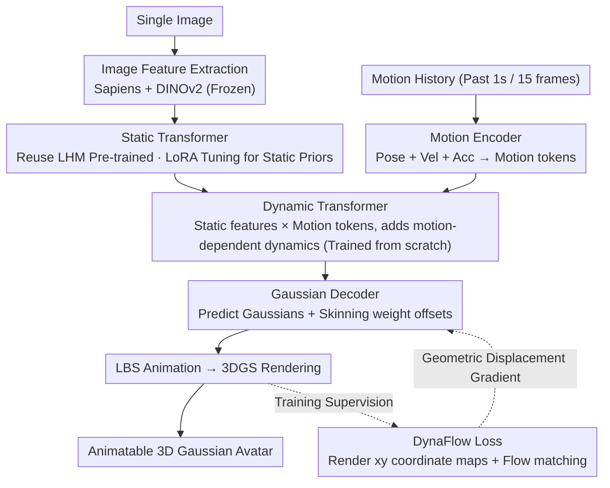

# Zero-Shot Reconstruction of Animatable 3D Avatars with Cloth Dynamics from a Single Image

**Conference**: CVPR2026  
**arXiv**: [2603.14772](https://arxiv.org/abs/2603.14772)  
**Code**: [https://juhyeon-kwon.github.io/DynaAvatar.github.io/](https://juhyeon-kwon.github.io/DynaAvatar.github.io/) (Project Page)  
**Area**: 3D Vision  
**Keywords**: 3D Human Reconstruction, Animatable Avatar, Cloth Dynamics, 3D Gaussian Splatting, Single-view Reconstruction

## TL;DR
DynaAvatar proposes the first zero-shot framework to reconstruct animatable 3D human avatars with motion-dependent cloth dynamics from a single image. By utilizing a static-to-dynamic knowledge transfer strategy and an optical flow-guided DynaFlow loss, it achieves realistic garment dynamic modeling under limited dynamic data, significantly outperforming existing methods.

## Background & Motivation

**Background**: Single-image animatable 3D human avatar reconstruction is a core objective in computer vision and graphics. Existing zero-shot methods (IDOL, LHM) primarily rely on skeletal-based Linear Blend Skinning (LBS) for animation. While these methods enable joint movement, they are inherently unable to model non-rigid cloth dynamics. Personalized methods (ExAvatar, GaussianAvatar) can capture subject-specific deformations but require multi-view video acquisition and per-person optimization, preventing generalization to unseen characters.

**Limitations of Prior Work**:
   - **Rigid Animation**: Zero-shot methods produce stiff animations where garments like skirts or jackets do not flow naturally with movement, severely undermining visual realism.
   - **Personalization Dependency**: Methods capable of modeling cloth dynamics (PERSONA, SeqAvatar) require per-person data collection and optimization, lacking scalability.
   - **Data Scarcity**: Large-scale dynamic capture data is extremely costly to acquire (multi-view sync, temporal calibration, garment diversity), and SMPL-X annotations in existing datasets are often missing or noisy.

**Key Challenge**: Learning motion-dependent cloth dynamics requires large-scale dynamic capture data, which is scarce. Furthermore, traditional image reconstruction losses fail in scenarios with large cloth deformations due to local receptive fields and the coupling of color and geometry.

**Goal**
   - How to achieve motion-dependent cloth dynamics in a zero-shot setting (without per-person optimization)?
   - How to learn effective dynamic deformation priors under limited dynamic data conditions?
   - How to provide reliable geometric supervision signals for large-magnitude cloth movements?

**Key Insight**: The authors observe that while large-scale static data lacks temporal deformation information, it contains rich human geometry and appearance priors. Simultaneously, optical flow can establish pixel-level correspondences between rendered and ground truth images across large deformations, thereby providing purely geometric displacement supervision.

**Core Idea**: Through LoRA fine-tuning of a static-pretrained Transformer to achieve knowledge transfer, combined with a flow-guided DynaFlow loss to provide geometric-level deformation supervision, single-image avatars can exhibit realistic motion-dependent cloth dynamics in a zero-shot manner.

## Method

### Overall Architecture

DynaAvatar adopts a Transformer-based feed-forward architecture. The input consists of a single person image and a motion history sequence (1 second/15 frames), and the output is a 3D Gaussian Avatar in canonical space with motion-dependent cloth dynamics. The overall pipeline is divided into five stages:

1. **Image Feature Extraction**: A frozen pre-trained encoder (Sapiens + DINOv2) extracts image tokens $\mathbf{T}_I$.
2. **Static Transformer**: Extracts detailed geometry and appearance features without considering cloth dynamics.
3. **Motion Encoder**: Encodes motion history into motion tokens $\mathbf{T}_M$.
4. **Dynamic Transformer**: Fuses motion information and adds motion-dependent cloth deformations on top of static features.
5. **Gaussian Decoder + LBS Animation + 3DGS Rendering**: Outputs the final animatable Avatar.

The image and motion paths are encoded separately, merged at the Dynamic Transformer, and finally decoded and rendered. The DynaFlow loss back-propagates geometric displacement gradients during training to correct Gaussian positions:

### Key Designs

**1. Static Transformer: Handling Static Geometry and Appearance First**

A primary cause of rigid animation in zero-shot methods is the attempt to simultaneously learn geometry, appearance, and deformation from insufficient dynamic data. DynaAvatar decouples "appearance" from "motion." The Static Transformer focuses on the former, extracting clean geometry and appearance features. It utilizes Multi-modal Transformer Blocks (MM), treating SMPL-X template vertex positional encodings as 3D point tokens $\mathbf{T}_{3D}$ (queries) and image tokens $\mathbf{T}_I$ as keys/values, transferring image information onto template vertices: $\mathbf{T}_{3D}, \mathbf{T}_I \leftarrow \text{MM}(\mathbf{T}_{3D}, \mathbf{T}_I; \mathbf{F}_I)$. This component reuses LHM weights pre-trained on large-scale static data with LoRA adapters, preserving strong geometric priors.

**2. Motion Encoder: Capturing Directional Dynamics**

Cloth dynamics depend not only on current pose but also on the direction of movement. The Motion Encoder compresses 1 second of motion history into motion tokens $\mathbf{T}_M$. Input features include 3D pose (6D rotation), pose velocity, pose acceleration, and 3D joint velocity. All motion is transformed into a canonical world coordinate system to ensure semantic consistency (e.g., "up" vs. "down").

**3. Dynamic Transformer: Learning Motion-Dependent Deformation**

The Dynamic Transformer merges static features with motion tokens. Here, $\mathbf{T}_{3D}$ acts as queries and $\mathbf{T}_M$ as keys/values. This module is trained from scratch, allowing the model to focus exclusively on temporal deformations without compromising the pre-trained static priors.

**4. Static-to-Dynamic Knowledge Transfer: LoRA Fine-Tuning**

To prevent the conflict between using static priors and learning new dynamic deformations, the Static Transformer uses lightweight LoRA adapters with frozen main weights. Ablations (Fig. 7) demonstrate that training from scratch loses texture details, while full fine-tuning overwrites existing knowledge. Only LoRA fine-tuning balances static knowledge preservation with dynamic learning.

**5. Gaussian Decoder and Animation Rendering**

The final step decodes the Dynamic Transformer output into renderable 3D Gaussians. Each Gaussian is assigned attributes (mean, scale, rotation, opacity, color) and a skinning weight offset. LBS is then applied to drive the canonical avatar to the target pose.

### Loss & Training

The **DynaFlow Loss** is the critical innovation for geometric supervision:

- **Problem**: Traditional reconstruction losses (L1, SSIM) entangle geometry with color and fail to handle large displacements due to local patch operations.
- **Mechanism**: Alongside RGB, the model renders an $xy$ coordinate map $\mathbf{M} \in \mathbb{R}^{H \times W \times 2}$ (rendering screen-space projection coordinates instead of color). LightGlue computes optical flow matching between the rendered map and the ground truth image, yielding $N$ pairs of source-target pixel coordinates $(\mathbf{p}_{src}, \mathbf{p}_{tgt})$. The constraint is defined as:

$$\mathcal{L}_{flow} = \frac{1}{N} \sum \|\mathbf{M}(\mathbf{p}_{src}) - \mathbf{p}_{tgt}\|_1$$

- **Training Strategy**: DynaFlow is activated in the later stages of training to ensure reliable flow matching. Gradients propagate through $\mathbf{M}$ to correct 2D Gaussian positions directly.
- **Dataset Re-labeling**: A unified SMPL-X re-fitting pipeline was applied to DNA-Rendering, 4D-Dress, and Actors-HQ, resulting in over 11 million high-quality training samples.

## Key Experimental Results

### Main Results

| Method | DNA-Rendering PSNR↑ | 4D-Dress PSNR↑ | 4D-Dress LPIPS↓ | Actors-HQ PSNR↑ |
|------|------|------|------|------|
| IDOL | 17.84 | 21.31 | 0.077 | 20.93 |
| PERSONA | 14.91 | 19.46 | 0.098 | 19.08 |
| LHM | 17.42 | 21.03 | 0.085 | 20.29 |
| **Ours** | **19.45** | **23.74** | **0.064** | **21.38** |

DynaAvatar outperforms existing single-image methods across all datasets. On 4D-Dress, the PSNR Gain is +2.43dB vs. IDOL, with a 16.9% reduction in LPIPS.

### Ablation Study

| Configuration | 4D-Dress PSNR↑ | 4D-Dress LPIPS↓ | Description |
|------|---------|---------|------|
| w/o Dynamic Transformer | 22.57 | 0.068 | Loss of motion-dependent dynamics |
| w/o Knowledge Transfer | — | — | Severe loss of texture details |
| w/o DynaFlow | — | — | Missing large cloth deformations |
| **Full Ours** | **23.62** | **0.062** | Complete framework |

### Key Findings
- **Dynamic Transformer is Essential**: Removing it reduces PSNR by 1.05dB and results in static cloth.
- **LoRA enables Knowledge Transfer**: Full fine-tuning overwrites textures; LoRA balances static priors with dynamic learning.
- **DynaFlow solves Large Deformation Supervision**: Without it, garments remain nearly static during rapid movement.
- **Motion Histories Matter**: The model distinguishes between different movements (e.g., jumping up vs. falling) for the same pose.

## Highlights & Insights
- **Decoupled Geometric Supervision**: DynaFlow effectively decouples color and geometry by rendering coordinate maps, providing pure geometric gradients for large displacements.
- **Static-Dynamic Separation**: The "Dual Tower + LoRA" paradigm elegantly balances pre-trained knowledge with new task learning.
- **Extensive Data Engineering**: The re-annotation of 11M+ samples is a significant contribution that provides high-quality supervision for the community.

## Limitations & Future Work
- **Oversized Clothing**: Samples with extremely loose clothing remain challenging due to 2D keypoint detection failures.
- **Computational Overhead**: LightGlue matching increases training costs, and motion history is required for inference.
- **Physical Consistency**: Purely data-driven dynamics may still produce physical artifacts like inter-penetrations.

## Related Work & Insights
- **vs LHM**: While LHM uses rigid LBS, DynaAvatar leverages LHM's static weights but adds the Dynamic Transformer and DynaFlow to achieve non-rigid deformation.
- **vs PERSONA**: Unlike PERSONA's per-person optimization, DynaAvatar is feed-forward and scalable.
- **vs Physics-based methods**: DynaAvatar is more robust to pose noise compared to simulation-based approaches which require perfectly calibrated geometry.

## Rating
- Novelty: ⭐⭐⭐⭐ 
- Experimental Thoroughness: ⭐⭐⭐⭐ 
- Writing Quality: ⭐⭐⭐⭐⭐ 
- Value: ⭐⭐⭐⭐ 

<!-- RELATED:START -->

## Related Papers

- [\[CVPR 2026\] Motion-Aware Animatable Gaussian Avatars Deblurring](motion-aware_animatable_gaussian_avatars_deblurring.md)
- [\[CVPR 2026\] ProgressiveAvatars: Progressive Animatable 3D Gaussian Avatars](progressiveavatars_progressive_animatable_3d_gaussian_avatars.md)
- [\[CVPR 2026\] FlexAvatar: Flexible Large Reconstruction Model for Animatable Gaussian Head Avatars with Detailed Deformation](flexavatar_flexible_large_reconstruction_model_for_animatable_gaussian_head_avat.md)
- [\[ECCV 2024\] ZeST: Zero-Shot Material Transfer from a Single Image](../../ECCV2024/3d_vision/zest_zero-shot_material_transfer_from_a_single_image.md)
- [\[CVPR 2026\] Multi-Scale Gaussian-Language Map for Zero-shot Embodied Navigation and Reasoning](multi-scale_gaussian-language_map_for_zero-shot_embodied_navigation_and_reasonin.md)

<!-- RELATED:END -->
