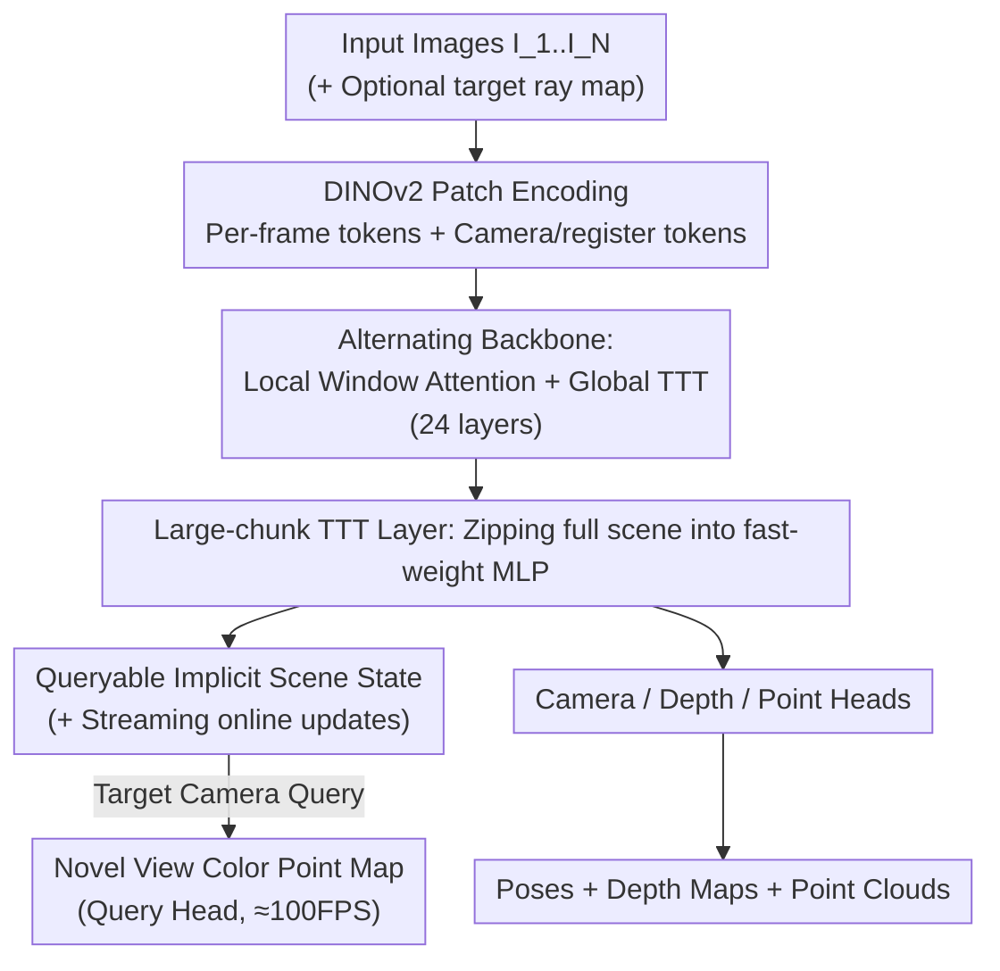

# ZipMap: Linear-Time Stateful 3D Reconstruction via Test-Time Training

**Conference**: CVPR 2026  
**Paper**: [CVF Open Access](https://openaccess.thecvf.com/content/CVPR2026/html/Jin_ZipMap_Linear-Time_Stateful_3D_Reconstruction_via_Test-Time_Training_CVPR_2026_paper.html)  
**Code**: [Project Page](https://haian-jin.github.io/ZipMap)  
**Area**: 3D Vision  
**Keywords**: Feed-forward 3D Reconstruction, Test-Time Training, Linear Complexity, Stateful Representation, Implicit Scenes

## TL;DR
ZipMap "compresses" an entire image collection into a fixed-size fast-weight MLP using Test-Time Training (TTT) layers, enabling bidirectional feed-forward 3D reconstruction (camera pose + depth + point cloud) in **linear time**. It achieves or exceeds the accuracy of quadratic-complexity methods like VGGT/π³, reconstructing over 700 frames in under 10 seconds (20× faster than VGGT), while the resulting implicit scene state can be queried in real-time for novel view geometry and appearance.

## Background & Motivation

**Background**: Feed-forward transformers have become the dominant paradigm for 3D reconstruction—DUSt3R/MASt3R demonstrated that image pairs can directly regress dense geometry, while VGGT and π³ extended this to multi-view scenarios, outputting camera poses, depth maps, and point clouds simultaneously in a single forward pass with high quality.

**Limitations of Prior Work**: These SOTA methods rely on **global self-attention** across all image tokens to establish geometric consistency, resulting in computational costs that grow **quadratically** with the number of input images $N$. For long sequences or large image sets of hundreds or thousands of frames, the attention matrix becomes a bottleneck—VGGT takes over 200 seconds for 750 frames, making it difficult to scale.

**Key Challenge**: Global consistency requires all tokens to observe each other (quadratic), while reducing costs often leads to compromises. Existing linear methods (CUT3R, Point3R, TTT3R) adopt a **sequential/local-chunking** approach—processing frames recurrently one by one to keep costs linear. However, this comes at the cost of significantly lower quality and susceptibility to **error accumulation** in recursive processing, where drift worsens with longer inputs (see Fig.4). Thus, "linear time" and "high fidelity" have remained mutually exclusive in feed-forward reconstruction.

**Key Insight**: The authors leverage a new mechanism from linear sequence models called Test-Time Training (TTT)—which treats a portion of the model parameters as "fast-weight" memory, writing contextual information online via a single gradient descent step during inference. Specifically, LaCT updates the fast weights of a non-linear MLP **once per large chunk of tokens**, providing hardware efficiency and bidirectional context support. This perfectly aligns with the need to "compress a large image collection into a compact state."

**Core Idea**: Replace global attention with a **large-chunk TTT layer**—"zipping" the entire image collection into a fixed-size fast-weight MLP. This allows globally consistent bidirectional reconstruction in a single forward pass with linear time complexity; the resulting compressed state itself serves as a real-time queryable implicit scene representation.

## Method

### Overall Architecture
ZipMap is a **stateful feed-forward model**: given $N$ images $\{I_1,\dots,I_N\}$ (video or unordered set), a single linear-time forward pass outputs camera poses $c_i$, depth maps $D_i$, and point clouds $p_i$ for every frame. Simultaneously, the model **automatically "zips" the entire scene into TTT fast weights** during the forward pass, forming an implicit scene representation. Subsequently, a target camera (ray map) can be used to query the color point map from this new perspective in real-time.

The pipeline works as follows: each frame is first encoded into patch tokens using a pre-trained **DINOv2**, then passed through a backbone of **24 stacked identical blocks**. Each block consists of **local window attention** (self-attention only within a single frame to capture intra-frame spatial relations) + a **global large-chunk TTT layer** (aggregating tokens from all frames into fast weights for global fusion). After the backbone, four prediction heads (camera/depth/point/query) generate outputs. Crucially, global information aggregation no longer relies on "all-to-all token multiplication" but on "writing context into a fixed-size MLP," dropping complexity from $O(N^2)$ to $O(N)$ while remaining naturally bidirectional.

### Key Designs

**1. Large-chunk TTT Layer: Zipping the Scene into a Fixed-size Fast-weight MLP**

This is the core of the work, directly addressing the "quadratic explosion of global attention." Instead of maintaining an attention buffer that grows with the number of tokens, the authors implement global aggregation as "training at test time": the fast-weight function is a SwiGLU-MLP $f_W(x)=W_2\big(\mathrm{SiLU}(W_1x)\circ(W_3x)\big)$, where $W=\{W_1,W_2,W_3\}$ are the parameters to be updated online. Each token projects a query $q_i$, key $k_i$, and value $v_i$, constructing a **virtual key-value reconstruction objective** $\mathcal{L}(f_W(k_i),v_i)=-f_W(k_i)^\top v_i$. This forces the fast weights to remember the mapping of keys to values—essentially building an in-context associative memory. This virtual objective is independent of the final 3D reconstruction loss.

Specifically, a single gradient is computed for all tokens across all views:

$$g=\nabla_W\sum_{k=1}^{N\times p}\eta_i\,\mathcal{L}\big(f_W(k_i),v_i\big),$$

where the learning rate $\eta_i$ for each token is predicted by a linear layer (per-token adaptation). **A single gradient step** "zips" the entire image set into the fast weights $\hat W$. Complexity is linear ($O(N)$) as it only scans all tokens once. It remains globally consistent and bidirectional because the gradient step observes all tokens from all frames simultaneously, allowing every token to "contribute" to the same shared state, unlike recursive sequence models (avoiding the drift found in CUT3R/TTT3R).

After the update, the query of each token is passed through the updated fast weights $o_i'=f_{\hat W}(q_i)$, which is **analogous to "using a query to self-attend all key-values" but with linear complexity**. Queries $q_t$ for target ray tokens are similarly processed via $f_{\hat W}$, equivalent to "cross-attending all input views" from a target perspective, with a constant cost per target token independent of the number of input views $N$.

**2. Local Window Attention + Global TTT Alternating Backbone**

TTT is responsible for "cross-frame global fusion," but intra-frame spatial structures must also be modeled. The authors distribute these tasks within each block: **local window attention** uses standard self-attention + RoPE within a single view (image or ray map) to capture spatial relationships; the **global large-chunk TTT layer** handles information aggregation across all frames. By stacking 24 such blocks, the complexity is determined by "local attention (fixed size per frame, linear with $N$) + TTT (linear with tokens)," making the entire backbone $O(N)$. This effectively replaces the **most expensive global attention** in the VGGT architecture with TTT while retaining local modeling capabilities.

**3. The Stability Trio for TTT: Newton–Schulz Orthogonalization + Gating + Per-token LR**

Updating an MLP via a single gradient step repeatedly across 24 layers is prone to divergence. The authors introduce three stabilization mechanisms. First, **Newton–Schulz orthogonalization** is applied to the fast-weight gradients before the update, accompanied by L2 normalization: $\Delta\leftarrow\mathrm{NewtonSchulz}(g)$, $\hat W\leftarrow\|W\|\cdot\frac{W-\Delta}{\|W-\Delta\|}$. This is the most critical component; removing it degrades point cloud accuracy (ETH3D Acc.) from 0.337 to 0.408. Second, a **gating unit** $o_i=\mathrm{RMSNorm}(o_i')\cdot\mathrm{SiLU}(W_g o_i')$ allows the model to adaptively adjust TTT output intensity. Third, the **per-token learning rate** $\eta_i$ significantly outperforms fixed global learning rates.

**4. Queryable Implicit Scene State + Streaming Online Expansion**

The zipped fast weights are more than intermediate products; they form an **implicit scene representation** with two unique capabilities. **Real-time Querying**: A target camera ray map (9D per pixel: ray origin $r_o$, direction $r_d$, and $r_o\times r_d$) is patchified into query tokens and passed through the updated fast weights $f_{\hat W}(q_t)$. The query head directly predicts the RGB $I_t$ and depth $D_t$ for the novel view at ≈100 FPS, decoupled from the number of input views. **Streaming Reconstruction**: While the bidirectional version updates TTT once with all tokens, it can be switched to update weights online using only current frame tokens $W^{(t)}\leftarrow\mathrm{TTTUpdate}\big(W^{(t-1)};\{k_{t,i},v_{t,i}\}\big)$, facilitating recursive per-frame reconstruction without architectural changes.

### Loss & Training
The total loss is $\mathcal{L}=\mathcal{L}_{point}+\mathcal{L}_{depth}+w_c\mathcal{L}_{cam}+(\mathcal{L}^t_{color}+\mathcal{L}^t_{depth})$ with $w_c=5$. Point loss uses scale-invariant local reconstruction loss, while the global scale $\hat s$ is solved via an ROE solver. Depth loss uses L1 modulated by predicted uncertainty $\Sigma$. Camera loss initially uses L1 with the first frame as reference, but the **reference view is removed** in final stages in favor of π³'s affine-invariant loss to improve long-sequence generalization. Training occurs in **three stages** on 64 H100 GPUs using 29 datasets.

## Key Experimental Results

### Main Results

Camera Pose Estimation (Tab.1, AUC↑): On RealEstate10K and Co3Dv2, ZipMap significantly outperforms other linear methods (CUT3R/TTT3R) and approaches the performance of quadratic methods.

| Method | Complexity | RE10K AUC@30 ↑ | Co3Dv2 AUC@30 ↑ |
|------|--------|----------------|------------------|
| VGGT | $O(N^2)$ | 78.89 | 89.99 |
| π³ | $O(N^2)$ | 87.40 | 87.93 |
| CUT3R | $O(N)$ | 81.68 | 71.72 |
| TTT3R | $O(N)$ | 81.51 | 69.46 |
| **ZipMap** | $O(N)$ | **84.30** | **88.76** |

Point Map Estimation (Tab.4, DTU/ETH3D, lower is better): ZipMap brings linear method accuracy to the level of VGGT/π³.

| Method | Complexity | DTU Acc.↓ | ETH3D Acc.↓ |
|------|--------|-----------|-------------|
| VGGT | $O(N^2)$ | 1.308 | 0.270 |
| π³ | $O(N^2)$ | 1.151 | 0.188 |
| CUT3R | $O(N)$ | 5.045 | 0.593 |
| TTT3R | $O(N)$ | 5.337 | 0.763 |
| **ZipMap** | $O(N)$ | **1.228** | **0.254** |

Efficiency (Fig.1): Reconstructs 750 frames in < 10 seconds (75 FPS), which is **20×+** faster than VGGT (> 200 seconds) and ~3× faster than CUT3R/TTT3R (due to low GPU utilization in serial processing).

### Ablation Study

Ablation of TTT Key Components (Tab.6, ETH3D Point Map, lower is better):

| Configuration | Acc.↓ Mean | Description |
|------|-----------|------|
| Full model | 0.337 | Complete model |
| w/o gated unit | 0.354 | Significant drop |
| w/o Newton–Schulz | 0.408 | Largest drop |
| w/ Fixed global lr=0.1 | 0.411 | Worse than per-token lr |
| w/ Fixed global lr=1.0 | 0.464 | Most severe degradation |

### Key Findings
- **Newton–Schulz orthogonalization is vital for TTT stability**: Removing it causes the largest degradation (Acc. 0.337 to 0.408).
- **Long sequences are ZipMap's advantage** (Fig.4, DL3DV): As frame count increases, CUT3R/TTT3R exhibit sharp increases in ATE (recursive error accumulation), while ZipMap remains stable alongside π³/VGGT.
- **The implicit state learns 3D priors**: Point clouds queried directly from the state (without viewing input images) are nearly identical to those reconstructed from images, even extrapolating common structures like walls/floors.

## Highlights & Insights
- **Transferring "Linear Sequence Model" concepts to "Bidirectional Multi-view 3D Reconstruction"**: Linear architectures like Mamba are often designed for 1D causal sequences. The authors adapt LaCT-style large-chunk TTT to provide both linear scaling and bidirectional context.
- **Upgrading "Reconstruction Byproducts" to "Queryable States"**: The compressed fast-weight MLP is not just an intermediate variable but an implicit scene that can be queried in real-time.
- **Unified Bidirectional and Streaming Mechanism**: The same virtual objective handles both modes—processing all tokens at once for bidirectional or sequentially for streaming—offering high architectural flexibility.

## Limitations & Future Work
- **Deterministic output lacks generative completion**: The model extrapolates common structures but cannot "hallucinate" occluded objects (e.g., a hidden sofa) or high-frequency details.
- **Parameter count**: ZipMap has 1.40B parameters, larger than π³ (959M). The "linearity" saves on $N$-scaling rather than absolute model size.
- **Stability Sensitivity**: The reliance on Newton–Schulz and gating indicates that the "one-step gradient" approach requires precise stabilization to be effective.

## Related Work & Insights
- **vs VGGT / π³**: These use $O(N^2)$ global attention for consistency; ZipMap achieves $O(N)$ by replacing global attention with large-chunk TTT while maintaining accuracy.
- **vs CUT3R / TTT3R**: These linear methods rely on **recursive** processing, which is prone to drift. ZipMap uses **non-recursive bidirectional** updates via a single gradient step, significantly improving long-sequence accuracy.
- **vs SfM (COLMAP/GLOMAP)**: Unlike classical pipelines that require time-consuming MVS stages, ZipMap integrates pose and dense geometry into a single fast forward pass.

## Rating
- Novelty: ⭐⭐⭐⭐⭐ First to introduce large-chunk TTT to bidirectional multi-view 3D reconstruction, achieving linear scale and queryable states simultaneously.
- Experimental Thoroughness: ⭐⭐⭐⭐ Coverage of pose/points/depth plus long-sequence analysis, though streaming quantification is mostly in the appendix.
- Writing Quality: ⭐⭐⭐⭐ Motivations and TTT mechanisms are clearly explained with complete formulas.
- Value: ⭐⭐⭐⭐⭐ Enables feed-forward 3D reconstruction to scale to thousands of frames while providing an extensible state-based representation.

<!-- RELATED:START -->

## Related Papers

- [\[CVPR 2026\] tttLRM: Test-Time Training for Long Context and Autoregressive 3D Reconstruction](tttlrm_test-time_training_for_long_context_and_autoregressive_3d_reconstruction.md)
- [\[CVPR 2026\] Scal3R: Scalable Test-Time Training for Large-Scale 3D Reconstruction](scal3r_scalable_test-time_training_for_large-scale_3d_reconstruction.md)
- [\[ICLR 2026\] TTT3R: 3D Reconstruction as Test-Time Training](../../ICLR2026/3d_vision/ttt3r_3d_reconstruction_as_test-time_training.md)
- [\[CVPR 2026\] Low-Rank Test-Time Training for Pre-Trained Point Cloud Models](low-rank_test-time_training_for_pre-trained_point_cloud_models.md)
- [\[CVPR 2026\] Learning 3D Reconstruction with Priors in Test Time](tco_learning_3d_reconstruction_with_priors_in_test_time.md)

<!-- RELATED:END -->
