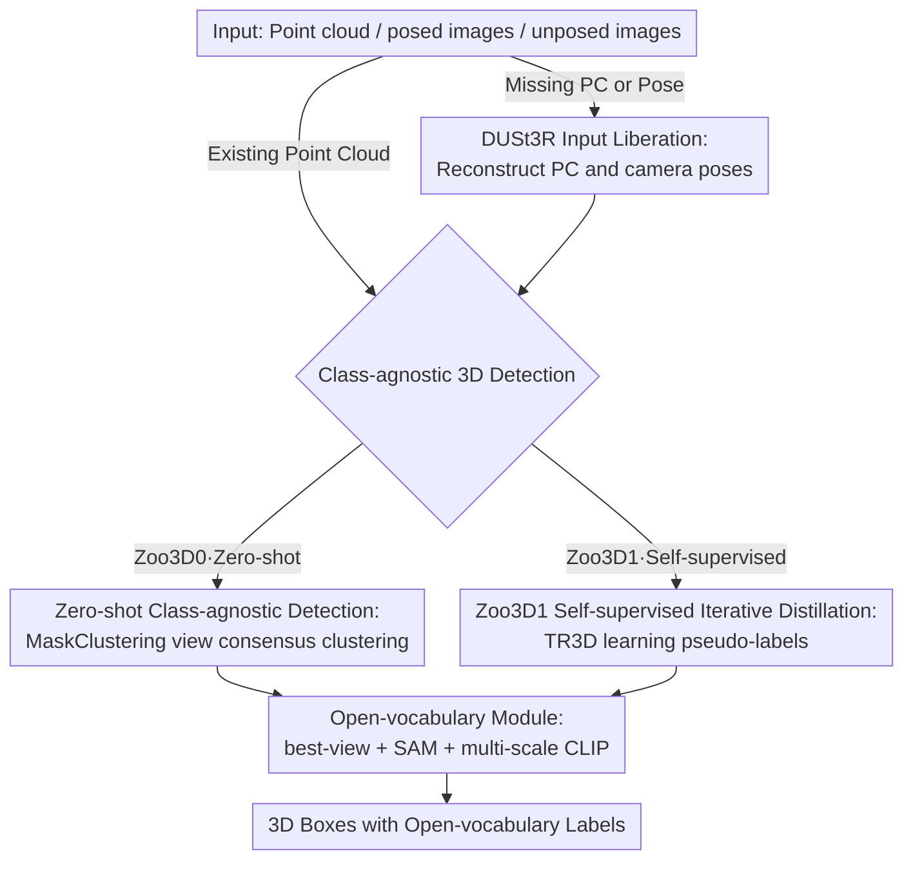

# Zoo3D: Zero-Shot 3D Object Detection at Scene Level

**Conference**: CVPR 2026  
**Paper**: [CVF Open Access](https://openaccess.thecvf.com/content/CVPR2026/html/Lemeshko_Zoo3D_Zero-Shot_3D_Object_Detection_at_Scene_Level_CVPR_2026_paper.html)  
**Code**: https://github.com/col14m/zoo3d  
**Area**: 3D Vision  
**Keywords**: Zero-shot detection, Open-vocabulary, 3D object detection, Training-free, Multi-view

## TL;DR
Zoo3D proposes the first **fully training-free (zero-shot)** scene-level 3D object detection framework. It directly constructs 3D boxes via graph clustering of 2D instance masks and assigns semantic labels using an open-vocabulary module featuring "best-view selection + SAM refinement + multi-scale CLIP." By leveraging DUSt3R, it relaxes input requirements from point clouds to unposed RGB images, outperforming all self-supervised methods on ScanNet200 and ARKitScenes in a zero-shot setting.

## Background & Motivation

**Background**: 3D object detection entails predicting both categories and oriented 3D boxes for objects within a scene. Fully supervised methods (e.g., FCAF3D, TR3D, UniDet3D, and recent LLM-based systems like Video-3D LLM) achieve high precision but are limited by the number of categories in annotated datasets, failing to recognize unseen objects. To bypass annotations, the open-vocabulary direction has evolved from "semi-supervised (OV-Uni3DETR using partial 3D boxes) to self-supervised (OV-3DET, ImOV3D relying on pseudo-labels)," progressively weakening the supervision requirements.

**Limitations of Prior Work**: Even the most efficient self-supervised methods **still require a training pass on the target scenes**—either needing the point clouds of the training scenes or images for distilling 2D supervision. Furthermore, the quality of generated pseudo-boxes is inconsistent, and text-visual alignment strategies are often cluttered. In other words, "no 3D annotations required" does not equal "no training data required." Simultaneously, inference typically requires pre-existing point clouds, whereas mobile or consumer camera scenarios often lack both point clouds and camera poses.

**Key Challenge**: To identify arbitrary open categories, it is natural to leverage 2D foundation models like CLIP or SAM. However, existing works only treat them as "pseudo-label producers during the training phase." No prior work has addressed whether the entire 3D detection pipeline can be made **completely training-free** while also solving the issue of missing point cloud inputs.

**Goal**: To push the supervision and input requirements for 3D detection to their limits—starting from "point clouds + ground truth annotations" and progressively removing annotations, training, point clouds, and camera poses to evaluate performance under extreme settings.

**Key Insight**: The authors **decouple** open-vocabulary 3D detection into two independent tasks: "class-agnostic 3D box localization" and "assigning open-vocabulary labels to those boxes." The former can leverage the established capabilities of zero-shot 3D instance segmentation (MaskClustering), while the latter only requires frozen CLIP/SAM for alignment during inference. Neither stage requires training.

**Core Idea**: Replace "training a detector on 3D scenes" with "clustering 2D masks into 3D boxes + frozen CLIP/SAM labeling." Then, use DUSt3R to recover missing point clouds or poses, achieving the first truly zero-shot scene-level 3D detection.

## Method

### Overall Architecture
Zoo3D splits open-vocabulary 3D detection into a two-stage pipeline: **first, predicting class-agnostic 3D boxes $\{b_g\}_{g=1}^G$, then assigning semantic labels $l_g$ via an open-vocabulary module**. Boxes are sourced via two modes: the zero-shot **Zoo3D0**, which clusters 2D masks from MaskClustering into 3D boxes (zero training), and the self-supervised **Zoo3D1**, which uses pseudo-boxes from Zoo3D0 to train a class-agnostic TR3D detector to improve box quality. Both modes share the **same** open-vocabulary module for labeling. Finally, to eliminate the "point cloud requirement," DUSt3R is used to reconstruct point clouds and poses from posed or even unposed images, reducing image inputs to point cloud inputs.

3D boxes are defined as axis-aligned boxes $b_g=(c_g, s_g)$, where $c_g\in\mathbb{R}^3$ is the center and $s_g\in\mathbb{R}^3_+$ represents the x/y/z dimensions (rotation is not predicted).

### Key Designs

**1. Zero-shot Class-agnostic 3D Detection: Adapting MaskClustering for Box Generation**

The challenge is obtaining 3D boxes without training. The authors build upon the SOTA zero-shot 3D instance segmentation method, MaskClustering. First, a class-agnostic mask predictor generates 2D masks $\{m_{t,i}\}$ for each frame. Each mask is treated as a node in a "mask graph," and **edges are connected between masks belonging to the same instance**. Connectivity is determined by a "view consensus rate"—for mask $m_{t',i}$ in frame $t'$ and mask $m_{t'',j}$ in frame $t''$, the set of observation frames $F_o$ where both are visible is identified. Within $F_o$, "support frames" $F_s$ are found (frames containing a mask $m_{t,k}$ whose point cloud covers the projections of both $m_{t',i}$ and $m_{t'',j}$). The consensus rate is the ratio of supporters to observers:

$$cr(m_{t',i}, m_{t'',j}) = \frac{|\{t\in V \mid \exists k,\, P^t_{t',i}, P^t_{t'',j} \sqsubset P_{t,k}\}|}{|F_o|}$$

Edges are connected when $cr \ge \tau_{rate}=0.9$. Masks are then iteratively merged (removing edges with observer counts less than $n_k$ and merging connected components) to obtain 3D instances. **The key modification is in the final step**: since only axis-aligned boxes are considered, the authors directly take the min/max xyz coordinates of each instance's point set as the box corners. This "freely" converts segmentation results into 3D boxes. The entire localization pipeline remains frozen and training-free, inheriting the instance quality of MaskClustering.

**2. Open-vocabulary Module: best-view selection + SAM refinement + multi-scale CLIP**

With class-agnostic boxes, labels must be assigned without training. A naive approach would be to project box points to images and feed the cropped regions to CLIP, but **boxes have errors, projections are contaminated by occlusions, and single views are unreliable**. The module addresses these sequentially: first, point clouds are cropped by the box $P_g=\{p_i\in P \mid c_g-\tfrac{s_g}{2}\le p_i \le c_g+\tfrac{s_g}{2}\}$ and projected to frame $t$ as $u_{t,i}=\pi(KR_t[x_i,y_i,z_i,1]^T)$. **Occlusion filtering** is then performed via back-projection, removing points that deviate by more than $\tau_{occ}$ from the original 3D point, resulting in a clean projected point set $U^t_g$. Next, the **top-5 views are selected** (best-view, based on the highest number of visible points). To correct for mask displacement caused by imprecise boxes, the min/max of the projected points define a 2D box $bb_{2d}$ used as a prompt for **SAM** to obtain a refined object mask. This mask is processed at three scales and fed into **CLIP**. The final feature vector averages the 5 views × 3 scales and computes cosine similarity with category text features to assign the label and confidence. This stage uses only frozen CLIP ViT-H/14 and SAM 2.1.

**3. Zoo3D1: Self-supervised Training with Zero-shot Pseudo-boxes, then Iterative Distillation**

While the training-free Zoo3D0 is SOTA, mask graph clustering is slow and has an accuracy ceiling. The authors use Zoo3D0 as a pseudo-label generator: it generates class-agnostic 3D boxes for training scenes, which are then used to train a **class-agnostic version of TR3D**. TR3D was modified by removing all "category-routed" designs—the original version splits objects into large/small categories and predicts them at different resolution layers (32cm/16cm). In the open-vocabulary setting, categories cannot be pre-defined, so boxes are predicted only at the 16cm layer. The classification branch is removed, and the detection head only regresses objectness confidence $\tilde{z}_j$, center offset $\Delta c_j$, and log-size $\tilde{s}_j$ for each 3D position $\hat{v}_j$, decoded as $c_j=\hat{v}_j+\Delta c_j$, $s_j=\exp(\tilde{s}_j)$, and $p_j=\sigma(\tilde{z}_j)$. Training utilizes focal loss for objectness and DIoU loss for box regression ($L=L_{focal}+L_{DIoU}$), with an assigner matching each ground truth object to the nearest 6 positions. Furthermore, **iterative distillation** is performed: the trained Zoo3D1 generates better pseudo-labels to train Zoo3D2. Experiments show gains from 0→1 and 1→2, saturating at the third round. Compared to Zoo3D0's graph clustering, TR3D is a lightweight sparse convolutional network and is much faster at inference.

**4. DUSt3R Input Liberation: From Point Clouds to Unposed RGB Images**

The aforementioned pipeline assumes the availability of point clouds, but real-world scenes often only provide images. The authors use the foundation model DUSt3R as a "2D↔3D bridge." In **posed image** mode, DUSt3R outputs dense depth maps, which are fused into TSDF voxels using ground truth poses to extract point clouds. In the most difficult **unposed image** mode, DUSt3R infers both depth and camera poses within a single end-to-end framework. A subtle advantage of choosing DUSt3R is that it was not trained on ScanNet, **avoiding data leakage** and maintaining the integrity of the zero-shot setting. Ablations show that replacing it with DROID-SLAM causes performance to collapse (unposed class-agnostic mAP25 drops from 19.0 to 2.4), highlighting that reconstruction quality is critical.

## Key Experimental Results

Datasets: ScanNet (10/20/60/200 categories, no ground truth 3D boxes used, reporting mAP@IoU0.25 and 0.5) and ARKitScenes (17 categories, class-agnostic evaluation, reporting precision/recall). The open-vocabulary module uses CLIP ViT-H/14 + SAM 2.1 (Hiera-L), sampling 45 frames per scene.

### Main Results: Open-vocabulary Detection with Point Cloud Input

| Benchmark | Metric | Prev. SOTA (OV-Uni3DETR†) | Zoo3D0 (Zero-shot) | Zoo3D1 (Self-supervised) |
|-----------|------|------|------|------|
| ScanNet20 | mAP25 | 25.3 | 34.7 | **37.2** (+11.9 Gain) |
| ScanNet60 | mAP25 | 19.4 | 27.1 | **32.0** (+12.6 Gain) |
| ScanNet200 | mAP25 | — | 21.1 | **23.5** |
| ScanNet10 | mAP25 | 34.1 | 42.1 | **44.5** (+10.4 Gain) |

(† indicates usage of ground truth 3D boxes during training.) Even the completely zero-shot Zoo3D0 significantly outperforms OV-Uni3DETR, which uses 3D box supervision.

### Across Input Modalities: posed / unposed images

| Input Modality | Method | ScanNet20 mAP25 | ScanNet60 mAP25 | ScanNet200 mAP25 |
|----------|------|------|------|------|
| Posed Images | OpenM3D | 19.8 | — | 4.2 |
| Posed Images | DUSt3R→Zoo3D1 | **32.8** | **23.9** (+12.7 vs OV-Uni3DETR) | **16.5** |
| Unposed Images | DUSt3R→Zoo3D0 | 24.2 | 13.3 | 8.3 |
| Unposed Images | DUSt3R→Zoo3D1 | **27.9** | **15.3** | **10.7** |

Notably, the unposed Zoo3D1 (lacking point clouds and poses) achieves accuracy close to OV-Uni3DETR trained on point clouds.

### Ablation Study: Open-vocabulary Module Components (posed, ScanNet200)

| Configuration | mAP25 | mAP50 | Description |
|------|-------|-------|------|
| base | 14.7 | 5.7 | Approximate mask from projected box points |
| + Occlusion Filter | 14.8 | 5.7 | Negligible impact |
| + SAM Mask Refinement | 15.4 | 5.7 | Mainly improves mAP25 |
| + Multi-scale Processing | **16.5** | **6.3** | Mainly improves mAP50 |

### Key Findings
- **SAM refinement and multi-scale are the core drivers of the open-vocabulary module**: SAM refinement raises mAP25 (better masks → better semantics), while multi-scale processing elevates mAP50 (tighter boxes/features). Occlusion filtering has minimal impact on main metrics but ensures clean projections.
- **Iterative training is effective but saturates quickly**: Zoo3D0→1→2 class-agnostic mAP25 on posed ScanNet200 improved from 22.4→36.1→37.6, ceasing to increase after the third round.
- **Precision is traded for time**: The most expensive part of Zoo3D is DUSt3R reconstruction (294s/scene). Zoo3D0's mask graph clustering is slow (56s for detection), while Zoo3D1 detection is only 0.04s but generates many overlapping boxes, making its open-vocabulary phase more time-consuming (84s). OpenM3D takes less than 1s overall—this speed deficit is traded for much higher accuracy.
- **More frames are better, but 15 frames suffice**: Performance peaks at 45 frames, but Zoo3D0 outperforms OpenM3D on ScanNet200 using only 15 frames.
- **Reconstruction quality is critical**: Replacing DUSt3R with DROID-SLAM causes the unposed class-agnostic mAP25 to plummet from 19.0 to 2.4.

## Highlights & Insights
- **Decoupling localization and labeling is the key to zero-shot success**: By splitting detection into "class-agnostic boxing (via MaskClustering)" and "frozen CLIP/SAM labeling," the pipeline avoids 3D training entirely. This concept is transferable to other tasks like zero-shot 6-DoF detection or scene graph generation.
- **Converting instance segmentation to detection boxes "for free"**: Since only axis-aligned boxes are required, taking min/max coordinates is a zero-cost way to reuse mature segmentation models, highlighting how many "new tasks" can be solved by simple format conversions of existing outputs.
- **Best-view + SAM-as-prompt is a practical alignment trick**: Using 2D boxes from projected points as SAM prompts to correct inaccurate 3D boxes creates a clever loop where 2D foundation models correct 3D errors.
- **DUSt3R selection balances capability and fairness**: It was chosen not just for unposed reconstruction capabilities, but because its lack of ScanNet training prevents data leakage, making the "zero-shot" claim robust.

## Limitations & Future Work
- **Extremely slow**: DUSt3R reconstruction takes ~300s, and the Zoo3D1 open-vocabulary phase takes 84s due to redundant boxes. This is far from real-time; "faster reconstruction/segmentation/labeling" is a primary future work.
- **Reconstruction quality ceiling**: The unposed mode relies entirely on DUSt3R; the pipeline is highly sensitive to the foundation model's quality, raising robustness concerns.
- **Axis-aligned boxes only**: The lack of orientation prediction leads to distortion for objects with significant rotation (slanted chairs, outdoor vehicles). The paper also only validates indoor scenes.
- **Generally low mAP50**: For example, unposed Zoo3D1 on ScanNet200 achieves only 3.8 mAP50, indicating that box precision is still weak, relying more on coarse localization and strong semantics.
- Future Work: Integrating LLMs for spatial reasoning to assist labeling, using faster feed-forward reconstruction instead of DUSt3R, and implementing stronger NMS to reduce overhead in the open-vocabulary phase.

## Related Work & Insights
- **vs OV-Uni3DETR / OpenM3D (Self-supervised open-vocabulary)**: These still require training on scenes (PC or image + depth supervision; OpenM3D also fine-tunes CLIP). Zoo3D0 outperforms them while being training-free, and Zoo3D1 extends this lead.
- **vs MaskClustering / SAM2Object (Zero-shot 3D instance segmentation)**: These only perform segmentation without boxes or open-vocabulary labels. Zoo3D adapts segmentation to 3D boxes and adds an open-vocabulary module, advancing zero-shot capabilities to "scene-level 3D detection."
- **vs SAM3D (Outdoor zero-shot)**: SAM3D operates on BEV projections and is unsuitable for indoors; Zoo3D specializes in indoor multi-view scenes.
- **vs VLM-3R / SpatialLM (Unposed images)**: These LLM-based methods require full supervision. Zoo3D achieves self-supervised or zero-shot performance in the unposed setting, representing the first label-free solution for this modality.

## Rating
- Novelty: ⭐⭐⭐⭐⭐ Proposes and solves the new task of "scene-level zero-shot 3D detection" with a clean framework.
- Experimental Thoroughness: ⭐⭐⭐⭐⭐ Covers four benchmarks × three input modalities, with ablations for components, frames, reconstructors, iterations, and inference time.
- Writing Quality: ⭐⭐⭐⭐ The narrative of "gradually relaxing supervision and inputs" is clear, though some mathematical notations (e.g., the relationship between $V$ and $F_o$) require cross-referencing.
- Value: ⭐⭐⭐⭐ A significant step toward "plug-and-play" open-vocabulary 3D detection without labels or point clouds, limited only by its speed.

<!-- RELATED:START -->

## Related Papers

- [\[CVPR 2026\] Few-Shot Incremental 3D Object Detection in Dynamic Indoor Environments](few-shot_incremental_3d_object_detection_in_dynamic_indoor_environments.md)
- [\[CVPR 2026\] ConceptPose: Training-Free Zero-Shot Object Pose Estimation using Concept Vectors](conceptpose_training-free_zero-shot_object_pose_estimation_using_concept_vectors.md)
- [\[CVPR 2026\] VGGT-360: Geometry-Consistent Zero-Shot Panoramic Depth Estimation](vggt-360_geometry-consistent_zero-shot_panoramic_depth_estimation.md)
- [\[ICCV 2025\] Accelerate 3D Object Detection Models via Zero-Shot Attention Key Pruning](../../ICCV2025/3d_vision/accelerate_3d_object_detection_models_via_zero-shot_attention_key_pruning.md)
- [\[ECCV 2024\] Zero-Shot Multi-Object Scene Completion](../../ECCV2024/3d_vision/zero-shot_multi-object_scene_completion.md)

<!-- RELATED:END -->
