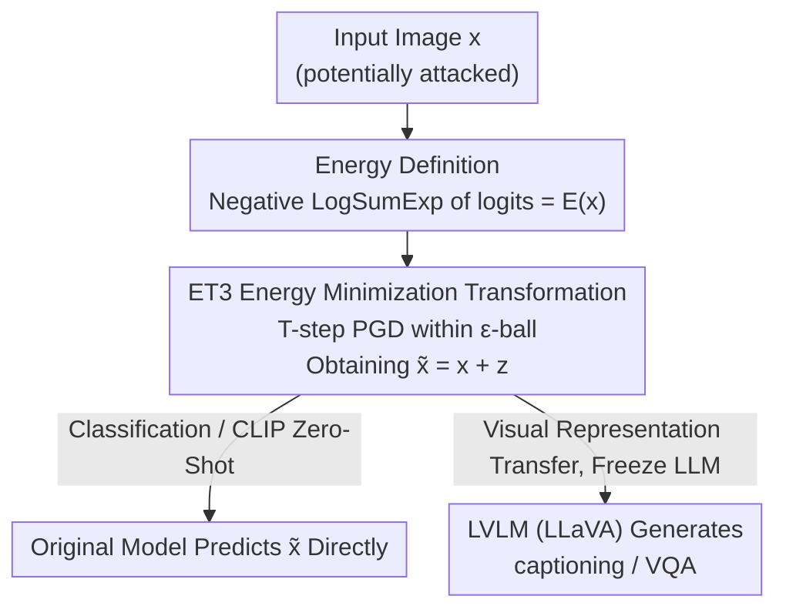

# A Provable Energy-Guided Test-Time Defense Boosting Adversarial Robustness of Large Vision-Language Models

**Conference**: CVPR 2026  
**Paper**: [CVF Open Access](https://openaccess.thecvf.com/content/CVPR2026/html/Mirza_A_Provable_Energy-Guided_Test-Time_Defense_Boosting_Adversarial_Robustness_of_Large_CVPR_2026_paper.html)  
**Code**: Yes (The paper states "Code is available on GitHub", repository address is subject to the original text)  
**Area**: AI Safety / Adversarial Robustness  
**Keywords**: Adversarial Robustness, Test-Time Defense, Energy-Based Models, Vision-Language Models, CLIP

## TL;DR
ET3 interprets the LogSumExp of classifier logits as the "energy" of the input. During inference, it applies a few gradient descent steps directly to the image to minimize this energy, thereby pulling adversarial samples that were pushed away from the data manifold back to their correct classes. It is training-free with almost zero overhead, significantly boosting the adversarial robustness of pure classifiers, zero-shot CLIP, and large VLMs like LLaVA, while providing provable correction guarantees under binary classification cases.

## Background & Motivation
**Background**: Large vision-language models (LVLMs, such as LLaVA, OpenFlamingo, Qwen-VL) almost universally employ CLIP vision encoders as their "eyes," relying on their strong generalization capabilities for captioning, VQA, and open-vocabulary recognition. However, the vision side of CLIP is also the primary source of adversarial vulnerability for the entire system: introducing imperceptible perturbations to the images can lead to catastrophic failures downstream. The mainstream paradigm for improving robustness is **adversarial training (AT)**, which feeds adversarial examples into the training set, while another direction is **test-time defense**, which remedies vulnerabilities during the inference phase.

**Limitations of Prior Work**: Adversarial training is computationally expensive, and a significant gap remains between clean and perturbed performance, especially when facing stronger or unseen attacks. On the other hand, existing test-time defense solutions come with their own costs: adversarial purification requires an auxiliary generative/diffusion model for denoising; randomized smoothing (RS) demands a large number of noise-perturbed evaluations to average; recent test-time transformation (TTT) methods (such as TPT/R-TPT/MTA) require optimizing additional prompt tokens for each sample or generating and aggregating multiple augmented views. These approaches incur **high inference overhead, often require extra models, struggle to scale to strong attacks**, and sometimes even compromise clean accuracy.

**Key Challenge**: There is a stark trade-off between robustness improvements and computational/engineering costs, requiring heavy investment either on the training side (AT) or the inference side (such as multi-view or model-heavy TTT). Furthermore, most of these methods lack theoretical guarantees, leaving it unclear when such transformations might fail.

**Goal**: To design a **training-free, auxiliary-model-free, and virtually zero-overhead** test-time defense that generalizes across image classifiers, zero-shot CLIP, and LVLMs, with **provable** effectiveness in binary classification.

**Key Insight**: The authors adopt an Energy-Based Model (EBM) perspective: adversarial perturbations essentially **push samples off the natural data manifold**, corresponding to high energy. The Joint Energy-based Model (JEM) has shown that a standard softmax classifier can inherently be interpreted as an EBM, where logits directly represent energy. Accordingly, "pulling samples back to the manifold" is equivalent to "minimizing the energy." The energy gradient can be directly obtained from the existing classifier/encoder without any additional training.

**Core Idea**: Instead of expensive adversarial training or multi-view TTT, a lightweight transformation is used—performing a few steps of gradient descent to minimize input energy within an $\epsilon$-ball—to push adversarial samples back to the correct classification region during test-time.

## Method

### Overall Architecture
The input to ET3 (Energy-guided Test-Time Transformation) is an (potentially attacked) image $x$ and a pre-trained model $f_\theta$ (classifier or vision encoder) to be defended. The output is a refined image $\tilde x = x + z$, where the perturbation $z$ is constrained within an $\ell_2$ ball of radius $\epsilon$. The overall pipeline consists of only three steps: ① The output logits of $f_\theta$ are used to define the energy $E(x)$ via LogSumExp; ② Starting from $x$, $T$ steps of projected gradient descent along $-\nabla_x E$ are performed to obtain $\tilde x$ with lower energy (closer to the manifold); ③ The refined $\tilde x$ is fed back to the original model for classification, or its internal representation from the CLIP vision encoder is directly forwarded to the downstream LVLM.

The key is that ET3 **does not modify the VLM itself**: the optimization minimizes energy solely on the vision encoder (CLIP). The subsequent language generation of LLaVA remains unchanged after receiving the visual embeddings of $\tilde x$ through the projection layer. Consequently, an image "purified" on CLIP can **transfer** its robustness to any LVLM that reuses the encoder, requiring only single-step optimization and introducing almost no inference latency.

### Key Designs

**1. Treating the Softmax Classifier as an EBM: Defining "Input Energy" via LogSumExp**

To defend against adversarial attacks, one must "pull adversarial samples back to the manifold." However, the data manifold is implicit, and no off-the-shelf energy function is provided. The key observation in this paper stems from JEM: the logits of a pre-trained $K$-class classifier $f_\theta$ can inherently be treated as energy without training a separate generative EBM. Specifically, the energy of a sample $x$ is defined as the negative LogSumExp of the output logits:

$$E(x) = -\log\left(\sum_{k=1}^{K}\exp\big(f_\theta(x)_k\big)\right).$$

Intuitively, in-distribution (on-manifold) samples possess lower energy, whereas out-of-distribution or adversarial (off-manifold) samples exhibit higher energy. The value of this formulation lies in converting the abstract goal of "reconstruction toward the natural manifold" into a **scalar objective directly differentiable with respect to the input**. The gradients are derived entirely from the existing model, requiring zero extra parameters and zero additional training.

**2. Projected Gradient Descent inside the $\epsilon$-Ball for Energy Minimization: A Training-Free, Few-Step Core Defense**

With the defined energy function, the defense becomes a constrained minimization problem: finding the minimum energy point $\tilde x = \arg\min_{x'\in B_\epsilon(x)} E(x')$ within an $\ell_2$ ball $B_\epsilon(x)$ centered at $x$ with radius $\epsilon$. Resolving this using $T$-step projected gradient descent, the $t$-th step is formulated as:

$$x^{(t)} = \Pi_{B_\epsilon(x)}\Big(x^{(t-1)} - \eta\,\nabla_x E\big(x^{(t-1)}\big)\Big),\quad x^{(0)}=x,$$

where the projection $\Pi_{B_\epsilon(x)}$ projects the perturbation back onto the $\ell_2$ ball to ensure $\lVert z\rVert\le\epsilon$. The step base $\eta$ and step count $T$ are the only hyperparameters. Note that expanding the energy gradient yields $\nabla_x E(x) = -\sum_i \mathrm{SoftMax}(f_\theta(x))_i\,\nabla_x f_\theta(x)_i$, which is a weighted sum of the logit gradients based on their softmax probabilities. Thus, minimizing energy is equivalent to **strengthening evidence along the classes favored by the model**. Unlike adversarial purification, no auxiliary generative model is required; unlike multi-view TTT, prompt optimization and augmented view generation are avoided. Empirically, the single-step defense increases inference time by only ~2.3% and often maintains or slightly increases confidence for clean images.

**3. Unified Integration Across Settings: CLIP Zero-Shot and LVLMs via "Proxy Label Sets + Vision Encoder Transfer"**

Applying the same energy minimization framework to both zero-shot classification and multimodal generation presents a challenge, as LVLMs do not output standard "K-class logits." This paper resolves this by introducing two adapters. For **zero-shot CLIP**, classification relies on image-text embedding similarities; thus, these similarities are treated as logits to compute energy. The label set can be a refined subset or the massive ImageNet-21K label set as "proxy concepts" (the latter performs slightly better in terms of robustness and is adopted by default). For **LVLMs (LLaVA)**, because they reuse the CLIP vision encoder, ET3 performs energy minimization on the visual input with respect to ImageNet-21K text labels directly on the vision encoder. The purified visual embeddings then enter LLaVA through the projection layer, while **the language generation process remains completely unchanged and the VLM does not participate in optimization**. This design enables "purifying once on the encoder to transfer robustness to all downstream tasks," explaining why captioning and VQA can share the same defense mechanism.

### Loss & Training
ET3 **has no training phase**; the only "objective function" is the energy $E(x)$ minimized during inference (Eq. 1). The only adjustable hyperparameters are the defense radius $\epsilon$, step size $\eta$, and step count $T$. In the paper, zero-shot CLIP defaults to $\epsilon=5$ (TeCoA) or $4$ (FARE) with $T=2$. The LVLM experiments fix the gradient iteration to two steps. A single step recovers most of the benefits, which is the source of its "almost zero overhead."

## Provable Guarantees of ET3
The paper presents a correction theorem under binary classification (Theorem 4.1): Let $f_\theta:\mathbb R^d\to\mathbb R^2$ be **locally linear** within $B_\epsilon(x)$, and denote the logit margin as $r_x=f_\theta(x)_{y_t}-f_\theta(x)_{\hat y_t}$, the logit gradients for each class as $g_i=\nabla_x f_\theta(x)_i$, and the energy weights for each logit as $e_i=\mathrm{SoftMax}(f_\theta(x))_i$. As long as the defense budget satisfies $\epsilon > \tfrac{-2r_x}{\lVert g_{y_t}\rVert}$, and the **energy gradient of the ground-truth class is stronger than that of the incorrect class** (i.e., $C\lVert e_{\hat y_t}g_{\hat y_t}\rVert < \lVert e_{y_t}g_{y_t}\rVert$, where $C$ is a threshold provided by the theorem), a single-step ($T=1$) ET3 transformation $z$ satisfies $\lVert z\rVert\le\epsilon$ and $f_\theta(x+z)_{y_t} > f_\theta(x+z)_{\hat y_t}$, meaning the sample is correctly classified after transformation.

Proof sketch: Under the local linearity assumption, the attack pushes down the ground-truth logit along the "negative direction of a larger gradient," while the ET3 energy minimization step goes precisely along the **positive direction of this larger gradient**, pulling the adversarial point back to the ground-truth region (Figure 3 left). The intuitive counterpart is the gradient norm ratio $C$: Figure 3 (right) shows a scatter plot of 1,000 ImageNet images, where samples with $C\gtrsim 1$ almost always achieve logit margin $>0$ (correctly classified) after transformation, with larger $C$ leading to larger margins. The authors also note that this theorem has looser assumptions for clean samples ($r_x>0$) and can be generalized to multi-step transformations under the same budget, citing the provably robust two-layer ReLU networks constructed in [26] as concrete instances satisfying these assumptions.

## Key Experimental Results

### Main Results

**Zero-Shot Classification (14 Datasets, defense-unaware, AA @ $\epsilon_a=4/255$)**: ET3 consistently improves the robust accuracy of robust CLIP (TeCoA / FARE) while barely affecting clean accuracy.

| Model (Backbone) | Metric | Base | + ET3 | Gain |
|---|---|---|---|---|
| ViT-L/14 TeCoA ($\epsilon_t$=4/255) | Robust Avg. | 32.85 | 40.93 | +8.08 |
| ViT-L/14 FARE ($\epsilon_t$=4/255) | Robust Avg. | 32.77 | 40.60 | +7.83 |
| ViT-L/14 TeCoA ($\epsilon_t$=2/255) | Robust Avg. | 27.66 | 38.64 | +10.98 |
| ViT-L/14 FARE ($\epsilon_t$=2/255) | Robust Avg. | 20.39 | 31.75 | +11.36 |
| ViT-L/14 TeCoA ($\epsilon_t$=4/255) | Clean Avg. | 55.69 | 56.09 | +0.40 |

It is worth noting that ET3 brings even larger gains (on the order of +11) to "weaker" models (trained with weaker attacks), while keeping clean accuracy largely unchanged (±0.4).

**Against Comparable Test-Time Defenses (8 Fine-grained Datasets, TeCoA CLIP-ViT-B/32, PGD-100 @ 4/255, Robust Avg.)**:

| Method | Scope | Robust Avg. | Gain |
|---|---|---|---|
| CLIP (Robust) baseline | — | 12.26 | — |
| TTC | Lightweight · Vision-only | 13.90 | +1.64 |
| **ET3 (ours)** | Lightweight · Vision-only | **16.51** | **+4.25** |
| MTA | Multi-view | 17.80 | +5.54 |
| Ensemble + ET3 | Multi-view | 22.26 | +10.0 |
| R-TPT | Multi-view + prompt | 21.41 | +9.15 |
| **R-TPT + ET3** | Multi-view + prompt | **23.88** | **+11.62** |

When used alone, ET3 outperforms TTC, which is also a "lightweight vision-only" method, and even surpasses the slower TPT/C-TPT. Moreover, stacking it on top of Ensemble / R-TPT further pushes the SOTA higher, demonstrating that it is **orthogonally plug-and-play**.

**LVLM (LLaVA-1.5-7B, defense-unaware, $\epsilon_a=4/255$, 500 APGD adversarial samples)**: Captioning is evaluated via CIDEr, and VQA via accuracy.

| Vision Encoder | Metric | Clean | +ET3 | 4/255 | +ET3 |
|---|---|---|---|---|---|
| CLIP (Standard) | Avg. | 76.2 | 73.9 (-2.3) | 1.0 | 38.8 (+37.8) |
| TeCoA2 | Avg. | 61.6 | 62.3 (+0.7) | 19.4 | 35.5 (+16.1) |

The most dramatic result is observed on the **standard (non-robust) CLIP**: under attack, its performance drops to nearly zero (average 1.0), but adding ET3 boosts it to 38.8, successfully rescuing an entirely undefended VLM solely through test-time purification. For the already robust TeCoA, it also yields a +16 improvement. The inference time overhead for this single-step defense is a mere +2.3%.

### Ablation Study

| Configuration / Setting | Key Findings |
|---|---|
| Label set: Refined subset vs ImageNet-21K | Using the full ImageNet-21K labels as proxy concepts yields slightly better robustness, and is thus adopted by default. |
| Step count $T$ (1 vs 2) | A single step yields major gains with +2.3% overhead; $T=2$ provides further improvements while remaining lightweight. |
| Defense-aware (Adaptive attack, BPDA + targeted APGD-DLR) | Remains effective against adaptive attacks designed to bypass defenses on RobustBench ResNet-50; worst-case accuracy is reported. |
| Increasing attack strength (Fig. 4) | The robustness gain of ET3 persists as the attack budget increases, showing that it does not only work under weak attacks. |

### Key Findings
- **Energy gradient ratio $C$ determines success**: Both theory and the scatter plot point to the same signal—as long as the energy gradient of the ground-truth class is sufficiently strong ($C\gtrsim1$), correctness is guaranteed after transformation. This provides an interpretable indicator of when the defense might fail.
- **The less defended, the more it benefits**: Standard CLIP under attack is almost entirely compromised for VLM tasks, yet ET3 brings the largest leap of +37.8. This demonstrates that energy minimization leverages a general mechanism of "returning to the manifold," rather than relying on prior robust training.
- **Orthogonality**: ET3 can be stacked on top of Ensemble / R-TPT to continuously improve performance, showing that it patches different vulnerabilities compared to "multi-view aggregation / prompt tuning."

## Highlights & Insights
- **Leveraging existing classifiers as energy models for free**: By using LogSumExp to interpret logits as energy, the entire overhead of training auxiliary generative/diffusion models—which is the heaviest burden of purification-style methods—is completely bypassed.
- **"Purify once, transfer to all"**: Optimization is performed solely on the CLIP vision encoder, allowing robustness to automatically transfer to any LVLM reusing that encoder without touching the language model. This is minimally invasive from an engineering perspective. The concept of "performing test-time defense on a shared backbone and transferring it" can be generalized to any multimodal system using CLIP or similar vision bases as eyes.
- **Alignment of theory and practice**: The authors not only provide a binary correction theorem but also validate the abstract "gradient norm ratio $C$" on a scatter plot of 1,000 images as an observable signal, avoiding the common pitfall where a defense has elegant theoretical assumptions but fails in reality.

## Limitations & Future Work
- **Provable guarantees are limited to binary classification and local linearity**: The correction theorem relies on assumptions such as binary classification, local linearity within $B_\epsilon(x)$, and a "stronger ground-truth energy gradient." Multi-class, highly non-linear deep networks can only satisfy these approximately; the theorem acts as a heuristic rather than a universal proof.
- **Dependency on the energy landscape of the underlying model**: If the energy landscape of $f_\theta$ itself is extremely poor ($C<1$, such as extreme cases where the model is entirely non-robust and gradient directions are dominated by the attack), ET3 cannot guarantee correction. Although standard CLIP sees a substantial boost, it still falls short of the upper bound of robust training.
- **Empirical choice of proxy label set**: Defaulting to the full ImageNet-21K labels to compute energy lacks systematic analysis on whether it is optimal for open-domain or out-of-distribution classes. Changing domains might require re-selecting the label set.
- **Future directions**: Adapting $\epsilon/\eta/T$ dynamically based on $C$ (e.g., taking more steps when the gradient ratio is high), combining it with lightweight robust training, or extending the energy definition to generative losses to cover tasks like captioning that lack explicit logits.

## Related Work & Insights
- **vs Adversarial Purification (DiffPure, etc.)**: They employ diffusion/score models for denoising, whereas ET3 does not require any auxiliary generative models. It directly reuses the logits of the defended model as energy, significantly reducing overhead and engineering complexity. The trade-off is the absence of explicit denoising, correcting predictions indirectly by "pulling them back to the manifold."
- **vs TTC**: Both are "lightweight and vision-only" test-time transformations. TTC maximizes the distance between the adversarial input and the clean embedding in the CLIP feature space, yielding limited robustness gains (+1.64). In contrast, ET3 utilizes energy minimization directions, doubling the gains (+4.25) with theoretical support.
- **vs TPT / R-TPT / MTA**: These rely on multi-view augmentation and prompt tuning, which incur high inference overhead. ET3 used alone matches or exceeds their performance, and stacking it on top yields further gains, acting as a less expensive and orthogonal piece of the puzzle.
- **vs Adversarial Training (TeCoA / FARE)**: AT requires significant effort during the training phase. ET3 introduces a training-free test-time purification layer on top of them, further pushing the adversarial accuracy of the robust backbone by +8 to 11. This shows that training-side and test-time defenses are complementary and stackable.

## Rating
- Novelty: ⭐⭐⭐⭐ Using JEM's "logits as energy" as a training-free test-time defense paired with a binary correction theorem is a refreshing perspective, though it is a clever combination of existing concepts.
- Experimental Thoroughness: ⭐⭐⭐⭐ Covers three settings (pure classifier, zero-shot CLIP, and LVLM) under both defense-unaware and defense-aware (adaptive attack) threat models across 14-15 datasets, which is highly comprehensive.
- Writing Quality: ⭐⭐⭐⭐ Clear alignment between theory, intuition, and experiment. Figure 3 turns the abstract gradient ratio $C$ into an observable signal.
- Value: ⭐⭐⭐⭐ Training-free, +2.3% overhead, plug-and-play, and capable of rescuing completely undefended VLMs. It has high practicality and is easy for downstream multimodal systems to adopt.

<!-- RELATED:START -->

## Related Papers

- [\[CVPR 2026\] TTP: Test-Time Padding for Adversarial Detection and Robust Adaptation on Vision-Language Models](ttp_test-time_padding_for_adversarial_detection_and_robust_adaptation_on_vision-.md)
- [\[ICLR 2026\] Adversarial Attacks Already Tell the Answer: Directional Bias-Guided Test-time Defense for Vision-Language Models](../../ICLR2026/ai_safety/adversarial_attacks_already_tell_the_answer_directional_bias-guided_test-time_de.md)
- [\[ICML 2026\] Towards Fine-Grained Robustness: Attention-Guided Test-Time Prompt Tuning for Vision-Language Models](../../ICML2026/ai_safety/towards_fine-grained_robustness_attention-guided_test-time_prompt_tuning_for_vis.md)
- [\[CVPR 2026\] SIF: Semantically In-Distribution Fingerprints for Large Vision-Language Models](sif_semantically_in-distribution_fingerprints_for_large_vision-language_models.md)
- [\[CVPR 2026\] When CLIP Sees More, It Fights Back Harder: Multi-View Guided Adaptive Counterattacks for Test-Time Adversarial Robustness](when_clip_sees_more_it_fights_back_harder_multi-view_guided_adaptive_counteratta.md)

<!-- RELATED:END -->
