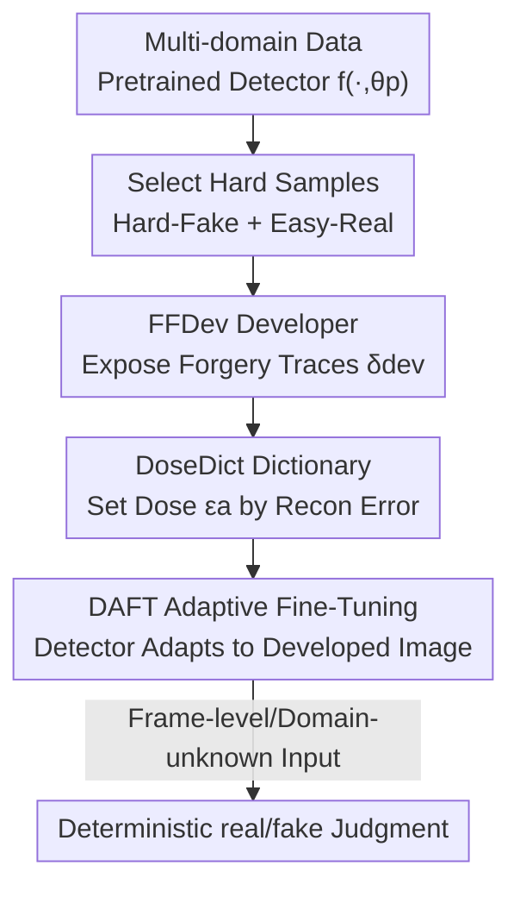

# A Sanity Check for Multi-In-Domain Face Forgery Detection in the Real World

**Conference**: CVPR 2026  
**Paper**: [CVF Open Access](https://openaccess.thecvf.com/content/CVPR2026/html/Cheng_A_Sanity_Check_for_Multi-In-Domain_Face_Forgery_Detection_in_the_CVPR_2026_paper.html)  
**Code**: To be confirmed  
**Area**: AI Security / Deepfake Detection  
**Keywords**: Face Forgery Detection, Multi-Domain Training, Frame-level Discrimination, Dictionary Learning, Model-Agnostic Post-processing

## TL;DR
This paper performs a "sanity check": it reveals that existing deepfake detectors achieve seemingly high AUC on multi-domain mixed data but suffer from low frame-level real/fake Accuracy (ACC) because "inter-domain discrepancies" overshadow "real/fake differences" in the feature space. Subsequently, it proposes a model-agnostic two-stage framework, DevDet (FFDev to expose forgery traces + DAFT for dose-adaptive fine-tuning), which significantly boosts frame-level ACC while preserving original generalization capabilities.

## Background & Motivation

**Background**: The mainstream goal of face forgery detection is to train "generalized detectors"—using data from limited (or even single) domains (e.g., FaceForensics++) with the expectation of transferring to entirely unseen forgery types. To address the continuous evolution of forgery techniques, some researchers adopt "Incremental Learning" (IFFD) to learn domain by domain.

**Limitations of Prior Work**: The authors point out that the generalization paradigm is too idealized—detectors trained on GAN-based swaps from five years ago cannot be expected to detect today's Diffusion Model-based full-face synthesis. Meanwhile, the incremental learning route suffers from catastrophic forgetting. Given that forgery detection is a low-cost binary classification task, the training time saved by IFFD is negligible compared to the loss caused by forgetting. Crucially, both routes evaluate on a "domain-by-domain" basis, masking the real-world requirement for "frame-level, domain-unknown" discrimination during deployment.

**Key Challenge**: When multiple domains are packed into the same latent space, **inter-domain discrepancies dominate the feature distribution, overpowering the subtle differences between real and fake samples**. Consequently, a detector can distinguish real/fake within a specific domain (high in-domain AUC), but fails when faced with a domain-unknown single image requiring an absolute judgment with a 0.5 threshold (low ACC). Fig. 2 provides visual evidence: real and fake samples from Domain 1 are both closer to real samples of Domain 2, while domain-unknown inputs fall into decision boundary gaps that look like neither real nor fake.

**Goal**: (1) Define a research paradigm closer to the real world—training on sufficient and diverse multi-domain data and providing deterministic real/fake judgments for **domain-unknown frame-level images**; (2) Design a method to "amplify real/fake differences and suppress domain discrepancies" that can be applied to any pretrained backbone without losing its original generalization ability.

**Key Insight**: Analogizing a forgery detector to "photographic developer"—since real/fake differences are too weak and submerged by domain discrepancies, one should actively "develop" and amplify latent forgery traces to dominate the latent space.

**Core Idea**: Use a learnable "developer" to preprocess inputs before detection, specifically exposing and magnifying forgery traces so that real/fake differences (rather than domain differences) dominate the detector's feature space, achieving reliable frame-level domain-unknown binary classification.

## Method

### Overall Architecture

The paper proposes the **MID-FFD (Multi-In-Domain Face Forgery Detection)** task paradigm and introduces a model-agnostic two-stage framework **DevDet (Developer for Detector)**. The strategy is: first pretrain a standard detector $f(\cdot,\theta_p)$ on large-scale multi-domain data; then "upgrade" it with DevDet. **Stage 1** trains a Face Forgery Developer (FFDev), which "washes out" forgery traces like developer fluid and overlays them onto the input. **Stage 2** uses Dose-Adaptive Fine-Tuning (DAFT) to adapt the detector to "developed images," while introducing a DoseDict to adaptively adjust the "development dose" per image, ensuring high development for hard samples (raising the ceiling) and low development for easy/out-of-domain samples (preserving the floor and generalization). During inference for a domain-unknown input: query DoseDict for adaptive dose $\epsilon_a$, develop with FFDev to get $\tilde{x}$, and feed it to the detector for confidence.

### Key Designs

**1. MID-FFD Paradigm and S-AUC Protocol: Exposing the "High AUC ≈ Usable" Illusion**

This is the manifestation of the "sanity check" in the title. The pain point is that the community has long assumed two "seemingly obvious" corollaries: that strong performance on single domains transfers seamlessly to multi-domain applications, and that relative separability within a domain translates to absolute frame-level judgment. The authors prove both are misleading. Mechanistically, the paper distinguishes two metrics: in-domain AUC (measuring relative ranking, insensitive to domain discrepancy) and frame-level ACC (absolute judgment using a fixed 0.5 threshold, highly sensitive to domain discrepancy). To prevent "domain information leakage" in per-domain AUC, the paper proposes **Summarized AUC (S-AUC)**: merging all test sets into a unified benchmark before calculating AUC, forcing the model to rank without knowing domain identity. It reveals the fundamental difficulty of real/fake differences being submerged by domain discrepancies—the very problem FFDev/DAFT aim to solve.

**2. FFDev (Face Forgery Developer): "Developing" Weak Forgery Traces into the Dominant Latent Space**

Since real/fake differences are too weak, FFDev amplifies them at the pixel level. Mechanistically, an image reconstruction-based DevGen $G(\cdot,\theta_g)$ generates a "development map" $\delta_{dev}=G(x,\theta_g)\in\mathbb{R}^{H\times W\times3}$ of the same size as the input, which is added back to get $\tilde{x}=x+\epsilon\delta_{dev}$ ($\epsilon$ is the dose), then fed into a **frozen** pretrained detector $f(\cdot,\theta_p)$ for prediction $y_p$. The clever part of training FFDev lies in sample and loss design: using only two types of samples—**Easy-Real (ER)** and **Hard-Fake (HF)**, selected from top-k real samples closest to 0 (real) and fake samples misclassified as real. The development loss is cross-entropy $L_{dev}=-(\hat{y}\log y_p+(1-\hat{y})\log(1-y_p))$, requiring "still judged as real after development" for ER (ensuring FFDev doesn't destroy intrinsic real features) and "judged as fake after development" for HF (forcibly magnifying forgery features of previously misclassified fakes). A Total Variation loss $L_{tv}$ is added to smooth $\delta_{dev}$, with the objective $L_{o1}=L_{dev}+\lambda_{tv}L_{tv}$. Thus, FFDev raises the detection **ceiling** by making previously invisible traces visible.

**3. DAFT + DoseDict: Per-image Adaptive Dose to Anchor the Generalization Floor**

FFDev alone can have side effects: applying a fixed dose to all images might wash away the detector's original generalization (Cross-domain performance drops from 0.6826 to 0.5735 with +FFDev in ablations). The DAFT mechanism unfreezes the detector in Stage 2 to fine-tune on images developed by the frozen FFDev, ensuring magnified real/fake differences exceed domain discrepancies. The key is **DoseDict**—a dictionary $D\in\mathbb{R}^{d\times K}$ specifically fitted to Hard-Fake samples, learned via alternating sparse coding optimization. During inference, the **reconstruction error** $e(z)=\|z-D^\star\alpha^\star(z)\|_2$ measures the similarity between the input and "hard fakes," and the adaptive dose is set as $\epsilon_a=\text{Norm}(1-e(x))$: more similar to hard fakes (lower error) $\rightarrow$ higher dose (boost accuracy); simpler or outside MID knowledge (higher error) $\rightarrow$ lower dose, almost no development (preserve generalization). This "prescribing medicine as needed" mechanism allows simultaneous MID improvement and generalization preservation.

### Loss & Training
- **Stage 1 (FFDev)**: Optimize only $G$ with the detector frozen. Objective: $L_{o1}=L_{dev}+\lambda_{tv}L_{tv}$, fixed dose $\epsilon=0.25$, using only Easy-Real and Hard-Fake samples.
- **Stage 2 (DAFT)**: Freeze FFDev, fine-tune detector $\theta_p$ using $\tilde{x}=x+\epsilon_a\delta_{dev}$ (where $\epsilon_a$ is from DoseDict, scaled by 0.25 for Stage 1 alignment), supervision same as $L_{dev}$.
- **Mechanism**: **Sequential** training (FFDev then DAFT) significantly outperforms parallel training, which prevents both from converging to their respective optima. Optimized with Adam, lr=0.0002, 10 epochs, input 256×256, batch 32.

## Key Experimental Results

### Main Results

Protocol-1 (classic domains: FF++/CDF/DFDCP/WDF) using Effort as base, reporting S-AUC, Mean-ACC, and per-domain F-ACC/R-ACC. Key observation: existing methods often show severe imbalance between F-ACC and R-ACC, whereas Ours improves both simultaneously.

| Method | Source | S-AUC | M-ACC | CDF F-ACC | CDF R-ACC | WDF R-ACC |
|------|------|-------|-------|-----------|-----------|-----------|
| Xception | CVPR'17 | 0.8732 | 0.6797 | 0.6016 | 0.7362 | 0.7555 |
| SBI | CVPR'22 | 0.8439 | 0.9092 | 0.7631 | 0.6176 | 0.7360 |
| ProDet | NeurIPS'24 | 0.8696 | 0.9124 | 0.7433 | 0.6250 | 0.7683 |
| Effort | ICML'25 | 0.9237 | 0.7312 | 0.5210 | 0.8419 | 0.7839 |
| **Ours** | — | **0.9317** | **0.8545** | **0.7671** | **0.8690** | **0.8764** |

> Note: While SBI/ProDet show high M-ACC (0.90+), their CDF R-ACC is only around 0.62, showing heavy bias toward one class. Ours maintains stable F-ACC and R-ACC. The paper claims a peak binary confidence improvement of **11.80%**.

### Ablation Study

Based on Effnb4, verifying each component (M-ACC is 4-domain mean ACC, Cross is mean of all cross-domain evaluations):

| Config | M-ACC | Cross | Description |
|------|-------|-------|------|
| Base | 0.7624 | 0.6826 | Original Effnb4 |
| +FFDev | 0.7823 | 0.5735 | Add developer, MID rises but **generalization collapses** |
| +FFDev&DFFT (Fixed Dose) | 0.8526 | 0.5851 | MID rises significantly, generalization still fails |
| +FFDev&DAFT-P (Parallel) | 0.8130 | 0.6341 | Neither converges to optimum |
| **+FFDev&DAFT-S (Ours)** | **0.8676** | **0.6896** | Best MID and generalization preserved |

### Key Findings
- **DoseDict's adaptive dose is the generalization lifesaver**: Adding FFDev alone or fixed-dose fine-tuning drags Cross-domain performance down from 0.68 to 0.57–0.59. Only adaptive dose (DAFT-S) pulls it back to 0.6896.
- **Sequential Training > Parallel Training**: DAFT-P (parallel) M-ACC is 0.8130, significantly weaker than sequential's 0.8676, as parallel training causes FFDev and the detector to constrain each other.
- **Strong Model-Agnosticism**: Applying the method to Xception/Effnb4/SPSL/Effort typically boosts MID-FFD ACC by 6–10 points while keeping Cross-domain performance level.
- **Visualization Evidence**: t-SNE shows the base model has multiple disjoint decision boundaries in MID, whereas Ours converges to a single consistent boundary. Grad-CAM shows FFDev makes invisible forgery regions "develop" out.

## Highlights & Insights
- **Solid "Sanity Check" Narrative**: Uses the AUC vs. ACC contrast + t-SNE to expose that "high AUC is an illusion," then introduces S-AUC to block the "domain information leakage" loophole.
- **Practical "Photographic Developer" Analogy**: FFDev is not mysticism but a learnable pixel-level residual $\delta_{dev}$, trained via dual-target CE (ER preservation + HF magnification).
- **DoseDict as a "Difficulty Meter"**: Outsourcing the dose decision to a sparse dictionary's reconstruction error naturally distinguishes between "looks like a hard-fake (more development)" and "domain-unknown/simple sample (less development)."
- **Model-Agnostic + Preservation of Original Capability**: Acting as a preprocessing plugin, it boosts MID while preserving OOD, making it deployment-friendly.

## Limitations & Future Work
- **Dependency on a Pretrained Detector**: The selection of HF/ER relies on the base detector's results. If the base is extremely poor, the hard sample definitions become unreliable.
- **"Manual" Dose Hyperparameters**: $\epsilon=0.25$ and the Stage 2 multiplier are fixed constants; sensitivity across different data scales/backbones requires further discussion. ⚠️
- **DoseDict only fits Hard-Fakes**: "Hard-Real" samples, which are also easily misclassified, are not symmetrically modeled.
- **Extra Computational Overhead**: Inference involves DevGen reconstruction + DoseDict sparse coding, increasing latency compared to a bare backbone. ⚠️

## Related Work & Insights
- **vs. Generalization Paradigms (Effort / CLIP / SPSL etc.)**: These aim for a "one-size-fits-all" detector using limited domains. This paper argues this is unrealistic for modern Diffusion synthesis and advocates for large-scale multi-domain training with frame-level absolute judgment.
- **vs. Incremental Learning (IFFD)**: IFFD is plagued by catastrophic forgetting and per-domain evaluation. This paper argues training costs for FFD are low enough that IFFD's time savings are not worth the trade-off.
- **vs. High M-ACC methods (SBI / ProDet)**: These methods often achieve high mean ACC via class bias; this paper uses S-AUC and dual ACC to expose this "unbalanced" performance and achieves better equilibrium.

## Rating
- Novelty: ⭐⭐⭐⭐⭐ Redefining the MID-FFD task + S-AUC protocol + "Developer" preprocessing.
- Experimental Thoroughness: ⭐⭐⭐⭐ Extensive protocol and model-agnostic verification, though inference overhead is not detailed in the main text.
- Writing Quality: ⭐⭐⭐⭐⭐ Clear "sanity check" narrative with tight logic.
- Value: ⭐⭐⭐⭐⭐ High deployment value by addressing the frame-level discrimination gap.

<!-- RELATED:START -->

## Related Papers

- [\[CVPR 2026\] DeepfakeImpact: A Two-Stage Benchmark with Real-World Impact in Deepfake Detection](deepfakeimpact_a_two-stage_benchmark_with_real-world_impact_in_deepfake_detectio.md)
- [\[CVPR 2026\] DiffusionFF: A Diffusion-based Framework for Joint Face Forgery Detection and Fine-Grained Artifact Localization](diffusionff_a_diffusion-based_framework_for_joint_face_forgery_detection_and_fin.md)
- [\[ACL 2026\] OmniCompliance-100K: A Multi-Domain Rule-Grounded Real-World Safety Compliance Dataset](../../ACL2026/ai_safety/omnicompliance-100k_a_multi-domain_rule-grounded_real-world_safety_compliance_da.md)
- [\[CVPR 2026\] Frequency-domain Manipulation for Face Obfuscation](frequency-domain_manipulation_for_face_obfuscation.md)
- [\[CVPR 2025\] Forensics Adapter: Adapting CLIP for Generalizable Face Forgery Detection](../../CVPR2025/ai_safety/forensics_adapter_adapting_clip_for_generalizable_face_forgery_detection.md)

<!-- RELATED:END -->
