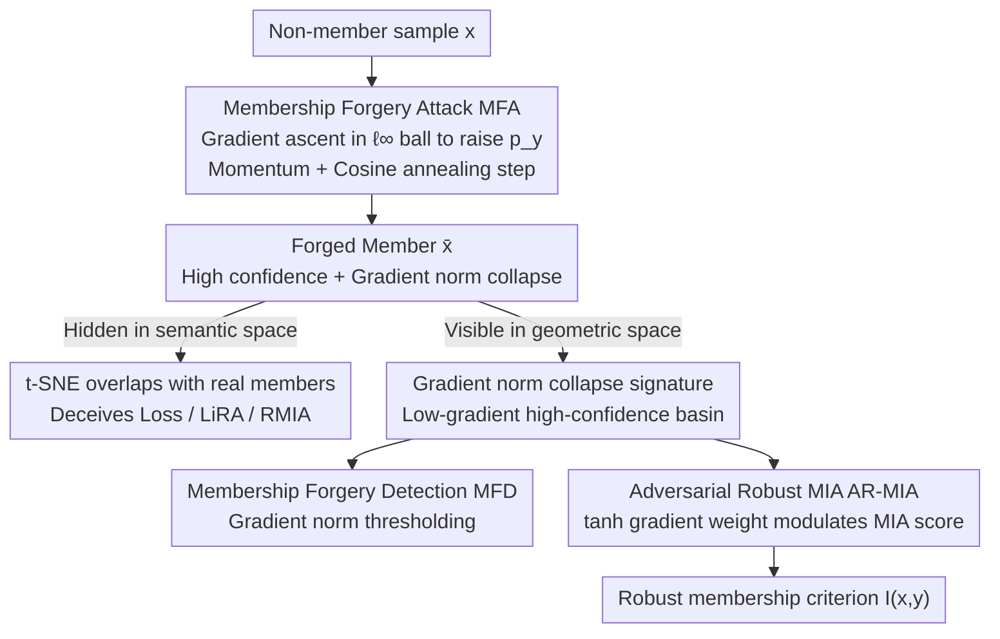

# A Unified Perspective on Adversarial Membership Manipulation in Vision Models

**Conference**: CVPR 2026  
**arXiv**: [2604.02780](https://arxiv.org/abs/2604.02780)  
**Code**: [https://github.com/Sjtubrian/Adversarial_Membership_Manipulation](https://github.com/Sjtubrian/Adversarial_Membership_Manipulation)  
**Area**: AI Security  
**Keywords**: Membership Inference Attack, Adversarial Membership Forgery, Gradient Norm, Privacy Auditing, Vision Models

## TL;DR
This paper first reveals the vulnerability of Membership Inference Attacks (MIA) in vision models to adversarial membership manipulation. It demonstrates that imperceptible perturbations can forge non-members as members to deceive auditing. It identifies a "gradient norm collapse" signature in forged members and proposes a gradient-geometry-based detection strategy along with an adversarial robust inference framework.

## Background & Motivation

**Background**: Membership Inference Attack (MIA) determines whether data belongs to a model's training set and is a core tool for privacy auditing. Existing MIAs (LiRA, RMIA, etc.) possess precise detection capabilities.

**Limitations of Prior Work**: All MIAs implicitly assume that query inputs are honest (unaltered). However, adversarial learning literature shows that imperceptible perturbations can drastically change model behavior. **Whether MIA itself is robust** has remained unstudied.

**Key Challenge**: MIA relies on the model's confidence (loss, likelihood ratio) regarding the true label to judge membership. Adversarial perturbations can manipulate confidence, thereby manipulating MIA decisions and causing privacy auditing to fail.

**Key Insight**: Unlike traditional adversarial attacks (which push samples toward misclassification regions), membership forgery attacks push inputs toward high-confidence regions—consistent with the "member" decision direction of MIA.

**Core Idea**: (1) Formalize Membership Forgery Attack (MFA); (2) Identify the gradient norm collapse signature of forged members; (3) Propose Membership Forgery Detection (MFD) and Adversarial Robust MIA (AR-MIA) based on gradient norms.

## Method

### Overall Architecture
The paper addresses a previously unexplored question: Can MIAs withstand adversarial perturbations? It links attack, diagnosis, and defense into a coherent pipeline. First, **MFA** demonstrates that non-members can be forged into "members" using imperceptible perturbations to deceive auditing. Second, **MFD** identifies signals to distinguish real members from forged ones. Finally, **AR-MIA** integrates these signals into existing MIA workflows. These components are unified by a geometric theme: forged members fall into a "low-gradient, high-confidence basin" characterized by gradient norm collapse, which serves as both the attack's trace and the defense's leverage.

### Key Designs

**1. Membership Forgery Attack (MFA): Pushing non-members to the highest confidence zone**

MIAs assume honest queries, where members are characterized by high confidence (low loss, high likelihood ratio) for the true label $y$. MFA attacks this by seeking a perturbation within an $\ell_\infty$ ball that maximizes the predicted probability of the true label: $\bar{x} = \arg\max_{x' \in \mathcal{B}_\epsilon[x]} p_y(x')$. Unlike traditional PGD (which uses gradient descent to lower confidence), MFA uses gradient ascent. The update rule is $x_{k+1} = \Pi_{\mathcal{B}_\epsilon}(x_k - \alpha_k\,\text{sign}(m_{k+1}))$, using momentum $m$ for stability and cosine annealing for the step size $\alpha_k = \alpha_0\,\frac{1+\cos(\pi k/N)}{2}$ to prevent oscillation near peaks. Its effectiveness stems from transferability: since most MIA criteria are monotonic transformations of $p_y$, raising $p_y$ deceives a broad class of MIAs simultaneously.

**2. Membership Forgery Detection (MFD): Capturing the gradient norm collapse signature**

Forged samples are difficult to detect in semantic space (t-SNE shows total overlap with real members), rendering Mahalanobis distance or LID ineffective. MFD focuses on the geometric trace left by optimization: **gradient norm collapse**. As MFA pushes samples into high-confidence zones, the input gradient norm $\|\nabla_x \ell(f(x), y)\|$ decreases. Even at the same confidence level, forged samples exhibit significantly smaller gradient norms than real members. Theorem 1 uses a local second-order approximation to prove that gradient norms must decrease after a signed gradient descent step. Detection is thus simplified to a threshold criterion: $\mathbf{T}(x,y) = \mathbf{1}[\|\nabla_x \ell(f(x),y)\| \leq \tau']$.

**3. Adversarial Robust MIA (AR-MIA): Embedding geometric signals into the inference pipeline**

AR-MIA treats the gradient signal as a modulation factor for MIA statistics. It defines a gradient weight $w(x,y) = \tanh(\lambda \cdot \|\nabla_x \ell(f(x),y)\|)$ and weights the original MIA score $S(x,y)$ to produce a robust criterion $I(x,y) = \mathbf{1}[w(x,y) \cdot S(x,y) > \tau]$. Forged samples with small gradient norms receive weights near 0, suppressing their scores. The $\tanh$ function is used for saturation to prevent extremely large gradients in some non-members from dominating the statistics. This approach allows seamless integration into existing MIAs (Attack R, LiRA, RMIA) with near-zero modification cost.

## Key Experimental Results

### MFA Effectiveness (Across datasets and MIA methods)

| MIA Method | CIFAR-10 | SVHN | CINIC-10 | ImageNet-100 |
|---------|----------|------|----------|-------------|
| Loss Attack | Deceived by MFA | ✓ | ✓ | ✓ |
| Attack R | Deceived by MFA | ✓ | ✓ | ✓ |
| LiRA | Deceived by MFA | ✓ | ✓ | ✓ |
| RMIA | Deceived by MFA | ✓ | ✓ | ✓ |

### MFD Detection Rate (Different ε)

| Dataset | ε=2/255 | ε=4/255 | ε=8/255 |
|--------|---------|---------|---------|
| CINIC-10 | High AUROC | Higher | Highest |
| SVHN | High AUROC | Higher | Highest |
| ImageNet-100 | High AUROC | Higher | Highest |

### AR-MIA Robustness Gain

| Original MIA | + Ours (AR Strategy) | Gain |
|---------|------------|------|
| Attack R | AR-Attack R | Significant improvement in forgery resistance |
| LiRA | AR-LiRA | Significant improvement |
| RMIA | AR-RMIA | Significant improvement |

### Key Findings
- MFA effectively deceives the strongest MIAs (e.g., RMIA) even with minimal perturbation ($\epsilon=2/255$).
- The AUROC of gradient norm as a detection feature is much higher than Mahalanobis distance or LID.
- The AR-MIA framework improves robustness across multiple MIA baselines.
- Adaptive MFA (where the attacker knows the detection mechanism) faces an inherent trade-off: increasing attack potency inevitably amplifies the gradient signal.

## Highlights & Insights
- **Discovery of a New Security Dimension**: MIA is not only an attack tool but also a target. This questions the reliability of MIA-based privacy auditing.
- **Unified Geometric Perspective**: Gradient norm collapse explains the attack mechanism and provides the defense, linking theory and practice.
- **Practical Defense Solution**: AR-MIA integrates seamlessly into existing MIAs with minimal cost, while attackers face an inescapable geometric trade-off.

## Limitations & Future Work
- Assumes white-box access (for both attacker and detector); the effectiveness of MFA/MFD in black-box scenarios requires further study.
- Hyperparameter $\lambda$ needs calibration across different datasets and metrics.
- Validated only on classification models; extension to generative models (e.g., diffusion models) is a significant future direction.

## Related Work & Insights
- **vs. MemGuard**: MemGuard perturbs the output space to protect privacy; ours studies input space perturbations, making the two approaches orthogonal.
- **vs. Traditional Adversarial Attacks**: Objectives differ—traditional attacks seek misclassification, while MFA seeks high confidence.
- **vs. RMIA**: RMIA discusses robustness against OOD non-members but does not consider adversarial in-distribution forged queries.

## Rating
- Novelty: ⭐⭐⭐⭐⭐ First to formalize adversarial membership manipulation; discovery of gradient norm collapse is theoretically deep.
- Experimental Thoroughness: ⭐⭐⭐⭐⭐ Tested on 4 datasets, multiple MIAs, and various perturbation levels; includes ablation and adaptive analysis.
- Writing Quality: ⭐⭐⭐⭐⭐ Rigorous problem definition (security game formalization) with tight integration of theory and experiments.
- Value: ⭐⭐⭐⭐⭐ Significant implications for AI security and privacy auditing.

<!-- RELATED:START -->

## Related Papers

- [\[CVPR 2026\] Transform to Transfer: Boosting Adversarial Attack Transferability on Vision-Language Pre-training Models](transform_to_transfer_boosting_adversarial_attack_transferability_on_vision-lang.md)
- [\[CVPR 2026\] TTP: Test-Time Padding for Adversarial Detection and Robust Adaptation on Vision-Language Models](ttp_test-time_padding_for_adversarial_detection_and_robust_adaptation_on_vision-.md)
- [\[CVPR 2026\] A Provable Energy-Guided Test-Time Defense Boosting Adversarial Robustness of Large Vision-Language Models](a_provable_energy-guided_test-time_defense_boosting_adversarial_robustness_of_la.md)
- [\[CVPR 2026\] Frequency-domain Manipulation for Face Obfuscation](frequency-domain_manipulation_for_face_obfuscation.md)
- [\[ICLR 2026\] Concept-based Adversarial Attack: a Probabilistic Perspective](../../ICLR2026/ai_safety/concept-based_adversarial_attack_a_probabilistic_perspective.md)

<!-- RELATED:END -->
