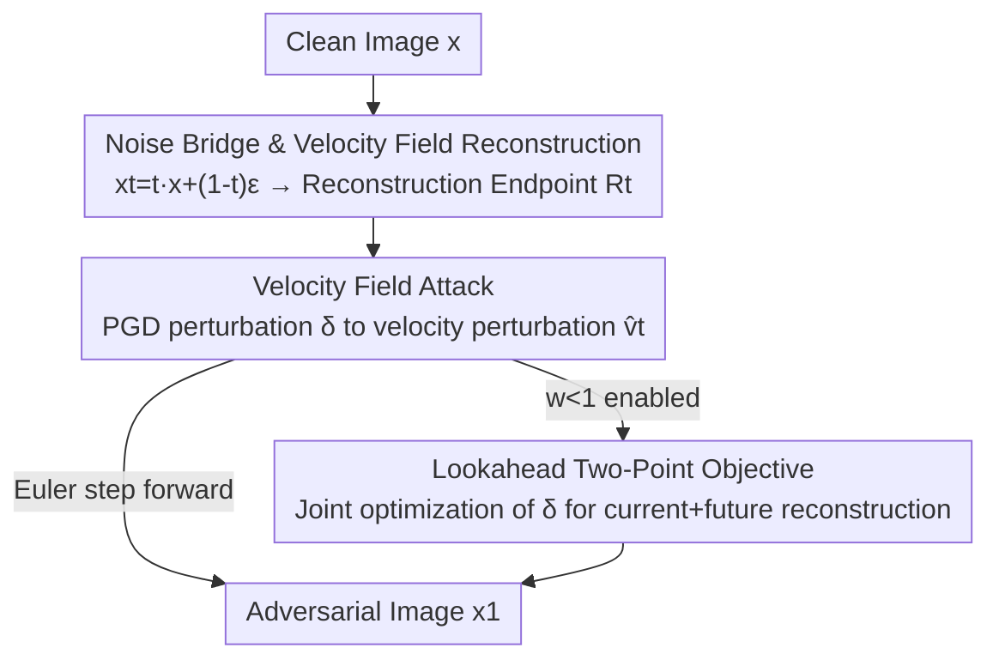

# AdvFM: Lookahead Flow-Matching Velocity-Field Attacks for Imperceptible and Transferable Adversarial Examples

**Conference**: CVPR 2026  
**Paper**: [CVF Open Access](https://openaccess.thecvf.com/content/CVPR2026/html/Liu_AdvFM_Lookahead_Flow-Matching_Velocity-Field_Attacks_for_Imperceptible_and_Transferable_Adversarial_CVPR_2026_paper.html)  
**Code**: Not available  
**Area**: AI Security / Adversarial Attacks  
**Keywords**: Adversarial examples, flow matching, velocity-field attack, black-box transferability, purification defense  

## TL;DR
Unrestricted adversarial attacks are implemented within the continuous-time velocity field of flow matching. Instead of perturbing pixels directly or using diffusion-based "denoising-then-re-noising," PGD perturbations on reconstructed images are translated into velocity field perturbations propagated deterministically along probability flow ODEs. A "lookahead two-point objective" corrects temporal mismatch, achieving simultaneously stronger black-box transferability and higher success rates against purification and adversarial training on ImageNet.

## Background & Motivation
**Background**: Unrestricted Adversarial Examples (UAEs) do not adhere to $\ell_p$ norm balls but utilize generative priors to create natural-looking, semantically invariant adversarial images along the data distribution. Recent mainstream methods integrate UAEs into diffusion model pipelines.

**Limitations of Prior Work**: Diffusion-based UAEs are hindered by their structural inference rules. Each diffusion step predicts a cleaner reconstruction $x'_0$ and injects random noise based on a time-dependent variance schedule. This leads to three issues: (1) Stochastic "re-noising" amplifies jitter in proxy model updates, weakening alignment with shared gradient subspaces across models and degrading transferability; (2) Adversarial signals are repeatedly down-weighted by new noise at each step, acting as multiplicative shrinkage that fails to accumulate along the trajectory; (3) The "noise-denoise" cycle introduces components deviating from the manifold normal, which are easily eliminated by purification defenses that pull inputs toward high-density regions.

**Key Challenge**: Injecting adversarial signals into a "stochastic, isotropic, and repeatedly re-noised" process leads to signal attenuation and manifold deviation, naturally limiting transferability and resistance to purification.

**Goal**: To identify a deterministic, smooth carrier that allows perturbations to propagate along the data manifold tangent for injecting adversarial signals.

**Key Insight**: The velocity field $v_\theta(x_t,t)$ learned via flow matching uses probability flow ODEs to move noise to the data distribution deterministically. This propagation is low-variance, approximately linear, and follows the data manifold tangent. It is hypothesized that perturbing the velocity field, rather than pixel or diffusion space, allows perturbations to be amplified stably, remain tangential, and resist purification.

**Core Idea**: Interpret the perturbation $\delta$ on reconstructed images as a velocity perturbation $\delta/(1-t)$ at time $t$, propagating through the ODE. A two-point objective coupling current and lookahead reconstructions is used to align how perturbations are pushed forward.

## Method

### Overall Architecture
AdvFM operates in "noisy space" using flow-matching velocity fields instead of diffusion denoising. Given a clean image $x$, a noisy state $x_t$ is sampled via a noise bridge. A single-step reconstruction operator estimates the flow endpoint $x_1^t$. PGD is performed on the reconstruction to obtain pixel perturbation $\delta$, which is translated into a velocity perturbation $\hat v_t$ at time $t$. An explicit Euler step pushes the noisy state forward. The trajectory evolves backward from $t$ to $1$, repeating "sample noisy state → reconstruct endpoint → PGD → velocity update" at each step. The final $x_1$ is the adversarial image. The lookahead variant replaces the PGD loss with a two-point objective coupling current and future reconstructions.

### Key Designs

**1. Noise Bridge & Velocity Field Reconstruction: Moving the Battlefield to Smooth Noisy Space**

Optimizing $\delta$ directly on clean images is difficult because decision boundaries are highly curved and $\nabla_x L_f(x,y)$ has high variance across models. A linear noise bridge $x_t = t\,x + (1-t)\,\epsilon$ ($\epsilon\sim\mathcal N(0,I)$, $t\in[0,1]$) is introduced. Low $t$ values provide heavy noise to smooth curvature and gradient variance, while $t\to1$ recovers fine-grained semantics. A single-step reconstruction operator $R_t(x_t)=x_t+(1-t)\,v_\theta(x_t,t)$ from a pre-trained flow-matching model $v_\theta$ approximates the endpoint $x_1^t$. This serves as the carrier for attacks and a source of "Gaussian smoothing": the gradient on the noisy bridge is equivalent to the gradient of a Gaussian-smoothed loss $\tilde L_f(x)=\mathbb E_\epsilon[L_f(t x+(1-t)\epsilon,y)]$, which has lower variance and better alignment.

**2. Velocity Field Attack: Translating Pixel Perturbations to Velocity Perturbations with ODE Amplification**

In each step, PGD is run on the reconstruction $x_1^t$ to obtain $\delta$, forming $\hat x_1^t = x_1^t+\delta$. The critical step is interpreting the endpoint perturbation as a velocity perturbation:

$$\hat v_t = \frac{\hat x_1^t - x_t}{1-t} = v_\theta(x_t,t) + \frac{\delta}{1-t}$$

An explicit Euler step $x_{t+\Delta t} = x_t + \Delta t\,\hat v_t$ advances the noisy state. Subtracting the baseline state yields the state change $\Delta x^{FM}_t = \frac{\Delta t}{1-t}\,\delta$. In contrast, diffusion pipelines (attack followed by scaling by $\sqrt{\bar\alpha_t}$) yield $\Delta x^{Diff}_t = \sqrt{\bar\alpha_t}\,\delta$. The ratio

$$\frac{\Delta L^{FM}_g}{\Delta L^{Diff}_g} = \frac{\Delta t}{(1-t)\sqrt{\bar\alpha_t}}$$

is typically greater than 1 given standard schedules ($\Delta t\sim O(1-t)$). Thus, velocity field updates provide a larger single-step boost to the black-box loss $L_g$ (step-size amplification), moving samples into adversarial regions more efficiently. Furthermore, flow propagation is deterministic and tangential to the data manifold, enhancing transferability and resistance to purification (which suppresses normal components).

**3. Lookahead Two-Point Objective: Correcting Temporal Mismatch**

Baseline attacks optimize the reconstruction $x_1^t$ corresponding to the current state $x_t$, but classifiers see the advanced state $x_{t+\Delta t}$. This mismatch hinders transferability. A two-point loss optimizes the "current" and "next-step" reconstructions simultaneously:

$$L^{LA}_f(\delta;t) = w\,L_f(x_1^t+\delta,\,y) + (1-w)\,L_f\!\big(x_1^{t+\Delta t}(\delta),\,y\big)$$

For $w=1$, it reverts to the baseline. For $w\in(0,1)$, it considers how adversarial signals are pushed forward. Theoretically, this amplifies the effect of $\delta$ and provides a lower-variance gradient estimate, keeping perturbations tangential. $w=0.3$ is used primarily in the latter half of the trajectory.

### Loss & Training
During the attack, the flow-matching backbone $v_\theta$ (GMFlow) is frozen. Only $\delta$ is optimized. Settings on ImageNet: flow steps $T=15$, PGD iterations per step $I=10$, step-wise constraint $\|\delta\|_\infty\le 4/255$ on $x_1^t$, lookahead weight $w=0.3$. The process follows: sample noisy state → reconstruct endpoint → inner K-step PGD (with baseline or lookahead loss) → convert $\delta$ to velocity update → advance state.

## Key Experimental Results

### Main Results
Black-box transferability across 8 architectures (CNNs and Transformers) on ImageNet. Average ASR (excluding white-box) compared to APA:

| Source Model | AdvFM Avg. ASR | Prev. SOTA (APA) | Gain |
|------------|---------------|-------------|------|
| VGG19 (CNN) | 70.35% | 65.86% | **+4.49** |
| RN50 (CNN) | 72.05% | 64.41% | **+7.64** |
| ViT-B/16 (Trans.) | 68.22% | 69.73% | −1.51 |
| Swin-B (Trans.) | 64.88% | 61.49% | **+3.39** |

Against defenses (ASR %): Purification (NRP / Smooth / DiffPure) and Adversarial Training (AT):

| Defense | AdvFM | APA | Note |
|------|-------|-----|------|
| NRP (Purification) | **94.98%** | 81.20% | +13.8 gain |
| Smooth (Smoothing) | **81.35%** | 70.70% | +10.6 gain |
| DiffPure (Diffusion) | 61.33% | 63.30% | Runner-up |
| PGD RN50 (AT) | **83.22%** | 80.87% | Best |
| RAT ViT-B16 (AT) | **98.53%** | 90.30% | Best |

### Ablation Study
Effect of Lookahead Two-Point Objective (ResNet50 proxy):

| Configuration | White-box ASR | Black-box ASR |
|------|---------|---------|
| AdvFM ($w=0.3$, Full) | **94.45%** | **72.05%** |
| AdvFM w/o lookahead ($w=1$) | 91.72% | 64.31% |

### Key Findings
- **Lookahead benefits black-box transferability significantly more than white-box**: While white-box ASR improved by ~2.7%, black-box ASR increased by ~7.7%. This confirms that the two-point objective provides lower-variance gradient estimates, improving proxy-target alignment.
- **Velocity field advantages accumulate**: ASR curves increase monotonically toward $t=1$, indicating constant utilization of interpolated states.
- **Resistance to purification is the primary highlight**: Gains of +13.8 on NRP and +10.6 on Smooth align with the theory that perturbations are concentrated on the manifold tangent.

## Highlights & Insights
- **Clever Transformation**: Translating pixel perturbation to velocity perturbation via $\hat v_t = v_\theta + \delta/(1-t)$ bridges PGD with continuous-time ODEs. The $1/(1-t)$ factor directly relates to theoretical step-size amplification.
- **Three Pillars of Success**: Step-size amplification (Lemma 1), variance reduction via Gaussian smoothing (Theorem 1), and tangential perturbations for purification resistance (Theorem 3).
- **Transferable logic**: Any generative attack that calculates perturbations on a reconstruction/endpoint can benefit from interpreting them as process control/velocity perturbations and using lookahead objectives to correct discrete step errors.

## Limitations & Future Work
- Attack quality depends on the pre-trained flow-matching backbone (GMFlow); cross-domain generalization was not discussed.
- Evaluation was limited to ImageNet classification; effectiveness on detection/segmentation or against strong adaptive defenses remains unknown.
- Computational overhead of multi-step PGD across multiple flow steps ($T=15, I=10$) was not compared against diffusion baselines.

## Related Work & Insights
- **vs. Diffusion UAEs**: Diffusion methods suffer from $\sqrt{\bar\alpha_t}$ attenuation, stochastic jitter, and excessive normal components. AdvFM uses deterministic velocity fields for amplified steps and tangential perturbations.
- **vs. APA**: APA is the strongest competitor, but AdvFM outperforms it in black-box transferability for most architectures and shows superior performance against most purification defenses.

## Rating
- Novelty: ⭐⭐⭐⭐⭐ Systematic application of UAE to flow-matching velocity fields with "diffusion vs. flow" theoretical comparison.
- Experimental Thoroughness: ⭐⭐⭐⭐ Extensive architectures and defenses, though limited to ImageNet classification.
- Writing Quality: ⭐⭐⭐⭐⭐ Tight logic linking motivation, method, theory, and experiments.
- Value: ⭐⭐⭐⭐ Provides a stronger, harder-to-purify baseline for evaluating generative adversarial robustness.

<!-- RELATED:START -->

## Related Papers

- [\[CVPR 2026\] RaPA: Enhancing Transferable Targeted Attacks via Random Parameter Pruning](rapa_enhancing_transferable_targeted_attacks_via_random_parameter_pruning.md)
- [\[CVPR 2026\] Towards Human-Imperceptible Backdoor Attacks on Text-to-Image Diffusion Models](towards_human-imperceptible_backdoor_attacks_on_text-to-image_diffusion_models.md)
- [\[CVPR 2026\] FlowHijack: A Dynamics-Aware Backdoor Attack on Flow-Matching Vision-Language-Action Models](flowhijack_a_dynamics-aware_backdoor_attack_on_flow-matching_vision-language-act.md)
- [\[CVPR 2026\] DASH: A Meta-Attack Framework for Synthesizing Effective and Stealthy Adversarial Examples](dash_a_meta-attack_framework_for_synthesizing_effective_and_stealthy_adversarial.md)
- [\[CVPR 2026\] CamPI: Physical Adversarial Examples through Camera Power Signal Injection](campi_physical_adversarial_examples_through_camera_power_signal_injection.md)

<!-- RELATED:END -->
