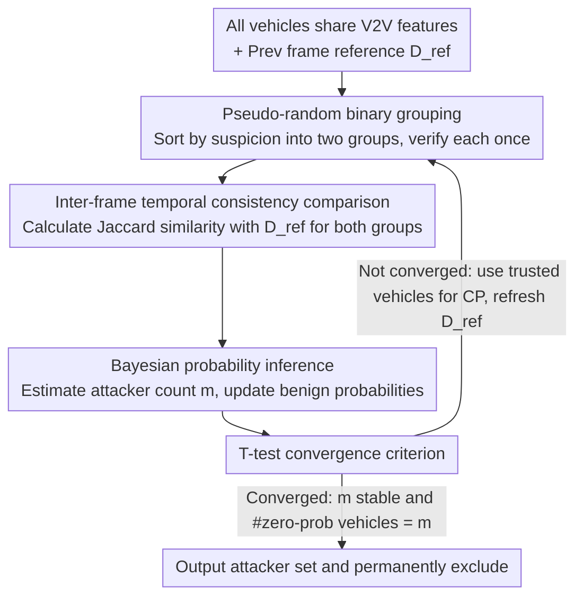

# All Vehicles Can Lie: Efficient Adversarial Defense in Fully Untrusted-Vehicle Collaborative Perception via Pseudo-Random Bayesian Inference

**Conference**: CVPR 2026  
**arXiv**: [2603.08498](https://arxiv.org/abs/2603.08498)  
**Code**: To be confirmed  
**Area**: AI Security  
**Keywords**: collaborative perception, adversarial defense, Bayesian inference, autonomous driving, V2V communication

## TL;DR

Ours proposes the Pseudo-Random Bayesian Inference (PRBI) framework for collaborative perception scenarios where **all vehicles are untrusted**. By utilizing inter-frame temporal consistency as a self-reference signal through pseudo-random grouping and Bayesian inference, the system efficiently identifies and excludes malicious vehicles with an average of only 2.5 verifications per frame, restoring detection accuracy to 79.4%–86.9% of pre-attack levels.

---

## Background & Motivation

**Security risks of Collaborative Perception (CP)**: Multiple vehicles share feature maps via V2V communication to expand their perception range. However, feature fusion mechanisms are inherently exposed to adversarial attacks—malicious vehicles can inject perturbations into shared features, leading to severe perception misalignment for the ego vehicle.

**Limitations of Prior Work relying on the "trusted ego" assumption**: Sampling-based defenses (ROBOSAC, PASAC) use the ego vehicle's perception as a reliable reference for consistency verification; classifier-based defenses train binary classification networks to distinguish between benign and malicious features. Both assume the ego itself is not compromised.

**Key Challenge (Real-world ego vulnerability)**: Through LiDAR injection attacks or data interception, attackers can interfere with the ego's feature maps without directly invading internal systems. Therefore, "All Vehicles Can Lie" is the realistic scenario.

**Linear growth of verification overhead**: High verification frequency in existing sampling/classification methods grows linearly with the total number of vehicles, making it difficult to meet large-scale real-time collaborative perception requirements.

**Detection delay in random sampling**: Pure randomized sampling may require many frames to converge to the complete set of attackers, creating continuous risk exposure.

**Goal (Zero-trust and low-overhead defense)**: The ideal solution should neither assume any vehicle is trusted nor require prior knowledge of the number or proportion of attackers, while maintaining a constant per-frame verification cost.

---

## Method

### Overall Architecture

The Core Problem PRBI addresses is: in a CP system where **all vehicles may lie**, the ego itself can be attacked, meaning no single vehicle's perception can serve as a trusted reference. The Key Insight of PRBI is to treat "time" as the only trusted anchor. Since attackers cannot easily tamper with the temporal continuity of the physical world, "whether the benign perception of this frame matches the previous frame" becomes a self-reference signal independent of any vehicle.

The Mechanism is a frame-by-frame rolling closed loop: each frame pseudo-randomly splits all vehicles into two groups, compares the Jaccard similarity of each group against the validated benign result from the previous frame, and accumulates "normal/abnormal" counts for each vehicle. Based on these counts, it estimates the current number of attackers $m$, calculates the benign probability for each vehicle, and identifies the most suspicious candidates. Finally, a T-test determines if $m$ has stabilized. If not, the remaining trusted vehicles are used for the current frame's CP and to update the reference frame; if stabilized, the final set of attackers is output. In this way, verification relies on time to force attackers out rather than priors about "who is trusted."

### Key Designs

**1. Inter-frame temporal consistency as a self-reference signal: Finding an anchor when no vehicle is trusted**

The most difficult part of a zero-trust setting is that sampling (ROBOSAC/PASAC) and classifier-based defenses default to a trusted ego. Once the ego is attacked via LiDAR injection, the entire verification baseline is lost. The Novelty of PRBI is using the **previously validated benign perception output $D_{\text{ref}}$** as the current frame's reference, using the Jaccard similarity of detection boxes between adjacent frames to determine consistency. This signal is reliable because LiDAR perception is naturally continuous in space, and object distribution changes smoothly between adjacent frames. Empirically, Jaccard similarity stays around 0.8 in benign scenarios but drops below 0.3 after perturbation. Since these distributions rarely overlap, a simple threshold $\epsilon$ converts "whether a vehicle's perception is contaminated" into a self-supervised criterion.

**2. Pseudo-random binary grouping strategy: Compressing overhead from $O(n)$ to constant 2**

Verification in existing sampling defenses scales linearly with the total number of vehicles $n$. PRBI performs only 2 verifications per frame: sorting vehicles by suspicion and placing the $\lfloor m \rfloor$ most suspicious vehicles in one group and the rest in another. This binary grouping statistically approximates randomized sampling without replacement. The probability of sampling an "all-benign group" depends only on the number of attackers $k$:

$$P_{ideal}' = \frac{2^{\,n-k}}{2^{\,n}} = 2^{-k}$$

Conversely, by statistically calculating the empirical normal ratio $\eta \approx 2^{-k}$ online, one can directly derive the number of attackers $m = \log_2(1/\eta)$ without prior knowledge of the attacker ratio. Because the grouping is pseudo-random based on current $m$ and benign probability $P_{\text{benign}}$, Theorem 1 proves that $m$ converges monotonically to the true value $k$, decoupling overhead from the number of vehicles and avoiding detection delays inherent in pure random sampling.

**3. Bayesian probability inference to identify attackers: Stable identification from noisy per-frame counts**

Counts alone are insufficient as early groupings are unstable and single-frame anomaly counts are noisy. PRBI maintains a posterior benign probability $P_{\text{benign}}[j] = P(\mathcal{B}_j \mid \mathcal{A})$ for each vehicle, updated in a Bayesian manner to pick the $\lfloor m \rceil$ vehicles with the lowest probabilities as suspects. The prior $P(\mathcal{B}_j)$ combines **short-term memory** (last frame's result) and **long-term memory** (historical normal detection ratio) to smooth early jitter. The likelihood $P(\mathcal{A} \mid \mathcal{B}_j)$ is estimated by the system's abnormal ratio after excluding vehicle $j$. A key invariant is that true malicious vehicles will consistently fall into abnormal detections (normal ratio $\beta_j = 0$), causing their benign probability to be driven to 0.

**4. T-test convergence criterion: Terminating redundant verification in continuous scenes**

Since $m$ fluctuates slightly around the true value $k$, a criterion is needed to stop verification. PRBI maintains a window $W$ of $m$ estimates for the last $w_p$ frames and performs a T-test on the null hypothesis $H_0: k = m$. Convergence is determined only when fluctuations are constrained within the confidence interval **and** the number of vehicles with zero benign probability exactly equals $m$. This dual condition prevents premature acceptance of $H_0$ while $m$ is still climbing. Convergence typically occurs within approximately 4 frames.

---

## Loss & Training

PRBI is an **inference-stage defense framework** and does not involve additional training or loss functions. It runs on top of pre-trained CP models, directly utilizing the Jaccard similarity between detection outputs. The perturbation optimization of the attacker follows a standard multi-agent detection loss:

$$\max_{\|\delta\| \leq \Delta} \sum_{j=1}^{L} \mathcal{L}_{\text{det}}(d_j, d_j')$$

where $\Delta$ constrains the perturbation magnitude and $\mathcal{L}_{\text{det}}$ is the detection loss. Ours distinguishes normal/abnormal frames via the Jaccard threshold $\epsilon$ without fine-tuning.

---

## Key Experimental Results

**Table 1: Per-frame Verification Count Comparison ($n=5$)**

| Method | Metric | Attack Ratio 20% | 40% | 60% | 80% | Avg ↓ |
|:-----|:-----|:---:|:---:|:---:|:---:|:---:|
| ROBOSAC | Avg | 4.89 | 10.36 | 8.29 | 4.73 | 7.1 |
| PASAC | Avg | 4.79 | 6.60 | 7.59 | 8.00 | 6.7 |
| **PRBI (Ours)** | **Avg** | **2.00** | **2.35** | **2.61** | **2.86** | **2.5** |

- PRBI averages only 2.5 verifications/frame, significantly lower than ROBOSAC (7.1) and PASAC (6.7).
- While ROBOSAC's max verification reaches 30.3/frame, PRBI peaks at only 5.0/frame.

**Table 2: Detection Performance Comparison ($n=5, k=2$, V2VNet Backbone + 3 Attacks)**

| Setting | AP@0.5 | AP@0.7 |
|:-----|:---:|:---:|
| Upper-Bound (No Attack) | 80.73 | 78.35 |
| Attack w/ PGD | 17.02 | 14.53 |
| PRBI against PGD | **68.93** (+51.91) | **63.82** (+49.29) |
| Attack w/ BIM | 13.51 | 11.69 |
| PRBI against BIM | **68.76** (+55.25) | **64.88** (+53.19) |
| Attack w/ C&W | 10.68 | 6.04 |
| PRBI against C&W | **71.87** (+61.19) | **68.54** (+62.50) |
| Lower-Bound (Single Vehicle) | 56.35 | 52.89 |
| ROBOSAC | 64.13 (+7.78) | 61.01 (+8.12) |
| PASAC | 68.39 (+12.04) | 64.73 (+11.83) |

- On V2VNet, PRBI restores 86.9% of AP loss against C&W, outperforming ROBOSAC and PASAC.
- Robustness is maintained across various fusion strategies (Mean/Max/Sum/V2VNet/DiscoNet).

**Table 3: Convergence Speed and Identification Rate**

| Attack Ratio | Avg Conv. Frames | Malicious Identification | Benign False Positive |
|:---:|:---:|:---:|:---:|
| 20% | 2.25 | 100% | 0% |
| 40% | 2.77 | 100% | 6% |
| 60% | 3.36 | 100% | 0% |
| 80% | 4.27 | 100% | 0% |

- Identification rate is 100% across all ratios, with convergence averaged at ~4 frames.

---

## Highlights & Insights

1. **First efficient defense for "Fully Untrusted" scenarios**: Breaks the dependency on a trusted ego by using temporal consistency as a self-reference signal.
2. **Decoupling overhead from vehicle count**: Binary grouping reduces verification from $O(n)$ to constant 2, which is theoretically optimal.
3. **Rigorous theoretical guarantees**: Theorem 1 proves monotonic convergence of $m$; Theorem 2 proves the necessity of the floor function for precision.
4. **Invariant malicious exclusion**: Malicious vehicles with $\beta_j = 0$ stay at zero probability, ensuring no false negatives.
5. **High practicality**: No training, no prior knowledge, and no model modification required; it functions as a plug-and-play inference-stage module.

---

## Limitations & Future Work

1. **Vulnerability in high-dynamic scenes**: In scenarios with sharp turns or emergency braking, inter-frame Jaccard similarity may drop naturally, potentially causing false positives.
2. **Initial frame assumption**: $t=0$ assumes correct perception; attacks at system startup might prevent the establishment of a reliable reference.
3. **Scale of evaluation**: Experiments primarily used $n=5$. Large-scale urban scenarios with dozens of vehicles require further validation.
4. **Static attacker set**: Assumes attackers are fixed throughout the sequence; adaptability to dynamic entry/exit of attackers is unconfirmed.
5. **False positives at specific ratios**: A 6% false positive rate at a 40% attack ratio suggests early stabilization of $m$ might exclude benign vehicles, losing collaboration gains.
6. **Adaptive attacks**: Attackers aware of PRBI logic might design slow-varying perturbations to bypass threshold-based Jaccard detection.

---

## Related Work & Insights

- **ROBOSAC / PASAC**: Typical sampling defenses using the ego as a reference for iterative consistency. PRBI improves this by replacing ego trust with temporal consistency and linear sampling with binary grouping.
- **MATE**: A geometric-based trust estimator requiring object tracking. PRBI is more lightweight as it does not rely on geometric modeling.
- **Classifier-based Defenses**: Uses binary networks to detect malicious features, which often lack generalization and expand the attack surface. PRBI is zero-training and adds no attack surface.
- **Insight**: Temporal consistency signals are applicable not only to CP defense but also to anomaly detection in any multi-source fusion system (e.g., malicious client detection in Federated Learning).

---

## Rating

- **Novelty**: ⭐⭐⭐⭐ — Constant overhead in zero-trust settings is a novel contribution.
- **Experimental Thoroughness**: ⭐⭐⭐⭐ — Comprehensive across attacks and fusion strategies, though $n=5$ is limited.
- **Writing Quality**: ⭐⭐⭐⭐⭐ — Precise problem definition and rigorous theoretical analysis.
- **Value**: ⭐⭐⭐⭐ — Plug-and-play design is highly suitable for practical autonomous driving deployment.

<!-- RELATED:START -->

## Related Papers

- [\[ICML 2026\] One Model to Translate Them All: Universal Any-to-Any Translation for Heterogeneous Collaborative Perception](../../ICML2026/ai_safety/one_model_to_translate_them_all_universal_any-to-any_translation_for_heterogeneo.md)
- [\[CVPR 2026\] RaPA: Enhancing Transferable Targeted Attacks via Random Parameter Pruning](rapa_enhancing_transferable_targeted_attacks_via_random_parameter_pruning.md)
- [\[ICML 2026\] How Does Bayesian Sampling Help Membership Inference Attacks?](../../ICML2026/ai_safety/how_does_bayesian_sampling_help_membership_inference_attacks.md)
- [\[ACL 2026\] On the (In-)Security of the Shuffling Defense in the Transformer Secure Inference](../../ACL2026/ai_safety/on_the_in-security_of_the_shuffling_defense_in_the_transformer_secure_inference.md)
- [\[AAAI 2026\] Detect All-Type Deepfake Audio: Wavelet Prompt Tuning for Enhanced Auditory Perception](../../AAAI2026/ai_safety/detect_all-type_deepfake_audio_wavelet_prompt_tuning_for_enhanced_auditory_perce.md)

<!-- RELATED:END -->
