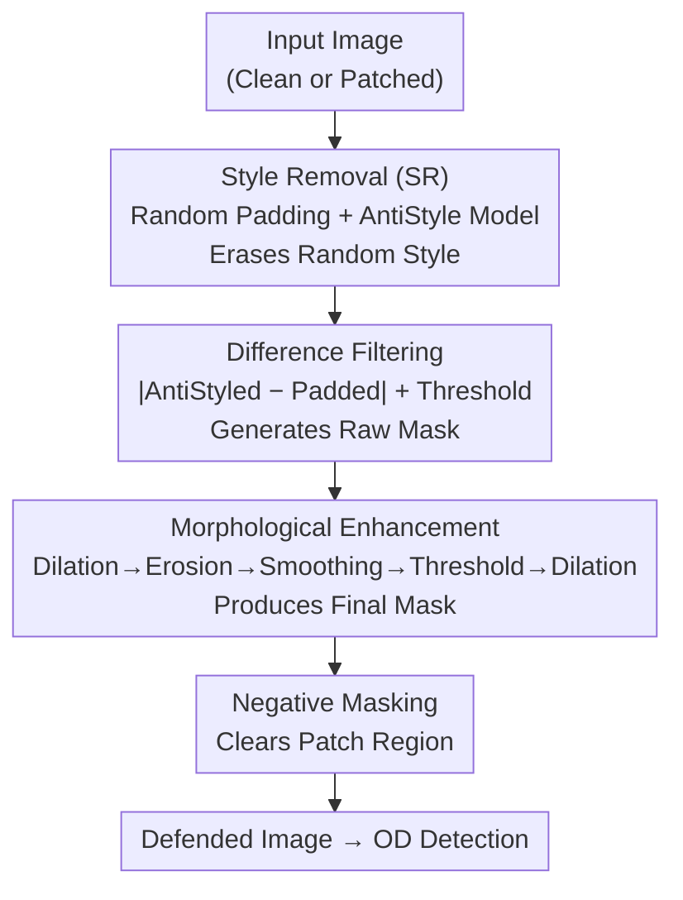

# AntiStyler: Defending Object Detection Models Against Adversarial Patch Attacks Using Style Removal

**Conference**: CVPR 2026  
**Paper**: [CVF Open Access](https://openaccess.thecvf.com/content/CVPR2026/html/Yankelev_AntiStyler_Defending_Object_Detection_Models_Against_Adversarial_Patch_Attacks_Using_CVPR_2026_paper.html)  
**Code**: https://github.com/IdanYankelev/AntiStyler  
**Area**: AI Security  
**Keywords**: Adversarial patch defense, Object detection, Style removal, Zero-shot defense, Real-time inference  

## TL;DR
The authors invert style transfer into "style removal" to eliminate the "random texture style" of adversarial patches from images. By locating and masking patch pixels based on these style changes, they develop a zero-shot defense that is agnostic to models, patches, and attacks. This method avoids training and preserves clean image performance while improving adversarial mAP by 8–15 points, achieving real-time detection at 10–12 FPS (40–90ms per image).

## Background & Motivation

**Background**: Object detection (OD) models, like other deep networks, are vulnerable to adversarial patch attacks—small, optimized patches that cause detectors to miss objects or misclassify them. This poses significant threats in real-time scenarios such as security and autonomous driving. Recent defense trends have shifted toward "lightweight, purification-based" approaches: identifying and masking/repairing adversarial regions before feeding them into the detector.

**Limitations of Prior Work**: Existing defenses generally suffer from two major flaws. First, they **sacrifice clean performance**—to mask patches, they often mistakenly remove or alter content in benign images, which is unacceptable given that most real-world images are not under attack. Second, **processing is too slow**—window-based methods (ObjectSeeker, PAD) require multiple inferences, and diffusion methods (DIFFender) rely on iterative sampling, often exceeding 4000ms per image, far below the real-time requirement of $\ge 10$ FPS ($\le 100$ms).

**Key Challenge**: Many purification methods originate from image classification. Their "reconstruction" process often changes the appearance or position of objects. While negligible for classification, this is fatal for OD, where shifting an object invalidates its bounding box. Thus, a tension exists between "thorough patch removal" and "preserving object localization."

**Key Insight**: The authors observe that adversarial patches introduce more complex and "random" visual textures compared to natural images, effectively carrying a unique "style." Since style transfer can move style from one image to another, the authors propose a "style removal" operator designed to specifically erase this random style while leaving content intact. Preserving content ensures that object positions are not disrupted.

**Core Idea**: For the first time, style transfer is modified into **Style Removal (SR)** by keeping the content loss and negating the style loss, forcing the optimization to "move away" from random styles. Patch locations are identified via pixel differences before and after SR, refined through spatial morphological filtering, and finally removed using a negative mask. The entire pipeline requires no training or prior knowledge of the attack.

## Method

### Overall Architecture
AntiStyler is a preprocessing defense placed **before** the detector. It takes a potentially patched image, outputs a "defended" image, and feeds it into any OD model. The pipeline consists of four stages: **Style Removal → Difference Filtering → Morphological Enhancement → Negative Masking**.

Intuitively, a CNN (AntiStyle model) erases "random styles" to produce an AntiStyled image. Since patch regions have the strongest style and undergo the most change, the patch is highlighted by comparing the "Original vs. AntiStyled" pixel differences. This raw mask is refined via morphological filtering to eliminate noise, and the final negative mask removes the patch.

A key design choice is **random value padding**: if an image is clean, hard "style removal" might damage normal content. By adding a border of random pixels, the authors **guarantee that every image contains a random style**. On clean images, SR removes only the padding style; on adversarial images, it removes both the patch and the padding styles.

### Key Designs

**1. Style Removal (SR): Negating the style loss to subtract adversarial styles**

This is the core innovation for weakening patches without altering content. In standard style transfer, intermediate features of a pre-trained VGG are used: content is represented by the feature map itself, and style by the Gram matrices. The objective $L_{ST}(X_O,X_C,X_S)=\alpha L_C(X_O,X_C)+\beta L_S(X_O,X_S)$ is minimized to make the output $X_O$ **approach** the style of $X_S$.

Following Li et al.'s interpretation of style loss as MMD (Maximum Mean Discrepancy), minimizing Gram matrix MSE adapts the output domain to the style domain. AntiStyler instead **maximizes** this MSE to "push" the output domain away from the style domain:

$$L_{SR}(X_O,X_C,X_S)=\alpha L_C(X_O,X_C)-\beta L_S(X_O,X_S)$$

By flipping the sign of $L_S$, "style addition" becomes "style removal." The AntiStyle model uses the input image as content and samples a random pixel image (uniform $[0,1)$ distribution) as the style target. The resulting AntiStyled image preserves content but is pushed away from the "random style." Combined with random padding, this ensures clean content is not mistakenly modified—the fundamental reason for preserving clean performance. Implementation uses VGG-19 (first five layers for style, fourth for content) with $\alpha{:}\beta=1{:}1000$, optimized for **only one step** for speed.

**2. Difference Filtering: Locating patches via pixel displacement**

To locate the patch, the authors leverage the fact that SR causes the most significant changes in high-style (patch) regions. Pixel-wise differences are calculated and binarized using a **dynamic threshold**:

$$\text{Diff}[i,j]=\big|\text{AntiStyled}[i,j]-\text{PaddedInput}[i,j]\big|$$

$$\text{Mask}[i,j]=\begin{cases}1,&\text{Diff}[i,j]\ge \tau\cdot \text{Max\_change}\\0,&\text{otherwise}\end{cases}$$

Where $\text{Max\_change}=\max_{(i,j)}\text{Diff}[i,j]$ and $\tau$ is a percentage-based threshold (top-$\tau$ percentile). This relative threshold adapts to varying image lighting and content. Removing padding leaves a raw mask with dense clusters at the patch and sparse noise elsewhere.

**3. Morphological Enhancement & Masking: Refining the mask**

To prevent noisy masks from damaging benign regions, a sequence of spatial filters is applied: **Dilation (max)** connects adjacent masked pixels; a **larger Erosion (min)** removes isolated noise (low-density areas); **Smoothing + Thresholding** closes small holes; and a final **Dilation (max)** slightly expands the mask to ensure full patch coverage. This exploits the structural difference between "patch = high-density cluster" and "noise = low-density points." The final negative mask is applied to the original input to clear the patch before detection.

## Key Experimental Results

### Main Results
On COCO (digital attacks) using Faster R-CNN and DETR against Google, M-PGD, and DPatch. Benign / Adv / Mean refer to clean, adversarial, and overall mean mAP% (IoU=0.5). Time is in ms.

| Detector | Defense | Time (ms) | Google-Adv | M-PGD-Adv | DPatch-Adv | Clean (Google-Benign) |
|--------|------|----------|-----------|-----------|-----------|------------------------|
| Faster R-CNN | None | — | 16.6 | 22.3 | 23.0 | 51.6 |
| Faster R-CNN | DIFFender (ECCV24) | 7606 | 19.4 | 26.3 | 25.4 | 34.1 |
| Faster R-CNN | NutNet (CCS24) | 45* | 21.4 | 31.5 | 31.1 | 42.4 |
| Faster R-CNN | KDAT (AAAI25) | 43* | 31.5 | 33.3 | 34.3 | 50.1 |
| Faster R-CNN | **AntiStyler** | 93 | **32.5** | **38.0** | **38.3** | **51.6** |
| DETR | None | — | 30.8 | 29.0 | 35.5 | 52.8 |
| DETR | **AntiStyler** | 86 | **41.7** | 39.6 | 44.4 | **53.0** |

Note: AntiStyler achieves state-of-the-art results across all adversarial categories for Faster R-CNN (~15 mAP% gain) and **exactly matches** clean performance (51.6). It is one of the few defenses capable of real-time operation ($\le 100$ms). `*` KDAT/NutNet require re-training for each dataset/model, excluding training overhead.

### Ablation Study
Ablation of pipeline stages (COCO + Faster R-CNN, mAP%): UP = No padding, UM = SR only without mask, RM = Raw mask without enhancement.

| Variant | Google-Benign | Google-Adv | M-PGD-Adv | DPatch-Adv |
|------|---------------|-----------|-----------|-----------|
| No Defense | 51.6 | 16.6 | 22.3 | 23.0 |
| UP (No padding) | 38.8 | 30.6 | 35.7 | 37.7 |
| UM (SR only) | 49.3 | 29.3 | 32.2 | 33.4 |
| RM (Raw mask) | 48.1 | 30.4 | 35.3 | 35.2 |
| **AntiStyler (Full)** | **51.6** | **32.5** | **38.0** | **38.3** |

### Key Findings
- **Padding is essential for clean performance**: Removing padding (UP) causes clean mAP to drop from 51.6 to 38.8. Manually injecting a "bait style" ensures SR has something to remove without touching the actual content.
- **Filtering + Enhancement are non-negotiable**: SR alone (UM) or raw masks (RM) degrade both clean and adversarial performance. Morphological filtering is critical to separate patch clusters from benign noise.
- **VGG19 outperforms Residual Networks**: The authors hypothesize that VGG19's simple convolutional structure preserves local texture better, whereas ResNet50/EfficientNetV2 residual connections make features less sensitive to local perturbations, weakening patch capture.
- **Resilience to Adaptive Attacks**: Maintains gains under black/gray/white-box attacks (~5 to ~7 mAP% improvement). Gray-box attackers cannot predict the random style sampled, and white-box attacks are hampered by the non-differentiable thresholding components.

## Highlights & Insights
- **Minimalist "Negative Sign" Innovation**: Converting style transfer to style removal via a simple sign flip is elegant, zero-shot, and grounded in MMD theory.
- **Solving the OD Defense Paradox**: SR's inherent content preservation avoids the "bounding box shift" problem that plagues classification-based purification methods.
- **Random Padding as a "Hook"**: Transforming the binary problem of "should I remove style?" into a stable "there is always style to remove" process is a clever engineering trick.
- **Plug-and-Play**: Agnostic to models, patches, and attacks. It can be deployed in front of any existing detector with minimal cost.

## Limitations & Future Work
- **Dependency on "Patch = Random Texture" assumption**: If an attacker creates "natural" or smooth patches (e.g., P2/P3), the efficiency of texture-based localization decreases.
- **Parameter Sensitivity**: Morphological kernels, threshold $\tau$, and padding size are manually tuned (e.g., padding=10, 1-step optimization).
- **White-box Upper Bound**: While non-differentiable components provide a barrier, the robustness boundary may be re-evaluated if a fully differentiable approximation of the mask pipeline is developed.

## Related Work & Insights
- **vs. Purification-based Classification Defenses (e.g., DIFFender)**: These rely on reconstruction, which shifts object geometry (lethal for OD) and is slow (7606ms); AntiStyler is content-preserving and fast (~90ms).
- **vs. Window-based Defenses (ObjectSeeker, PAD)**: Slicing images into windows is extremely slow (4000–55000ms); AntiStyler achieves real-time speeds.
- **vs. Training-based Defenses (KDAT, Adversarial Training)**: These require retraining for each architecture and dataset; AntiStyler is zero-shot.

## Rating
- Novelty: ⭐⭐⭐⭐⭐ 
- Experimental Thoroughness: ⭐⭐⭐⭐ 
- Writing Quality: ⭐⭐⭐⭐⭐ 
- Value: ⭐⭐⭐⭐⭐ 

<!-- RELATED:START -->

## Related Papers

- [\[CVPR 2026\] When Robots Obey the Patch: Universal Transferable Patch Attacks on Vision-Language-Action Models](when_robots_obey_the_patch_universal_transferable_patch_attacks_on_vision-langua.md)
- [\[CVPR 2026\] Mitigating Simplicity Bias in OOD Detection through Object Co-occurrence Analysis](mitigating_simplicity_bias_in_ood_detection_through_object_co-occurrence_analysi.md)
- [\[CVPR 2026\] Phantom: Physical Object Interactions as Dynamic Triggers for NMS-Exploited Backdoors](phantom_physical_object_interactions_as_dynamic_triggers_for_nms-exploited_backd.md)
- [\[CVPR 2026\] TTP: Test-Time Padding for Adversarial Detection and Robust Adaptation on Vision-Language Models](ttp_test-time_padding_for_adversarial_detection_and_robust_adaptation_on_vision-.md)
- [\[CVPR 2026\] RemedyGS: Defend 3D Gaussian Splatting Against Computation Cost Attacks](remedygs_defend_3d_gaussian_splatting_against_computation_cost_attacks.md)

<!-- RELATED:END -->
