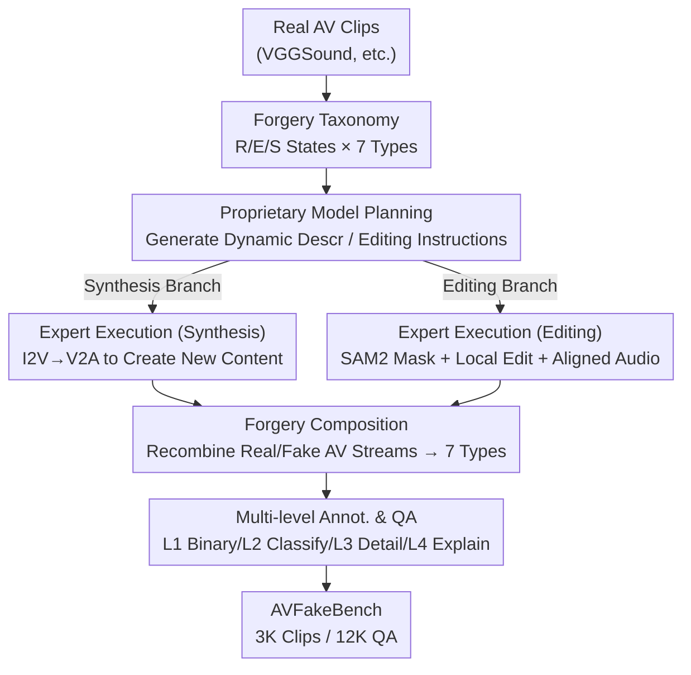

# AVFakeBench: A Comprehensive Audio-Video Forgery Detection Benchmark for AV-LMMs

**Conference**: CVPR 2026  
**Paper**: [CVF Open Access](https://openaccess.thecvf.com/content/CVPR2026/html/Xia_AVFakeBench_A_Comprehensive_Audio-Video_Forgery_Detection_Benchmark_for_AV-LMMs_CVPR_2026_paper.html)  
**Code**: To be confirmed  
**Area**: AI Security / Audiovisual Forgery Detection / Multimodal Benchmark  
**Keywords**: Audiovisual Forgery Detection, AV-LMM, Benchmark, Multi-level Annotation, Hybrid Forgery Generation

## TL;DR
AVFakeBench is the first comprehensive audiovisual forgery detection benchmark covering "Human + Generic Scenes, 7 types of AV forgery combinations, and 4 levels of annotation" (3K segments / 12K QA). Using a multi-stage hybrid forgery framework based on "proprietary model planning + expert model execution" to mass-produce fake data, the authors evaluated 11 Audiovisual Large Multimodal Models (AV-LMMs) and 2 expert detectors. The study reveals that while AV-LMMs outperform expert models in binary real/fake judgment, they nearly collapse in fine-grained forgery classification and explanatory reasoning.

## Background & Motivation
**Background**: Audiovisual (AV) forgery detection currently relies on two types of resources: early face deepfake datasets (FF++, Celeb-DF, DFDC) and multimodal deepfake datasets introducing cross-modal combinations (FakeAVCeleb, LAV-DF, AVDeepFake1M). Detection methods primarily consist of expert detectors targeting synthetic speech or faces (LipFD, AVH-Align).

**Limitations of Prior Work**: Existing benchmarks are simultaneously limited in three dimensions: (1) **Subject Monotony**: Almost exclusively focusing on faces/voices, failing to cover the vast real-world scenes like natural landscapes, animals, traffic, or industry; (2) **Single Forgery Type**: Focusing on either editing or synthesis without modeling their co-existence or complex cross-modal combinations; (3) **Single Annotation Granularity**: Providing only "real/fake" binary labels without fine-grained annotations like forgery types, details, or interpretable rationales, which lags far behind human perception.

**Key Challenge**: Generative models (Sora, KLING, FoleyCrafter, etc.) can already produce high-fidelity, synchronized fake content, shifting forgery from "face deepfakes" to "any natural scene + any AV modality." Meanwhile, evaluation benchmarks remain stuck in the face-based binary classification era, leaving us unable to verify if next-generation detectors work in real-world scenarios or if they can "locate, describe, and explain forgeries."

**Goal**: To build a benchmark that broadens the "subject breadth, forgery types, and annotation depth" simultaneously. This seeks to answer a critical question: Can AV-LMMs, inherently capable of language generation, serve as unified and interpretable forgery detectors?

**Key Insight**: The authors noted that AV-LMMs (e.g., VideoLLaMA2, video-SALMONN) can jointly process audiovisual signals and generate natural language, making "interpretable forgery evaluation" possible for the first time. Thus, rather than just binary testing, four progressive levels of tasks are designed to stress-test the perception and reasoning of AV-LMMs.

**Core Idea**: A decoupled hybrid forgery framework—combining "intent planning by proprietary models" with "precise execution by expert models"—is used to create high-fidelity cross-scene, cross-modal, multi-type fake data at low cost. Coupled with 4-level annotations, AV forgery detection is upgraded from "binary classification" to a multi-task evaluation of "Detection—Localization—Description—Explanation."

## Method

### Overall Architecture
AVFakeBench is not a single model but a **data benchmark + evaluation protocol**. It consists of four components: ① A taxonomy that categorizes AV content into Real/Edit/Synthesis states, crossing them to form **7 valid cross-modal forgery types**; ② A **Human Subject** portion (1,500 clips) reorganized from existing datasets into the 7-type taxonomy; ③ A **Generic Subject** portion (1,500 clips) newly created via a **multi-stage hybrid forgery framework**; ④ A set of **4-level annotations + 4 evaluation tasks**, leveraging LMM-assisted annotation and human verification to upgrade each sample into multi-level QA. The final dataset includes 3K AV segments and 12K QA pairs.

The foundation is the forgery combination matrix: Audio and Video each have Real (R), Edit (E), and Synthesis (S) states. Theoretically, there are 9 combinations, but "one modality synthesis + other modality edit" (e.g., synthetic video with partially edited audio) causes obvious semantic/temporal misalignment. Therefore, SA&EV and EA&SV are excluded, leaving **7 semantically consistent combinations**: RA&RV, RA&EV, RA&SV, EA&RV, EA&EV, SA&RV, and SA&SV.

The key to data construction lies in the generic subject forgery generation pipeline, which decouples "intent planning" from "execution" into three stages across synthesis and editing branches:

### Key Designs

**1. 3-State × 7-Type Cross-modal Forgery Taxonomy: Structuring "Real-World Hybrid Attacks"**
Existing benchmarks only label "real/fake," failing to describe real-world hybrid attacks where, for instance, audio is edited but video is real. The authors define video and audio as Real, Edited, or Synthesized. Within the $3 \times 3 = 9$ theoretical matrix, two semantically inconsistent combinations are removed, leaving 7: RA&RV (all real), RA&EV, RA&SV, EA&RV, EA&EV, SA&RV, and SA&SV. This system provides both a recipe for data construction and a 7-option label space for "forgery type classification (L2/T2)," requiring models to identify which modality is fake and whether it was edited or synthesized.

**2. Multi-stage Hybrid Forgery Framework: Decoupling Planning and Execution for High-Fidelity Data**
Generic scenes are harder to forge than faces due to high diversity in objects and events. Direct video generation often results in unstable motion or physically implausible scenes. The authors solve this by splitting forgery into "planning intent" and "precise execution" across two branches. **Synthesis Branch**: Stage 1 uses proprietary LMMs for planning with two strategies—frame-driven (using a real video's first frame as a visual anchor to predict temporal evolution) and scenario-driven (generating static descriptions based on 10 real scenarios, converted to frames via T2I like Midjourney). Stage 2 uses I2V models (KLING, QingYing) to synthesize video and V2A generators (FoleyCrafter) for aligned audio. Stage 3 recombines real/synthetic streams to instantiate RA&SV, SA&RV, and SA&SV. **Editing Branch**: Stage 1 samples 8 frames from a real video and lets a proprietary model suggest a local modification (e.g., "remove the small boat in the center for seconds 3-5"). Stage 2 follows two paths: generative editing (using KLING with manual constraints) and mask-based editing (using SAM2 for segmentation and a video editor for precise modification), followed by V2A for aligned audio. Stage 3 reintegrates the edited segments. This "proprietary model as director, expert model as actor, human as QA" division is key to mass-producing high-fidelity data.

**3. 4-Level Progressive Annotation + LMM-assisted Pipeline: From "Labels" to "Interpretable QA"**
To test AV-LMM perception, binary labels are insufficient. The authors designed: **L1 Binary Judgment** (Is it AI-processed?), **L2 Forgery Classification** (Which of the 7 types?), **L3 Forgery Detail Selection** (A 5-choice question for the most prominent evidence), and **L4 Explanation** (Natural language explaining where, what, and why it is semantically/visually flawed). L1 and L2 are determined by the data generation process. To handle 12,000 L3/L4 annotations, an **LMM Multimodal Annotator** was built. It is fed complementary evidence: sampled frames (spatial appearance), motion heatmaps (temporal motion), Mel-spectrograms (frequency anomalies), and high-frequency maps (manipulation noise). The LMM generates L4 rationales first, then extracts the most significant evidence for L3 and generates four distractors. All annotations undergo human verification for correctness and clarity.

### Evaluation Protocol & Metrics
The benchmark includes 4 tasks: T1 Binary Real/Fake, T2 Multiple-choice Classification, T3 Detail Selection, and T4 Open-ended Explanation. Accuracy and macro-F1 are reported for T1–T3. To handle poor instruction-following in some open-source models, a robust answer parser is used (checking explicit letters first, then justifying via content, or using GPT-5 as a neutral parser). T4 uses GPT-Score (reasoning score from 0-100 assigned by GPT-5). Additionally, a **Normalized Bias Index (NBI)** based on recall per forgery type quantifies systemic model preference (e.g., a model favoring a specific option regardless of content).

## Key Experimental Results

The evaluation covers **5 open-source AV-LMMs** (PandaGPT, OneLLM, VideoLLaMA2, video-SALMONN, AVicuna), **6 proprietary AV-LMMs** (GPT-4o, Gemini-2.0/2.5 series), and **2 expert detectors** (LipFD, AVH-Align).

### Main Results: Performance Across Four Task Levels (Selected Models, %)

| Model | T1 Binary F1 (Overall) | T2 Classif. F1 (Overall) | T3 Detail F1 (Overall) | T4 Expl. GPT-Score |
|------|------|------|------|------|
| LipFD (Expert) | 32.1 | — | — | — |
| AVH-Align (Expert) | 42.8 | — | — | — |
| GPT-4o | 56.9 | 12.2 | 27.5 | 29.0 |
| Gemini-2.5-flash | 59.0 | 11.3 | 31.8 | 26.6 |
| Gemini-2.5-pro | **59.9** | **19.2** | 21.9 | **30.9** |
| video-SALMONN (OS) | 40.0 | 4.6 | **17.8** | 4.4 |
| Video-LLaMA2 (OS) | 51.1 | 2.5 | 13.0 | 21.4 |
| PandaGPT (OS) | 25.0 | 5.5 | 12.6 | 20.4 |

Key Comparison: Expert detectors achieve only 45.0/51.7% F1 on Human Subjects and drop to 18.9–34.3% on Generic Subjects, showing heavy reliance on face-specific artifacts. Gemini-2.5-pro stays more stable (63.3% Human / 54.3% Generic). However, performance for all models collapses on T2/T3/T4; the strongest model (Gemini-2.5-pro) achieves only 19.2% F1 on T2—a **~70% performance drop** compared to T1.

### Analysis: Forgery Classification by State (T2, F1 %)

| Model | Real F1 | Edit F1 | Synthesis F1 | Overall F1 |
|------|------|------|------|------|
| GPT-4o | 15.2 | 3.9 | 5.5 | 12.2 |
| Gemini-2.5-flash-lite | 49.3 | 5.4 | 5.8 | 15.6 |
| Gemini-2.5-pro | 42.8 | **7.5** | 13.9 | 19.2 |
| PandaGPT | 7.2 | 0.3 | 2.2 | 5.5 |
| Video-LLaMA2 | 0.0 | 2.4 | 3.7 | 2.5 |

**Edit (Editing-based forgery) is the hardest category**: Even Gemini-2.5-pro scores only 7.5% F1 here. Editing is often local and subtle; models consistently fail to capture these changes, proving that current AV-LMMs lack reliable fine-grained perception.

### Key Findings
- **AV-LMMs are promising unified detectors**: They generally outperform specialized expert detectors on T1 and exhibit better cross-domain robustness due to their general-purpose priors.
- **Fine-grained perception is a major weakness**: Performance drops by ~70% from T1 to T2/T3. Edited forgeries are the most difficult to identify and represent a shared blind spot.
- **Explanatory reasoning is extremely weak**: Open-source models score in the single digits to low 20s (OneLLM: 1.0, video-SALMONN: 4.4) on T4. Even GPT-4o only reaches 29.0, far from practical use.
- **Strong Systematic Bias (NBI)**: Most models collapse into one or two dominant categories (especially "Real" RA&RV) on T2, suggesting they haven't learned reliable cross-modal forgery cues and default to the "safest" or most frequent labels.

## Highlights & Insights
- **"Planning-Execution Decoupling" is the key trick for high-fidelity fake data**: Using proprietary LMMs as directors to produce structured dynamic descriptions/instructions prevents the physical inconsistencies of unconstrained video generation.
- **Multimodal Evidence for Annotation**: Providing frames, motion heatmaps, Mel-spectrograms, and high-frequency maps as context for the annotating LMM is a practical recipe for generating "interpretable forgery explanations."
- **NBI Metric reveals the illusion**: Normalized Bias Index exposes model collapse (guessing the safe option), reminding benchmarkers not to trust accuracy alone.
- **The "Aha" Moment**: AV-LMMs can win at binary classification but fail to explain why, suggesting they rely on generic priors rather than actually perceiving forgery artifacts.

## Limitations & Future Work
- **Dependence on closed-source generation and annotation models**: Data is generated via KLING/Midjourney and annotated via GPT-5, meaning distribution and quality are tied to these black-box models.
- **Pruned Taxonomy**: Excluding 2 cross-modal combinations for naturalness leaves a gap in testing "hybrid synthesis + editing" attacks.
- **Evaluation-centric Scale**: 3K clips / 12K QA is small for training; the paper focuses on evaluation rather than fine-tuning for improved detection.
- **GPT-Score Reliability**: T4 relies on GPT-5, whose inherent biases may affect conclusions.
- **Future Directions**: Improving fine-grained perception (e.g., explicit high-frequency/spectral branches), using NBI for debiasing, and expanding the benchmark into a training set for alignment.

## Related Work & Insights
- **vs. FakeAVCeleb / LAV-DF / AVDeepFake1M**: These expanded cross-modal combinations but remained face-centric with single labels. AVFakeBench broadens subject, type, and annotation depth simultaneously.
- **vs. GenVidBench / DeMamba / FakeParts**: These expanded to generic video generation or editing but were limited to the video modality. Ours fills the gap for multimodal AV forgery.
- **vs. LipFD / AVH-Align (Expert Detectors)**: Expert models fall short on cross-domain tasks and lack explanatory power. AVFakeBench leverages AV-LMMs to push detection toward "Localization—Description—Explanation."

## Rating
- Novelty: ⭐⭐⭐⭐⭐ First comprehensive AV forgery benchmark with 7 types and 4-level tasks; innovative decoupled framework.
- Experimental Thoroughness: ⭐⭐⭐⭐⭐ Extensive evaluation of 11 AV-LMMs and 2 experts across 4 dimensions + bias analysis.
- Writing Quality: ⭐⭐⭐⭐ Clear motivation and structure; rich data construction details.
- Value: ⭐⭐⭐⭐⭐ Establishes a standard for interpretable forgery detection and highlights the gap between "detection" and "perception."

<!-- RELATED:START -->

## Related Papers

- [\[CVPR 2026\] DeepfakeImpact: A Two-Stage Benchmark with Real-World Impact in Deepfake Detection](deepfakeimpact_a_two-stage_benchmark_with_real-world_impact_in_deepfake_detectio.md)
- [\[CVPR 2026\] FVBench: Benchmarking Deepfake Video Detection Capability of Large Multimodal Models](fvbench_benchmarking_deepfake_video_detection_capability_of_large_multimodal_mod.md)
- [\[CVPR 2026\] X-AVDT: Audio-Visual Cross-Attention for Robust Deepfake Detection](x-avdt_audio-visual_cross-attention_for_robust_deepfake_detection.md)
- [\[CVPR 2026\] Skyra: AI-Generated Video Detection via Grounded Artifact Reasoning](skyra_ai-generated_video_detection_via_grounded_artifact_reasoning.md)
- [\[CVPR 2026\] A Sanity Check for Multi-In-Domain Face Forgery Detection in the Real World](a_sanity_check_for_multi-in-domain_face_forgery_detection_in_the_real_world.md)

<!-- RELATED:END -->
