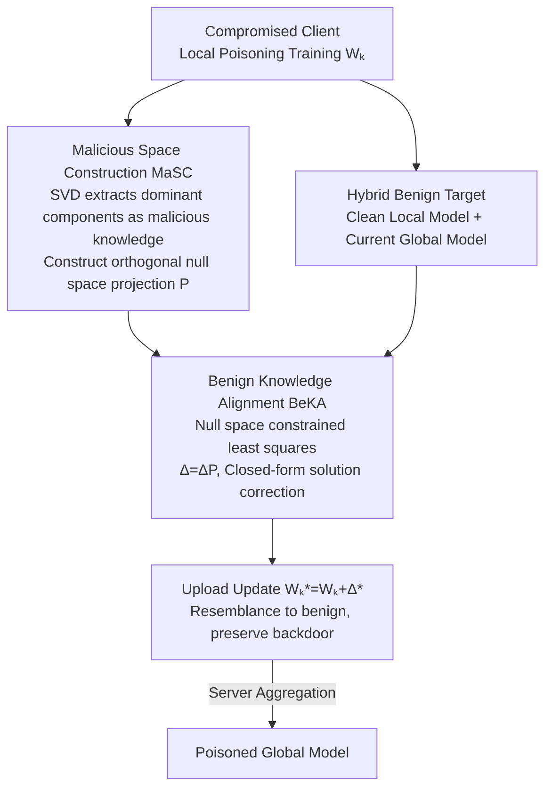

# Batman: Benign Knowledge Alignment Through Malicious Null Space in Federated Backdoor Attack

**Conference**: CVPR 2026  
**Paper**: [CVF Open Access](https://openaccess.thecvf.com/content/CVPR2026/html/He_Batman_Benign_Knowledge_Alignment_Through_Malicious_Null_Space_in_Federated_CVPR_2026_paper.html)  
**Code**: https://github.com/WenddHe0119/Batman  
**Area**: AI Security / Federated Learning Backdoor Attack  
**Keywords**: Federated Learning, Backdoor Attack, Null Space, Benign Knowledge Alignment, Stealthiness

## TL;DR
Addressing the dilemma in federated backdoor attacks where "aligning benign knowledge weakens the attack, while failing to align makes it easily detected by defenses," Batman utilizes SVD to compress malicious knowledge into the dominant directions of parameter matrices. It aligns benign knowledge within the orthogonal "malicious null space," significantly enhancing stealthiness while maintaining backdoor functionality. It achieves high ASR and ACC simultaneously across four datasets and six aggregation/defense mechanisms.

## Background & Motivation

**Background**: Federated Learning (FL) enables multiple clients to collaboratively train a global model without exchanging raw data, where the server only observes uploaded parameter updates. This "updates-only" setting naturally leaves a vulnerability for backdoor attacks—by compromising a few clients, an attacker can cause the global model to misclassify inputs with specific triggers to a target class while performing normally on clean samples.

**Limitations of Prior Work**: Classical backdoors (e.g., BadNet) use fixed triggers, creating distinct differences between malicious and benign updates that are easily filtered by consistency or statistical defenses. To evade detection, recent attacks have evolved in two directions: **Trigger-Surface attacks**, which modify trigger shapes, locations, or poisoning ratios to make samples "look benign" (e.g., DBA, Bad-PFL, Chameleon); and **Representation-Guided attacks**, which actively inject benign updates into malicious ones to blur the boundary (e.g., Neurotoxin, Lp-attack).

**Key Challenge**: Trigger-surface attacks achieve **insufficient alignment** in the parameter space—malicious representations are suppressed but not truly moved toward benign ones, leaving them still distinguishable. Representation-guided attacks suffer from **over-alignment**—injecting too many benign updates dilutes malicious knowledge and weakens the attack success rate. The root cause is that both categories occupy the **same shared parameter space** for both benign and malicious knowledge, where any alignment toward benign knowledge inevitably interferes with malicious representations. Thus, achieving both stealth and effectiveness becomes a deadlock.

**Key Insight & Core Idea**: The authors made a critical observation on ResNet-18 using Trigger Activation Change (TAC): the **high-rank (dominant) components** of the parameter matrix respond strongly to triggers and are essential for the backdoor, while the **low-rank (tail) components** barely respond to triggers but align with benign features. Since malicious knowledge is concentrated in dominant directions, it can be isolated. By aligning benign knowledge in the **orthogonal complement (null space)** of these directions, perturbations in the null space will by definition not alter the dominant directions. This allows **"benign alignment" and "malicious preservation" to occur in two non-interfering directions**. In short: use the null space to decouple benign alignment from malicious retention, bypassing the forced trade-off of the shared parameter space.

## Method

### Overall Architecture

Batman is a two-step operation performed by compromised clients **after the final local training round** on **layers most relevant to the backdoor**. The goal is to rewrite the update $W_k^*$ to be uploaded to the server such that it resembles a benign client without losing the backdoor.

Step 1: **MaSC (Malicious Space Construction)**: Perform truncated SVD on the local parameter matrix, using the top-$r$ dominant components to approximate "malicious knowledge" $W_k^{\text{main}}$, then construct its left null space projection matrix $P$. Step 2: **BeKA (Benign Knowledge Alignment)**: Construct a hybrid benign target $W_k^b$ using "the clean local model before poisoning + the current global model." Solve a constrained least-squares problem to find a correction $\Delta$ that pulls the update toward the benign target while forcing $\Delta$ to reside within the malicious null space spanned by $P$. The final uploaded update is $W_k^* = W_k + \Delta^*$. Due to the high cost of SVD, these steps are only performed in the final round and on layers with the largest deviation from the initial state; if the attacker is excluded during aggregation, more layers are progressively included in subsequent rounds to adaptively balance efficiency and durability.

### Key Designs

**1. MaSC: Confining the Backdoor via SVD to Free Up Harmless Directions for Benign Alignment**

The pain point here is that aligning benign knowledge in a shared parameter space tends to erase the backdoor. The authors first diagnose this by performing SVD on the parameter matrix $W_k \in \mathbb{R}^{m \times n}$ and splitting it into dominant and residual components:

$$W_k = \underbrace{\sum_{i=1}^{r}s_i u_i v_i^\top}_{W_k^{\text{main}}} + \underbrace{\sum_{j=r+1}^{\min\{m,n\}}s_j u_j v_j^\top}_{W_k^{\text{res}}}$$

TAC analysis shows that top-$r$ components respond much more strongly to triggers than tail components, thus $W_k^{\text{main}}$ is treated as "malicious knowledge." The **left null space** is then defined: performing SVD on $W_k^{\text{main}}$ and taking the left singular vectors $\tilde U_0$ corresponding to zero singular values, which satisfy $\tilde U_0 \tilde U_0^\top W_k^{\text{main}} = 0$. The projection matrix $P = \tilde U_0 \tilde U_0^\top$ maps any vector into the malicious null space. This definition ensures any perturbation $\Delta$ satisfying $\Delta = \Delta P$ only introduces changes in directions orthogonal to $W_k^{\text{main}}$, **leaving the dominant directions containing malicious knowledge untouched**. This is the mathematical foundation for "safe" benign alignment and distinguishes it from methods like Neurotoxin (filling updates in low-significance subspaces), which only approximate interference avoidance while Batman uses **strict** orthogonal isolation.

**2. BeKA: Hybrid Benign Targets and Null Space Projection for Closed-form Correction**

Aligning the malicious update only to the pre-poisoning clean local model is insufficient: a single clean model may deviate from the global aggregation direction and be caught by consistency defenses. BeKA therefore constructs a **hybrid benign knowledge set** $W_k^b = \{W_k^*, W_g^t\}$, where $W_k^*$ is the client's clean model before poisoning (reflecting the natural local trajectory) and $W_g^t$ is the global model at round $t$ (representing the collective optimization direction). By fitting both "local trends + global trends," the update avoids appearing as an outlier or deviating from the collective direction.

Given the malicious update $W_k^{\text{main}}$, the task is to find a correction $\Delta$ such that the total update is as close as possible to the benign reference $W_k^b$ without touching the backdoor signal. This is solved via a regularized least-squares problem with a null space constraint:

$$\min_{\Delta} \lVert (W_k^{\text{main}} + \Delta) - W_k^b \rVert_F^2 + \lambda \lVert \Delta \rVert_F^2, \quad \text{s.t. } \Delta = \Delta P$$

The first term pulls the update toward the benign target in both direction and scale; the second term $\lambda$ constrains the magnitude of the correction; and the constraint $\Delta = \Delta P$ locks the correction within the malicious null space. This yields a closed-form solution:

$$\Delta^* = -\big(I + \lambda^{-1}P\big)^{-1}P(W_k^{\text{main}} - W_k^b)$$

The final uploaded update is $W_k^* = W_k + \Delta^*$. Consequently, the attacker preserves the backdoor in $W_k^{\text{main}}$ while transforming the actual update to resemble a benign client, making it harder for both consistency-based and distribution-based defenses to distinguish.

### Loss & Training
The core objective is the regularized least-squares problem with the null space constraint shown above, which requires no iteration and uses the closed-form solution $\Delta^*$. SVD and alignment are performed only in the final round and on specific backdoor-related layers that deviate most from the initial state to save computation. Two regularization strengths $[\lambda_{W_g}, \lambda_{W_k^*}]$ control the alignment intensity toward the global and clean local models respectively.

## Key Experimental Results

Setup: 100 clients, 100 communication rounds, 10 compromised clients, 10% sampling per round; Dirichlet(0.5) for non-IID. Datasets: CIFAR-10/100, Fashion-MNIST, CINIC. Metrics: ASR (Attack Success Rate), ACC (Clean Accuracy), AVG = (ACC+ASR)/2. Comparisons include BadNet, DBA, Bad-PFL, Lp-attack, Neurotoxin; defenses include FedAvg (no defense), FLGuardian, AlignIns, FLTrust, TrimmedMean, DnC.

### Main Results: Comparison under Six Aggregations/Defenses (Partial)

| Dataset | Defense | Method | ASR | ACC | AVG |
| :--- | :--- | :--- | :--- | :--- | :--- |
| CIFAR-100 | FedAvg | BadNet | 96.06 | 39.25 | 67.65 |
| CIFAR-100 | FedAvg | Neurotoxin | 94.03 | 36.74 | 65.38 |
| CIFAR-100 | FedAvg | **Batman** | **98.48** | 39.65 | **69.06** |
| CIFAR-100 | FLGuardian | BadNet | 96.08 | 34.96 | 65.52 |
| CIFAR-100 | FLGuardian | Lp-attack | 81.07 | 34.27 | 57.67 |
| CIFAR-100 | FLGuardian | **Batman** | **99.38** | 34.43 | **66.91** |
| CINIC | FedAvg | BadNet | 92.37 | 51.77 | 72.07 |
| CINIC | FLGuardian | Neurotoxin | 70.64 | 38.94 | 54.79 |
| CINIC | FLGuardian | **Batman** | **98.48** | 42.86 | **70.67** |

**Key Findings**: Under strong defenses like AlignIns, BadNet's ASR on CIFAR-100 drops to 0.72 (essentially failing), while Batman maintains a high ASR. For stealthy attacks like Neurotoxin/Lp-attack under FLGuardian, ASR typically falls between 30% and 80%, whereas Batman consistently stays >96%. Essentially, "the stronger the defense, the more significant Batman's relative advantage."

### Ablation Study: Contributions of MaSC and BeKA

| Configuration | DnC(CINIC) AVG | FLTrust(CINIC) AVG | DnC(F-MNIST) AVG | FLTrust(F-MNIST) AVG |
| :--- | :--- | :--- | :--- | :--- |
| MaSC only | 73.80 | 57.85 | 94.93 | 83.77 |
| BeKA only | 72.88 | 53.35 | 92.37 | 75.08 |
| **MaSC+BeKA (Full)** | **74.18** | **67.47** | **95.15** | **94.78** |

**Key Findings**:
- **BeKA requires MaSC to be effective**: Using BeKA alone (alignment in shared space) is actually worse than using MaSC alone—under FLTrust (CINIC), BeKA only achieved an AVG of 53.35 vs MaSC's 57.85, confirming that "alignment in the shared space weakens the attack." Only by projecting alignment into the null space did the combination raise the AVG to 94.78 for FLTrust (F-MNIST).
- **Null space isolation is the primary source of Gain**: The full model's improvement over individual modules mostly occurs in high-stealth/stringent defense scenarios (e.g., ~10 points AVG Gain under FLTrust).
- **Hyperparameters $[\lambda_{W_g}, \lambda_{W_k^*}]$ and Rank $r$ require tuning**: Optimal combinations for alignment intensity exist, and rank $r$ also affects AVG; values that are too high or too low are suboptimal.

## Highlights & Insights
- **Orthogonality as a Decoupling Tool**: While many stealthy backdoor methods "approximate" interference avoidance, Batman uses the null space constraint $\Delta = \Delta P$ to turn "preserving the backdoor" into a **hard constraint** rather than a soft regularization. The mechanism is clean, providing a closed-form solution.
- **Diagnostic-Driven Design**: Using TAC to prove "malicious knowledge = high-rank dominant components" and "benign features = low-rank tail components" allows the space to be partitioned based on evidence rather than intuition.
- **Dual-Source Benign Target**: Aligning with both the "pre-poisoning local model" and the "current global model" simultaneously covers both consistency-based (group deviation) and distribution-based (statistical outlier) detection signals.
- **Transfer Value**: Null space alignment could be generalized to any scenario requiring the injection of new knowledge without damaging existing functionality, such as preventing forgetting in continual learning or covert embedding of model watermarks.

## Limitations & Future Work
- **Computational Cost**: SVD is expensive, forcing the authors to limit its use to "last round + few layers." This is an engineering compromise; if a defender forces frequent full-layer audits, the attack cost would rise.
- **White-box/Strong Capability Assumption**: The attacker needs the pre-poisoned local model, the global model, and the ability to perform SVD, which is a relatively strong capability requirement.
- **Domain Restriction**: Experiments were limited to four visual classification datasets. Whether the premise "malicious knowledge concentrates in high-rank components" holds across NLP, detection, or larger models remains to be verified.
- **Defense Inspiration**: Since the attack hides in the null space of dominant components, defenders could specifically audit updates for anomalous energy outside the dominant subspace.

## Related Work & Insights
- **vs. Trigger-Surface Attacks (DBA / Bad-PFL)**: These modify triggers at the input layer for a benign appearance, but malicious representations are only suppressed, not converged toward benign ones; Batman performs orthogonal alignment directly in the parameter space.
- **vs. Representation-Guided Attacks (Neurotoxin / Lp-attack)**: These restrict malicious updates to low-significance or specific subspaces to reduce interference, but they still operate in shared space where alignment and attack effectiveness are at odds.
- **vs. Classic BadNet**: BadNet's static triggers and distinct updates result in ASR dropping to near zero under defenses like AlignIns; Batman maintains high ASR under the same conditions, representing a qualitative leap in stealthiness.

## Rating
- **Novelty**: ⭐⭐⭐⭐⭐ Using null space orthogonality to hard-decouple "benign alignment" from "backdoor retention" is elegant and bypasses shared space trade-offs.
- **Experimental Thoroughness**: ⭐⭐⭐⭐ Covers various datasets and defenses with adequate ablation; lacks adaptive defense evaluation and cross-domain verification.
- **Writing Quality**: ⭐⭐⭐⭐ Logical flow from diagnosis to formula; some OCR/formatting noise but doesn't hinder understanding.
- **Value**: ⭐⭐⭐⭐ Provides a strong baseline for attacks and, more importantly, suggests a new direction for federated backdoor defense by auditing energy outside dominant subspaces.

<!-- RELATED:START -->

## Related Papers

- [\[CVPR 2025\] Geometric Knowledge-Guided Localized Global Distribution Alignment for Federated Learning](../../CVPR2025/ai_safety/geometric_knowledge-guided_localized_global_distribution_alignment_for_federated.md)
- [\[CVPR 2026\] Eliminate Distance Differences Induced by Backdoor Attacks: Layer-Selective Training and Clipping to Mask Backdoor Models](eliminate_distance_differences_induced_by_backdoor_attacks_layer-selective_train.md)
- [\[CVPR 2025\] Infighting in the Dark: Multi-Label Backdoor Attack in Federated Learning](../../CVPR2025/ai_safety/infighting_in_the_dark_multi-label_backdoor_attack_in_federated_learning.md)
- [\[ICML 2026\] Extending Fair Null-Space Projections for Continuous Attributes to Kernel Methods](../../ICML2026/ai_safety/extending_fair_null-space_projections_for_continuous_attributes_to_kernel_method.md)
- [\[CVPR 2026\] FlowHijack: A Dynamics-Aware Backdoor Attack on Flow-Matching Vision-Language-Action Models](flowhijack_a_dynamics-aware_backdoor_attack_on_flow-matching_vision-language-act.md)

<!-- RELATED:END -->
