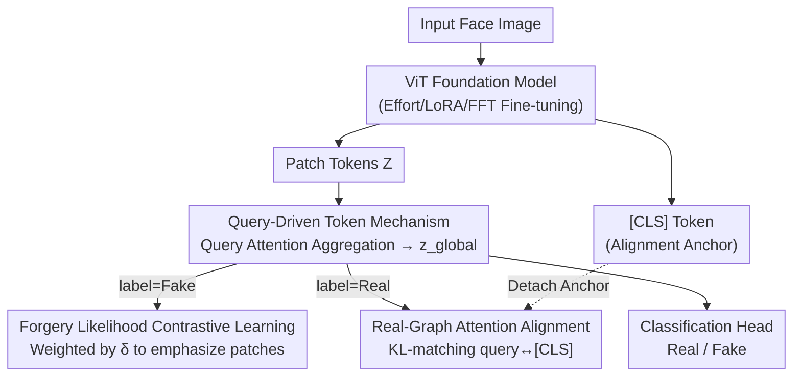

# Beyond [CLS] Token: Query-Driven Token-Level Forgery Purification for Generalizable Deepfake Detection

**Conference**: CVPR 2026  
**Paper**: [CVF Open Access](https://openaccess.thecvf.com/content/CVPR2026/html/Wang_Beyond_CLS_Token_Query-Driven_Token_Level_Forgery_Purification_for_Generalizable_Deepfake_CVPR_2026_paper.html)  
**Code**: https://banishedknight.github.io/CVPR_QTFP/ (Project Page)  
**Area**: AI Security / Deepfake Detection  
**Keywords**: Deepfake Detection, Visual Foundation Models, query token, contrastive learning, generalizability

## TL;DR
Addressing the "Pre-trained Information Bias" (PIB) where the [CLS] token in ViT foundation models excessively focuses on global semantics and ignores local forgery traces during deepfake detection, this paper proposes the QTFP framework. By replacing [CLS] with a set of randomly initialized learnable query tokens to aggregate local evidence, combined with "Forgery Likelihood Weighted Contrastive Loss" and "Real-Graph Attention Alignment" regularizations, the average cross-dataset AUC is improved from 0.923 (Effort) to 0.947.

## Background & Motivation
**Background**: Generalizable deepfake detection (DFD) is treated as a real/fake binary classification problem. Recent SOTA methods (e.g., Effort, Forensics Adapter) typically use ViT Visual Foundation Models (VFMs) like CLIP as backbones to leverage powerful pre-trained priors against domain shifts from unseen forgery sources. Most methods directly use the **[CLS] token** from the pre-trained ViT for classification.

**Limitations of Prior Work**: Through preliminary experiments on Effort, the authors identify a phenomenon termed **Pre-trained Information Bias (PIB)**: the attention of the [CLS] token is distributed broadly across almost all patches (as shown in Fig. 2a, where attention distribution is concentrated near small weight values with extremely high patch counts). This indicates a tendency to aggregate global semantics. Since deepfake traces are **local** (e.g., face-swapping, local manipulations), global semantics are dominated by "real-looking" patches, diluting the focus on subtle forgery clues.

**Key Challenge**: Controlled experiments locate the root cause: replacing [CLS] with a randomly initialized learnable token (RandCLS) results in an AUC curve that **gradually converges** to the performance of the pre-trained [CLS] (PreCLS) after several epochs (Fig. 2b). This suggests the bias stems not from the initialization of [CLS], but from the **pre-trained parameters throughout all layers**. As long as the token propagates through the attention layers of the backbone, it is "biased" by global semantic priors. This creates a dilemma: pre-trained priors are useful for generalization (especially characterizing "realness"), but the accompanying global semantic bias suppresses local forgery evidence.

**Goal / Key Insight**: Instead of patching the [CLS] token constrained by pre-trained parameters, it is better to **bypass the backbone** and create a "detection-specific token." This token should break the global semantic ceiling to capture local forgeries without discarding useful pre-trained realness priors.

**Core Idea**: Introduce a set of **learnable query tokens independent of the backbone and randomly initialized**. These tokens "query" patch tokens through an additional lightweight multi-head attention in the final layer to aggregate local forgery evidence into a global detection token. Two regularizations—contrastive loss emphasizing real/fake patches and attention alignment—are used to preserve realness priors. Effectively, this is "token-level forgery purification using query tokens instead of [CLS]."

## Method

### Overall Architecture
QTFP (Query-Driven Token-Level Forgery Purification) is a **plug-and-play** framework applicable to any ViT foundation model and various fine-tuning methods (Effort / LoRA / FFT). Given a face image, the backbone produces patch token sequences $Z\in\mathbb{R}^{P\times D}$ and the [CLS] token. QTFP discards [CLS] for classification, utilizing learnable query tokens to aggregate patches in the final layer to obtain $z_{global}$ for real/fake discrimination. The method consists of three modules, where the latter two act as losses/regularizations during training only; during inference, only the query aggregation path is retained:

1. **Query-Driven Token Mechanism**: Query tokens extract local forgery evidence from patches via attention to form a global token.
2. **Forgery Likelihood Contrastive Learning**: Each patch is assigned a soft weight based on its "forgery-like" probability to ensure manipulated patches dominate the contrastive loss.
3. **Real-Graph Attention Alignment**: On real images only, the query attention distribution is aligned with [CLS] to anchor useful pre-trained realness priors.

### Key Designs

**1. Query-Driven Token Mechanism (QDTM): Bypassing the Global Semantic Ceiling of [CLS]**

This module addresses PIB directly. Since [CLS] is constrained by pre-trained parameters, its attention is biased by global semantics. The authors introduce $K$ **randomly initialized learnable query tokens independent of the backbone** $Q=[q_1,\dots,q_K]\in\mathbb{R}^{K\times D}$. These tokens interact with patch tokens $Z\in\mathbb{R}^{P\times D}$ only in the final layer via an additional lightweight multi-head attention:

$$A=\mathrm{Softmax}\!\left(\frac{QZ^\top}{\sqrt{D}}\right),\quad \tilde Z = AZ,$$

where $A\in\mathbb{R}^{K\times P}$ is the query→patch attention and $\tilde Z\in\mathbb{R}^{K\times D}$ represents the purified local evidence aggregated by each query. The $K$ query representations are averaged into a single global token $z_{global}=\frac{1}{K}\sum_{k=1}^K \tilde z_k$ for the classification head. This offers two advantages: queries start as a "blank slate" without pre-trained global bias, and by actively collecting information from patches, they naturally bridge local and global contexts, allowing the detector to focus on subtle manipulations while maintaining structural consistency.

**2. Forgery Likelihood Contrastive Learning (FLCL): Forgery-Likelihood Soft Weights**

Query aggregation alone is insufficient: fake images contain a mix of real and fake patches. Treating all patches equally in contrastive learning would bias the query toward the abundant "real-looking" patches. The authors estimate real/fake prototypes within the batch—$\mu_r$ (mean of all real image patches) and $\mu_f$ (mean of all fake image patches). For each patch $z_i$, distances to these prototypes are calculated: $s_r(i)=1-\mathrm{sim}(z_i,\mu_r)$ and $s_f(i)=1-\mathrm{sim}(z_i,\mu_f)$. A **signed likelihood difference** is defined:

$$\delta_i = s_r(i)-s_f(i)=\mathrm{sim}(z_i,\mu_f)-\mathrm{sim}(z_i,\mu_r).$$

Manipulated patches exhibit a significantly larger $\delta_i$. A monotonic mapping $w_i=g(\delta_i)$ (sigmoid or temperature-scaled softmax) converts $\delta_i$ into soft weights for the patch-level contrastive loss:

$$L_{FLCL}=-\frac{1}{N_fP}\sum_{n=1}^{N_f}\sum_{i=1}^{P} w_i^n \log\frac{\sum_{j=1}^{P^+}e{\mathrm{sim}(z_i^n,z_j^{n+})/\tau}}{\sum_{j=1}^{P}e^{\mathrm{sim}(z_i^n,z_j^n)/\tau}},$$

where $z_j^{n+}$ represents positive patch samples. The authors justify these weights via **Signal-to-Noise Ratio (SNR)**: assuming Gaussian distributions for real/fake patches, let $\Delta\mu=\mu_r-\mu_f$, then:

$$\mathrm{SNR}=\frac{\lVert\Delta\mu\rVert^2}{\sqrt{\mathrm{Var}(\delta)}}=\frac{\lVert\Delta\mu\rVert}{\sigma}.$$

When SNR > 1, $\delta$ is considered "informative." The SNR remains stable at approximately 2.5–3.0 during training, indicating clear separation.

**3. Real-Graph Attention Alignment (RAAL): Anchoring Realness Priors**

As an independent learning branch, queries might deviate from the real semantic structures learned by the backbone, losing useful "realness" priors. On **real images only**, the normalized attention distribution of each query $a_{n,k}^{Q}$ is pulled toward the [CLS] attention distribution $a_n^{CLS}$ using KL divergence:

$$L_{RAAL}=\frac{1}{N_rK}\sum_{n=1}^{N_r}\sum_{k=1}^{K}\mathrm{KL}\!\left(a_{n,k}^{Q}\,\Vert\, a_n^{CLS}\right).$$

The [CLS] attention is **detached** to serve as a stable knowledge anchor. Since global semantics in real images correlate with "realness," aligning queries with [CLS] on real data preserves pre-trained priors without introducing forgery bias.

### Loss & Training
Total loss = Classification loss + regularizations: $L=L_{CLS}+\lambda_1 L_{FLCL}+\lambda_2 L_{RAAL}$, with $\lambda_1=0.14,\ \lambda_2=1.0$. Implementation uses DeepfakeBench with a CLIP ViT-L/14 backbone, 8 frames for training, 32 frames for inference, Adam optimizer (lr 2e-4, batch 16), and Effort fine-tuning (rank-1).

## Key Experimental Results

### Main Results
Cross-dataset evaluation: Trained on FF++ (c23), tested on 10 unseen datasets (video-level AUC). QTFP achieves an average AUC of 0.947, surpassing Effort (0.923) and Forensics Adapter (0.914).

| Method | Venue | CDF-v2 | DFDC | DFDCP | WDF | Avg AUC (10 sets) |
| :--- | :--- | :--- | :--- | :--- | :--- | :--- |
| Forensics Adapter* | CVPR'25 | 0.956 | 0.869 | 0.851 | 0.890 | 0.914 |
| Effort | ICML'25 | 0.956 | 0.843 | 0.909 | 0.848 | 0.923 |
| **Ours (QTFP)** | CVPR'26 | **0.960** | **0.869** | **0.925** | **0.917** | **0.947** |

### Ablation Study
Based on Effort (rank-1) trained on FF++ (c23):

| QDTM | FLCL | RAAL | CDF-v1 | FSh | DFDCP | Avg |
| :---: | :---: | :---: | :---: | :---: | :---: | :---: |
| × | × | × | 0.967 | 0.868 | 0.909 | 0.914 |
| ✓ | × | × | 0.970 | 0.891 | 0.914 | 0.925 |
| ✓ | ✓ | × | 0.976 | 0.902 | 0.917 | 0.931 |
| × | ✓ | × | 0.971 | 0.897 | 0.920 | 0.929 |
| ✓ | ✓ | ✓ | **0.980** | **0.913** | **0.925** | **0.939** |

### Key Findings
- **Query tokens provide the largest contribution**: QDTM alone increases average AUC from 0.914 to 0.925 (+1.1). FLCL adds +0.6, and RAAL adds +0.8, providing complementary robustness.
- **FLCL requires queries to be effective**: Adding FLCL directly to [CLS] (without queries) results in only 0.929, confirming that forgery-weighted contrastive learning is more effective on tokens without global bias.
- **Backbone Independence**: Performance gains are consistent across BEiTv2, DINOv4, SigLIP2, and CLIP.

## Highlights & Insights
- **Quantifying the problem before solving it**: The diagnosis that bias comes from pre-trained parameters (via the RandCLS experiment) makes the design of bypassing the backbone with query tokens logical and well-justified.
- **SNR Justification**: Using $\mathrm{SNR}=\lVert\Delta\mu\rVert/\sigma$ to quantify discriminability provides theoretical backing for the soft weighting mechanism.
- **Plug-and-play efficiency**: Queries are lightweight additions outside the backbone. Regularizations are training-only, meaning inference overhead is negligible.

## Limitations & Future Work
- Sensitivity to hyperparameters like $K$ and $\lambda_1$ is not fully explored.
- Prototype estimation within small batches (e.g., batch size 16) might be noisy.
- RAAL assumes global semantics in real images are reliable anchors; this may fail in high-interference or low-quality scenarios.
- Evaluation is limited to image/video deepfakes and has not yet addressed audio-visual or pure generative (non-editing) content.

## Related Work & Insights
- **Comparison with Effort (ICML'25)**: While Effort focuses on utilizing pre-trained priors via SVD adaptation, it still relies on [CLS]. QTFP identifies PIB as the bottleneck and improves Effort's average AUC from 0.923 to 0.947.
- **Insight**: When "general information" in a strong pre-trained representation overwhelms "task-specific sparse signals," it is more effective to introduce an independent learnable query token for active retrieval rather than modifying the internal tokens constrained by pre-trained parameters.

## Rating
- Novelty: ⭐⭐⭐⭐ 
- Experimental Thoroughness: ⭐⭐⭐⭐⭐ 
- Writing Quality: ⭐⭐⭐⭐ 
- Value: ⭐⭐⭐⭐ 

<!-- RELATED:START -->

## Related Papers

- [\[CVPR 2026\] DFD-HR: Generalizable Deepfake Detection via Hierarchical Routing Learning](dfd-hr_generalizable_deepfake_detection_via_hierarchical_routing_learning.md)
- [\[CVPR 2026\] TokenTrace: Multi-Concept Attribution through Watermarked Token Recovery](tokentrace_multi-concept_attribution_through_watermarked_token_recovery.md)
- [\[CVPR 2026\] ClusterMark: Towards Robust Watermarking for Autoregressive Image Generators with Visual Token Clustering](clustermark_towards_robust_watermarking_for_autoregressive_image_generators_with.md)
- [\[CVPR 2025\] Forensics Adapter: Adapting CLIP for Generalizable Face Forgery Detection](../../CVPR2025/ai_safety/forensics_adapter_adapting_clip_for_generalizable_face_forgery_detection.md)
- [\[CVPR 2026\] Tutor-Student Reinforcement Learning: A Dynamic Curriculum for Robust Deepfake Detection](tutor-student_reinforcement_learning_a_dynamic_curriculum_for_robust_deepfake_de.md)

<!-- RELATED:END -->
