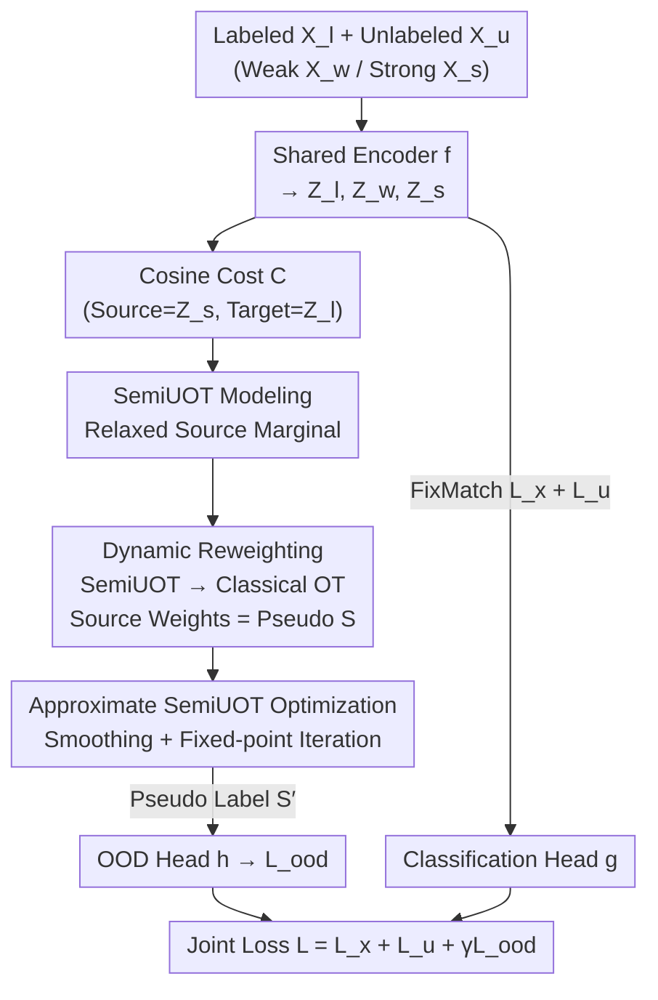

# Bypassing the Transport Plan: Dynamic Reweighting for Out-of-Distribution Detection with Optimal Transport

**Conference**: CVPR 2026  
**Paper**: [CVF Open Access](https://openaccess.thecvf.com/content/CVPR2026/html/Xiao_Bypassing_the_Transport_Plan_Dynamic_Reweighting_for_Out-of-Distribution_Detection_with_CVPR_2026_paper.html)  
**Code**: Not disclosed  
**Area**: AI Safety / OOD Detection  
**Keywords**: OOD Detection, Optimal Transport, Semi-supervised Learning, Open-set SSL, Dynamic Reweighting  

## TL;DR
To address the lack of OOD labels in open-set semi-supervised learning, this paper proposes DREW: modeling batch-level OOD detection as Semi-Unbalanced Optimal Transport (SemiUOT). Through "dynamic reweighting," it is equivalently transformed into classical OT, allowing pseudo OOD scores to be directly read from the source distribution weights—bypassing the computation of the full transport plan $\pi$. This yields more accurate, faster pseudo-labels with theoretical error bounds to supervise the OOD detection head.

## Background & Motivation
**Background**: Semi-supervised learning (SSL) relies on a small amount of labeled data and large amounts of unlabeled data. However, classical SSL assumes that labeled and unlabeled data share the same class space. In reality, unlabeled sets are often contaminated with **unknown OOD samples** (Open-set SSL), which are treated as ID pseudo-labels, severely degrading classification accuracy. Thus, OOD detection is required during training.

**Limitations of Prior Work**: The fundamental difficulty of open-set SSL is the **lack of reliable OOD labels** for supervision. Pure neural network methods (MTCF, T2T) perform poorly due to the absence of labels. Among methods introducing "third-party proxies" for pseudo-labels, Optimal Transport (OT) has proven effective—POT treats unlabeled (source) and labeled (target) data as uniform discrete distributions, solves for the transport plan $\pi$, and uses the total mass transferred per sample as ID confidence.

**Key Challenge**: Existing OT methods insist on **solving for the full transport plan $\pi$**, which is both redundant and unreliable. Redundancy arises because OOD detection cares about "sample-to-distribution" matching (how much mass each source sample ultimately matches), not fine-grained "sample-to-sample" matching in $\pi$. Unreliability stems from the common use of entropy regularization (Sinkhorn) to make OT solvable, resulting in **dense solutions** where concentrated mass is smeared, polluting OOD scores. Furthermore, POT requires manually injecting a redundant mass $k$ into source weights to relax target marginal constraints, which relies on ad-hoc tuning linked to the OOD ratio.

**Goal**: Obtain theoretically reliable and more accurate pseudo OOD scores without solving for the full $\pi$, without entropy regularization, and without manual weight inflation.

**Core Idea**: Model batch-level OOD detection as SemiUOT by **relaxing source marginal constraints**, then prove it can be equivalently transformed into classical OT via "dynamic reweighting." Since the source marginal of the classical OT is exactly the desired OOD score, one can **directly read the score from the reweighted source weights, bypassing the calculation of $\pi$**.

## Method

### Overall Architecture
DREW is an open-set semi-supervised training framework consisting of two modules connected by two weight-shared ("Tied") feature encoders $f$: the **Closed-set Classification Module** (following FixMatch) ensures class accuracy, and the **OOD Detection Module** produces pseudo OOD labels via dynamic reweighting to supervise an OOD detection head $h$.

The data flow is as follows: A batch of unlabeled samples $X_u$ undergoes weak augmentation $X_w$ and strong augmentation $X_s$. These, along with labeled samples $X_l$, pass through encoder $f$ to obtain features $Z_l, Z_w, Z_s$. The OOD module takes **strongly augmented unlabeled features $Z_s$ as source and labeled features $Z_l$ as target**, calculates a cosine cost matrix $C$, and models the task as SemiUOT. This is transformed into classical OT via dynamic reweighting, and **pseudo OOD scores $S$ are read directly from the source marginal weights** (labeled samples have a constant score of 1). These pseudo-labels $S'$ supervise the prediction $\hat S$ of detection head $h$ via an OOD loss. Simultaneously, classification is trained via standard FixMatch weights. Three losses are optimized jointly:

$$L = L_x + L_u + \gamma L_{ood}, \qquad L_{ood} = \frac{1}{M+N}\|\hat S - S'\|_2^2 .$$

where $\hat S = h(Z_l \oplus Z_s)$ and $S' = \mathbf{1}_N \oplus S$. A key benefit is that dynamic reweighting only occurs during **training**; during inference, only the FixMatch and ID probability outputs are active, resulting in **zero extra test latency**.

### Key Designs

**1. SemiUOT Modeling: Formalizing "Source Marginal Focus"**

OOD detection essentially requires knowing the mass matched per unlabeled sample (source marginal of the plan) rather than point-to-point details. The paper models batch-level OOD detection as **Semi-Unbalanced Optimal Transport**: source distribution $\alpha=\sum_i \frac{1}{M}\delta_{u_i}$, target distribution $\beta=\sum_j \frac{1}{N}\delta_{l_j}$, with cost $C = \mathbf{1}_{M\times N} - \frac{Z_s Z_l}{\|Z_s\|_2^2\|Z_l\|_2^2}$. Unlike classical OT, SemiUOT **retains the target marginal constraint $\pi^\top \mathbf{1}_M = b$ but relaxes the source marginal to a KL penalty term**:

$$\min_{\pi\in\Pi_s(\alpha,\beta)} \langle C,\pi\rangle_F + \tau_a\,\mathrm{KL}(\pi\mathbf{1}_N\,\|\,a).$$

This allows the mass carried by each source sample to **adaptively change**, which serves as the OOD signal (OOD samples are far from labeled data and match less mass). It avoids the ad-hoc redundant mass $k$ used in POT.

**2. Dynamic Reweighting: Bypassing $\pi$ via Duality**

Solving SemiUOT via Sinkhorn returns to entropy regularization issues. Proposition 3.1 shows that the dual form of SemiUOT can be **rewritten as a classical OT** where the source marginal constraint becomes $\pi\mathbf{1}_N = a\odot\exp\!\big(\frac{-u^*+\zeta^*}{\tau_a}\big)$. Crucially: **by partially solving for dual variables $u^*$ and $\zeta^*$, the SemiUOT collapses into a classical OT, and the reweighted source marginal itself is the pseudo OOD score**:

$$S = a\odot\exp\!\Big(\tfrac{-u^*+\zeta^*}{\tau_a}\Big).$$

This avoids computing the full plan $\pi$ and the "smearing" effect of dense solutions.

**3. Approximate SemiUOT + Fixed-point Iteration**

The exact SemiUOT objective contains a non-smooth $\inf_k[C_{kj}-u_k]$ term. The paper uses log-sum-exp for softening: $\inf_k[C_{kj}-u_k] \approx -\epsilon\log\sum_k e^{(u_k-C_{kj})/\epsilon}$. This allows $u_i$ to be updated via **fixed-point iteration** ($u^{(l+1)}_i = T(u^{(l)}_i)$). It provides a **strict error bound** (Proposition 3.3): $|K_P(u)-K_P(\widehat u)| \le \epsilon\log M$, ensuring the pseudo-labels are controllable and accurate.

### Loss & Training
Total loss $L = L_x + L_u + \gamma L_{ood}$: $L_x/L_u$ use FixMatch consistency losses (weight 1); $L_{ood}$ is the MSE between prediction $\hat S$ and pseudo-label $S'$ ($\gamma=0.01$). Backbones: WRN-28-2 (CIFAR-10), WRN-28-8 (CIFAR-100), ResNet-18 (ImageNet-30). Nesterov SGD, initial lr 0.03, $\tau_a=0.01$.

## Key Experimental Results

### Main Results
Evaluation on open-set scenarios using Top-1 Accuracy and AUROC.

| Dataset / Setting | Metric | DREW | POT | OpenMatch |
|--------------|------|------|------|-----------|
| CIFAR-10 (50 lab/class) | Acc / AUROC | **92.2** / 99.6 | 92.1 / **99.7** | 89.6 / 99.3 |
| CIFAR-100 (55 cls, 50 lab) | Acc / AUROC | **78.8** / **91.7** | 78.7 / 88.4 | 72.3 / 87.0 |
| ImageNet-30 (20 known cls) | Acc / AUROC | **92.1** / **97.6** | 92.0 / 97.4 | 89.6 / 96.4 |

DREW leads significantly in **CIFAR-100 AUROC** (+3.3 over POT), as other methods' pseudo-label quality degrades faster in high-class-count scenarios.

### Ablation Study
Comparison of supervision signals on CIFAR-100:

| Config | Acc (55cls) | AUROC (55cls) | AUROC (80cls) |
|------|------|------|------|
| FixMatch-OOD | 78.2 | 57.3 | 48.7 |
| FixMatch + POT | 78.7 | 88.4 | 88.1 |
| FixMatch + DREW | **78.8** | **91.7** | **90.8** |

### Key Findings
- **Pseudo-label quality is decisive**: DREW's self-generated pseudo-label AUROC (59.7) outperforms POT (59.2 with optimal $k$), without requiring the manual tuning of $k$.
- **Robustness**: Performance is stable across $\tau_a \in [0.001, 1]$.
- **Efficiency**: Due to the approximation proposition, training latency only increases slightly compared to POT, with **zero latency during inference**.

## Highlights & Insights
- **Perspective Shift**: Bypassing the full transport plan is a meaningful optimization, focusing only on the marginal match required for OOD detection.
- **Duality for Reweighting**: Using duality to collapse SemiUOT into classical OT provides a more grounded theoretical basis than ad-hoc weight inflation in POT.
- **Theoretical Bounds**: The $\epsilon\log M$ bound ensures the approximation is reliable and transferable to other UOT-based tasks like domain adaptation.

## Limitations & Future Work
- **Evaluation Scale**: Benchmarks are limited to CIFAR and ImageNet-30; performance on large-scale long-tailed OOD is unverified.
- **Marginal Gains in Simple Settings**: In CIFAR-10, the improvement over POT is minimal, suggesting the value is higher in complex, many-class scenarios.
- **Target Distribution Reliance**: pseudo-labels depend on labeled ID features; reliability may drop with extremely few labels.

## Related Work & Insights
- **vs POT**: POT requires manual mass $k$ and suffers from dense solutions in Sinkhorn; DREW uses SemiUOT to bypass $\pi$ and $k$, making it more accurate and theoretically sound.
- **vs OpenMatch**: OpenMatch uses OVA classifiers which lag behind in accuracy and AUROC on CIFAR-100 compared to DREW's OT-based signals.
- **vs Test-time Detection (MSP/Energy)**: These cannot utilize OOD information during training to preserve classification accuracy, whereas DREW optimizes jointly.

## Rating
- Novelty: ⭐⭐⭐⭐
- Experimental Thoroughness: ⭐⭐⭐⭐
- Writing Quality: ⭐⭐⭐⭐
- Value: ⭐⭐⭐⭐

<!-- RELATED:START -->

## Related Papers

- [\[ICLR 2026\] Optimal Transport-Induced Samples against Out-of-Distribution Overconfidence](../../ICLR2026/ai_safety/optimal_transport-induced_samples_against_out-of-distribution_overconfidence.md)
- [\[CVPR 2026\] RankOOD: Class Ranking-based Out-of-Distribution Detection](rankood_-_class_ranking-based_out-of-distribution_detection.md)
- [\[ICML 2026\] Optimal Transport under Group Fairness Constraints](../../ICML2026/ai_safety/optimal_transport_under_group_fairness_constraints.md)
- [\[CVPR 2026\] Enhancing Out-of-Distribution Detection with Extended Logit Normalization](enhancing_out-of-distribution_detection_with_extended_logit_normalization.md)
- [\[CVPR 2026\] Sparsity as a Key: Unlocking New Insights from Latent Structures for Out-of-Distribution Detection](sparsity_as_a_key_unlocking_new_insights_from_latent_structures_for_out-of-distr.md)

<!-- RELATED:END -->
## Related Papers

- [\[CVPR 2026\] SubFLOT: Submodel Extraction for Efficient and Personalized Federated Learning via Optimal Transport](subflot_submodel_extraction_for_efficient_and_personalized_federated_learning_vi.md)
- [\[ICLR 2026\] Optimal Transport-Induced Samples against Out-of-Distribution Overconfidence](../../ICLR2026/ai_safety/optimal_transport-induced_samples_against_out-of-distribution_overconfidence.md)
- [\[CVPR 2026\] RankOOD: Class Ranking-based Out-of-Distribution Detection](rankood_-_class_ranking-based_out-of-distribution_detection.md)
- [\[CVPR 2026\] Enhancing Out-of-Distribution Detection with Extended Logit Normalization](enhancing_out-of-distribution_detection_with_extended_logit_normalization.md)
- [\[ICML 2026\] Optimal Transport under Group Fairness Constraints](../../ICML2026/ai_safety/optimal_transport_under_group_fairness_constraints.md)

<!-- RELATED:END -->
