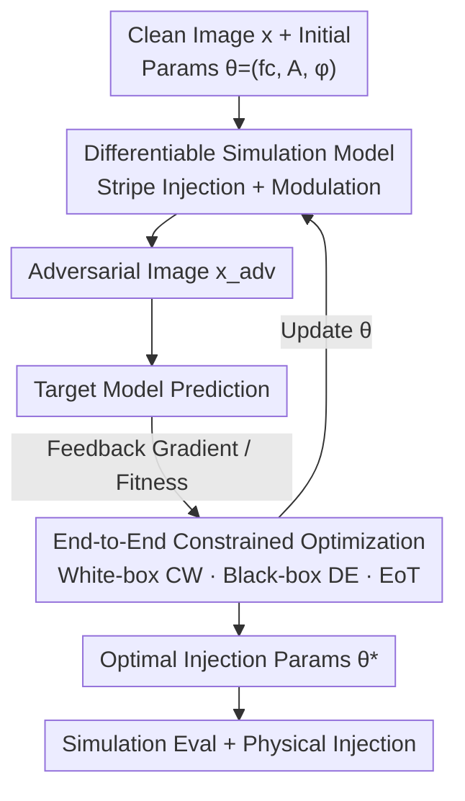

# CamPI: Physical Adversarial Examples through Camera Power Signal Injection

**Conference**: CVPR 2026  
**Paper**: [CVF Open Access](https://openaccess.thecvf.com/content/CVPR2026/html/Ren_CamPI_Physical_Adversarial_Examples_through_Camera_Power_Signal_Injection_CVPR_2026_paper.html)  
**Code**: None  
**Area**: Adversarial Attacks / AI Safety  
**Keywords**: Physical Adversarial Examples, Camera Power Injection, Signal Modulation, Differentiable Simulation, Black-box Optimization  

## TL;DR
By injecting a modulated signal into the camera's power supply line, controllable stripe/mask perturbations are induced in the imaging process through ADC sampling aliasing. This generates physical adversarial examples that are invisible to the naked eye, require no physical patches or external lighting, and do not need to face the target directly. The authors build a differentiable simulation model to optimize this physical mechanism end-to-end into attack parameters, achieving physical attack success rates of 92% and 82% under white-box and black-box settings, respectively.

## Background & Motivation
**Background**: Physical adversarial examples mainly follow two paths: patch-based, where printed adversarial patches are attached to target objects; and optical-based, where projectors or lasers are used to project visible patterns onto targets or cameras. Both have been repeatedly proven effective in misleading real-world classifiers and detectors.

**Limitations of Prior Work**: These methods carry significant exposure risks. Patches require physical proximity and leave visible marks, while optical attacks require a direct line of sight and involve visible patterns, making them easily detectable by human observers or defense systems. Furthermore, they are sensitive to target pose, shooting angles, and lighting conditions.

**Key Challenge**: Adversarial perturbations must be "strong enough to deceive the model" while remaining "stealthy enough to avoid detection." Existing methods place perturbations on the **target or the optical path**, where visibility and strength are naturally in opposition. The root cause is the wrong choice of attack surface: if the perturbation appears in the scene, it is inherently visible.

**Goal**: To identify a new attack surface that allows fine-grained control of perturbations while completely bypassing "visibility," and to transform this into an optimizable adversarial example generation problem.

**Key Insight**: The authors focus on a component present in every camera but never seriously utilized as an attack surface: the **power supply**. Injecting signals into the power line interferes with the sensor readout circuitry. This interference is aliased during ADC undersampling, producing stripes in the image. A key observation is that the morphology of these stripes (direction, density) changes systematically with the injected signal frequency, meaning they are **controllable**. Since the perturbation is generated during the imaging process, no patches or light spots are visible in the scene.

**Core Idea**: Shift "adversarial perturbations" from patches or light spots to **power signals**. Use modulated signals to "draw" adversarial patterns within the camera imaging chain and utilize a differentiable simulation model to optimize this physical process end-to-end into attack parameters.

## Method

### Overall Architecture
CamPI consists of two layers. The bottom layer is the **physical characterization of the injection mechanism** (stripe injection + modulation-based control), defining what signal injected into the power supply results in what image perturbation. The top layer is the **end-to-end attack framework**: given a clean image and a set of randomly initialized injection parameters $\theta=(f_c, A, \phi)$, a **differentiable simulation model** first reproduces the physical perturbation on the digital image to obtain an adversarial image. this is fed into the target model to obtain predictions, which are then fed back to the optimization algorithm (White-box CW / Black-box DE, with EoT for robustness) to iteratively update $\theta$. Finally, the converged optimal parameters $\theta^*$ are used for simulation evaluation and real-world physical injection.

The two bottom mechanisms (stripe injection and modulation control) are encoded into the differentiable simulation model node. The simulation model is designed to faithfully reproduce these physical processes on digital images.

### Key Designs

**1. Mechanism: Using ADC Sampling Aliasing to Transform Power Signals into Image Stripes**

This is the physical foundation of the attack, answering why power signal injection creates controllable patterns. When a signal with a center frequency $f_c$ is injected into the camera power supply, it interferes with the sensor readout and analog front-end circuits. When this high-frequency interference is sampled by the ADC, aliasing occurs due to an insufficient sampling rate $f_s$, producing an alias frequency $f_{\text{alias}} = |f_c - k f_s|$, where $k$ is an integer that minimizes the absolute value. Since cameras use progressive scanning (reading out pixels sequentially from left to right, top to bottom), the aliased interference is superimposed on the original signal in readout order, forming **regular stripes** in the image. Critically, different $f_c$ values change $f_{\text{alias}}$, thereby changing the direction and density of the stripes—the source of "controllability."

**2. Mechanism: Modulation-based Fine-grained Control to "Draw" Mask Signal**

Stripes alone lack granularity. Attackers desire **arbitrary shapes** for adversarial perturbations. The authors introduce a modulation scheme: the target source mask is read row-by-row and concatenated into a 1D **baseband signal**. This baseband signal is then **amplitude modulated (AM)** onto a carrier wave with frequency $f_c$ to obtain the attack signal for power injection. Consequently, the observed perturbation in the image is a superposition of the "mask pattern + carrier-induced stripes." A technical constraint is that the injection signal transmission rate must be strictly synchronized with the camera's frame and row rates; otherwise, the pattern will drift and fail to stabilize.

**3. Differentiable Simulation Model: Mapping Physical Injection to Digital Operators**

Physical injection itself is not differentiable. Gradient-based optimization requires a digital differentiable proxy. The authors design a simulation model (Algorithm 1): taking clean image $x$, injection parameters $(f_c, \phi, A)$, and camera parameters (frame rate $f_{ps}$, sampling rate $f_s$, crop ratio, grid $N_{row}\times N_{col}$), it first calculates the pixel transmission rate $f_{pixel}=f_{ps}\cdot N_{row}\cdot N_{col}$ and the alias frequency $f_{\text{alias}}$. Per-pixel perturbations are then generated via:

$$\delta[i,j] = A[k]\,\sin\!\Big(2\pi\,\frac{f_{\text{alias}}}{f_{pixel}}\cdot k + \phi\Big),\quad k=(i-1)N_{col}+j$$

The model then simulates the effective cropping area during sensor readout, resizes to full resolution, copies to three color channels, and clips to the valid pixel range to obtain $x_{adv}=\text{clip}(x+\delta^{(3)}, 0, 255)$. Since the perturbation responds continuously to small changes in parameters, the simulation is naturally differentiable.

**4. End-to-end Constrained Optimization (White-box CW + Black-box DE + EoT)**

Unlike digital attacks where pixels can be changed arbitrarily, power injection is restricted to the physically realizable parameter set $\Theta$ for $(f_c, A, \phi)$. The core is a **constrained optimization**: $\max_\theta \mathcal{L}\big(f(x+\delta(\theta)), y\big)$, s.t. $\|\delta(\theta)\|_p \le \epsilon,\ x+\delta(\theta)\in\mathcal{X},\ \theta\in\Theta$. 

Under white-box settings, gradients are available. Leveraging the simulation's differentiability, Carlini–Wagner optimization is used to minimize perturbation magnitude and classification margin loss: $\min_\theta \|\delta(\theta)\|_2^2 + c\,\mathcal{L}_{\text{margin}}$, where $\mathcal{L}_{\text{margin}}=\max(Z(x')_y - \max_{i\neq y}Z(x')_i, -\kappa)$. Since physical parameters are discrete, **Gumbel–Softmax** is used for differentiable relaxation: $\theta=\sum_i z_i\tilde\theta_i$. Under black-box settings, **Differential Evolution (DE)** is used to evolve optimal parameters through mutation, crossover, and selection. Both settings utilize **EoT (Expectation over Transformation)** to ensure the perturbation remains effective under physical transformations (translation, rotation, brightness, etc.).

## Key Experimental Results

### Main Results
Simulation evaluation used the ImageNet-compatible dataset from the NIPS 2017 Competition (1000 images) against 7 pre-trained architectures. As the trade-off coefficient $c$ increases, ASR rises alongside $L_2$ distortion:

| Model | $c_1{=}10^1$ ASR | $c_2{=}10^2$ ASR | $c_3{=}10^3$ ASR | $c_4{=}10^4$ ASR |
|------|------|------|------|------|
| ResNet | 66.9 | 93.5 | 94.4 | 94.6 |
| Inception | 81.9 | 93.4 | 95.6 | 95.5 |
| VGG | 92.4 | 99.0 | 99.4 | 99.8 |
| DenseNet | 86.3 | 97.7 | 98.3 | 98.7 |
| ResNeXt | 50.8 | 86.4 | 89.4 | 90.6 |
| SqueezeNet | 93.0 | 99.4 | 99.8 | 99.2 |
| ShuffleNet | 82.1 | 99.1 | 99.5 | 99.0 |
| **Average** | **79.1** | **95.5** | **96.6** | **96.8** |

At $c_2$ (average $L_2{=}7.3$), the average ASR reached 95.5%. Black-box ASR reached 89.7% with 256 perturbation blocks.

Real-world physical injection used an HD camera (HIKVISION DS-2CE56C3T-IT3) with a USRP-B210:

| Setup | Sim ASR | Physical ASR | Notes |
|------|----------|----------|------|
| White-box ($L_2$) | 98% | 92% | $L_2$ 17.4→15.2 |
| Black-box ($L_0{=}256$) | 85% | 82% | DE Optimization |

The ASR drop from simulation to physical was only 3%--6%, demonstrating the accuracy of the simulation model.

### Ablation Study
| Configuration / Variable | Key Metric | Description |
|------|---------|------|
| Black-box $L_0$ 1→256 | ASR & Confidence rise | More blocks increase attack strength |
| Targeted Attack (Tab.2) | 94%--100% ASR | High success using "affinity targets" |
| EoT Robustness | Effective under distortion | Remains potent under translation/noise |
| Distance 1–10m | Stable at 5–10m | Support for long power cables |

### Key Findings
- **Targeted attacks are efficient with "affinity targets"**: Targeted attacks are highly successful when targeting semantically similar classes in the feature space.
- **Asymmetry from AGC**: In distance experiments, camera Auto Gain Control (AGC) makes injection more likely to cause amplitude decreases rather than increases.
- **Grad-CAM Insights**: Post-attack, model attention either weakens on the true target or drifts to irrelevant backgrounds, confirming the perturbation diverts the network from true features.
- **Robustness Variance**: VGG/SqueezeNet are most vulnerable, while ResNeXt is the most robust.

## Highlights & Insights
- **Innovation in Attack Surface**: Moving perturbations to the invisible power line bypasses visibility, line-of-sight, and pose constraints, enabling covert attacks over long distances.
- **Differentiable Simulation as a Bridge**: Since physical injection is non-differentiable, mapping the "aliasing + modulation + readout" chain into a continuous differentiable operator allows gradient-based optimization on physical parameters.
- **Gumbel-Softmax for Discrete Constraints**: This technique allows gradients to flow through discrete physical parameter choices (frequency, phase, amplitude).
- **Affinity Target Insight**: The realization that targeted attacks work best by leveraging pre-existing similarities in the feature space provides insight into the practical boundaries of targeted physical attacks.

## Limitations & Future Work
- **Strong Threat Model**: Requires physical access to the target camera's power line (using amplifiers and couplers).
- **Strict Sync Requirements**: The injection signal must be strictly synchronized with the camera's frame/row rates, raising questions about portability across unknown camera hardware. ⚠️
- **Task Scope**: Evaluation was limited to ImageNet classification; downstream tasks like detection or segmentation were not validated.
- **Limited Physical Scale**: Due to cost, physical validation was performed on a smaller sample size (100 images).
- **Future Directions**: Extending simulation to detection tasks, studying zero-shot calibration for unknown cameras, and developing defenses like power filtering or readout randomization.

## Related Work & Insights
- **vs Patch-based Physical Attacks**: These are visible and sensitive to pose; CamPI is non-contact, invisible, and robust to target orientation.
- **vs Optical-based Physical Attacks**: These require line-of-sight; CamPI works even with occlusions and varied lighting by leveraging the power line.
- **vs Prior Power Disturbance [18]**: Earlier work observed image interference but lacked control; CamPI achieves fine-grained modulation and targeted optimization.
- **vs Digital Attacks**: CamPI adapts mature optimizers (CW/DE) but applies them to a constrained physical parameter space $(f_c,A,\phi)$ rather than arbitrary pixels.

## Rating
- Novelty: ⭐⭐⭐⭐⭐ 
- Experimental Thoroughness: ⭐⭐⭐⭐ 
- Writing Quality: ⭐⭐⭐⭐ 
- Value: ⭐⭐⭐⭐⭐ 

<!-- RELATED:START -->

## Related Papers

- [\[CVPR 2026\] DASH: A Meta-Attack Framework for Synthesizing Effective and Stealthy Adversarial Examples](dash_a_meta-attack_framework_for_synthesizing_effective_and_stealthy_adversarial.md)
- [\[CVPR 2026\] RevINN: An End-to-End Invertible Neural Network for Reversible Adversarial Examples Generation](revinn_an_end-to-end_invertible_neural_network_for_reversible_adversarial_exampl.md)
- [\[CVPR 2026\] AdvFM: Lookahead Flow-Matching Velocity-Field Attacks for Imperceptible and Transferable Adversarial Examples](advfm_lookahead_flow-matching_velocity-field_attacks_for_imperceptible_and_trans.md)
- [\[CVPR 2026\] Physical Adversarial Clothing Evades Visible-Thermal Detectors via Non-Overlapping RGB-T Pattern](physical_adversarial_clothing_evades_visible-thermal_detectors_via_non-overlappi.md)
- [\[CVPR 2026\] Phantom: Physical Object Interactions as Dynamic Triggers for NMS-Exploited Backdoors](phantom_physical_object_interactions_as_dynamic_triggers_for_nms-exploited_backd.md)

<!-- RELATED:END -->
