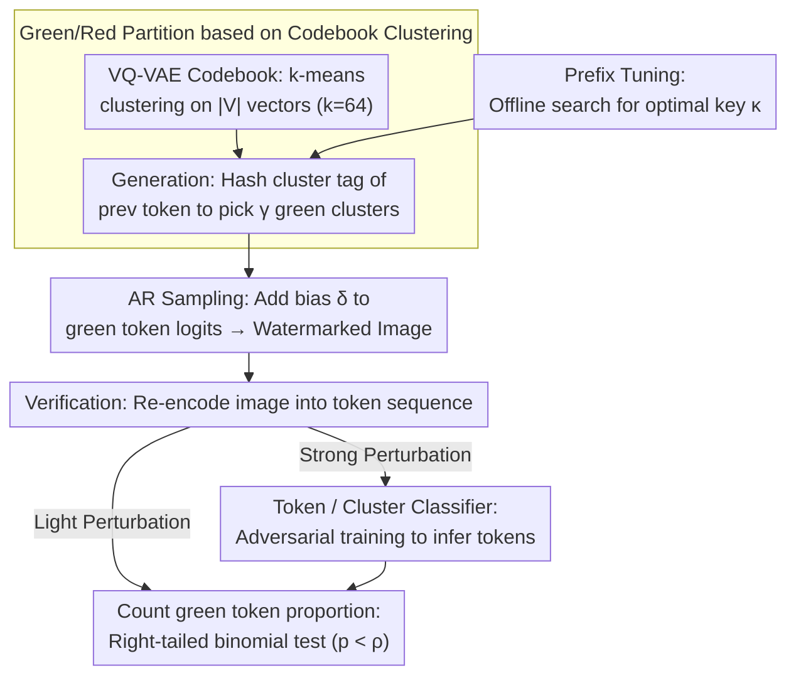

# ClusterMark: Towards Robust Watermarking for Autoregressive Image Generators with Visual Token Clustering

**Conference**: CVPR 2026  
**arXiv**: [2508.06656](https://arxiv.org/abs/2508.06656)  
**Code**: [https://github.com/lukovnikov/ClusterMark](https://github.com/lukovnikov/ClusterMark)  
**Area**: AI Security / Image Watermarking  
**Keywords**: Autoregressive Image Generation, Watermark Detection, Visual Token Clustering, Robust Watermarking, VQ-VAE  

## TL;DR

Proposes ClusterMark, a watermarking scheme based on visual token clustering that adapts KGW-style LLM watermarking to autoregressive (AR) image generators. By assigning visually similar tokens to the same green/red sets, the method significantly enhances watermark robustness against image perturbations while preserving visual quality.

## Background & Motivation

**Background**: Watermarking for AI-generated images is crucial for content provenance, preventing misuse, and training data quality control. Current research primarily focuses on watermark embedding for diffusion models, while watermarking for AR image generation models remains understudied. With the rapid development of AR image models like LlamaGen and RAR, this need has become increasingly urgent.

**Limitations of Prior Work**: AR image models generate images by progressively predicting visual token sequences defined by a VQ-VAE codebook. A natural direct migration of the KGW watermarking scheme from the LLM domain—partitioning the vocabulary into "green" and "red" sets based on the previous token to bias sampling—suffers from severe robustness issues. Watermark verification requires re-encoding the image into tokens, but even slight perturbations (e.g., JPEG compression, Gaussian noise) cause the VQ-VAE encoder to produce different tokens. Because KGW partitions are randomized, similar tokens may fall into different sets, causing the watermark signal to collapse after perturbation.

**Key Insight**: If visually similar tokens are clustered together, ensuring all tokens within the same cluster belong to the same set (all green or all red), the watermark signal will persist even if perturbations cause token shifts, provided the new token remains within the same cluster.

## Method

### Overall Architecture

ClusterMark embeds watermarks during the sampling phase of AR image generation. Verification requires only the VQ-VAE encoder and a secret key, without access to the original generative model. The workflow consists of three steps: (1) In the preprocessing stage, k-means clustering is performed on VQ-VAE codebook vectors; (2) During generation, the green/red partition is calculated based on the cluster label of the previous token, biasing sampling towards tokens in green clusters; (3) During verification, the image is encoded into a token sequence to calculate the proportion of green tokens for a binomial hypothesis test. Two enhancements are added: a lightweight Token/Cluster classifier to "undo" strong perturbations before encoding, and prefix tuning to select the key $\kappa$ with the lowest false alarm rate.

### Key Designs

**1. Green/Red Partition based on Codebook Clustering: Enhancing Signal against Quantization Jumps**  
The fatal flaw of direct KGW migration is sensitivity to VQ-VAE quantization. Minor perturbations cause latent vectors to cross boundaries, jumping to different tokens. ClusterMark performs k-means on $|\mathbb{V}|$ codebook vectors to obtain $k$ clusters (optimally $k=64$). The partition logic is elevated from the token level to the cluster level: rather than hashing the token itself, the hash of the previous token's cluster label $o_i = \text{hash}(\kappa, c(q_{i-1}))$ determines the green clusters. Since visually similar vectors are grouped together, re-encoded tokens likely remain in the same cluster after perturbation, stabilizing the green token count. This training-free clustering improves TPR under JPEG compression from 69% to 96%.

**2. Token / Cluster Classifier: Undoing Perturbations via Adversarial Training**  
Clustering alone struggles against heavy distortions like salt-and-pepper noise or strong blur where tokens jump out of their original clusters. ClusterMark introduces a lightweight classifier—a VQ-VAE encoder replica with the pre-quantization layer removed and a classification head added. The Token classifier uses cross-entropy $\mathcal{L}_{TC}$ to predict original token indices, while the Cluster classifier uses $\mathcal{L}_{CC}$ to predict cluster indices. Crucially, the classifier is trained by applying random perturbations $\phi(\cdot)$ to input images, forcing the network to infer the original tokens from distorted inputs. This approach boosts TPR under salt-and-pepper noise from ~40% to nearly 100%.

**3. Prefix Tuning: Mitigating False Positives from Uniform Backgrounds**  
This design targets false alarms. Certain keys $\kappa$ can cause high false positives in uniform regions (e.g., white backgrounds) where specific token bigrams recur, leading to high green token counts in clean images. This variance is especially high when the number of clusters $k$ is small. ClusterMark performs an offline search over candidate keys $\kappa$ on a validation set to select and fix the one with the lowest false alarm rate, ensuring stable detection thresholds.

### Loss & Training

Token classifier loss: $\mathcal{L}_{TC} = \mathbb{E}[\sum_i \text{CE}(\mathcal{M}_T(\phi(x))_i, q_i)]$; Cluster classifier loss: $\mathcal{L}_{CC} = \mathbb{E}[\sum_i \text{CE}(\mathcal{M}_C(\phi(x))_i, c(q_i))]$. Training uses a linear perturbation schedule and completes in approximately 12 hours on a single A40 GPU. Watermark detection utilizes a right-tailed binomial test, where a p-value below threshold $\rho$ indicates a watermark.

## Key Experimental Results

### Main Results

**LlamaGen GPT-B (256×256), Clustering k=64 + Cluster Classifier**

| Perturbation Type | AUC / TPR@1%FPR | Prev. SOTA (IndexMark) | Gain |
|----------|----------------|-------------------|------|
| Clean | 1.000 / 1.000 | 1.000 / 1.000 | - |
| JPEG 20 | 0.982 / 0.893 | 0.969 / 0.821 | +7.2% TPR |
| Gaussian Blur R3 | 0.992 / 0.925 | 0.761 / 0.171 | +75.4% TPR |
| Gaussian Noise σ=0.2 | 0.982 / 0.895 | 0.631 / 0.055 | +84.0% TPR |
| Salt & Pepper 0.1 | 1.000 / 0.999 | 0.635 / 0.071 | +92.8% TPR |
| Regeneration Attack | 0.993 / 0.935 | 0.951 / 0.761 | +17.4% TPR |

**Image Quality (FID)**

| Method | FID (↓) | Note |
|------|---------|------|
| Baseline (No Watermark) | 6.01 | LlamaGen GPT-B |
| ClusterMark (k=64) | 6.12 | Only +0.11 |
| IndexMark | 5.84 | - |
| SSL | 6.19 | Post-processing watermark |

### Ablation Study

| Configuration | JPEG TPR | Gaussian Noise TPR | Salt & Pepper TPR | Note |
|------|----------|-------------|-------------|------|
| No Clustering | 0.692 | 0.075 | 0.069 | Direct KGW migration |
| No Clustering + Token Clf | 0.564 | 0.651 | 0.998 | Classifier helps but inconsistent |
| Clustering k=64 | 0.956 | 0.369 | 0.402 | Clustering provides major boost |
| Clustering + Token Clf | 0.875 | 0.900 | 1.000 | Strongest combination |
| Clustering + Cluster Clf | 0.893 | 0.895 | 0.999 | Direct cluster prediction also effective |

### Key Findings

- Clustering count $k=64$ is the optimal balance between quality and robustness; $k < 64$ increases robustness but degrades FID.
- A green proportion of $\gamma=0.25$ provides significantly higher robustness than $\gamma=0.5$, though FID is slightly worse.
- Verification is extremely fast (10-25ms/image), comparable to lightweight post-processing watermarks and much faster than diffusion model watermarks (which require full reverse diffusion).
- Watermarks remain vulnerable to geometric transformations (rotation, cropping) but can be mitigated with image synchronization layers like SyncSeal.

## Highlights & Insights

- **Elegant Clustering Strategy**: A training-free codebook clustering improves TPR under JPEG from 69% to 96%, demonstrating that the robustness bottleneck lies in the lack of structure in token space rather than the generative model itself.
- **Model-Agnostic Verification**: Verification requires only the VQ-VAE encoder and key, with low computational complexity. This is vital for real-world deployment compared to diffusion watermarks requiring full inversion.
- **Perturbation Undoing via Adversarial Training**: The classifier's performance jump under salt-and-pepper noise shows the effectiveness of adversarial training in compensating for the natural fragility of VQ-VAE quantization.

## Limitations & Future Work

- Vulnerable to geometric transformations (rotation, cropping), requiring additional synchronization layers.
- Prefix selection relies on empirical search; theoretically optimal green/red partitioning strategies deserve further study.
- Clustering reduces the effective resolution of the codebook; image quality drops significantly when $k$ is too low.
- Only validated on class-conditional generation; text-to-image AR models (e.g., Emu-3) require further testing.

## Related Work & Insights

- **vs IndexMark**: While IndexMark pairs similar tokens but assigns them to different sets (one green, one red), this work assigns them to the same set, providing a massive advantage under strong perturbations.
- **vs WMAR**: WMAR also trains a token reconstructor but involves fine-tuning the VAE decoder, which is more complex and affects image appearance. This method is simpler.
- **vs LLM KGW**: Text tokens are discrete and semantically clear; image tokens require clustering to heal the fragility introduced by quantization.

## Rating

- **Novelty**: ⭐⭐⭐⭐ The clustering concept is intuitive and the training-free solution is elegant, though built on the existing KGW framework.
- **Experimental Thoroughness**: ⭐⭐⭐⭐⭐ Comprehensive ablation across 3 models, 7 perturbation types, and multiple configurations.
- **Writing Quality**: ⭐⭐⭐⭐ Clear algorithm descriptions and informative visualizations.
- **Value**: ⭐⭐⭐⭐ Significant progress for AR image model watermarking with high practical utility (fast verification + high robustness).

<!-- RELATED:START -->

## Related Papers

- [\[CVPR 2026\] PECCAVI: Overcoming the Brittleness of AI Image Watermarking Under Visual Paraphrasing Attacks](peccvai_overcoming_the_brittleness_of_ai_image_watermarking_under_visual_paraphr.md)
- [\[CVPR 2026\] AdvMark: Decoupling Defense Strategies for Robust Image Watermarking](decoupling_defense_strategies_for_robust_image_watermarking.md)
- [\[CVPR 2026\] RecoverMark: Robust Watermarking for Localization and Recovery of Manipulated Faces](recovermark_robust_watermarking_for_localization_and_recovery_of_manipulated_fac.md)
- [\[CVPR 2026\] Meta-FC: Meta-Learning with Feature Consistency for Robust and Generalizable Watermarking](meta-fc_meta-learning_with_feature_consistency_for_robust_and_generalizable_wate.md)
- [\[CVPR 2026\] X-AVDT: Audio-Visual Cross-Attention for Robust Deepfake Detection](x-avdt_audio-visual_cross-attention_for_robust_deepfake_detection.md)

<!-- RELATED:END -->
