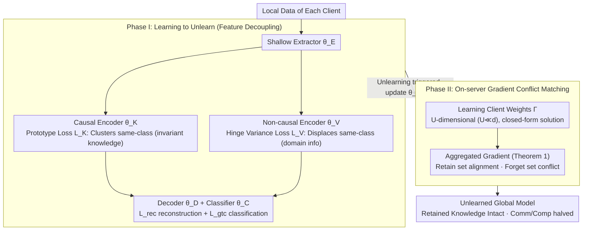

# Computation and Communication Efficient Federated Unlearning via On-server Gradient Conflict Mitigation and Expression

**Conference**: CVPR 2026  
**arXiv**: [2603.13795](https://arxiv.org/abs/2603.13795)  
**Code**: The paper claims reproducibility but has not provided a public repository link.  
**Area**: AI Security  
**Keywords**: Federated Unlearning, Gradient Conflict, Causal Disentanglement, On-server Aggregation, Privacy

## TL;DR

The FOUL framework is proposed to achieve efficient federated unlearning with low communication overhead without accessing client data. It utilizes a two-stage strategy: decoupling causal and non-causal features during the learning phase, followed by server-side gradient conflict matching during the unlearning phase.

## Background & Motivation

**Privacy Regulation Driven**: Data protection laws such as GDPR grant users the "right to be forgotten," requiring Federated Learning (FL) models to be capable of removing the data contributions of specific clients.

**Huge Retraining Cost**: While retraining from scratch (Retrain) is the gold standard for FUL, its computational and communication costs are extremely high, making it impractical for large-scale real-world scenarios.

**Dilemma of Approximate Unlearning**: Most existing approximate methods rely on the local availability of both retained and forgotten data ($\mathcal{L}_{\text{unlearn}}=\mathcal{L}_{\text{retain}}-\mathcal{L}_{\text{forget}}$). In client-wise unlearning scenarios, the forgotten client cannot access the retained data, rendering this formula invalid.

**Repetitive Overhead of Sub-network Identification**: Previous methods identify sub-networks that need to be forgotten by analyzing gradient conflicts, but this must be repeated as the model evolves in each round, leading to significant extra computational overhead.

**Causal Structure Inspiration**: Causal invariant representations (causal factors) remain constant across domains, while non-causal representations (non-causal factors) carry domain-specific information. Unlearning should only target the non-causal parts to avoid damaging general knowledge.

**Lack of On-server Aggregation**: Existing FUL methods fail to simultaneously utilize the gradient information from both retained and forgotten clients on the server side to execute efficient unlearning.

## Method

### Overall Architecture

FOUL is divided into two phases:

- **Phase I: Learning to Unlearn (L2U)**: During the federated training phase, the feature extractor is decoupled into a causal sub-network $\theta_K$ (extracting domain-invariant features) and a non-causal sub-network $\theta_V$ (extracting domain-specific features) to prepare for future unlearning.
- **Phase II: On-server Gradient Matching**: Once unlearning is triggered, only the non-causal sub-network $\theta_V$ is updated. This is achieved through gradient matching aggregation on the server—ensuring the aggregated gradient aligns with the retain clients' direction while conflicting with the forget client's direction.

### Key Designs

**1. Causal/Non-causal Feature Disentanglement: Separating "what to forget" from "what to keep" during training**

The core difficulty of client-wise unlearning is that the forgotten client lacks retained data, making the traditional $\mathcal{L}_{\text{retain}}-\mathcal{L}_{\text{forget}}$ subtraction formula inapplicable. FOUL addresses this by employing a Causal Structured Model (Definition 5): causal factors $\mathcal{Z}_K$ are domain-invariant and carry general knowledge, while non-causal factors $\mathcal{Z}_V$ carry domain-specific information. By making these independent, unlearning only needs to intervene in $\mathcal{Z}_V$ without touching $\mathcal{Z}_K$, thus preserving knowledge from the retain set.

The local model of each client is parameterized as $\theta_u = \{\theta_E, \theta_K, \theta_V, \theta_D, \theta_C\}$. Four losses are used to enforce this structure: the causal encoder uses prototype loss $\mathcal{L}_K$ to compact same-class representations, the non-causal encoder uses hinge variance loss $\mathcal{L}_V$ to displace same-class representations (absorbing domain diversity), classification loss $\mathcal{L}_{\text{gtc}}$ ensures causal representations are sufficient for prediction, and reconstruction loss $\mathcal{L}_{\text{rec}}$ ensures both representations can reconstruct the original data. This "Learning to Unlearn" amortizes the cost of future unlearning by embedding the decoupling structure upfront.

**2. On-server Gradient Conflict Matching: Using coefficient weights to "synthesize" a dual-purpose aggregated gradient**

When unlearning is triggered, the ideal update direction should satisfy two opposing requirements: aligning with the retain clients' gradients and conflicting with the forget client's gradient. Searching in the high-dimensional $d$-dimensional parameter space is computationally expensive and generalizes poorly. FOUL reduces this to a low-dimensional problem by introducing learnable weights $\Gamma = \{\gamma_u^{(r)}\}$, optimizing only $U$ client coefficients ($U \ll d$). Theorem 1 provides a closed-form solution, eliminating the need for iterative search:

$$\nabla_\text{FOUL}^{(r)} = \nabla_\text{FL}^{(r)} + \frac{\kappa \|\nabla_\text{FL}^{(r)}\|}{\|\nabla_{\Gamma_\mathcal{R}}^{(r)} - \nabla_{\Gamma_\mathcal{F}}^{(r)}\|}\left(\nabla_{\Gamma_\mathcal{R}}^{(r)} - \nabla_{\Gamma_\mathcal{F}}^{(r)}\right)$$

Here $\nabla_{\Gamma_\mathcal{R}}$ and $\nabla_{\Gamma_\mathcal{F}}$ are the weighted gradients for the retain and forget sets. This entire optimization occurs on the server using previously uploaded gradients, requiring no access to local client data and maintaining privacy while improving generalization.

**3. Hinge Variance Loss for the Non-causal Sub-network: Preventing uncontrolled representation displacement**

To ensure the non-causal encoder absorbs domain-specific information, it must maximize the variance of same-class representations. However, direct MSE-style variance maximization can be unstable. FOUL utilizes a hinge framework to constrain the variance within an optimal range:

$$\mathcal{L}_V = \frac{1}{C}\sum_{c=1}^{C}\max\left(0,\ 1-\sqrt{\text{Var}(\mathcal{Z}_V^c)+\epsilon}\right)$$

In the early stages, the loss is high to ensure this objective is not ignored. Once the intra-class variance reaches the threshold, the $\max(0,\cdot)$ lower bound becomes zero, preventing the variance from growing excessively and interfering with classification or reconstruction.

## Loss & Training

Total loss for each client during the L2U phase:

$$\mathcal{L}_{\text{L2U}}(\theta_u) = \alpha_V \mathcal{L}_V + \alpha_K \mathcal{L}_K + \alpha_{\text{gtc}} \mathcal{L}_{\text{gtc}} + \mathcal{L}_{\text{rec}}$$

- $\mathcal{L}_K$: Prototypical network contrastive loss (Eq. 4), pulling same-class causal representations together.
- $\mathcal{L}_V$: Hinge variance loss (Eq. 5), pushing same-class non-causal representations apart.
- $\mathcal{L}_{\text{gtc}}$: Cross-entropy classification loss (Eq. 7), from causal representations to labels.
- $\mathcal{L}_{\text{rec}}$: MSE reconstruction + KL divergence (Eq. 8), from both representations to original data.

During the unlearning phase, only the non-causal sub-network $\theta_V$ is updated while the causal sub-network is frozen. On-server unlearning is executed via the closed-form gradient aggregation from Theorem 1.

## Key Experimental Results

| Method | FA ↓ | RA ↑ | TA ↑ | MIA ↓ | Comm (MB) | Comp (FLOPs) |
|------|------|------|------|-------|-----------|-------------|
| Retrain | 70.51 | 82.84 | 77.45 | 50.02 | 42.73 | 5.81e16 |
| FATS | 74.45 | 80.91 | 75.98 | 55.72 | 42.73 | 5.81e16 |
| NoT | 73.24 | 79.25 | 75.28 | 59.13 | 34.72 | 3.38e16 |
| FUSED | 75.94 | 79.34 | 76.86 | 58.72 | 0.98 | 2.81e16 |
| **FOUL (Ours, L2U)** | **69.53** | **93.11** | **77.14** | 53.82 | **16.02** | **2.35e16** |
| **FOUL (Ours, L2U+Unlearn)** | 70.97 | 92.33 | 76.43 | **51.93** | 16.02 | 2.35e16 |

> PACS dataset, ResNet-18 backbone, 20 clients IID setting.

| Method | FA ↓ | RA ↑ | TA ↑ | MIA ↓ |
|------|------|------|------|-------|
| Retrain | 30.64 | 42.41 | 38.94 | 50.71 |
| FATS | 33.07 | 40.96 | 37.34 | 60.81 |
| **FOUL (Ours, L2U)** | **27.97** | **43.81** | 38.16 | **56.40** |
| **FOUL (Ours, L2U+Unlearn)** | 29.92 | 42.13 | **39.16** | 57.11 |

> TerraIncognita dataset, ResNet-50 backbone.

**Time-to-Forget (T2F)**: FOUL reaches optimal FA in <50 rounds with T2F > 0.32/round; in contrast, Retrain requires 75 rounds with T2F at only 0.13/round—representing a roughly 2.5x speedup in unlearning speed.

## Highlights & Insights

- **Elegant Causal Decoupling**: Introduces causal invariance principles from domain generalization into federated unlearning, proving theoretically that unlearning only needs to target the non-causal sub-network.
- **On-server Zero-data Unlearning**: The unlearning phase is completed via coefficient optimization on the server without accessing local client data, ensuring absolute privacy.
- **Dimensionality Reduction**: Shrinks the $d$-dimensional gradient optimization to $U$ coefficient optimizations ($U \ll d$), significantly reducing server-side complexity and improving generalization.
- **RA Outperforming Retrain**: FOUL achieves an RA of 93.11 on PACS (vs 82.84 for Retrain), indicating the decoupled causal sub-network retains purer general knowledge.
- **Halved Communication**: By only transmitting non-causal sub-network parameters, communication overhead is reduced from 42.73 MB to 16.02 MB.
- **Introduction of the T2F Metric**: Quantifies unlearning speed, filling a gap in the efficiency dimension of FUL evaluation frameworks.

## Limitations & Future Work

- Only validated on domain generalization datasets (PACS/VLCS/OfficeHome/TerraIncognita); not yet tested on real-world FL scenarios like medical or mobile devices.
- Backbones are limited to ResNet-18/50, lacking validation on modern architectures like ViT.
- The quality of causal/non-causal decoupling depends on tuning hyperparameters $\alpha_V, \alpha_K, \alpha_{\text{gtc}}$, and the paper lacks a thorough discussion on robustness.
- The unlearning phase assumes all clients are involved, omitting discussions on client dropouts or asynchronous scenarios.
- Most experiments were conducted in IID settings; performance in Non-IID scenarios requires deeper exploration.

## Related Work & Insights

- **Federated Unlearning Baselines**: FedRecovery, FFMU, FUSED, and MoDE approximate unlearning from various angles but fail to simultaneously solve the communication/computation/privacy triangle.
- **Causal Representation Learning**: The Causal Structured Model provides a theoretical foundation for disentanglement, which could be transferred to other "selective forgetting" scenarios like continual learning.
- **Gradient Conflict & Multi-task Learning**: The idea of matching/conflicting gradient directions originates from MTL and DG (e.g., PCGrad), but this is the first time it has been adapted for the dual purpose of "forward retention + backward forgetting" in FUL.
- **Insight**: This proactive "pre-embedding a decoupling structure during training to lower future unlearning costs" approach is worth exploring in RLHF unlearning for LLM fine-tuning.

## Rating

| Dimension | Rating |
|------|------|
| Novelty | ⭐⭐⭐⭐ |
| Technical Depth | ⭐⭐⭐⭐ |
| Experimental Thoroughness | ⭐⭐⭐ |
| Practicality | ⭐⭐⭐⭐ |

<!-- RELATED:START -->

## Related Papers

- [\[CVPR 2026\] Machine Unlearning via Adaptive Gradient Reweighting and Multi-stage Objective Optimization](machine_unlearning_via_adaptive_gradient_reweighting_and_multi-stage_objective_o.md)
- [\[AAAI 2026\] SecMoE: Communication-Efficient Secure MoE Inference via Select-Then-Compute](../../AAAI2026/ai_safety/secmoe_communication-efficient_secure_moe_inference_via_select-then-compute.md)
- [\[NeurIPS 2025\] Efficient Fairness-Performance Pareto Front Computation](../../NeurIPS2025/ai_safety/efficient_fairness-performance_pareto_front_computation.md)
- [\[CVPR 2026\] SubFLOT: Submodel Extraction for Efficient and Personalized Federated Learning via Optimal Transport](subflot_submodel_extraction_for_efficient_and_personalized_federated_learning_vi.md)
- [\[CVPR 2026\] DSO: Direct Steering Optimization for Bias Mitigation](dso_direct_steering_optimization_for_bias_mitigation.md)

<!-- RELATED:END -->
