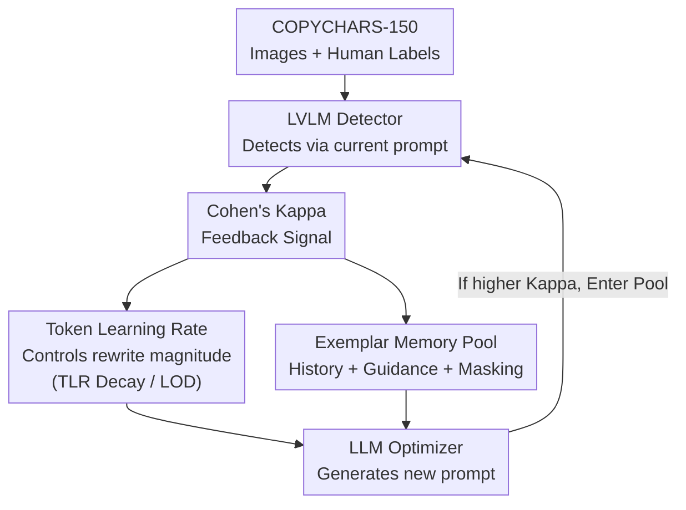

# COPYLENS: Towards Copyrighted Characters Infringement Detection via Copyright-Aware Prompt Learning

**Conference**: CVPR 2026  
**Paper**: [CVF Open Access](https://openaccess.thecvf.com/content/CVPR2026/html/Jin_COPYLENS_Towards_Copyrighted_Characters_Infringement_Detection_via_Copyright_Aware_Prompt_Learning_CVPR_2026_paper.html)  
**Code**: https://github.com/yaoyujin-qm/copylens  
**Area**: AI Security / Copyright Detection  
**Keywords**: Copyrighted Character Detection, Prompt Optimization, Vision-Language Models, Closed-loop Feedback, AIGC Governance

## TL;DR
Addressing the governance challenge where text-to-image models unintentionally replicate copyrighted characters (e.g., Disney characters), COPYLENS employs an LVLM as a detector and an LLM as a prompt optimizer. Using Cohen's Kappa (alignment with human annotations) as a feedback signal, it automatically rewrites detection prompts in a closed loop to maximize human-like judgment, achieving a $5\%–10\%$ improvement in alignment on the new COPYCHARS dataset compared to existing methods.

## Background & Motivation
**Background**: Text-to-image models like Stable Diffusion can generate images virtually identical to official versions of characters like "Ariel the Little Mermaid" given keywords such as "red hair, princess, mermaid," raising serious intellectual property concerns. Automatically determining whether "this image infringes upon a copyrighted character" within massive synthetic datasets is a critical requirement for copyright governance.

**Limitations of Prior Work**: Early methods relied on **similarity matching** in pixel or embedding spaces, requiring a reference image for every synthetic image. This approach is neither scalable nor capable of capturing imitations that are "stylistically similar but pixel-distinct." Recent shifts toward large models, such as CopyCat, use LVLMs with **hard-coded fixed prompts**. However, the authors found that its alignment with human judgment on larger datasets is much lower than claimed, and handwritten prompts are extremely sensitive to phrasing—swapping a prompt can lead to opposite conclusions for the same image (Fig. 1).

**Key Challenge**: Can a "universal" optimal prompt be found that is stable across different characters, images, and detectors? Directly applying off-the-shelf LLM prompt optimizers (e.g., IPO, LLM-OPT) fails because copyright detection is a highly task-specific scenario: ① Supervision signals are sparse and delayed (lack of standard datasets and explicit labels makes scoring prompt quality difficult); ② There is no explicit strategy to guide the optimization trajectory, causing optimizers to explore uncontrollably in the vast, discrete prompt space, resulting in Kappa scores of only $0.25–0.27$.

**Goal**: Construct a dataset with reliable human annotations to provide supervision signals; design a prompt optimization framework specifically for copyrighted character detection to align detector outputs with human consensus.

**Core Idea**: Decompose prompt optimization into "How to Teach (Instruction Optimization)" and "How to Show (Exemplar Optimization)." Utilize a controllable **Token Learning Rate (TLR)** to let the LLM behave like gradient descent—"exploring with large changes first, then refining with small changes." Incorporate short-term and long-term memory pools to allow the optimizer to learn from historically successful prompts, pushing prompt quality toward human judgment in a closed loop.

## Method

### Overall Architecture
COPYLENS is a closed-loop optimization framework where an **LLM Optimizer** (Qwen2.5-14B) and an **LVLM Detector** (Qwen2-VL-7B) collaborate. In each iteration, the optimizer generates a candidate detection prompt $p$ conditioned on a carefully designed **meta-prompt**. The detector uses $p$ to judge characters in the COPYCHARS-150 training set, producing a binary prediction $\hat{y}(p)\in\{0,1\}$. This prediction is compared against human majority-vote labels to calculate Cohen's Kappa as the sole scalar feedback signal. This score, along with the new prompt, is fed back into the meta-prompt, forming a loop that incrementally improves prompt quality.

Formally, given a dataset $D=\{(I_i,y_i)\}_{i=1}^N$, the objective is to find a prompt that maximizes consistency with human labels:

$$p^* = \arg\max_{p\sim M_{\text{OPT}}} \; \mathbb{E}_{(I,y)\in D}\big[F(M_{\text{DET}}(I;p),\, y)\big]$$

where $M_{\text{OPT}}$ is the LLM implicit optimizer (iterating via $p_{t+1}=\text{LLM}(p_t, F(p_t), h)$, where $h$ is the prompt history), $M_{\text{DET}}$ is the LVLM detector, and $F$ denotes the Kappa metric. The framework advances along two complementary axes: **How to Teach (Instruction Optimization, IO)**, which manages task intent delivery, and **How to Show (Exemplar Optimization, EO)**, which utilizes high-scoring historical prompts for demonstration.

### Key Designs

**1. Token Learning Rate (TLR): Managing Optimization in Linguistic Space like Gradient Descent**

Relying solely on text instructions for prompt refinement often leads LLMs to make drastic, erratic changes due to the discrete nature of the space, either destroying effective structures or converging prematurely. TLR is a **purely prompt-level control mechanism**: it does not modify parameters but embeds a hard constraint in the meta-prompt: "You may only update the prompt at the token level, limiting total changes to $R_t$ tokens. For the best historical prompt, modify only $R_t$ tokens while keeping the rest unchanged." Adjusting $R_t$ controls the change magnitude: a large $R_t$ allows for broad rewriting/exploration, while a small $R_t$ forces fine-tuning near the current optimum.

**2. TLR Decay + Local Optimum Detection: Enabling Convergence Dynamics**

To ensure stability, **TLR Decay** reduces $R_t$ over iterations (Alg. 1, line 5), balancing exploration and convergence. To prevent getting stuck, **Local Optimum Detection (LOD)** monitors for **repeated prompts** across recent rounds; if detected, it temporarily increases TLR (Alg. 1, lines 6–8) to jump out of the local optimum. This "simulated annealing" style of step control is a primary contributor to performance.

**3. Short-term and Long-term Exemplar Memory (EO): Learning from Contextual Success**

Scalar Kappa feedback is too coarse for the optimizer to understand *which* phrasing works. EO addresses this with three components. **Prompt History (Short-term Memory)** maintains a top-$k$ ($k=4$) buffer, ensuring the optimizer always refines the best-known samples. **Prompt Guidance (Long-term Memory)** uses GPT-4o to distill recurring linguistic patterns from high-scoring samples into heuristic principles, providing a meta-level prior. The **Masking Mechanism** filters out explanatory or redundant text from the optimizer's output, ensuring that performance gains stem from the detection logic itself rather than "cheating" via additional context.

### Mechanism
As shown in Fig. 4: a baseline prompt "Do you detect any copyrighted character in this image? ..." yields $\kappa_0=0.5337$ on COPYCHARS-150. The optimizer reads the meta-prompt (Role, Task, History with Kappa, and TLR $R=80$) and rewrites it into a more structured prompt: "Does the image contain a copyrighted character? Respond: 'character: , score: 0.' if none...". The detector re-evaluates, and if $\kappa' > \min(\text{History})$, the new prompt joins the pool. Convergence typically occurs within 15 rounds.

## Key Experimental Results

Experiments used Qwen2.5-14B-Instruct as the optimizer and Qwen2-VL-7B-Instruct as the detector, optimized over 15 steps on COPYCHARS-150. Evaluation metrics include Kappa, ACC, FPR, F1, and TPR@1%FPR.

### Main Results
Average detection performance across PixArt / SDXL / PLG models:

| Method | Kappa↑ | ACC↑ | FPR↓ | F1↑ | TPR@1%FPR↑ |
|------|--------|------|------|-----|-----------|
| Baseline (CopyCat) | 0.58 | 0.86 | 0.13 | 0.84 | 0.75 |
| Fine-tune | 0.54 | 0.83 | 0.21 | 0.81 | 0.55 |
| Beam Search | 0.50 | 0.79 | 0.19 | 0.76 | 0.63 |
| OPRO | 0.25 | 0.61 | 0.33 | 0.55 | 0.25 |
| APE | 0.19 | 0.57 | 0.42 | 0.46 | 0.18 |
| IPO | 0.25 | 0.65 | 0.39 | 0.61 | 0.35 |
| LLM-OPT | 0.27 | 0.59 | 0.36 | 0.52 | 0.28 |
| **COPYLENS (Ours)** | **0.62** | **0.88** | **0.09** | **0.86** | **0.78** |

General LLM prompt optimizers (OPRO/APE/IPO/LLM-OPT) failed significantly (Kappa 0.19–0.27), confirming that copyright detection requires specialized strategies.

### Ablation Study
Cumulative component addition (I: Instructions/History; R: TLR; G: Guidance; M: Masking; D: TLR Decay; LOD: Local Optimum Detection):

| Configuration | Kappa↑ | ACC↑ | FPR↓ | F1↑ | Note |
|------|--------|------|------|-----|------|
| I | 0.27 | 0.56 | 0.44 | 0.51 | Baseline instructions |
| I+R | 0.39 | 0.68 | 0.21 | 0.57 | Adding TLR, +0.12 |
| I+R+G | 0.41 | 0.77 | 0.15 | 0.70 | Adding Guidance |
| I+R+G+M | 0.53 | 0.82 | 0.11 | 0.77 | Adding Masking, +0.12 |
| w/ D | 0.58 | 0.85 | 0.12 | 0.78 | Adding TLR Decay |
| w/ D+LOD | **0.62** | **0.88** | **0.09** | **0.86** | Full Model |

### Key Findings
- **TLR and Masking are the largest contributors**: I→I+R and I+R+G→I+R+G+M each provided a $+0.12$ Kappa boost, solving the "uncontrolled search" and "output pollution" issues.
- **Fast and Stable Convergence**: Optimization converges in roughly 15 rounds ($\approx 40$ mins), with a shrinking standard deviation across runs, indicating robustness.
- **Strong Generalization to Unseen IPs**: On COPYCHARS-UNSEEN, COPYLENS achieved $63.3\%$ Kappa—slightly higher than the test set—while baselines and fine-tuning dropped significantly, suggesting it learns general detection patterns rather than specific characters.

## Highlights & Insights
- **Prompt Optimization as Gradient Descent**: COPYLENS implements a step-size scheduling metaphor purely through natural language instructions ($R_t$). This avoids parameter tuning while making the search process interpretable.
- **Kappa-as-reward**: In subjective tasks like fringe copyright judgment, using "alignment with human consensus" (Cohen's Kappa) as a feedback signal elegantly transforms subjective legal/ethical nuances into an optimizable scalar.
- **The Pitfall of Redundancy**: The masking mechanism reveals that explanatory text in optimizer outputs can "pollute" the evaluation. Filtering for core logic is essential to ensure gains are genuine.

## Limitations & Future Work
- **Reliance on Label Quality**: Ground truth is based on a majority vote of five annotators. Copyright infringement is inherently subjective; the framework aligns with "human consensus" rather than strict legal rulings.
- **Absolute Performance Limits**: A Kappa of 0.62 (0.65 on test) represents "moderate-to-substantial agreement," but a $0.09$ FPR means nearly one in ten non-infringing images are still flagged.
- **Manual Thresholds**: TLR decay schedules are currently empirical and may require re-tuning for different tasks or models.

## Related Work & Insights
- **vs. CopyCat**: CopyCat introduced LVLM detection but used fixed prompts sensitive to phrasing. COPYLENS automates prompt evolution, raising Kappa from 0.58 to 0.62.
- **vs. CopyJudge**: CopyJudge uses multi-agent debate for "substantial similarity," which is computationally expensive. COPYLENS is more efficient, allowing for detector re-optimization in ~40 minutes.
- **vs. General Optimizers**: General tools lack the mechanisms to handle the sparse supervision of copyright tasks. TLR step control and exemplar memory are shown to be indispensable.

## Rating
- Novelty: ⭐⭐⭐⭐ (Prompt optimization as gradient descent + Kappa-as-reward).
- Experimental Thoroughness: ⭐⭐⭐⭐ (7050 images, 7 baselines, cross-model/IP generalization).
- Writing Quality: ⭐⭐⭐⭐ (Clear motivation and structured IO/EO explanations).
- Value: ⭐⭐⭐⭐ (Directly addresses AIGC governance, though absolute reliability remains a bottleneck).

<!-- RELATED:START -->

## Related Papers

- [\[CVPR 2026\] FedDAP: Domain-Aware Prototype Learning for Federated Learning under Domain Shift](feddap_domain-aware_prototype_learning_for_federated_learning_under_domain_shift.md)
- [\[CVPR 2026\] Scaling Up AI-Generated Image Detection with Generator-Aware Prototypes](scaling_up_ai-generated_image_detection_with_generator-aware_prototypes.md)
- [\[ECCV 2024\] Noise-Assisted Prompt Learning for Image Forgery Detection and Localization](../../ECCV2024/ai_safety/noise-assisted_prompt_learning_for_image_forgery_detection_and_localization.md)
- [\[CVPR 2026\] PROMPTMINER: Black-Box Prompt Stealing against Text-to-Image Generative Models via Reinforcement Learning and VLM-Guided Optimization](promptminer_black-box_prompt_stealing_against_text-to-image_generative_models_vi.md)
- [\[CVPR 2026\] DFD-HR: Generalizable Deepfake Detection via Hierarchical Routing Learning](dfd-hr_generalizable_deepfake_detection_via_hierarchical_routing_learning.md)

<!-- RELATED:END -->
