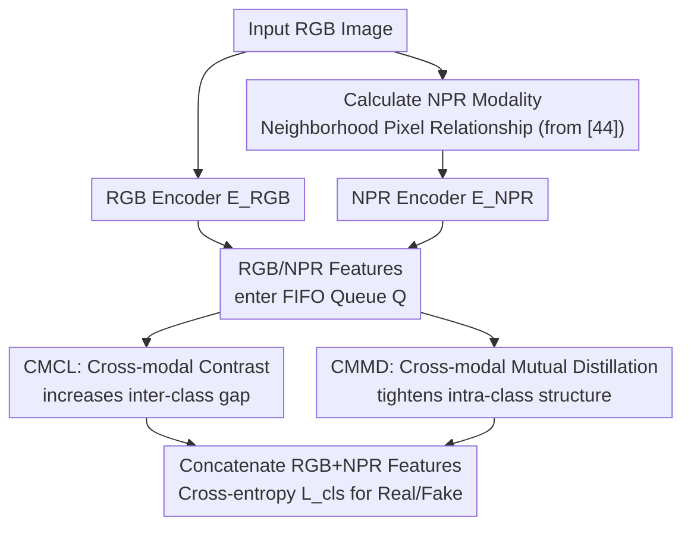

# Cross-modal Representation Learning for Diffusion-generated Image Detection

**Conference**: CVPR 2026  
**Paper**: [CVF Open Access](https://openaccess.thecvf.com/content/CVPR2026/html/Gong_Cross-modal_Representation_Learning_for_Diffusion-generated_Image_Detection_CVPR_2026_paper.html)  
**Code**: Not disclosed  
**Area**: AI Security / Generated Image Detection  
**Keywords**: Diffusion-generated image detection, cross-modal representation learning, contrastive learning, mutual distillation, NPR  

## TL;DR
This work utilizes RGB and NPR (Neighborhood Pixel Relationship) modalities for representation learning—employing Cross-modal Contrastive Learning (CMCL) to increase inter-class separation and Cross-modal Mutual Distillation (CMMD) to tighten intra-class structures. Together, they learn a "forgery-detection-oriented" embedding space, reaching SOTA performance on three benchmarks: GenImage, DRCT-2M, and Co-Spy-Bench.

## Background & Motivation
**Background**: The mainstream approach for detecting fake images generated by diffusion models is to feed RGB images into ResNet or CLIP visual encoders to extract features, followed by a classification head. To improve generalization to "unseen generators," recent works either modify detection algorithms (DIRE, PatchCraft, etc.) or leverage large pre-trained models (UnivFD, FatFormer, Co-Spy, etc.).

**Limitations of Prior Work**: Backbones like ResNet and CLIP are essentially designed for "high-level semantics" and are not naturally optimized for forgery detection—they extract semantics like "this is a cat" rather than "this image contains forgery traces left by upsampling." CoDE was the first attempt to use contrastive learning to learn an embedding space specifically for detection, validating the "forgery-aware embedding" path. However, it only used RGB for conventional contrastive learning, treating two augmentations of the same image as positive samples without introducing signals directly related to forgery traces.

**Key Challenge**: To learn a truly "forgery-oriented" embedding space, RGB self-augmentation is insufficient—RGB lacks a description of "source-invariant" forgery traces from generator pipelines. Prior work on NPR has proven that upsampling operators leave generalizable forgery traces between local pixels, which capture intrinsic clues better than RGB. Thus, the problem becomes: can the "forgery-sensitive" NPR modality be integrated with RGB for representation learning?

**Goal**: (1) Make real/fake classes more **inter-class** separable in the embedding space; (2) Make the same class (real or fake) more **intra-class** compact; (3) Allow RGB and NPR modalities to mutually complement the knowledge learned by each.

**Key Insight**: Treat NPR as the "cross-modal partner" for RGB. The RGB features of a real image and its own NPR features should naturally be closer than "that real image's RGB features vs. some fake image's NPR features." This intuition naturally provides the definition of positive and negative pairs without requiring manual augmentation.

**Core Idea**: Replace "RGB x RGB augmentation" with "RGB x NPR cross-modal" representation learning, split into two complementary tasks—cross-modal contrast (managing inter-class separation) + cross-modal mutual distillation (managing intra-class compactness)—to collaboratively learn a forgery-aware embedding space.

## Method

### Overall Architecture
The model is named **SDID (Strong Diffusion-generated Image Detector)**. Given an input image, the NPR modality is first calculated from the RGB modality. RGB and NPR are processed by their respective encoders, $E_{RGB}$ and $E_{NPR}$, to obtain features $F^{RGB}$ and $F^{NPR}$. During training, a FIFO queue $Q$ is maintained for each "modality x category" combination (current batch enters, oldest batch exits) to serve as a negative sample pool for contrastive learning and an anchor pool for mutual distillation.

Two types of representation learning losses are executed simultaneously on this dual-encoder and queue framework: **CMCL** uses cross-modal positive/negative pairs to push real and fake classes apart (inter-class), while **CMMD** uses "neighborhood similarity distributions" within the same class for bidirectional KL distillation to align knowledge between the two modalities (intra-class). Finally, the enhanced $F^{RGB}$ and $F^{NPR}$ are concatenated and passed through a cross-entropy loss $L_{cls}$ to predict real/fake. During inference, only the two encoders are retained, and the concatenated features yield the prediction. The architecture is symmetric for real/fake (the paper uses real images as an example for convenience).

### Key Designs

**1. NPR as a Cross-modal Partner: Replacing "RGB Self-Augmentation" with "Forgery-Sensitive Modality"**

The issue with CoDE's RGB x RGB augmented contrastive learning is that two augmented views share the same high-level semantics; the contrastive learning mostly captures semantic structures and remains insensitive to forgery traces. This paper changes the strategy—bringing in NPR as the second modality. NPR comes from [44] (this paper explicitly does **not** claim NPR itself as a contribution); it involves partitioning the RGB image into $l \times l$ ($l=2$) non-overlapping patches and subtracting the top-left pixel value channel-wise from each pixel. The resulting residual map characterizes the local forgery traces left by upsampling operators, providing source-invariant generalization across different generators.

Using NPR as RGB's cross-modal partner ensures that positive and negative pairs are naturally established: the RGB and NPR features of the same real image should be closer than "that real image vs. other fake images," eliminating the need for manually designed augmentations. Ablations (Table 5) directly validate this choice—replacing the second modality with "RGB random augmentation" causes CMCL to degrade into conventional contrastive learning and CMMD to nearly fail due to single-modality (93.2%); using high-frequency components is slightly better (95.5%); only using NPR reaches 98.4%.

**2. CMCL (Cross-modal Contrastive Learning): Managing "Inter-class Separation"**

CMCL addresses "inter-class separability." Taking the real image's RGB feature $F^{RGB}_{real}$ as an example: it forms a positive pair with its own NPR feature $F^{NPR}_{real}$ and negative pairs with NPR features in the fake image queue $Q^{NPR}_{fake}$, optimized using InfoNCE:

$$L_{CMCL}(F^{RGB}_{real}; F^{NPR}_{real}; Q^{NPR}_{fake}) = -\log \frac{\exp(F^{RGB}_{real}\cdot F^{NPR}_{real}/\tau)}{\exp(F^{RGB}_{real}\cdot F^{NPR}_{real}/\tau) + \sum_{q_i\in Q^{NPR}_{fake}}\exp(F^{RGB}_{real}\cdot q_i/\tau)}$$

where the temperature $\tau=0.07$, and negative samples are drawn from a FIFO queue of length $N_Q=2048$ (using a MoCo-style queue instead of large batches to provide sufficient negative samples due to VRAM constraints). The complete CMCL loss is the symmetric sum across the four combinations of "RGB/NPR × Real/Fake": real RGB pushes away fake NPR, real NPR pushes away fake RGB, and similarly for the fake paths. This enhances the discriminative power of both RGB and NPR features between real and fake classes.

**3. CMMD (Cross-modal Mutual Distillation): Managing "Intra-class Compactness"**

CMCL only focuses on inter-class aspects and does not model the internal structure of "the same class" (e.g., real class), leaving the knowledge learned by each modality under-exploited. CMMD compensates for this and performs distillation **only within the same class** (between real images, or between fake images, never cross-class).

First, the "knowledge" of each modality is represented as a **neighborhood similarity distribution**: given an embedding $z$, the Top-$K$ ($K=128$) nearest neighbors are taken from the same-modality queue as anchors $\{a_i\}$. The cosine similarity is calculated and softmaxed into a probability distribution, characterizing the local neighborhood structure of $z$ in that modality's feature space:

$$p_i(z, a_i) = \frac{\exp(\cos(z, a_i)/\tau)}{\sum_{j=1}^{K}\exp(\cos(z, a_j)/\tau)}$$

Anchors are taken directly from the existing contrastive learning queues, requiring no additional forward inference and nearly zero overhead. Then, **bidirectional** KL distillation is performed between the RGB ↔ NPR distributions (using the real image RGB → NPR direction as an example):

$$L_{CMMD} = KL\big(p(F^{RGB}_{real}, Q^{RGB}_{real}) \,\|\, p(F^{NPR}_{real}, Q^{NPR}_{real})\big)$$

The key difference from traditional distillation is that there is no "fixed, pre-trained teacher"; knowledge is continuously updated during training. Each modality is **simultaneously the student and the teacher**, passing its understanding of intra-class structures to the other, thereby learning more compact intra-class features. The complete CMMD is also symmetrically summed across the four "modality direction × Real/Fake" combinations.

### Loss & Training
$F^{RGB}$ and $F^{NPR}$ are concatenated for prediction, using cross-entropy $L_{cls}$ for classification. The total loss is a weighted sum of the three:

$$L = L_{cls} + \lambda_1 L_{CMCL} + \lambda_2 L_{CMMD}$$

Implementation details: The RGB encoder is a pre-trained DINOv2-ViT-L/14 fine-tuned with LoRA; the NPR encoder is a ResNet-101 pre-trained on ImageNet. Queue length $N_Q=2048$, Top-$K=128$, $\lambda_1=\lambda_2=0.1$. Evaluation uses accuracy with a 0.5 threshold. After training, only the two encoders are kept for detection.

## Key Experimental Results

### Main Results
Comparisons across three benchmarks: GenImage, DRCT-2M, and Co-Spy-Bench. All follow their respective protocols (training on the SDv1.4 subset, testing on multiple unseen generator subsets), with metrics reported as average accuracy (%).

| Dataset | Training Setup | Prev. SOTA | SDID (Ours) | Gain |
|--------|---------|----------|--------------|------|
| GenImage (Avg. 8 subsets) | GenImage/SDv1.4 | 96.2 (CoD) | **98.4** | ≥2 pts |
| DRCT-2M (Avg. multiple) | DRCT-2M/SDv1.4 | 90.9 (DLFE) | **92.4** | ≥1.5 pts |
| Co-Spy-Bench (Avg. multiple) | DRCT-2M/SDv1.4 | 87.1 (CO-SPY) | **96.1** | ≥9 pts |

Highlights: In harder subsets like Midjourney / ADM / BigGAN (GenImage) and SDv2-DR / SDXL-DR (DRCT-2M, where images are reconstructed from real images by diffusion models rather than pure noise, making them extremely difficult), SDID's relative advantage is particularly significant. On Co-Spy-Bench, most subsets exceed 95%, except for PG-v2-256 and FLUX.1-sch/dev.

### Ablation Study
Training on GenImage/SDv1.4, results are average accuracy on the full GenImage test set:

| Configuration | GenImage Acc | Description |
|------|-------------|------|
| RGB Only | 86.7 | Single modality baseline |
| NPR Only | 88.5 | NPR captures forgery traces better than RGB |
| RGB+NPR Concat | 90.1 | Dual modality complementarity |
| + CMCL | 95.4 | Inter-class separation, +5.3 |
| + CMCL + CMMD (Full) | **98.4** | Intra-class compactness, further +3.0 |

Comparison of different second modality inputs (Table 5), validating the "NPR choice":

| Second Modality | Baseline | +CMCL | +CMCL+CMMD |
|----------|------|-------|------------|
| RGB & RGB (Degraded to standard contrastive) | 86.9 | 93.0 | 93.2 |
| RGB & High-freq components | 88.3 | 93.8 | 95.5 |
| RGB & NPR (Ours) | 90.1 | 95.4 | **98.4** |

Additionally, Table 6 shows that when only RGB features are used for prediction (NPR only participates in CMCL/CMMD), CMCL improves RGB detection from 86.7% → 93.6% (+6.9), and CMMD further increases it to 96.4% (+2.8). This indicates that the two losses can "inject" cross-modal knowledge back into the RGB encoder, benefiting inference even when only looking at RGB.

### Key Findings
- **CMCL and CMMD are effective and stackable**: CMCL is responsible for pulling real/fake classes apart (the largest single-step contribution, +5.3), and CMMD adds +3.0 by tightening intra-class structures. The two are complementary.
- **"Selecting NPR" is crucial, not any second modality**: RGB x RGB improvement relies almost entirely on CMCL with CMMD being ineffective; high-frequency components are second-best; NPR is optimal, proving that forgery-sensitive modalities are superior partners for representation learning.
- **t-SNE Visualization (Figure 4)**: Real and fake embeddings overlap without CMCL/CMMD. After adding CMMD, intra-class clusters tighten significantly, and the real/fake boundary becomes clear.

## Highlights & Insights
- **Using "Cross-modal Consistency" as the source for contrastive pairs**: Same-image RGB-NPR pairs are positive, while cross-category pairs are negative. This naturally derives positive/negative pairs from modal consistency, avoiding manual augmentation design and directly introducing "forgery trace" signals into the embedding space—more targeted than CoDE's RGB self-augmentation.
- **Reusing contrastive queues as anchors for mutual distillation**: CMMD's neighborhood distribution anchors are taken directly from the queues maintained for CMCL, grafting "relational knowledge distillation" with almost zero extra overhead.
- **"No fixed teacher, bidirectional mutual student-teacher"**: Distillation knowledge updates dynamically during training, and the two modalities perform symmetric mutual distillation. This idea can be transferred to any representation learning scenario where "neither dual-view/dual-modality is perfect and both should complement each other."
- **Decoupling Inter-class vs. Intra-class**: Explicitly assigning "inter-class separation" and "intra-class tightening" to two losses is cleaner than a single contrastive loss trying to achieve both, as clearly shown by the independent and stackable gains in ablation.

## Limitations & Future Work
- **NPR's strong dependence on upsampling traces**: NPR captures local traces left by upsampling operators. Its generalization remains questionable for generators that do not follow typical upsampling pipelines or for images with strong post-processing/compression that smooths these traces ⚠️ (compression/perturbation robustness was not specifically tested).
- **Shortcomings in difficult subsets**: On Co-Spy-Bench, FLUX.1-sch/dev and PG-v2-256 are still significantly lower than other subsets, indicating room for improvement on the latest/high-resolution generators.
- **Training overhead**: Dual encoders + four sets of queues + bidirectional distillation lead to higher training VRAM and computation than single-modality RGB detectors. The paper uses queues to mitigate negative sample volume, but the sensitivity of results to hyperparameters like queue length and Top-$K$ is not fully explored ⚠️.
- **$\lambda_1=\lambda_2=0.1$ is an empirical setting**; no systematic scan of loss weights is provided, and it is unknown if re-tuning is needed across datasets.

## Related Work & Insights
- **vs CoDE**: CoDE also seeks to learn forgery-aware embeddings but uses standard contrastive learning with RGB (augmentations of the same image as positive pairs). This paper replaces the second modality with the forgery-sensitive NPR and adds CMMD for intra-class management—the RGB x RGB path (93.2%) in the ablation is far inferior to RGB x NPR (98.4%).
- **vs NPR [44]**: NPR proposed the "Neighborhood Pixel Relationship" as a forgery representation for direct classification. This paper treats NPR as an input modality for representation learning to further optimize the embedding space.
- **vs [55] using RGB+NPR**: [55] was the first to use both RGB and NPR simultaneously, but its goal was "fake image explanation" using MLLMs; this paper targets optimizing the embedding space for detection, a completely different focus.
- **vs Relational Distillation (PKT / CompRess / SEED)**: These methods use "relationships between samples and a set of anchors" for structural distillation. This paper borrows this neighborhood distribution modeling but innovates with "cross-modal, bidirectional, no fixed teacher" online mutual distillation.

## Rating
- Novelty: ⭐⭐⭐⭐ Combining RGB x NPR cross-modal contrast + cross-modal mutual distillation for forgery detection embedding learning is a clear and targeted strategy. The individual innovations are moderate, but the combination is solid.
- Experimental Thoroughness: ⭐⭐⭐⭐⭐ Three major benchmarks + comprehensive ablations (modules, different input modalities, RGB-only inference) + t-SNE provide a complete chain of evidence.
- Writing Quality: ⭐⭐⭐⭐ The framework and formulas are clearly explained; the symmetric structure is slightly repetitive but logically sound.
- Value: ⭐⭐⭐⭐ Achieves SOTA in the high-demand AI security area of generated image detection; the method has high reusability. Lack of public code is a minor deduction.

<!-- RELATED:START -->

## Related Papers

- [\[CVPR 2026\] Scaling Up AI-Generated Image Detection with Generator-Aware Prototypes](scaling_up_ai-generated_image_detection_with_generator-aware_prototypes.md)
- [\[CVPR 2026\] SAIDO: Scene-Aware and Importance-Guided Dynamic Optimization for Generalizable AI-Generated Image Detection](saido_generalizable_detection_of_ai-generated_images_via_scene-aware_and_importa.md)
- [\[CVPR 2026\] X-AVDT: Audio-Visual Cross-Attention for Robust Deepfake Detection](x-avdt_audio-visual_cross-attention_for_robust_deepfake_detection.md)
- [\[CVPR 2026\] Forensic-Friendly Image Manipulation via Controllable Latent Diffusion](forensic-friendly_image_manipulation_via_controllable_latent_diffusion.md)
- [\[CVPR 2026\] Skyra: AI-Generated Video Detection via Grounded Artifact Reasoning](skyra_ai-generated_video_detection_via_grounded_artifact_reasoning.md)

<!-- RELATED:END -->
